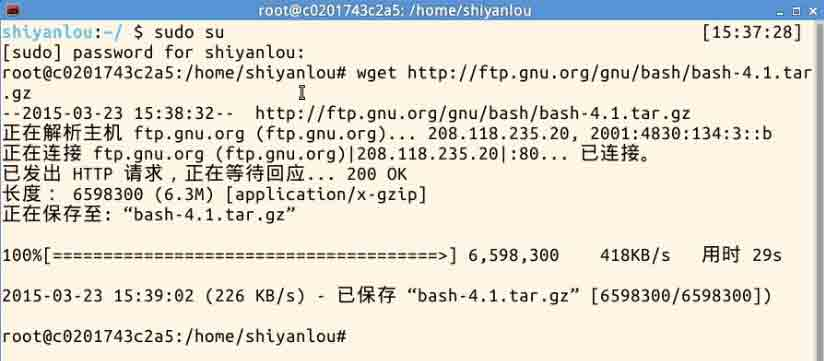
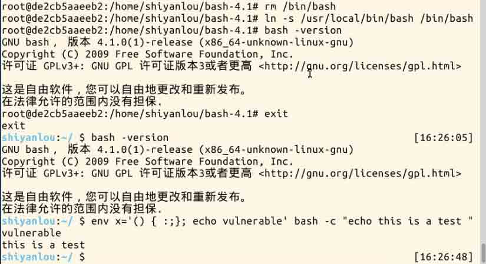
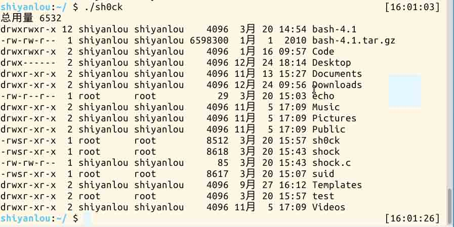

# 第 1 节 ShellShock 攻击实验

## 一、 实验简介

2014 年 9 月 24 日，Bash 中发现了一个严重漏洞 shellshock，该漏洞可用于许多系统，并且既可以远程也可以在本地触发。在本实验中，学生需要亲手重现攻击来理解该漏洞，并回答一些问题。

## 二、 预备知识

### 1\. 什么是 ShellShock？

>Shellshock，又称 Bashdoor，是在 Unix 中广泛使用的 Bash shell 中的一个安全漏洞，首次于 2014 年 9 月 24 日公开。许多互联网守护进程，如网页服务器，使用 bash 来处理某些命令，从而允许攻击者在易受攻击的 Bash 版本上执行任意代码。这可使攻击者在未授权的情况下访问计算机系统。——摘自维基百科

### 2\. 进行实验所需的准备

#### 1\. 环境搭建

以 root 权限安装 4.1 版 bash（4.2 版本以上的漏洞已经被堵上了） bash4.1 下载地址：http://labfile.oss.aliyuncs.com/bash-4.1.tar.gz 

下载

```
# wget http://labfile.oss.aliyuncs.com/bash-4.1.tar.gz 
```

安装

```
# tar xf bash-4.1.tar.gz
# cd bash-4.1
# ./configure
# make & make install 
```

链接

```
# rm /bin/bash
# ln -s /usr/local/bin/bash /bin/bash 
```

到这里就安装完了，接下来检测是否存在 shellshock 漏洞。

```
$ env x='() { :;}; echo vulnerable' bash -c "echo this is a test " 
```



输出 vulnerable 的话,说明 bash 有漏洞。

最后，让/bin/sh 指向/bin/bash.

```
$ sudo ln -sf /bin/bash /bin/sh 
```

现在一切就绪，进入下一步吧。

#### 2.预备知识

了解 bash 自定义函数，只需要函数名就能够调用该函数。

```
$ foo() { echo bar; } 
$ foo
> bar 
```

这个时候的 Bash 的环境变量：

```
KEY = foo
VALUE = () { echo bar; } 
```

来看看 ShellShock 漏洞的真身：

```
export foo=’() { :; }; echo Hello World’ 
bash
>Hello World 
```

为什么调用 bash 的时候输出 Hello World 了呢？瞧瞧他内部的情况：

```
KEY = foo
VALUE = () { :; }; echo Hello World 
```

bash 读取了环境变量，在定义 foo 之后直接调用了后面的函数。 一旦调用 bash，自定义的语句就直接触发。

到了这，你有想到什么么？联系之前的 Set-UID 课程。

## 三、 实验内容

### 1.攻击 Set-UID 程序

本实验中，我们通过攻击 Set-UID 程序来获得 root 权限。 首先，确保安装了带有漏洞的 bash 版本，并让/bin/sh 指向/bin/bash.

```
$ sudo ln -sf /bin/bash /bin/sh 
```

请编译下面这段代码，并设置其为 Set-UID 程序，保证它的所有者是 root。我们知道 system()函数将调用"/bin/sh -c" 来运行指定的命令, 这也意味着/bin/bash 会被调用，你能够利用 shellshock 漏洞来获取权限么？

```
#include <stdio.h>
void main()
{
    setuid(geteuid()); // make real uid = effective uid.
    system("/bin/ls -l");
} 
```

我们注意到这里使用了 setuid(geteuid()) 来使 real uid = effective uid，这在 Set-UID 程序中不是普遍实践，但它确实有时会发生。 先自己试着 hack 一下：） …… …… …… …… …… …… 以下是 hack 过程。 

如果 setuid(geteuid()) 语句被去掉了，再试试看攻击，我们还能够拿到权限么？

```
#include <stdio.h>
void main()
{
    system("/bin/ls -l");
} 
```

 (hack 过程与 step1 完全一样，sh0ck 是编译后的程序)

失败了！这就说明如果 real uid 和 effective uid 相同的话，定义在环境变量中的内容在该程序内有效，那样 shellshock 漏洞就能够被利用了。但是如果两个 uid 不同的话，环境变量失效，就无法发动攻击了，这可以从 bash 的源代码中得到印证（variables.c,在 308 到 369 行之间）请指出是哪一行导致了这样的不同，并说明 bash 这样设计的原因。

这里给出这部分代码

```
/* Initialize the shell variables from the current environment.
   If PRIVMODE is nonzero, don't import functions from ENV or
   parse $SHELLOPTS. */
void
initialize_shell_variables (env, privmode)
     char **env;
     int privmode;
{
  char *name, *string, *temp_string;
  int c, char_index, string_index, string_length;
  SHELL_VAR *temp_var;

  create_variable_tables ();

  for (string_index = 0; string = env[string_index++]; )
    {

      char_index = 0;
      name = string;
      while ((c = *string++) && c != '=')
  ;
      if (string[-1] == '=')
  char_index = string - name - 1;

      /* If there are weird things in the environment, like `=xxx' or a
   string without an `=', just skip them. */
      if (char_index == 0)
  continue;

      /* ASSERT(name[char_index] == '=') */
      name[char_index] = '\0';
      /* Now, name = env variable name, string = env variable value, and
   char_index == strlen (name) */

      temp_var = (SHELL_VAR *)NULL;

      /* If exported function, define it now.  Don't import functions from
   the environment in privileged mode. */
      if (privmode == 0 && read_but_dont_execute == 0 && STREQN ("() {", string, 4))
  {
    string_length = strlen (string);
    temp_string = (char *)xmalloc (3 + string_length + char_index);

    strcpy (temp_string, name);
    temp_string[char_index] = ' ';
    strcpy (temp_string + char_index + 1, string);

    parse_and_execute (temp_string, name, SEVAL_NONINT|SEVAL_NOHIST);

    /* Ancient backwards compatibility.  Old versions of bash exported
       functions like name()=() {...} */
    if (name[char_index - 1] == ')' && name[char_index - 2] == '(')
      name[char_index - 2] = '\0';

    if (temp_var = find_function (name))
      {
        VSETATTR (temp_var, (att_exported|att_imported));
        array_needs_making = 1;
      }
    else
      report_error (_("error importing function definition for `%s'"), name);

    /* ( */
    if (name[char_index - 1] == ')' && name[char_index - 2] == '\0')
      name[char_index - 2] = '(';   /* ) */
  } 
```

摘出其中关键部分并简化

```
void initialize_shell_variables(){
// 循环遍历所有环境变量
for (string_index = 0; string = env[string_index++]; ) {
     /*...*/
     /* 如果有 export 过的函数, 在这里定义 */
     /* 无法导入在特权模式下（root 下）定义的函数 */
     if (privmode == 0 && read_but_dont_execute == 0 &&
           STREQN (“() {“, string, 4)) {
           [...]
           // 这里是 shellshock 发生的地方
           // 传递函数定义 + 运行额外的指令
           parse_and_execute (temp_string, name,
                SEVAL_NONINT|SEVAL_NOHIST);
[...]
} } 
```

就是上述那一行判断逻辑导致了两者的不同，primode 即私有模式，要求 real uid 与 effective uid 保持一致。

## 四、 练习

在实验楼环境安步骤进行实验，并截图

## License

本课程所涉及的实验来自[Syracuse SEED labs](http://www.cis.syr.edu/~wedu/seed/)，并在此基础上为适配[实验楼](http://www.shiyanlou.com)网站环境进行修改，修改后的实验文档仍然遵循 GNU Free Documentation License。

本课程文档 github 链接：[`github.com/shiyanlou/seedlab`](https://github.com/shiyanlou/seedlab)

附[Syracuse SEED labs](http://www.cis.syr.edu/~wedu/seed/)版权声明：

> Copyright Statement Copyright 2006 – 2009 Wenliang Du, Syracuse University. The development of this document is funded by the National Science Foundation’s Course, Curriculum, and Laboratory Improvement (CCLI) program under Award No. 0618680 and 0231122\. Permission is granted to copy, distribute and/or modify this document under the terms of the GNU Free Documentation License, Version 1.2 or any later version published by the Free Software Foundation. A copy of the license can befound at http://www.gnu.org/licenses/fdl.html.