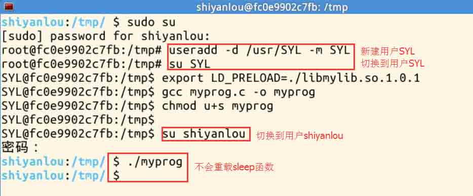

# 第 1 节 SET-UID 程序漏洞实验

## 一、实验简介

Set-UID 是 Unix 系统中的一个重要的安全机制。当一个 Set-UID 程序运行的时候，它被假设为具有拥有者的权限。例如，如果程序的拥有者是 root，那么任何人运行这个程序时都会获得程序拥有者的权限。Set-UID 允许我们做许多很有趣的事情，但是不幸的是，它也是很多坏事情的罪魁祸首。

因此本次实验的目标有两点：

> 1．欣赏好的方面，理解为什么 Set-UID 是需要的，以及它是如何被执行的。

> 2．注意坏的方面，理解它潜在的安全性问题。

## 二、实验内容

这是一个探索性的实验，你的任务是在 Linux 环境中和 Set-UID 机制”玩游戏“，你需要在 Linux 中完成接下来的实验任务：

### 2.1 猜测为什么“passwd”，“chsh”，“su”，和“sudo”命令需要 Set-UID 机制，如果它们没有这些机制的话，会发生什么，如果你不熟悉这些程序，你可以通话阅读使用手册来熟悉它们，如果你拷贝这些命令到自己的目录下，这些程序就不会是 Set-UID 程序，运行这些拷贝的程序，观察将会发生什么。


从上面的截图可以看出：将 passwd 拷贝到/tmp/下，权限发生了变化（在原目录下 suid 位被设置），复件没有了修改密码的权限。

对于“chsh”，“su”，和“sudo”命令，把这些程序拷贝到用户目录下，同样不再具有 root 权限。

### 2.2 在 linux 环境下运行 Set-UID 程序，同时描述并且解释你的观察结果

#### 2.2.1 以 root 方式登录，拷贝/bin/zsh 到/tmp, 同时设置拷贝到 tmp 目录下的 zsh 为 set-uid root 权限，然后以普通用户登录，运行/tmp/zsh。你会得到 root 权限吗？请描述你的结果。


#### 2.2.2 拷贝/bin/bash 到/tmp 目录，同时设置/tmp 目录下的 bash 为 Set-UID root 权限，然后以普通用户登录，运行/tmp/bash。你会得到 root 权限吗？请描述你的结果。


可见，同样的操作，运行复制的 zsh 可以获得 root 权限，而 bash 不能。

### 2.3 从上面步骤可以看出，/bin/bash 有某种内在的保护机制可以阻止 Set-UID 机制的滥用。为了能够体验这种内在的保护机制出现之前的情形，我们打算使用另外一种 shell 程序——/bin/zsh。在一些 linux 的发行版中（比如 Redora 和 Ubuntu），/bin/sh 实际上是/bin/bash 的符号链接。为了使用 zsh，我们需要把/bin/sh 链接到/bin/zsh。

下面的指令将会把默认的 shell 指向 zsh：

```
$sudo su
Password:
#cd /bin
#rm sh
#ln -s zsh sh 
```


### 2.4 PATH 环境变量的设置

system(const char * cmd)系统调用函数被内嵌到一个程序中执行一个命令，system()调用/bin/sh 来执行 shell 程序，然后 shell 程序去执行 cmd 命令。但是在一个 Set-UID 程序中 system()函数调用 shell 是非常危险的，这是因为 shell 程序的行为可以被环境变量影响，比如 PATH；而这些环境变量可以在用户的控制当中。通过控制这些变量，用心险恶的用户就可以控制 Set-UID 程序的行为。

下面的 Set-UID 程序被用来执行/bin/ls 命令；然后程序员可以为 ls 命令使用相对路径，而不是绝对路径。

```
int main()
{
   system("ls");
   return 0;
} 
```

#### 2.4.1 你能够设置这个 Set-UID 程序运行你自己的代码而不是/bin/ls 吗？如果你能的话，你的代码具有 root 权限吗？描述并解释你的观察。

可以具有 root 权限，把/bin/sh 拷贝到/tmp 目录下面重命名为 ls（先要确保/bin/目录下的 sh 符号链接到 zsh，而不是 bash），将环境变量 PATH 设置为当前目录/tmp，运行编译的程序 test。就可以获得 root 权限：


#### 2.4.2 修改/bin/sh 使得其返回到/bin/bash，重复上面的攻击，你仍然可以获得 root 权限吗？描述并解释你的观察。


可见修改 sh 连接回 bash，运行 test 程序不能使普通用户获得 root 权限。

### 2.5 sytem()和 execve()的不同

首先确保/bin/sh 指向 zsh

背景：Bob 在为一家审计代理处工作，他正在调查一家公司是否存在诈骗行为。为了这个目的，他需要阅读这家公司在 Unix 系统中的所有文件；另一方面，为了保护系统的可靠性，他不能修改任何一个文件。为了达到这个目的，Vince——系统的超级用户为他写了一个 SET-ROOT-UID 程序，并且给了 Bob 可以执行它的权限。这个程序需要 Bob 在命令行中打出一个文件名，然后运行/bin/cat 命令显示这个文件。既然这个程序是以 root 权限运行的，它就可以显示 Bob 想看的任何一个文件。然而，既然这个程序没有写操作，Vince 很确信 Bob 不能用这个程序修改任何文件。

```
#include <string.h>
#include <stdio.h>
#include <stdlib.h>
int main(int argc, char *argv[])
{
   char *v[3];
   if(argc < 2)
   {
   printf("Please type a file name.\n");
   return 1;
   }
   v[0] = "/bin/cat"; v[1] = argv[1]; v[2] = 0;
  //Set q = 0 for Question a, and q = 1 for Question b
   int q = 0;
   if (q == 0)
   {
      char *command = malloc(strlen(v[0]) + strlen(v[1]) + 2);
      sprintf(command, "%s %s", v[0], v[1]);
      system(command);
  }
  else execve(v[0], v, 0);
  return 0 ;
} 
```

#### 2.5.1 程序中有 q=0。程序会使用 system()调用命令行。这个命令安全码？如果你是 Bob，你能对系统的完整性妥协吗？你能重新移动一个对你没有写权限的文件吗?

这个命令不安全，Bob 可能会出于好奇或者个人利益驱使阅读或者修改只有 root 用户才可以运行的一些文件。比如截图中：file 文件只有 root 用户有读写权限，但普通用户通过运行该程序，阅读并重命名了 file 文件：


#### 2.5.2 如果令 q=1；刚才的攻击还会有效吗？请描述并解释你的观察。

修改为 q=1 后，不会有效。前面步骤之所以有效，是因为 system()函数调用/bin/sh，链接至 zsh，具有 root 权限执行了 cat file 文件后，接着执行 mv file file_new 命令。

而当令 q=1, execve()函数会把 file; mv file file_new 看成是一个文件名，系统会提示不存在这个文件：


### 2.6 LD_PRELOAD 环境变量

为了保证 Set-UID 程序在 LD_PRELOAD 环境的操纵下是安全的，动态链接器会忽略环境变量，但是在某些条件下是例外的，在下面的任务中，我们猜测这些特殊的条件到底是什么。

1、让我们建立一个动态链接库。把下面的程序命名为 mylib.c，放在/tmp 目录下。在函数库 libc 中重载了 sleep 函数：

```
#include <stdio.h>
void sleep (int s)
{
    printf("I am not sleeping!\n");
} 
```

2、我们用下面的命令编译上面的程序（注意区别 l 和 1）：

```
gcc -fPIC -g -c mylib.c

gcc -shared -Wl,-soname,libmylib.so.1 \
-o libmylib.so.1.0.1 mylib.o –lc 
```

3、把下面的程序命名为 myprog.c，放在/tmp 目录下：

```
int main()
{
   sleep(1);
   return 0;
} 
```

请在下面的条件下运行这些程序，并观察结果。基于这些观察告诉我们链接器什么时候会忽略 LD_PRELOAD 环境变量，解释原因。

#### 2.6.1 把 myprog 编译成一个普通用户下的程序在普通用户下运行

可见，它会使用 LD_PRELOAD 环境变量，重载 sleep 函数：


#### 2.6.2 把 myprog 编译成一个 Set-UID root 的程序在普通用户下运行

在这种情况下，忽略 LD_PRELOAD 环境变量，不重载 sleep 函数，使用系统自带的 sleep 函数：


#### 2.6.3 把 myprog 编译成一个 Set-UID root 的程序在 root 下运行

在这种情况下，使用 LD_PRELOAD 环境变量，使用重载的 sleep 函数：


#### 2.6.4 在一个普通用户下把 myprog 编译成一个 Set-UID 普通用户的程序在另一个普通用户下运行

在这种情况下，不会重载 sleep 函数：



由以上四种情况可见：只有用户自己创建的程序自己去运行，才会使用 LD_PRELOAD 环境变量，重载 sleep 函数，否则的话忽略 LD_PRELOAD 环境变量，不会重载 sleep 函数。

### 2.7 消除和清理特权

为了更加安全，Set-UID 程序通常会调用 setuid()系统调用函数永久的清除它们的 root 权限。然而有些时候，这样做是远远不够的。在 root 用户下，在/tmp 目录新建一个空文件 zzz。在 root 用户下将下面代码命名为 test.c，放在/tmp 目录下，编译这个程序，给这个程序设置 root 权限。在一个普通的用户下，运行这个程序。描述你所观察到的情况，/tmp/zzz 这个文件会被修改吗？解释你的观察。

代码：

```
#include <stdlib.h>
#include <stdio.h>
#include <sys/types.h>
#include <fcntl.h>

int main(){

    int fd;
    fd = open("/tmp/zzz",O_RDWR|O_APPEND);
    sleep(1);
    setuid(getuid());
    pid_t pid ;

    if( ( pid = fork() ) < 0 )
        perror("fork error");
    else if( pid == 0 ){
        // child process
        write( fd , "shiyanlou!" , 10 );
    }

    int status=waitpid(pid,0,0);
    close(fd);

    return 0;
} 
```

结果如图：


如图所示文件被修改了，原因在于设置 uid 前，zzz 文件就已经被打开了。只要将语句 setuid(getuid())移至调用 open 函数之前，就能避免这个问题。

## 三、练习

在实验楼环境安步骤进行实验，并截图

## License

本课程所涉及的实验来自[Syracuse SEED labs](http://www.cis.syr.edu/~wedu/seed/)，并在此基础上为适配[实验楼](http://www.shiyanlou.com)网站环境进行修改，修改后的实验文档仍然遵循 GNU Free Documentation License。

本课程文档 github 链接：[`github.com/shiyanlou/seedlab`](https://github.com/shiyanlou/seedlab)

附[Syracuse SEED labs](http://www.cis.syr.edu/~wedu/seed/)版权声明：

> Copyright Statement Copyright 2006 – 2009 Wenliang Du, Syracuse University. The development of this document is funded by the National Science Foundation’s Course, Curriculum, and Laboratory Improvement (CCLI) program under Award No. 0618680 and 0231122\. Permission is granted to copy, distribute and/or modify this document under the terms of the GNU Free Documentation License, Version 1.2 or any later version published by the Free Software Foundation. A copy of the license can befound at http://www.gnu.org/licenses/fdl.html.