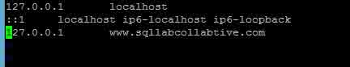
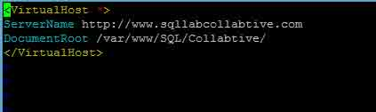
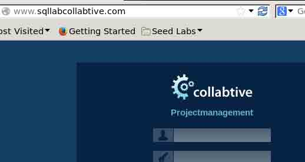
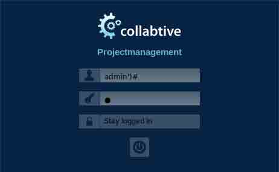
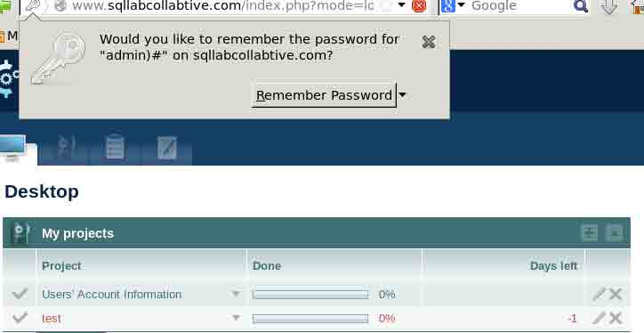
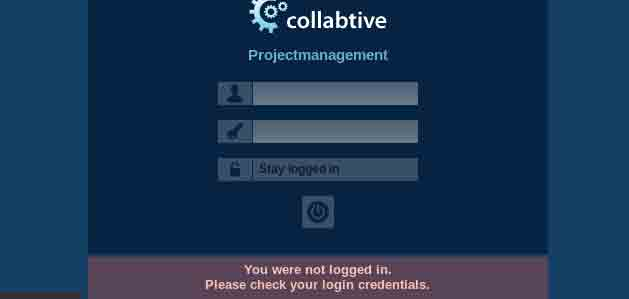
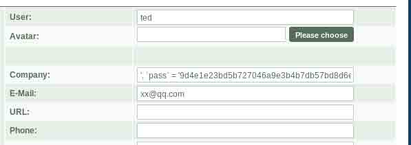
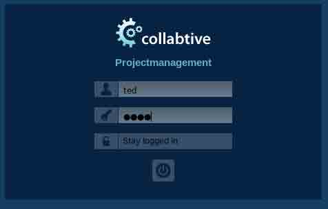
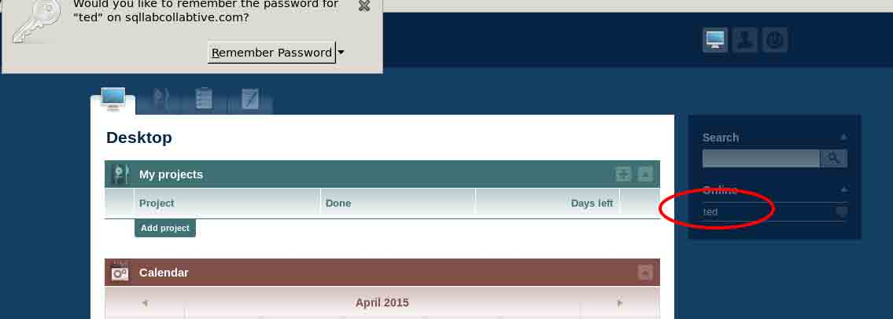

# 第 1 节 Collabtive 系统 SQL 注入实验

## 实验介绍

SQL 注入漏洞的代码注入技术,利用 web 应用程序和数据库服务器之间的接口。通过把 SQL 命令插入到 Web 表单提交或输入域名或页面请求的查询字符串，最终达到欺骗服务器执行恶意的 SQL 命令。

在这个实验中,我们利用的 web 应用程序称为 Collabtive，禁用 Collabtive 的若干对策。这样我们就创建了一个容易受到 SQL 注入攻击的 Collabtive 版本。经过我们的人工修改,可以捕捉许多 web 开发人员的常见错误。在本实验室学生的目标是找到方法来利用 SQL 注入漏洞,证明可以通过攻击的伤害,和掌握的技术,可以帮助抵御这类攻击。

## 预备知识

### 1、 SQL 语言

结构化查询语言(Structured Query Language)简称 SQL：是一种特殊目的的编程语言，是一种数据库查询和程序设计语言，用于存取数据以及查询、更新和管理关系数据库系统；同时也是数据库脚本文件的扩展名。

[常见 SQL 语句](http://www.cnblogs.com/yubinfeng/archive/2010/11/02/1867386.html)

### 2、SQL 注入

SQL 注入：SQL 注入能使攻击者绕过认证机制，完全控制远程服务器上的数据库。SQL 是结构化查询语言的简称，它是访问数据库的事实标准。目前，大多数 Web 应用都使用 SQL 数据库来存放应用程序的数据。几乎所有的 Web 应用在后台都使用某种 SQL 数据库。跟大多数语言一样，SQL 语法允许数据库命令和用户数据混杂在一起的。如果开发人员不细心的话，用户数据就有可能被解释成命令，这样的话，远程用户就不仅能向 Web 应用输入数据，而且还可以在数据库上执行任意命令了。

[sql 注入原理讲解](http://blog.csdn.net/stilling2006/article/details/8526458)

### 3、SQL 注入危害

>1\. 非法读取、篡改、添加、删除数据库中的数据。

>2\. 盗取用户的各类敏感信息，获取利益。

>3\. 通过修改数据库来修改网页上的内容。

>4\. 私自添加或删除账号。

>5\. 注入木马等等。

### 4、环境搭建

启动 mysql：

```
sudo mysqld_safe 
```

注意启动后程序不会退出，可以打开新的终端执行后续命令。

启动 Apache：

```
 sudo service apache2 start

    密码：dees 
```

配置 DNS：

```
 sudo vim /etc/hosts 
```

> 按 i 进入编辑模式，编辑文件

> 编辑完成后按 Esc 退出编辑

> 完成后使用 :wq 保存并退出



配置网站文件：

```
 sudo vim /etc/apache2/conf.d/lab.conf
    sudo service apache2 restart  重启服务 
```



>访问测试：http://www.sqllabcollabtive.com



>用户名：admin；密码：admin

关闭 php 配置策略：

```
 sudo vim /etc/php5/apache2/php.ini 
```

把`magic_quotes_gpc=On` 改为 `magic_quotes_gpc = Off`


>关于 magic*quotes*off 函数：

>对于 magic*quotes*gpc=on 的情况， 我们可以不对输入和输出数据库的字符串数据作 addslashes()和 stripslashes()的操作,数据也会正常显示；

>如果此时你对输入的数据作了 addslashes()处理，那么在输出的时候就必须使用 stripslashes()去掉多余的反斜杠。

对于 PHP `magic_quotes_gpc=off` 的情况

必须使用 addslashes()对输入数据进行处理，但并不需要使用 stripslashes()格式化输出，因为 addslashes()并未将反斜杠一起写入数据库，只是帮助 mysql 完成了 sql 语句的执行。

[科普](http://baike.baidu.com/link?url=kSUFbQgmubERiql4ftrJk_i9-PuTormAXb3oz0y-YL9qT9uLnDcU_Yi5LTmBoSMD_-I7M_UskS5QJVrmebz1ca)

## 实验内容

### lab1 select 语句的 sql 注入

访问：www.sqllabcollabtive.com；当我们知道用户而不知道到密码的时候，我们可以怎么登陆？

查看登陆验证文件：

```
sudo vim /var/www/SQL/Collabtive/include/class.user.php 
```

>设置行号 :set number

> 查找 :/keyword

找到其中第`375`行


```
$sel1 = mysql_query ("SELECT ID, name, locale, lastlogin, gender, FROM user WHERE (name = '$user' OR email = '$user') AND pass = '$pass'"); 
```

这一句就是我们登录时，后台的 sql 语句；我们可以构造一个语句，在不知道密码的情况下登陆；

```
 $sel1 = mysql_query ("SELECT ID, name, locale, lastlogin, gender, FROM user WHERE (name = '$user ') #' OR email = '$user') AND pass = '$pass'"); 
```

修改完后重启一下服务器：

```
sudo sudo service apache2 restart 
```

我们在`$user`后面加上`) #` 这样就会只验证用户名，后面的会被`#`注释



点击登陆以后，我们就可以绕过密码直接登录：



思考：

> 你是否可以找到一个方法来修改数据库（仍然使用上述 SQL 查询）？

>例如，你能添加一个新的登陆用户，或删除现有的用户？显然，上述的 SQL 语句是一个查询只陈述，并且不能更新数据库。但是，使用 SQL 注入，你可以把上面的语句分割为两个语句，后面是更新语句。

>请试试这个方法，看看是否可以成功地更新数据库？

答案：

> 其实，我们都无法达到更新的目标。这是因为在 MySQL 中实现的特定的防御机制。在报告中，你应该告诉我们你有什么企图以修改数据库。你应该找出原因的攻击失败，是什么机制在 MySQL 中阻止这种攻击。

登陆用户名：

```
admin') union update user set name='test' # 
```

登陆密码：随意的字符

登陆失败



#### 原因解释

MySQL 机制：update 不支持 union 语法。

### lab2 update 语句的 sql 注入

Collabtive 平台中可以更新用户信息，我们要实现通过自己的用户去修改别人的用户信息；

访问用户编辑链接：http://www.sqllabcollabtive.com/manageuser.php?action=editform&id=1

在 Collabtive web 应用程序中，如果用户想更新他们的个人资料，他们可以去我的帐户，单击编辑链接，然后填写表格以更新资料信息。在用户发送更新请求到服务器，一个 UPDATE SQL 语句将建造在 include/class.user.php。这句话的目的是修改用户表中的当前用户的配置信息。 有一个在这个 SQL 语句中的 SQL 注入漏洞；

```
 sudo vim /var/www/SQL/Collabtive/include/class.user.php 
```

我们可以找到如下的代码

```
 function edit($id, $name, $realname, $email, $tel1, $tel2, $company,
              $zip, $gender, $url, $address1, $address2, $state,
              $country, $tags, $locale, $avatar = "", $rate = 0.0)
    {
    $name = mysql_real_escape_string($name);
    $realname = mysql_real_escape_string($realname);

    //modified for SQL Lab
    //$company = mysql_real_escape_string($company);
    $email = mysql_real_escape_string($email);

    // further escaped parameters removed for brevity...

    $rate = (float) $rate;
    $id = (int) $id;

    if ($avatar != "")
        {
            $upd = mysql_query("UPDATE user SET name='$name', email='$email',
                                tel1='$tel1', tel2='$tel2', company='$company',
                                zip='$zip', gender='$gender', url='$url',
                                adress='$address1', adress2='$address2',
                                state='$state', country='$country',
                                tags='$tags', locale='$locale',
                                avatar='$avatar', rate='$rate' WHERE ID = $id");
        }
    else
        {
            // same query as above minus setting avatar; removed for
            // brevity
        }
    if ($upd)
        {
            $this->mylog->add($name, 'user', 2, 0);
            return true;
        }
    else
        {
            return false;
        }
    } 
```

我们会发现​sql 语句为：`SELECT ID WHERE name=​'$user'`,并且`company`的位置是存在注入漏洞，原理同 lab1。

这样我们就可以越权来修改其他用户的信息及密码；我们使用任意用户，如： bob bob 进行登录；

在编辑用户的位置：user 填 ted 用户； Company 处填：

```
 ', `pass` = '9d4e1e23bd5b727046a9e3b4b7db57bd8d6ee684' WHERE ID = 4 # '
    注：这里的 9d4e1e23bd5b727046a9e3b4b7db57bd8d6ee684 就是 pass 的 md5 值； 
```



点击修改，然后我们退出当前用户，使用 ted 用户登录，这个时候 ted 用户的密码应该是 pass；





### 防御策略

SQL 注入漏洞的根本问题是数据与代码的分离失败，因此我们可以针对这个原因进行防御

#### 防御策略 1

防御转义特殊字符使用，默认开启 magic*quotes*gpc，将 magic*quotes*gpc 值设为 On。

```
 sudo vim /etc/php5/apache2/php.ini
    sudo service apache2 restart 
```


科普：[magic*quotes*gpc 防注入方法](http://jingyan.baidu.com/article/49711c6144857efa441b7cd5.html)

#### 防御策略 2--避免使用特殊字符

MySQL 提供一个函数 mysql*real*escape_string()，这个函数可以用来过滤一些特殊字符；如\x00, \n, \r, , ', " and \x1a；

科普：[mysql*real*escape_string()](http://www.w3school.com.cn/php/func_mysql_real_escape_string.asp)

代码防御示例：

```
 sudo vim /var/www/SQL/Collabtive/include/class.user.php 
```

修改为如下：

```
 // This code was provided by the lab's author Wenliang Du, of Syracuse
    // University under the GNU Free Documentation License

    function login($user, $pass)
    {
        if (!$user)
            {
                return false;
            }

        // modification fixed
        $user = mysql_real_escape_string($user);
        $pass = mysql_real_escape_string($pass);
        $pass = sha1($pass);

        $sel1 = mysql_query("SELECT ID, name, locale, lastlogin, gender
                         FROM user WHERE (name =  '$user' OR
                         email = '$user') AND pass = '$pass'");
        $chk = mysql_fetch_array($sel1);
        if ($chk["ID"] != "")
            {
                // New user session object and cookie creation code
                // removed for brevity
                return true;
            }
        else
        {
            return false;
        }
    } 
```

以及编辑用户代码：

```
 function edit($id, $name, $realname, $email, $tel1, $tel2, $company,
              $zip, $gender, $url, $address1, $address2, $state,
              $country, $tags, $locale, $avatar = "", $rate = 0.0)
    {
    $name = mysql_real_escape_string($name);
    $realname = mysql_real_escape_string($realname);

    // modification fixed
    $company = mysql_real_escape_string($company);
    $email = mysql_real_escape_string($email);

    // further escaped parameters removed for brevity...

    $rate = (float) $rate;
    $id = (int) $id;

    if ($avatar != "")
        {
            $upd = mysql_query("UPDATE user SET name='$name', email='$email',
                                tel1='$tel1', tel2='$tel2', company='$company',
                                zip='$zip', gender='$gender', url='$url',
                                adress='$address1', adress2='$address2',
                                state='$state', country='$country',
                                tags='$tags', locale='$locale',
                                avatar='$avatar', rate='$rate' WHERE ID = $id");
        }
    else
        {
            // same query as above minus setting avatar; removed for
            // brevity
        }
    if ($upd)
        {
            $this->mylog->add($name, 'user', 2, 0);
            return true;
        }
    else
        {
            return false;
        }
    } 
```

#### 防御策略 3--数据与 sql 语句的分离

通过 SQL 逻辑分离来告诉数据库到底是哪部分是数据部分，哪一部分是 SQL 语句部分；

提供以新的 new mysqli()函数， 将这个函数写入 config/standary/config.php 文件：

```
 sudo vim /var/www/SQL/Collabtive/include/class.user.php 
```

修改代码如下：

```
 // This code was provided by the lab's author Wenliang Du, of Syracuse
    // University under the GNU Free Documentation License

    function login($user, $pass)
    {
    if (!$user)
        {
            return false;
        }

    // using prepared statements

    // note that $conn is instantiated in the datenbank class found in
    // ./class.datenbank.php. this may need to be passed in, but we
    // will assume we have access to it for the sake of brevity

    $stmt = $conn->prepare("SELECT ID,name,locale,lastlogin,gender FROM user
                            WHERE (name=? OR email=?) AND pass=?");
    $stmt->bind_param("sss", $user, $user, sha1($pass));
    $stmt->execute();
    $stmt->bind_result($bind_ID, $bind_name, $bind_locale, $bind_lastlogin,
                       $bind_gender);
    $chk = $stmt->fetch();
    if ($bind_ID != "")
        {
            // New user session object and cookie creation code
            // removed for brevity
            return true;
        }
    else
        {
            return false;
        }
    } 
```

以及编辑用户处的代码：

```
 // This code was provided by the lab's author Wenliang Du, of Syracuse
    // University under the GNU Free Documentation License

    function edit($id, $name, $realname, $email, $tel1, $tel2, $company, $zip,
              $gender, $url, $address1, $address2, $state, $country, $tags,
              $locale, $avatar = "", $rate = 0.0)
    {
    // the bind_param() function wants a double, not float, though
    // they are the same internally
    $rate = (double) $rate;
    $id = (int) $id;

    if ($avatar != "")
        {
            // again, $conn is instantiated in the datenbank class, and
            // may need to be passed, but we are assuming we have
            // access to it for the sake of brevity

            // note that the app uses zip as a string, does not use
            // realname although it is passed, and the columns adress
            // and adress2 are misspelled

            $stmt = $conn->prepare("UPDATE user SET name=?, email=?, tel1=?,
                                    tel2=?, company=?, zip=?, gender=?, url=?,
                                    adress=?, adress2=?, state=?, country=?,
                                    tags=?, locale=?, avatar=? rate=?
                                    WHERE ID = ?");
            $stmt->bind_param("sssssssssssssssdi", $name, $email, $tel1, $tel2,
                               $company, $zip, $gender, $url, $address1,
                               $address2, $state, $country, $tags, $locale,
                               $avatar, $rate, $id);
            $upd = $stmt->execute();
        }
    else
        {
            $stmt = $conn->prepare("UPDATE user SET name=?, email=?, tel1=?,
                                    tel2=?, company=?, zip=?, gender=?, url=?,
                                    adress=?, adress2=?, state=?, country=?,
                                    tags=?, locale=?, rate=? WHERE ID = ?");
            $stmt->bind_param("ssssssssssssssdi", $name, $email, $tel1, $tel2,
                               $company, $zip, $gender, $url, $address1,
                               $address2, $state, $country, $tags, $locale,
                               $rate, $id);
            $upd = $stmt->execute();
        }
    if ($upd)
        {
            $this->mylog->add($name, 'user', 2, 0);
            return true;
        }
    else
        {
            return false;
        }
    } 
```

### 调试

下面的代码可以让服务器端 php 程序变量输出到一个文件中，以此来对 php 代码进行调试

```
 $myFile = "/tmp/mylog.txt";
    $fh = fopen($myFile, ’a’) or die("can’t open file");
    $Data = "a string";
    fwrite($fh, $Data . "\n");
    fclose($fh); 
```

#### 火狐插件 Tamper Data

[TamperData 使用](http://www.shangxueba.com/jingyan/1608455.html)

## 作业

你需要提交一份详细的实验报告，描述你所做的和你所观察到的。

请提供使用的 LiveHTTPHeaders 的截图，并且提供详细的操作过程资料。

您还可以提供有趣或者令人惊讶的发现。

## license

本实验所涉及的实验环境来自[Syracuse SEED labs](http://www.cis.syr.edu/~wedu/seed/)，并在此基础上为适配实验室我那工作环境进行修改，修改后的实验文档仍然遵循 GUN Free Documentation License 附[Syracuse SEED labs](http://www.cis.syr.edu/~wedu/seed/)版权说明：

Copyright c 2006 - 2011 Wenliang Du, Syracuse University. The development of this document is/was funded by three grants from the US National Science Foundation: Awards No. 0231122 and 0618680 from TUES/CCLI and Award No. 1017771 from Trustworthy Computing. Permission is granted to copy, distribute and/or modify this document under the terms of the GNU Free Documentation License, Version 1.2 or any later version published by the Free Software Foundation. A copy of the license can be found at http://www.gnu.org/licenses/fdl.html.