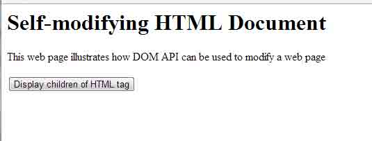
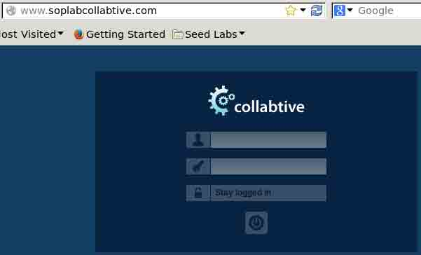
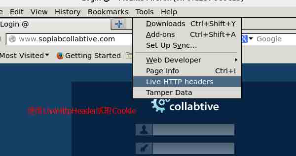
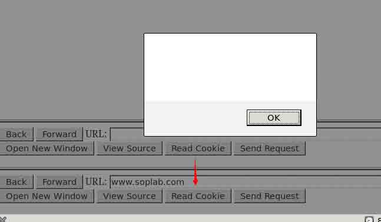
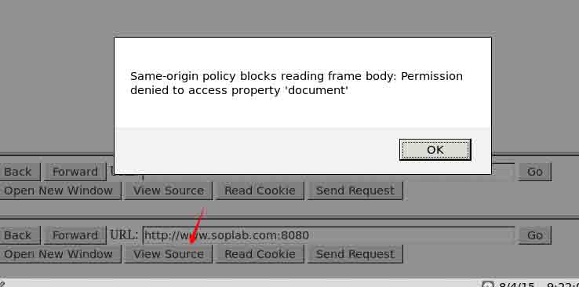
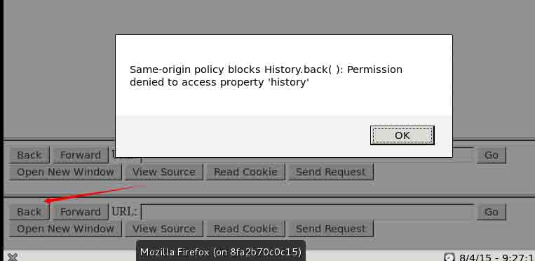
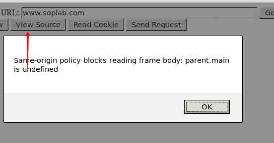

# 第 1 节 Collabtive 系统浏览器访问控制实验

## 实验简介

现在的 web 浏览器的安全模型是基于同源策略，并提供一些基于 Web 应用程序的保护功能；这个实验的目的是帮助大家对同源策略有一个很好的理解，这将对我们学习跨站脚步攻击和跨站请求伪造有很大帮助。

>系统用户名：seed，密码：dees

>网站登陆用户名：admin ，密码：admin

## 实验背景

Web 浏览器本质上是与 sites/web applications 1 代表其用户进行交互的用户代理。通常，用户访问一个网站使用 Web 浏览器 - Web 浏览器将 HTTP 请求转发到网站上代表其用户，并反过来显示由该网站的响应返回的网页。 Web 浏览器使用的安全模型被称为同源策略（SOP）用于执行对 Web 应用程序的一些访问限制。

SOP 的标识每个网站使用它的起源，这是 hprotocol，域 PORTI 的一个独特的组合，并创建一个上下文为每个原点。对于每个源，所述 web 浏览器生成的上下文，并将该 web 应用程序的资源，从上下文中的原点。从一个出身 JavaScript 程序不得从其他产地访问资源。cookie 和文档对象模型（DOM）对象是为哪 SOP 施加的 web 应用资源的例子。此外，JavaScript 程序可以使用 XMLHttpRequest API HTTP 请求发送到 Web 应用程序。 SOP 的也扩展到使用的 XMLHttpRequest API。首先，我们将提供 cookie，DOM 对象和 XMLHttpRequest API 一些背景。然后，我们描述了实验室的任务，这将导致学生调查 SOP 以及它如何影响使用 cookies，DOM 对象和 XMLHttpRequest API

## 预备知识

### 1、什么是同源策略

同源：如果两个页面使用相同的协议(protocol)，端口和主机（域名），那么这两个页面就属于同一个源。

同源策略：限制了一个源(origin)中加载文本或脚本与来自其他源中资源的交互方式；是客户端脚本（尤其是 Javascript）的重要的安全度量标准。

**重点：同源策略认为来自任何站点装载的信赖内容是不安全的。当被浏览器半信半疑的脚本运行在沙箱时，它们应该只被允许访问来自同一站点的资源，而不是那些来自其它站点可能怀有恶意的资源；**

>拓展：单源策略（Single Origin Policy），它是一种用于 Web 浏览器编程语言（如 JavaScript 和 Ajax）的安全措施，以保护信息的保密性和完整性。同源策略能阻止网站脚本访问其他站点使用的脚本，同时也阻止它与其他站点脚本交互。

### 2、什么是 DOM&Cookie？

DOM：文档对象模型(Document Object Module)，是处理可扩展标志语言的标准编程接口。 详细请参考[DOM—百度百科](http://baike.baidu.com/link?url=vTFAJ02ScpoGHdNs9sDSuyWsnmDxWFtb0YCd32u1IqsnXYz0-SjoIMsuu9eYGye5U0Xrpe34QCOBDdGYn4V3Qcr0doxM3N4nlC55KnkOW0m)

Cookie：为了辨别用户身份，进行 session 跟踪而存储在用户本地终端上的数据(通常经常加密)。 详细请参考[Cookie—百度百科](http://baike.baidu.com/link?url=4Of8ifjwfzzNtWmrjGN1B4tBho2pogxWwys9wgYlREX6ehbQIIdvQPCVIvrI36EDgSAhMZF35shi5vPLUZIg__f8eckSFVfQNdkc9lmdlQi)

### 3、什么是 XMLHttpRequest

[XMLHttpRequest—百度百科](http://baike.baidu.com/link?url=mEnP_BFD77g3L_dGEhV7rDTJNM9D_m-vNkEzFS0gD2f4hnRod-nHuirKC_n_oSThYUbd1hGlO8vWH4H2vb3VXq)

应用对象：后台与服务器交换数据；

>作用：

>1\. 在不重新加载页面的情况下更新网页。

>2\. 在页面已加载后从服务器请求数据。

>3\. 在页面已加载后从服务器接受数据。

>4\. 在后台向服务器发送数据。

### 4、环境搭建

在菜单中打开 Terminal，启动服务：

```
sudo service apache2 start 
```

>密码：dees 配置 DNS：

```
sudo vim /etc/hosts 
```

>按 i 进入编辑模式

>按 Esc 退出编辑

>输入 wq： 退出并保存


## 实验内容

### lab1 理解 DOM 和 Cookie

本实验中，我们通过编写代码来了解 DOM 和 Cookie

#### 使用 DOM API 来显示 html 的子节点 h1 的内容

```
sudo vim /var/www/SOP/first.html 
```

```
 <html> 
    <head> 
    <title>Self-modifying HTML</title> 
    <script> 
    function appendp()  //添加 h1 内容
    { 
    var h1_node = document.createElement("h1"); 
    h1_node.innerHTML = "Self-modifying HTML Document"; 
    document.childNodes[0].childNodes[2].appendChild(h1_node); 
    var p_node = document.createElement("p"); 
    p_node.innerHTML = "This web page illustrates how DOM API can be used to modify a web page"; 
    document.childNodes[0].childNodes[2].appendChild(p_node); 
    } 
    function gethtmlchildren()   //获取节点
    { 
    var entiredoc = document.childNodes[0]; 
    var docnodes = entiredoc.childNodes; 
    for(i=0; i<docnodes.length; i++) 
    alert(docnodes[i].nodeName); 
    } 
    </script> 
    </head> 
    <body name="bodybody" > 
    <script> appendp(); </script> 
    <input type="button" value="Display children of HTML tag" 
    onclick=gethtmlchildren() > 
    </body> 
    </html> 
```

显示 h1 的标题



显示 html 子节点


[常见 JavaScript 获取 DOM 节点](http://www.cnblogs.com/seamar/archive/2011/07/25/2116197.html)

#### 通过 LiveHttpHeader 抓取 Cookie

测试服务器

```
 sudo service apache2 restart
    sudo mysqld_safe 
```



用 firefox 访问 www.soplabcollabtive.com

打开 Tools 内的的 Live HTTP headers 查看 cookie




#### 通过 Cookie 获取页面的访问量

编辑网站配置文件：

```
 sudo vim /etc/apache2/conf.d/lab1.conf 
```

 重启服务器：

```
sudo service apache2 restart 
```

访问：www.soplab.com/cookie.html 会提示输入你的信息，第二次进入以后就会判断你的 Cookie 并返回你的定制；通过查看源代码进行理解如何存储并处理 Cookie

通过代码来实现“通过 cookie 获取页面访问次数”，这里我们新建一个 count_cookie.html

```
sudo vim count_cookie.html 
```

输入下面代码：

```
 <script type="text/javascript"> 
    if(getCookie("num")){ 
    var nn=parseInt(getCookie("num")); 
    setCookie("num",++nn); 
    }else{ 
    setCookie("num",1); 
    } 
    function getCookie(name){ 
    var str=document.cookie.split(";"); 
    for(i=0;i<str.length;i++){ 
    var str2=str[i].split("=") 
    if(str2[0].replace(/\s(.*)\s/,"$1")==name){ 
    return str2[1]; 
    } 
    } 
    } 
    function setCookie(name,value){ 
    var Days=30; 
    var exp = new Date(); 
    exp.setTime(exp.getTime() + Days*24*60*60*1000); 
    document.cookie = name + "="+ escape(value) +";expires"+ exp.toGMTString(); 
    } 
    alert("您是第"+getCookie("num")+"次访问"); 
    </script> 
```

### lab2 SOP 的 DOM 与 Cookie

本次实验是为了说明 Web 浏览器如何识别 Web 应用程序的来源，以及 DOM 对象和 Cookie 的访问限制；

#### 查看 frame 以及 Cookie

```
 sudo vim /etc/apache2/conf.d/lab1.conf 
```


通过页面上的 url 地址栏访问 www.soplab.com 查看 frame(是否同一个源，允许访问)

>同源：协议相同(ftp,http,https 等等)；主机相同(www.xxx.cn/com 等等)；端口相同(默认情况下都是 80 端口，但是有些域名绑定的不是 80 端口，这种情况属于不同源)；


访问 Cookie(允许访问，但是这个时候 Cookie 为空)



#### 从不同源的的 url 进行访问

查看 frame(因为主机名不同，所以同源策略不允许访问)


查看 Cookie(因为主机名不同，所以同源策略不允许访问)


#### 设置不同端口进行访问

访问 frame(因为端口不同，所以同源策略不允许访问)



查看 Cookie(因为端口不同，所以同源策略不允许访问)


#### 不仅仅是 Cookie 和 frame 受到 SOP 约束，还有历史对象

不同源：历史等框架同样受到限制

**最下面两幅图是有区别的（大家好好体会一下！）**




### SOP XMLHttpRequest

#### SOP 是否扩展到 HTTP 请求的目标 URL



通过验证可以表示，同源策略没有扩展到请求 http url；

#### 描述通过 XMLHttpRequest 进行绕过同源策略

[科普](http://blog.csdn.net/shimiso/article/details/21830313)

#### SOP 的例外

[科普](http://www.91ri.org/7330.html)

## 作业

你需要提交一份详细的实验报告，描述你所做的和你所观察到的。

使用的 LiveHTTPHeaders 的截图，请提供详细资料。

您还需要提供的解释是有趣的或者令人惊讶的观察。

## license

本实验所涉及的实验环境来自[Syracuse SEED labs](http://www.cis.syr.edu/~wedu/seed/)，并在此基础上为适配实验室我那工作环境进行修改，修改后的实验文档仍然遵循 GUN Free Documentation License 附[Syracuse SEED labs](http://www.cis.syr.edu/~wedu/seed/)版权说明：

Copyright c 2006 - 2011 Wenliang Du, Syracuse University. The development of this document is/was funded by three grants from the US National Science Foundation: Awards No. 0231122 and 0618680 from TUES/CCLI and Award No. 1017771 from Trustworthy Computing. Permission is granted to copy, distribute and/or modify this document under the terms of the GNU Free Documentation License, Version 1.2 or any later version published by the Free Software Foundation. A copy of the license can be found at http://www.gnu.org/licenses/fdl.html.