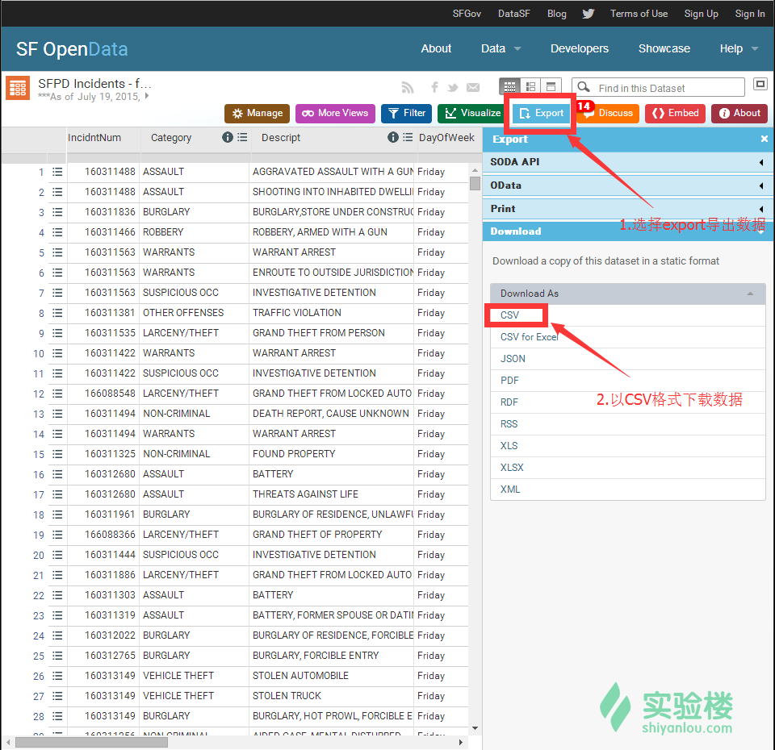
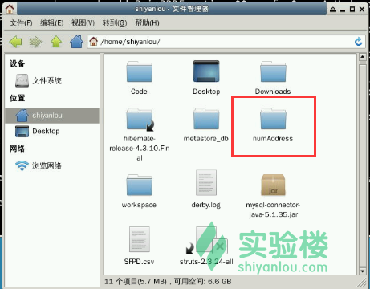
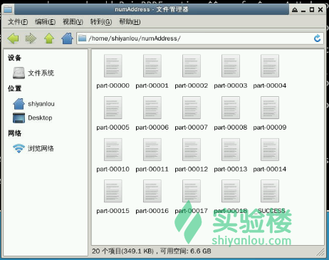

# 第 1 节 Spark DataFrame 详解

## 一、实验简介

本实验通过更加深入的讲解，使用真实的数据集，并结合实际问题分析过程作为引导，旨在让 Spark 学习者掌握 DataFrame 的高级操作技巧。

### 1.1 知识点

*   DataFrame 概念复习
*   创建 DataFrame 的两种方式
*   常用 DataFrame 操作
*   自定义函数
*   DataFrame 的重分区

## 二、准备数据集

### 2.1 数据集简介

本节内容选择了 SFPD 数据源中的数据作为数据集。该数据由美国旧金山政府提供。数据集包含了旧金山警察署自 2003 年 1 月 1 日以来公开的案件信息。

数据集中主要的字段有：

*   IncidntNum：案件 ID（编号）
*   Category：案件分类
*   Descript：案件描述
*   DayOfWeek：案件发生时的星期
*   Date：案件发生日期
*   Time：案件发生时间
*   PdDistrict：警察署所处区域
*   Resolution：案件解决方案
*   Address：案发发生所在地
*   X：案发位置经度
*   Y：案发位置纬度
*   Location：案发位置（组合坐标）
*   PdId：当值警察编号

### 2.2 下载数据集

你可以访问下面的原始地址获得最全面的数据。但我们已在实验楼为你准备好了这些数据的一个子集，你可以通过后面的步骤获取。

> 数据集来源：https://data.sfgov.org/Public-Safety/SFPD-Incidents-from-1-January-2003/tmnf-yvry

在其官方网站中，可以看到导出数据的选项：



回到我们的实验环境，你可以通过在终端中输入下面的命令来得到一个样例数据集。具体命令如下：

```java
wget http://labfile.oss.aliyuncs.com/courses/543/SFPD.csv 
```

文件下载后保存在`/home/shiyanlou`目录下。请使用 gedit 打开它（双击该 csv 文件即可），并且删除文件中首行的字段名称，保存后退出。


## 三、DataFrame 详解

### 3.1 什么是 DataFrame？

尽管我们已经通过一系列的课程学习了 DataFrame 的使用，但此处我们仍然需要问问自己，究竟什么是 DataFrame？

在之前的课程中，我们提到了 DataFrame 是按照指定列组织的分布式数据集合。

> 是 SparkSQL 中的编程抽象 > 支持广泛的数据格式和存储系统 > 可通过 Scala、Python、Java 和 R 语言编程

DataFrame 与 Spark RDD 的区别在于：

*   DataFrame 是带有模式的集合，可以通过 SQL 语句查询。
*   RDD 是不具有潜在数据类型信息的对象的不透明集合，不能通过 SQL 语句查询。

### 3.2 在 Spark 中创建 DataFrame

有两个途径可以创建 DataFrame。一是从现有的 RDD 创建，二是直接从数据源创建。

#### 3.2.1 从 RDD 创建 DataFrame

根据 RDD 的实际情况，从现有 RDD 创建 DataFrame 的方式如下：

**（1） 由反射机制推断出模式**

这里的模式指的就是 DataFrame 独有的模式（Schema）。这种方式通常适用于模式已知的情况，是将含有 case class 的 RDD 转化为 DataFrame 来实现的。

Case Class 的作用就是定义表的模式。参数的名称通过反射得到，并且会成为列名。Case Class 可以被嵌套，也可以包含复杂的数据（比如序列或者数组）。

这种方式的步骤如下：

> 注意：下面的步骤是建立在 SQLContext 已创建的情况下，我们默认你在进行这些步骤时已执行 SQLContext 的创建操作。

Step 1：引用必要的类。

```java
import org.apache.spark.sql._

import sqlContext.implicits._

// 在使用 Spark Shell 时，下面这句不是必需的。
// Spark Shell 已默认为你启用了 SQL context，在需要时可直接使用 sqlContext。 
val sqlContext = new org.apache.spark.sql.SQLContext(sc) 
```


Step 2：创建 RDD。

```java
//导入 CSV 文件并处理逗号分隔的数据

val sfpdRDD = sc.textFile("/home/shiyanlou/SFPD.csv").map(inc => inc.split(",")) 
```


Step 3：定义 case class。

```java
case class Incidents(incidentnum:String, category:String, description:String, dayofweek:String, date:String, time:String, pddistrict:String, resolution:String, address:String, x:String, y:String, location:String, pdid:String) 
```


Step 4：将 RDD 转换为含有 case 对象的 RDD。

```java
val sfpdCase = sfpdRDD.map(inc => Incidents(inc(0), inc(1), inc(2), inc(3), inc(4), inc(5), inc(6), inc(7), inc(8), inc(9), inc(10), inc(11), inc(12))) 
```


Step 5：隐式转换会将含有 case 对象的 RDD 转换为 DataFrame，将 DataFrame 的一些操作和函数应用于这个 DataFrame 中。

```java
val sfpdDF = sfpdCase.toDF() 
```


Step 6：将 DataFrame 注册为临时表，以便于在表上运行 SQL 查询。

```java
sfpdDF.registerTempTable("sfpd") 
```

**（2） 通过编程方式构建模式**

这种方式适用于列和类型在运行时不可知的情况，我们就需要手动地去构建 DataFrame 的模式。通常 DataFrame 的模式在动态变化时才会使用这种方式。

> 注意：该方式在 case class 在不能被提前定义时，或者使用 scala 语言的项目中 case class 超过 22 个字段时，才会用到。

在学习之前我们先做几个样本数据：

首先我们在`/home/shiyanlou/`目录下新建一个文本文件。在资源管理器中右击，然后选择菜单中的“创建文档” -> “空文件”。


在弹出的对话框中填入文件名`data.txt`。


然后用 gedit 编辑器打开它，并写入下面的内容，然后保存退出。

```java
160311488 Friday 04/15/2016 23:51 BAYVIEW
160311836 Friday 04/15/2016 23:30 MISSION
160311961 Friday 04/15/2016 23:00 CENTRAL 
```


简单的数据源我们就准备好了。接下来通过具体的代码学习如何使用编程方法构建模式。

Step 1：引入必要的类。

```java
import sqlContext.implicits._
import org.apache.spark.sql._
import org.apache.spark.sql.types._ 
```


Step 2：由原始 RDD 创建一个 Row RDD。

```java
val rowRDD = sc.textFile("/home/shiyanlou/data.txt").map(x => x.split(" ")).map( p => Row(p(0), p(2), p(4))) 
```


Step 3：使用 StructType 和 StructField 分别创建模式。其中，StructType 对应于 table（表），StructField 对应于 field（字段）。

```java
val testSchema = StructType(Array(StructField("IncNum", StringType, true), StructField("Date", StringType, true), StructField("District", StringType, true))) 
```


Step 4：使用 SQLContext 提供的方法，将模式应用于 Row RDD 上，以创建 DataFrame。

```java
val testDF = sqlContext.createDataFrame(rowRDD, testSchema)

// 将 DataFrame 注册为表
testDF.registerTempTable("test")

val incs = sql("SELECT * FROM test") 
```


最后查看一下这个查询语句的结果。

```java
incs.show(3) 
```


#### 3.2.2 从数据源创建 DataFrame

现有的大数据应用通常需要搜集和分析来自不同的数据源的数据。而 DataFrame 支持 JSON 文件、Parquet 文件、Hive 表等数据格式。它能从本地文件系统、分布式文件系统（HDFS）、云存储（Amazon S3）和外部的关系数据库系统（通过 JDBC，在 Spark 1.4 版本起开始支持）等地方读取数据。另外，通过 Spark SQLL 的外部数据源 API，DataFrame 能够被扩展，以支持第三方的数据格式或数据源。在实验楼提供的 DataFrame 入门课程中，我们就用到了一个十分流行的第三方 CSV 格式扩展。除此之外，它还支持 Avro（一个数据序列化的系统）、ElasticSearch、Cassandra。

扩展阅读：

> `CSV`：逗号分隔值（Comma-Separated Values），其文件以纯文本形式存储表格数据。http://commons.apache.org/proper/commons-csv/ > `Apache Avro`： 一个数据序列化的系统，相当于基于二进制数据传输高性能的中间件。https://avro.apache.org/docs/current/ > `Elasticsearch`：一个基于 Lucene 的搜索服务器。提供了一个基于 RESTful web 接口的分布式全文搜索引擎。https://www.elastic.co/products/elasticsearch/
> `Apache Cassandra`：一套开源分布式 NoSQL 数据库系统。http://cassandra.apache.org/

由于数据格式和数据源众多，这里暂不能一一展开讲解。在实际应用中，如果需要使用某种格式的数据或者某个数据源，应查询其官方文档。通常官方文档（特别是 API 手册）都提供了详细的集成方法和指导。

在 Spark 中，默认的数据源被设定为 Parquet，所以通用的加载方式为：

```java
sqlContext.load("/home/shiyanlou/data.parquet") 
```

如果是其他格式，则需要手动地指定格式：

```java
sqlContext.load("/home/shiyanlou/data", "json") 
```

下面给出了其他的加载指定数据源的方法：

*   `sqlContext.jdbc`：从数据库表中加载 DataFrame
*   `sqlContext.jsonFile`：从 JSON 文件中加载 DataFrame
*   `sqlContext.jsonRDD`：从包含 JSON 对象的 RDD 中加载 DataFrame
*   `sqlContext.parquetFile`：从 parquet 文件中加载 DataFrame

需要注意的是，在 Spark 1.4 及之后的版本中，加载数据源的方法为：

```java
// 默认格式 parquet 文件的加载方法，需要给出文件的路径
sqlContext.read.load("/home/shiyanlou/data.parquet")

// 加载其他格式的文件，需要在 format 方法中指明格式
sqlContext.read.format("json").load("/home/shiyanlou/data.json") 
```

## 四、探索 DataFrame 中的数据

### 4.1 常用 DataFrame 操作

对于 DataFrame 而言，经常用到的行动操作（Action）主要有：

*   `count()`：返回当前 DataFrame 中含有的行的数目。
*   `collect()`：以数组的形式，返回当前 DataFrame 中的所有行。
*   `head()`：返回当前 DataFrame 中的第一行数据。
*   `first()`：功能与 head()相同，返回其中第一行的数据。
*   `show()`：输出 DataFrame 中的前面几行数据，默认为前 20 行，输出的数据将以表格形式呈现。
*   `take(n:int)`：返回当前 DataFrame 中前面 n 行的数据，行数由参数确定。
*   `describe(cols:String*)`：计算数值列的统计值（这些指标有计数、均值、标准差、最大值和最小值等）

除此之外，DataFrame 还有以下这些经常用到的基础函数：

*   `columns()`：以数组的形式，返回当前 DataFrame 中所有的列名。
*   `cache()`：将当前 DataFrame 缓存至内存或硬盘中（缓存方式由其他机制决定）。
*   `persist()`：持久化当前 DataFrame。
*   `unpersist()`：与上面的持久化方法作用相反，是去除该 DataFrame 的持久化。
*   `printSchema()`：以“树目录”的形式打印表格的字段名和类型（相当于其模式）。
*   `dtypes()`：以数组的形式，返回所有的列名及其数据类型。
*   `toDF()`：在重新指定列名后，返回一个新的 DataFrame。
*   `registerTempTable()`：将指定的名字作为参数，将当前 DataFrame 注册为一个临时表。
*   `isLocal()`：返回一个 Boolean 的结果，用于判断 collect 操作和 take 操作是否可以本地运行。
*   `explain()`：在控制台输出物理计划（Catalyst Optimizer）

由于 DataFrame 本身也是一个 RDD，所以一些 RDD 具有的操作，DataFrame 也有。例如：

*   `map()`
*   `flatMap()`
*   `foreach()`
*   `repartition()`
*   `foreachPartition()`

这些方法如何使用已经在 RDD 相关的课程中进行了讲解，此处不再赘述。

最后，我们再提供一些常用的语言集成查询函数。这些函数的作用类似于 SQL 语句，通常与 Spark SQL 结合使用。

*   `select()`：根据参数提供的条件，选择一个列的集合。
*   `where(condition)`：根据参数提供的条件，过滤指定的行。与此作用相同的还有`filter(expr)`。
*   `sort()`：根据参数提供的表达式，返回一个按照该表达式排序的新的 DataFrame。
*   `drop()`：移除参数指定的列，然后返回一个新的 DataFrame。
*   `distinct()`：返回一个仅包含 DataFrame 的唯一行的新 DataFrame。
*   `col()`：选择参数指定的列，并将其以 Column 的形式返回。
*   `as()`：以参数指定的名称作为当前 DataFrame 的别名，返回一个新的 DataFrame。
*   `agg(expr, exprs)`：聚集整个 DataFrame。
*   `except(other)`：返回一个带有行的新 DataFrame，这里的行指的是当前 DataFrame 不在其他 DataFrame 中被包含的行。
*   `groupBy(cols:Columns)`：使用指定的列来分组 DataFrame。
*   `join(DataFrame, joinExpr)`：使用指定的联合表达式，联合其他的 DataFrame。

这些函数的参数形式、返回值类型，请通过[最新的 DataFrame API 文档](https://spark.apache.org/docs/1.3.0/api/scala/index.html#org.apache.spark.sql.DataFrame)获取。

### 4.2 入手数据分析工作

在本课程一开始，我们就下载了一个数据集。假设现在我们是某个数据分析专家，要对这个数据集中的数据进行分析。我们可以首先为这些数据提出一切问题，然后用数据分析的手段来回答这些问题。

在数据分析的过程中，如何针对数据的特点提出问题也是一种技巧。数据都是普普通通的，正是因为带有特定意义的解释才让这些陈旧的数据焕发出光彩。

不妨先提出这个问题：发生事件最多的前 3 个地址（Address）有哪些？

我们先给出能够回答这个问题的代码：

```java
val incByAdd = sfpdDF.groupBy("address")

val numAdd = incByAdd.count

val numAddDesc = numAdd.sort($"count".desc)

val top3Add = numAddDesc.show(3) 
```

上面的 4 个语句也可以简写为：

```java
val incByAdd = sfpdDF.groupBy("address").count.sort($"count".desc).show(3) 
```

输出的结果为：


我们还可以用 SQL 语句来得到上面的结果。具体的代码为：

```java
val top3Address = sqlContext.sql("SELECT address, count(incidentnum) AS inccount FROM sfpd GROUP BY address ORDER BY inccount DESC LIMIT 3").show 
```

输出的结果为：


这样，第一个问题就回答了。现在我们将这个结果保存下来。

我们在常用 DataFrame 操作一节中讲述了行动操作、基础函数等，这里还需要再补充一下输出操作会用到的函数。输出的意思即保存，我们通常会将一些中间结果或者最终结果存储起来，作为下一步分析的基础。

这些用于输出的操作主要有：

*   `save(source, mode, options)`：基于给定的数据源、保存模式和选项，将 DataFrame 的内容保存下来。
*   `saveAsTable(tableName, source, mode, options)`：基于给定的数据源、保存模式和选项，将 DataFrame 的内容保存为表。
*   `saveAsParquetFile(path)`：将 DataFrame 的内容保存为 parquet 文件，存放于指定的路径。
*   `insertIntoJDBC(url, name, over
*   )`：将 DataFrame 的内容保存至 JDBC 源，路径由参数 url 给出，需要指定表名和覆盖模式。

但我们如果需要保存为 JSON 格式，又应该怎么办呢？我们知道 JSON 文件的本质是文本，所以可通过下面的代码来实现：

```java
numAddDesc.toJSON.saveAsTextFile("/home/shiyanlou/numAddress") 
```


注意此处保存的对象`numAddDesc`是一个 DataFrame 对象。在保存完毕后，我们可以在`/home/shiyanlou`目录下看到一个名为`numAddress`的文件夹，如下图所示。



打开该文件夹后可以看到很多的文本文件，这些都是 DataFrame 的内容。



随意打开一个文本文件，可以看到 DataFrame 的具体内容。它是以 Json 格式存放的，如下图所示。


在 Spark 1.4 及之后的版本中，这些保存的方法被通用的格式所取代。首先调用`write()`方法进行写操作，可以通过`format()`函数指定格式，并且通过`mode()`函数指定存储模式，用`sava()`函数指定路径。于是刚刚的保存操作可以写成：

```java
numAddDesc.write.format("json").mode("overwrite").save("/home/shiyanlou/numAddDesc2") 
```


如果需要保存为其他格式，`format()`函数中可以填写`parquet`、`jdbc`等。Spark SQL 支持通过`format()`函数，将任何类型的 DataFrame 转换成其他类型。保存模式`mode()`中的参数可以是`errorifexists`、`append`和`ignore`等。

学会了这个操作后，请你尝试回答下面的问题，并将答案填写在实验报告中。

*   发生事件最多的前 3 个区域（District）有哪几个？
*   事件的各个分类（Categories）中，数量排名前 5 的有那几个？
*   排名前 10 的决议（Resolution）是哪些？

## 五、自定义函数（UDF）

在 Spark 中，你可以在行内自定义函数（我们称之为 UDF，User Defined Functions）以满足更多的需要。在自定义 UDF 的时候，没有很复杂的注册或者包处理机制。UDF 有两种类型：一是与 Scala 的 DataFrame 操作共用；二是与 SQL 语句共用。

在行内定义 UDF 的方法是使用`udf()`函数，可以基于 DataFrame 操作来创建。下面给出了定义 UDF 时需要使用的格式：

```java
val function1 = udf((arguments) => {function definition}) 
```

在 SQL 查询中定义 UDF 的方式是：

```java
def function1

sqlContext.udf.register("functionName", function1 _) 
```

这两个语句可以简写为：

```java
sqlContext.udf.register("functionName", function1 def) 
```

### 5.1 入手 UDF

下面我们通过一个案例来学习 UDF。同样，我们先对数据提出一个问题，然后用自己的办法来回答这个问题。

比如，我们可以去探索如何按年查找事件。首先我们需要找出数据集中的日期的格式，此处为`DD/MM/YY`，分别代表日、月、年。 然后我们需要提取出最后一个斜杠之后的字符串，即`YY`。它就是我们需要的年份。最后我们就能够按照年份来计算事件的数量。

**（1）**如果是使用 Scala 语言，则首先定义一个 UDF，用于获取年份。

```java
val getYearString = udf((s:String) => {val lastString = s.substring(s.lastIndexOf('/') + 1); lastString}) 
```


> 思考一下：为什么要+1？

接着，将这个 UDF 用在 DataFrame 的操作中：

```java
val year = sfpdDF.groupBy(getYearString(sfpdDF("Date"))).count.show 
```

这个语句将会按照年份来统计每年的事件数量，输出的结果如下：


**（2）**如果是要使用 SQL 语句，则可以按照另外一种方式定义 UDF：

```java
def getString(s: String) = {val stringAfter = s.substring(s.lastIndexOf('/') + 1); stringAfter} 
```


然后将其注册为 UDF：

```java
sqlContext.udf.register("getString", getString _) 
```


上面两步可以简写为：

```java
sqlContext.udf.register("getString", (s: String) => {val stringAfter = s.substring(s.lastIndexOf('/') + 1); stringAfter}) 
```


接着，将其用在 SQL 语句里面：

```java
val numOfIncByYear = sqlContext.sql("SELECT getString(date), count(incidentnum) AS countbyyear FROM sfpd GROUP BY getString(date) ORDER BY countbyyear DESC LIMIT 5") 
```


最后我们将这个结果输出：

```java
numOfIncByYear.foreach(println) 
```

输出的结果如下：


## 六、扩展：DataFrame 的重分区

在混洗（Shuffle）过程之后，我们可以设置 DataFrame 中的分区数量：

```java
spark.sql.shuffule.partitions 
```

在 Spark 中，其分区数量的默认值是 200，你可以通过下面的方法来改变这个参数：

```java
sqlContext.setConf(key, value) 
```

**为什么要重分区？**

SparkSQL 在内部对数据进行分区，是为了更好地联合（join）和聚集（aggregation）。这是一种优化方法，在 Hive 中比较常见。如果将其他的 RDD 操作应用在 DataFrame 操作的结果上，则可以手动地控制分区。分区表的数据通常存储在不同的目录里，然后每个分区的目录的路径里会有分区列的值编码。

如果需要重分区，直接使用`df.repartition(numOfpartitions)`即可。如果要获得现有分区的数量，则可以调用`df.rdd.partitions.size`。

最理想的情况下，每个分区的大小在 50MB 至 200MB 之间是最好的。如果数据集实在是很小，则可以将其重分区为较少的分区。对于那些包含 100 个节点的大型集群，则至少应保证有 100 个分区。例如，假设 100 个节点的每个 executor 中 10 个槽（slot），而我们就可以设定 1000 个分区，以使用所有 executor 的槽。

## 七、实验总结

本实验首先复习了 DataFrame 的概念，这与其他数据分析类语言中的数据库概念是类似的，你可以相互比较一下，加深映像。其次，我们通过 SFPD 数据集的分析任务，学习了如何创建 DataFrame、如何使用常用的 DataFrame 操作，以及如何定义 UDF。最后，我们还介绍了 DataFrame 的重分区相关知识。

在本节实验学习结束后，你可以针对这个 SFPD 数据集进行更多的分析。期待在你的实验报告中看到对于文中提出的未解决问题的回答。

对于本实验的学习有任何问题，欢迎在实验楼的[问答](https://www.shiyanlou.com/questions/)版块与我们交流。

## 八、作业

上文中提出了 3 个问题，请自行通过 DataFrame 的操作获得这些问题的答案，并回答在实验报告中。

我们再把这些问题列出来：

*   发生事件最多的前 3 个区域（District）有哪几个？
*   事件的各个分类（Categories）中，数量排名前 5 的有那几个？
*   排名前 10 的决议（Resolution）是哪些？