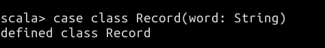
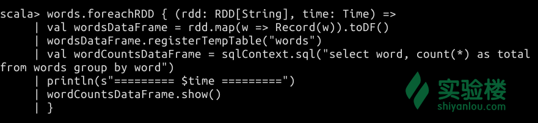

# 第 1 节 Spark Streaming 入门

## 一、实验简介

Spark Streaming 是 Spark 引擎的一种扩展，适用于实时处理流式数据。本课程将带你学习 Spark Streaming 的工作机制，了解 Streaming 应用的基本结构，以及如何在 Streaming 应用中附加 SQL 查询。

### 1.1 知识点

*   Spark Streaming 的工作机制
*   Streaming 应用的基本结构
*   DStream 的概念和结构
*   如何在 Streaming 上运行 SQL 查询

### 1.2 准备工作

在学习本课程之间，建议你对基本的 Spark 应用结构和 DataFrame 、SQL 相关知识有所了解。但这些知识不是学习 Streaming 机制所必需的。

为此，实验楼目前为你准备了以下课程：

*   [Spark 大数据动手实验](https://www.shiyanlou.com/courses/456)
*   [Spark 讲堂之 DataFrame 入门](https://www.shiyanlou.com/courses/536)
*   [Spark 讲堂之 SQL 入门](https://www.shiyanlou.com/courses/586)

## 二、Spark Streaming 介绍

Spark Streaming 是现有 Spark 核心 API 的一种扩展，适用于实时数据在可扩展、高吞吐、高容错等特性下的流处理。它支持多种数据源，例如 HDFS 、 Kafka 、 Flume 、ZeroMQ 、Kinesis 和 TCP Socket 等。诸如 CSV 文件、Excel 文档、Twitter 和 Facebook 等处导出的数据，再经过简单处理后，存放于上述数据源中，可供 Spark Streaming 使用。

既然是一种扩展，那么在 Streaming 中，数据就仍然能被 map 、reduce 、join 和 window 等表达式组成的复杂算法所处理。处理完成后，数据能被输出至文件系统、数据库和一些实时的仪表盘（例如下图所示的数据可视化界面）。


*图为 im.qq.com 提供的 QQ 同时在线人数实时统计。*

同时，一些机器学习和图相关的算法也能应用到这些流数据上。Spark Streaming 的工作流程如下图所示。


*图片来自 [Spark Streaming Programming Guide](http://spark.apache.org/docs/1.6.1/streaming-programming-guide.html)*

Spark Streaming 可以接收实时的数据流，然后将其划分为 Batch （可以理解为各个批次的数据块）。这些 Batch 将由真正的 Spark 引擎来处理，创建最后的处理结果的数据流，并且这些数据流也是以 Batch 的形式存在的。它们通常可以存放至 HDFS、HBase 等处。后续可以继续用 Spark 进行处理，或者是导向 Hadoop 的 MapReduce ，以及 Drill 、Hive 等是用于不同场景的数据分析工具。

总结一下上述过程，无非就是分为三步：

*   通过数据源（Flume、HDFS 等）产生输入数据流
*   由 Spark Streaming 捕获该数据流，进行分块后的处理，结果存放至 HDFS、HBase 等处。
*   已处理的结果块交由各项服务作后续处理（Drill 、Hive）等。

### 三、快速上手案例

在详细介绍 Streaming 的一些细节之前，我们可以先通过先的案例来快速上手。

请先打开桌面上的 Xfce 终端，然后再输入 `spark-shell` 来启动 Spark Shell。


#### 3.1 程序的入口点： Streaming Context 对象

首先我们需要引入一些 Spark Streaming 相关的包来利用其中的功能。

> 请在 Spark Shell 中输入下面的代码。

```java
import org.apache.spark._
import org.apache.spark.streaming._ 
```


这些包能被用于创建 StreamContext ，这是我们 Streaming 程序的入口点。创建 StreamContext 对象需要两个参数，一个是 SparkConf 对象，一个是分块间隔时间。

如果是在外部 IDE 开发的 Spark 应用，则你首先需要创建一个 SparkConf 对象之后再创建。

> **注意：本段代码仅作参考，不必在 Spark Shell 中输入。**

```java
val conf = new SparkConf().setMaster("local[2]").setAppName("NetworkWordCount")

val ssc = new StreamingContext(conf, Seconds(2)) 
```

由于在 Spark Shell 启动过程中，我们已经得到了一个初始化了的 Spark Context 对象 `sc` ，于是我们可以直接通过它来创建 StreamingContext 对象。

具体方法如下：

> 请在 Spark Shell 中输入下面的代码。

```java
val ssc = new StreamingContext(sc, Seconds(2)) 
```


大多数人会在创建 Streaming Context 对象这一步遇到各种错误，因此需要注意的是：

*   在同一段时间内，一个 JVM 上只能运行一个 Spark Context，否则会报错。报错如下图所示： 
*   当某个 Streaming Context 启动后，就不能再创建新的 Streaming Context 对象（对于其他的 Context 对象也是这样）。
*   使用 `stop()` 操作停止当前的 Streaming Context 后，实例就已经被销毁，不能再启动它，同时还会造成 Spark Context 停止（若不想停止 Spark Context，可在 `stop()` 函数中设置参数 `stopSparkContext` 为 `false`，具体请查阅 API 手册）。
*   当前的 Streaming Context 停止后，可以再次通过 Spark Context 来创建新的对象。

#### 3.2 为 Streaming 接收数据做好准备

在得到 Streaming Context 对象 `ssc` 之后，我们就可以通过它来创建 DStream 。在本例中，创建好的这个 DStream 对象用于接收来自 TCP 发送的数据包，因此我们需要指定主机名（hostname）和端口。

> 请在 Spark Shell 中输入下面的代码。

```java
val lines = ssc.socketTextStream("localhost", 9999) 
```


这里的 DStream 对象 `lines` 代表了将要接收的数据流，相当于定义了输入源。在 DStream 中，每一条记录都是一行文本，因此我们可以将每一行的内容按照特定的分隔符（例如空格），分隔成各个字段。

> 请在 Spark Shell 中输入下面的代码。

```java
val words = lines.flatMap(_.split(" ")) 
```


**就本质而言，对于流的计算就是建立在对 DStream 对象上的操作。**

上述操作中，`flatMap` 是一个一对多的 DStream 操作。它将源 DStream 中的每条记录按照条件产生多个新的记录，存放到新的 DStream 中。在本例中，每一行都按照空格划分为多个字段，划分的结果存放在名为 `words` 的 DStream 中。

#### 3.3 对 DStream 对象应用操作

在得到流数据之后，我们可以基于它做一些统计运算。例如在本例中，我们可以统计输入的词的数量。

> 请在 Spark Shell 中输入下面的代码。

```java
val pairs = words.map(word => (word, 1))

val wordCounts = pairs.reduceByKey(_ + _) 
```


```java
wordCounts.print() 
```

#### 3.4 发送数据和启动 Streaming

请不要关闭当前这个 Spark Shell ，同时打开另一个 Xfce 终端，并**在新打开的终端中输入以下命令：**

```java
nc -lk 9999 
```


此时再回到 Spark Shell 中，启动 Streaming 。

```java
ssc.start() 
```


> 如果是在启动 NetCat 之前就已经启动了 Streaming，则可能会遇到 Spark Shell 中有错误信息不断出现。这并不影响 Streaming 的工作，只需要及时启动 NetCat 即可。

如果需要停止，则是需要通过下面的代码来等待当前批次的计算完成后终止整个任务。

> 下面的代码在 Spark Shell 中无法使用，仅通过 Spark 提交的 jar 包中有效。**因此你不必在 Spark Shell 中输入。**

```java
ssc.awaitTermination() 
```

> **补充说明：** NetCat 是一个经典的读写 TCP 或 UDP 网络连接的工具。通过 `nc hostname port` 命令可以快速地建立一个 TCP 连接，并指向指定的主机和端口。本例中的 `nc -lk 9999` 就是让 NetCat 以服务端的模式，在 9999 端口发送 Socket 数据包。

在 Streaming 启动之后，两个不同用处的终端窗口应该是这样：


你可以尝试在 NetCat 所在的终端中输入一些字符，多个字符以空格隔开，输入完成后按回车以发送这些内容。

在另外一侧的 Spark Shell 中就可以看到接收到的内容被 WordCount 程序计数的结果。如下图所示：


最后请在浏览器中打开 `localhost:4040` ，访问 Spark Shell 提供的 Web UI 。在这里你可以看到每个时间间隔内，都会有一个 Streaming Job 。在 `Completed Jobs` 一栏中更可以详细地看到任务的提交时间、持续时间和处理结果等等，如下图所示。


对于运行在 Spark Shell 中的 Streaming 任务，可以利用 `Ctrl+C` 组合键来停止它的工作。


停止 NetCat 的工作也可以通过该方式。

### 四、深入理解 DStream

Spark Streaming 将输入数据流划分为小块的细节便是根据较为固定的时间间隔（单位为毫秒），将其划分为 DStream 。DStream 的全称为 Discretized Stream，即离散化流。它是一种 RDD （弹性分布式数据集）的序列。

DStream 是 Spark Streaming 中的一种基本抽象。一个 DStream 对象是由连续的多个 RDD 组成的（我们知道 RDD 是 Spark 中最为基本的一种数据单位）。在 DStream 中，各个 RDD 之间的时间间隔都是确定的，如下图所示。


任何应用于 DStream 的操作最终都会被转化为底层的 RDD 上的操作。例如在上一小节编写的这个 Streaming 应用里，就是实现了从输入行（line）的内容中统计出词（word）的数量。

这个过程的具体细节可以看下面的流程图：


作为 DStream 类型的 `lines` ，在应用了 flatMap 操作之后，产生了更多的对应的 `words` 。

上述 RDD 的转化过程是通过 Spark 引擎在底层进行的。对于 DStream 的操作隐藏了大量的细节，如果我们想要在这个基础上获得一些信息，可以利用 Spark 为开发者预留的一些高级 API 来完成。

### 五、在流数据上进行 SQL 查询

首先打开一个 Xfce 终端，输入下面的命令并执行，以启动 NetCat。

```java
nc -lk 9999 
```

> 如果你在先前的步骤中已经启动了 NetCat，则可以跳过此步。

接着，**在新打开的另一个 Xfce 终端内，输入 `spark-shell` 命令**，打开 Spark Shell 。

在 Streaming 上对传入的数据进行 SQL 查询的全部代码已在下方给出，请逐行在 Spark Shell 中输入即可。

首先是引入相关的包。

```java
import org.apache.spark.rdd.RDD
import org.apache.spark.storage.StorageLevel
import org.apache.spark.streaming.{Seconds, StreamingContext, Time} 
```


初始化 Streaming Context ，建立连接等。

```java
val ssc = new StreamingContext(sc, Seconds(2))

val lines = ssc.socketTextStream("localhost", 9999, StorageLevel.MEMORY_AND_DISK_SER) 
```


创建一个 case class 用于解析传入的字符串。

```java
case class Record(word: String) 
```



对传入的数据按空格分隔符来划分。

```java
val words = lines.flatMap(_.split(" ")) 
```


利用 foreachRDD 函数对 DStream 中的字符串进行计数。重点是将每一个 RDD 转换成的 DataFrame 注册为临时表，然后通过 SQL 查询语句，在该临时表上获得一些计算的结果。

```java
words.foreachRDD { (rdd: RDD[String], time: Time) =>
val wordsDataFrame = rdd.map(w => Record(w)).toDF()
wordsDataFrame.registerTempTable("words")
val wordCountsDataFrame = sqlContext.sql("select word, count(*) as total from words group by word")
println(s"========= $time =========")
wordCountsDataFrame.show()
} 
```



最后是启动 Streaming。

```java
ssc.start() 
```

我们同样在 NetCat 一方的终端内输入要发送的内容，然后在 Spark Shell 中查看结果。


> 这个例子的完整 Spark 应用代码可以访问 [Spark 的 Github 仓库](https://github.com/apache/spark/blob/master/examples/src/main/scala/org/apache/spark/examples/streaming/SqlNetworkWordCount.scala) 查看。

## 六、实验总结

作为入门级课程，我们在本课程中仅对如何创建和启动 Streaming 应用有了一个简单的了解。实际上， Streaming 上可以运行 MLlib 的相关函数，以及读写 HBase、HDFS 等文件系统。

后期的进阶课程中，对于 Streaming 相关知识点的讲解还有以下内容：

*   加速器和广播变量
*   缓存和持久化
*   检查点 Checkpoint
*   Streaming 的部署
*   性能调优
*   容错语义

我们将在不久后提供更加深入的进阶课程，敬请关注。

## 参考资料

*   [Spark Streaming Programming Guide](http://spark.apache.org/docs/1.6.1/streaming-programming-guide.html)
*   [Spark Streaming](http://spark.apache.org/streaming/)