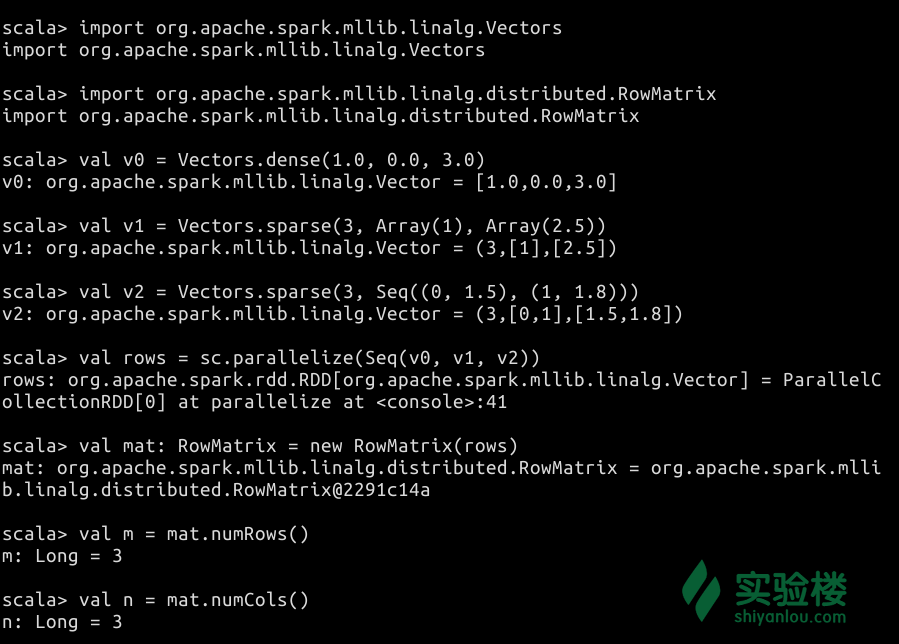
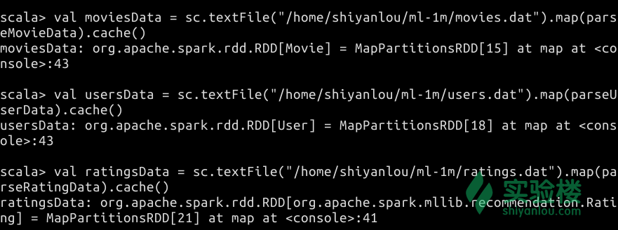
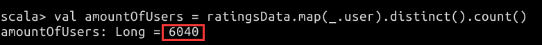

# 第 1 节 Spark MLlib 入门

## 一、实验简介

在本课程中，你将可以了解到 Spark 的 MLlib 库相关知识，掌握 MLlib 的几个基本数据类型，并且可以动手练习如何通过机器学习中的一些算法来推荐电影。

### 1.1 知识点

*   MLlib 概念
*   MLlib 库主要内容
*   MLlib 的数据类型和算法种类
*   协同过滤算法
*   Spark SQL 应用（复习）

## 二、MLlib 简介

MLlib （ Machine Learning Library ）是 Spark 的一个机器学习库。它能够较容易地解决一些实际的大规模机器学习问题。

机器学习的相关基础知识可以查看下面的资料：

*   [有趣的机器学习：最简明入门指南](http://blog.jobbole.com/67616/)

在 MLlib 中，有常见的学习算法，如分类、回归、聚类、协同过滤、降维等，也有一些低级的优化原语和高级的工作流 API 。

它主要有两种类型的包：

*   `spark.mllib` 含有基于 RDD 构建的原始 API。
*   `spark.ml` 则含有基于 DataFrame 构建的高级 API，它们可以用于构造机器学习中的工作流。

在实际的数据分析工作中，我们使用 DataFrame 的频次要比 RDD 更高，所以用到 ML 库的机会也更多。但这并不意味着 MLlib 就失去了存在的意义。 ML 与 MLlib 的主要区别就是前者能够更便捷地搭建机器学习工作流，后者则具有更加基础的数据类型、算法和功能。

与 Spark 1.5 版本相比，1.6 版本不再推荐使用一些旧的用法，例如 `spark.mllib.clustering.KMeans` 包内的 `run` 参数。详细的变化敬请查阅 Spark 官方文档，地址已在文末给出。

### 2.1 MLlib 的数据类型

MLlib 支持存储在单机内的本地（Local）向量和矩阵，也支持由一个或多个 RDD 组成的分布式矩阵。本地向量和本地矩阵都是单一的数据模型，拥有公共接口。

> 本小节的代码来自 [Spark 官方文档](http://spark.apache.org/docs/1.6.1/mllib-data-types.html)。

#### 2.1.1 本地向量

本地向量（Local Vector）的索引是从 0 开始的，并且是整型。而它的值为 Double 类型，存储于单个机器内。 MLlib 支持两种本地向量：稠密向量和稀疏向量。

稠密向量是用一个 Double 类型的数组代表它的实体值，而稀疏向量是基于两个并行数组，即索引和值。举个例子，向量 `(1.0, 0.0, 3.0)` 写成稠密形式就是 `[1.0, 0.0, 3.0]`，而写成稀疏形式则是 `(3, [0, 2], [1.0, 3.0])`，后者的第一个 3 是指向量的大小。稀疏和稠密的界限没有严格意义上的标准，通常需要依据具体的问题来决定。

本地向量的基类是 `Vector` 类，`DenseVector` 和 `SparseVector` 类是其两种不同的实现。官方文档推荐大家使用 Vector 类中已实现的工厂方法来创建本地向量。

创建本地向量的例子如下所示，请在 Spark Shell 中输入下面的代码：

> **请打开桌面上的 Xfce 终端，并在终端中输入 `spark-shell` 来启动 Spark Shell。** > Spark Shell 启动完成后，请输入下面的代码。

```java
// 首选需要引入 MLlib 中关于向量的包，原因见本段代码之后的解释
import org.apache.spark.mllib.linalg.{Vector, Vectors}

// 创建稠密向量 (1.0, 0.0, 3.0)
val dv: Vector = Vectors.dense(1.0, 0.0, 3.0)

// 通过指定非零实体对应的索引和值，来创建稀疏向量 (1.0, 0.0, 3.0) 
val sv1: Vector = Vectors.sparse(3, Array(0, 2), Array(1.0, 3.0))

// 通过指定非零实体，来创建稀疏向量 (1.0, 0.0, 3.0) 
val sv2: Vector = Vectors.sparse(3, Seq((0, 1.0), (2, 3.0))) 
```

执行结果如下图所示：


> 在 Spark 中，如果没有引入 `org.apache.spark.mllib.linalg.Vector` 包的话，Vector 会被认为是 `` 中定义的那个。因此，应当引入前者以显式地使用 MLlib 中的向量。

#### 2.1.2 标记点

标记点（Labeled Point）是一个本地向量，也分稀疏或者稠密，并且是一个带有标签或响应的本地向量。

在 MLlib 中，标记点常用语监督学习类算法。标记（Label）是用 Double 类型存放的，因此标记点可以用于回归或者分类算法中。如果是二维分类，标记则必须是 0 或 1 之间的一种。而如果是多个维度的分类，标记应当是从 0 开始的数字，代表各个分类的索引。

标记点是由一个名为 `LabeledPorint`的 Case Class 定义的。

请在 Spark Shell 中输入下面的代码来创建标记点。

```java
// 首先需要引入标记点相关的类
import org.apache.spark.mllib.linalg.Vectors
import org.apache.spark.mllib.regression.LabeledPoint

// 创建一个带有正面标记和稠密特征向量的标记点。
val pos = LabeledPoint(1.0, Vectors.dense(1.0, 0.0, 3.0))

// 创建一个带有负面标记和稀疏特征向量的标记点。
val neg = LabeledPoint(0.0, Vectors.sparse(3, Array(0, 2), Array(1.0, 3.0))) 
```

执行结果如下图所示：


#### 2.1.3 本地矩阵

本地矩阵（Local matrix）的索引也是从 0 开始的，并且是整型。值也为 Double 类型，存储于单个机器内。 MLlib 支持两种本地矩阵：稠密矩阵和稀疏矩阵。

稠密矩阵的实体值以列为主要次序的形式，存放于单个 Double 型数组内。系数矩阵的非零实体以列为主要次序的形式，存放于压缩稀疏列（Compressed Sparse Column, CSC）中。例如，下面这个稠密矩阵就是存放在一维数组 `[1.0, 3.0, 5.0, 2.0, 4.0, 6.0]` 中，矩阵的大小为 `(3, 2)` 。


*图片来自 [Spark 官方文档](http://spark.apache.org/docs/1.6.1/mllib-data-types.html#local-matrix)。*

本地矩阵的基类是 `Matrix` 类，在 Spark 中有其两种实现，分别是 `DenseMatrix` 和 `SparseMatrix` 。官方文档中推荐使用 已在 `Matrices` 类中实现的工厂方法来创建本地矩阵。需要注意的是，MLlib 中的本地矩阵是列主序的（column-major），

请在 Spark Shell 中输入下面的代码来练习如何创建本地矩阵。

```java
// 引入相关的包
import org.apache.spark.mllib.linalg.{Matrix, Matrices}

// 创建稠密矩阵 ((1.0, 2.0), (3.0, 4.0), (5.0, 6.0))
val dm: Matrix = Matrices.dense(3, 2, Array(1.0, 3.0, 5.0, 2.0, 4.0, 6.0))

// 创建稀疏矩阵 ((9.0, 0.0), (0.0, 8.0), (0.0, 6.0))
val sm: Matrix = Matrices.sparse(3, 2, Array(0, 1, 3), Array(0, 2, 1), Array(9, 6, 8)) 
```

执行结果如下图所示：


#### 2.1.4 分布式矩阵

分布式矩阵（Distributed Matrix）是与本地矩阵相对的一个概念，它分布式存放在一个或者多个 RDD 中。分布式矩阵的行和列的索引是 Long 类型的，值仍然为 Double 类型。

选择合适的格式来存放大规模的分布式矩阵是很重要的。将一个分布式矩阵转换为不同的格式需要全局混洗（Global Shuffle）过程，这个过程十分耗时。

以下是几种分布式矩阵的具体实现：

** （1） 行矩阵**

行矩阵（Row Matrix）是面向行的分布式矩阵。它的主要特征是没有行索引，由 RDD 及其内部的行来构成。这里的每一行都是一个本地向量。

由于每个行都是本地向量构成的，所以列的数量就限制在整型能够表达的范围内（在实际操作，列的数量应当小于这个值）。

行矩阵是由 `RDD[Vector]` 的实例来创建的。我们可以据此计算列的一些统计信息和对其进行分解（例如 QR 分解）。它可以用于 SVD 、PCA 等算法。

请在 Spark Shell 中输入下面的代码来练习创建行矩阵：

```java
// 引入相关的包
import org.apache.spark.mllib.linalg.Vectors
import org.apache.spark.mllib.linalg.distributed.RowMatrix

// 创建本地向量的 RDD
val v0 = Vectors.dense(1.0, 0.0, 3.0)
val v1 = Vectors.sparse(3, Array(1), Array(2.5))
val v2 = Vectors.sparse(3, Seq((0, 1.5), (1, 1.8)))
val rows = sc.parallelize(Seq(v0, v1, v2))

// 由 RDD[Vector] 来创建行矩阵
val mat: RowMatrix = new RowMatrix(rows)

// 获得它的行列大小
val m = mat.numRows()
val n = mat.numCols() 
```

执行结果如下图所示：



** （2）索引行矩阵**

索引行矩阵（Indexed Row Matrix）类似于行矩阵，但它是带有行的索引的。

索引行矩阵是由 `RDD[IndexedRow]` 的实例来创建的，这里的 `IndexedRow` 时 `(Long, Vector)` 的一种封装。索引行矩阵可以通过丢弃其行的索引，转换为行矩阵。

在创建索引行矩阵之前，需要引入 `org.apache.spark.mllib.linalg.distributed.{IndexedRow, IndexedRowMatrix, RowMatrix}` 这个三个包，创建的方法如下：

> 这段代码仅供参考，**不必在 Spark Shell 中输入。**

```java
val mat: IndexedRowMatrix = new IndexedRowMatrix(rows) 
```

具体的使用方法请查阅 API 文档。

** （3） 坐标矩阵**

坐标矩阵（Coordinate Matrix）的每个条目都是 `(i: Long, j: Long, value: Double)` 这样的元组，其中的 `i` 时行索引, `j` 是列索引， `value` 是该条目具体的值。

穿件坐标矩阵需要引入两个包，即 `org.apache.spark.mllib.linalg.distributed.{CoordinateMatrix, MatrixEntry}`。具体的使用方法请查阅 API 文档。

** （4）分块矩阵**

构成分块矩阵（Block Matrix）的元组是 `((Int, Int), Matrix)`，其中的 `(Int, Int)` 是索引块， `Matrix` 是子矩阵。

由于篇幅所限，此处不再详细介绍分块矩阵的理论知识。在后期我们涉及到分块矩阵的课程中再作介绍。就目前而言，具体的使用方法请查阅 API 文档。

### 2.2 MLlib 的算法

MLib 的算法涵盖了基本统计、分类和回归和协同过滤等 9 个大类，而更加新颖和高效的算法也在不断地推陈出新。

在 Spark 1.6 版本中，主要的算法有：

*   基本统计算法
    *   汇总统计
    *   相关统计
    *   分层抽样
    *   假设检验
    *   随机数据生成
    *   核密度估计
*   分类和回归
*   协同过滤
*   聚类
*   降维
*   特征提取和转化
*   频繁项挖掘
*   评价指标
*   PMML 导出

由于算法种类繁多，我们在 MLlib 入门课程中不能一一展开讲解，在本实验的实例部分主要介绍了一种名为交替最小二乘法的协同过滤算法。

实验楼会在今后的课程体系中逐个为大家介绍更加深入的算法。同时，这些算法与机器学习密不可分，为了更好的学习效果，建议本课程的学习者能够逐步掌握一些数学（特别是数理统计相关）和机器学习的理论知识。

## 三、实例：利用算法来推荐电影

### 3.1 流程和算法介绍

本例的目标是基于已有用户对电影的评价数据，围绕特定用户输出其可能会感兴趣的电影，构成一个电影推荐算法。

> 本实例参考了 Spark Summit 2014 的 Hands-on Exercises ，内容上有改编，原文请参阅文末给出的参考资料。

在这个例子中，完成推荐系统的主要步骤有：

1.  加载数据集，并按照规则解析成特定格式。
2.  将解析后的数据划分为两部分，分别作为模型的训练集和测试集（在实际项目中应考虑加入验证集，但本课程无需考虑该部分）。
3.  利用 `交替最小二乘法（ALS）` 算法，训练用户与电影之间的矩阵模型。
4.  基于训练集进行预测，利用测试集来验证预测结果是否有效。

上述步骤的第 3 步和第 4 步是为了利用**[协同过滤](http://baike.baidu.com/view/981360.htm)**算法来推荐电影，即给予某个用户的认知模型进行可能观看电影的预测。

> 协同过滤常常被用于分辨某位特定顾客可能感兴趣的东西，这些结论来自于对其他相似顾客对哪些产品感兴趣的分析。协同过滤以其出色的速度和健壮性，在全球互联网领域炙手可热。——百度百科 · 协同过滤

下面的几个资料较为详细地介绍了协同过滤算法的原理和应用场景，推荐阅读：

*   **必读：**[基于用户的协同过滤推荐算法原理和实现](http://www.cnblogs.com/technology/p/4467895.html)
*   [深入推荐引擎相关算法 - 协同过滤](http://www.ibm.com/developerworks/cn/web/1103_zhaoct_recommstudy2/index.html)
*   [协同过滤和基于内容推荐有什么区别？](http://www.zhihu.com/question/19971859)

通读以上资料之后，我们可以把这样一种推荐算法简单分为两类：

*   item-based CF：基于 item 的协同过滤，通过用户对不同 item 的评分来评测 item 之间的相似性，基于 item 之间的相似性做出推荐。
*   user-based CF：基于 user 的协同过滤，通过不同用户对 item 的评分来评测用户之间的相似性，基于用户之间的相似性做出推荐。**本例就是基于某个用户的喜好来进行推荐的。**

在 Spark MLlib 中，协同过滤算法是通过交替最小二乘法（ALS）来实现的。它是一个迭代算法，在每次迭代中最小化误差的平方，并且寻找数据的最佳函数匹配。你可以在[Spark 官方文档](http://spark.apache.org/docs/1.6.1/mllib-collaborative-filtering.html#collaborative-filtering)和 [ACM 官网](http://dl.acm.org/citation.cfm?id=1608614)中可以看到算法的具体解释。

结合到具体的电影数据中来说，用户和电影评价矩阵是 K 维的稀疏矩阵，ALS 算法会把它视作两个稠密矩阵的积，即用户矩阵（用户数量 * K 维）、电影评价矩阵（评价数量 * K 维）。在机器学习理论中，这两个稀疏矩阵被称为潜在特征模型。

我们可以大胆假设这些系数矩阵包含了一些潜在的特征，例如用户矩阵可能包含每个用户的特征，电影评价矩阵可能包含每部电影的特征。

### 3.2 数据集准备

本次实验使用的数据集来自 GroupLens 。GroupLens 是明尼苏达大学计算机科学与技术系的一个实验室。该实验室致力于推荐系统、在线社区、移动和普适技术、数字图书馆，以及局部地理信息系统等领域的研究。

在 GroupLens 的官网里，可以找到一个名为 [MoiveLens 的数据集](http://grouplens.org/datasets/movielens/)，页面如下图所示。


我们需要从这个页面下载一个数据量在一百万条的数据集，**实验楼已为你提供了下载方式，请往后阅读**。你也可以根据自己的情况来选择不同大小的数据集。

在下方给出的这个链接可以查到上述数据集中每个文件的数据格式，以及每个字段的含义。重点是要关注各个字段之间的分割符是 `::` ，我们在导入数据时要据此来划分各个字段。各字段的含义请自行查看，此处不再赘述。

*   [`files.grouplens.org/datasets/movielens/ml-1m-README.txt`](http://files.grouplens.org/datasets/movielens/ml-1m-README.txt)

下面开始下载这个数据集。

请双击桌面上的 `Xfce 终端` 图标，打开 Xfce 后输入下面的命令来下载和解压所需的数据集文件。

```java
wget http://labfile.oss.aliyuncs.com/courses/600/ml-1m.zip

unzip ml-1m.zip 
```


默认情况下，该文件夹和文件位于 `/home/shiyanlou` 目录中。

### 3.3 分析数据与执行算法

#### 3.3.1 Spark Shell 的启动

在终端输入下面的命令进入 Spark Shell：

```java
spark-shell 
```


Spark Shell 启动完成后，会自动初始化一个 Spark Context 和 SQL Context 。

Spark Context 是 Spark 程序的入口点，通常需要利用下面的代码来进行初始化。

> 注意：这段代码不必在 Spark Shell 中输入。

```java
val conf = new SparkConf().setMaster("local[1]")
      .setAppName("Shiyanlou")

val sc = new SparkContext(conf) 
```

而 Spark Shell 在启动过程中会自动为你创建一个 Spark Context 对象，名为 `sc`，如下图所示。在需要时直接调用 `sc` 即可。


同样地，Spark Shell 在初始化过程中也会自动创建一个 SQL Context 对象，名为 `sqlContext`，如下图所示。我们可以通过它来进行一些 SQL 相关的操作。


若你是通过外部的 IDE 来开发 Spark 应用，则可能需要通过下面的代码来创建 SQL Context 。

> 注意：下面的代码不必在 Spark Shell 中输入。

```java
// 这里的 sc 即已经初始化了的 Spark Context 对象
val sqlContext = new SQLContext(sc) 
```

### 3.3.2 相关包引入和数据导入

工欲善其事，必先利其器。根据之前的步骤设计，我们要用到一些相关的 API，例如 SQL、ALS 等。

当然，并不是所有的包都只能在一开始引入。我们在涉及到实现某一功能的时候，通过查阅 Spark 的 API 手册可以找到我们想要的功能，从而最终决定引入哪些包。

对于这个例子而言，我们需要下面这些包（是否用这些包也是在开发过程中逐个确定的，此处把它们放在了一起）。

请在 Spark Shell 中输入下面的代码来引入它们。

```java
import sqlContext.implicits._
import org.apache.spark.rdd._
import org.apache.spark.sql._
import org.apache.spark.mllib.recommendation.Rating
import org.apache.spark.mllib.recommendation.ALS
import org.apache.spark.mllib.recommendation.MatrixFactorizationModel 
```


接着，就应该导入数据集。对于大多数的数据集，都需要构造一个合适的 Case Class 来描述数据的数据结构，并且这个 Case Class 中的成员变量是对应到数据集中的每一个字段的。这也是为下一步将其转化为 DataFrame 埋下了伏笔。

> 如果你对于 DataFrame 不是特别熟悉，建议学习实验楼为你提供的课程——[《Spark 讲堂之 DataFrame 详解》](https://www.shiyanlou.com/courses/543)。

因此，我们首先对电影数据建立一个 Case Class，它对应了 `movies.dat` 文件中的部分字段（其中 Genres 字段不是我们所需要的，因此在 Case Class 中没有设置对应的成员变量）。

请输入下面的代码：

```java
// 不同的字段对应了不同的数据类型
case class Movie(movieId: Int, title: String) 
```


同样的，我们为用户数据建立一个 Case Class，它对应了 `users.dat` 文件中的部分字段（本例只使用了 userID 作为运算时的输入，其他字段留给你稍后扩展学习使用）。

请输入下面的代码：

```java
case class User(userId: Int, gender: String, age: Int, occupation: Int, zipCode: String) 
```


> 你可能会问：为什么我们不定义关于 `ratings.dat` 数据的 Case Class ？ > 这是因为评价类型的数据结构在 Spark 的机器学习框架中已经有 `org.apache.spark.mllib.recommendation.Rating` 类来做映射了，我们可以直接使用 `Rating` 类。

接着，我们需要定义三个解析数据函数。这些函数将用于解析数据集中的每一行内容，去掉分隔符 `::`，然后把数据映射到 Case Class 的对应成员中。

因此，针对三种数据，我们分别编写一个解析的函数：

```java
// 解析 movies.dat 文件的函数
def parseMovieData(data: String): Movie = {
  val dataField = data.split("::")
  assert(dataField.size == 3)
  Movie(dataField(0).toInt, dataField(1))
}

// 解析 users.dat 文件的函数
def parseUserData(data: String): User = {
  val dataField = data.split("::")
  assert(dataField.size == 5)
  User(dataField(0).toInt, dataField(1).toString, dataField(2).toInt, dataField(3).toInt, dataField(4).toString)
}

// 解析 ratings.dat 文件的函数，这里用到的 Rating 类是在
// org.apache.spark.mllib.recommendation.Rating 包中定义的
def parseRatingData(data: String): Rating = {
  val dataField = data.split("::")
  Rating(dataField(0).toInt, dataField(1).toInt, dataField(2).toDouble)
} 
```


定义好三中数据对应的解析函数后，下面我们将他们导入到 RDD 中。

```java
val moviesData = sc.textFile("/home/shiyanlou/ml-1m/movies.dat").map(parseMovieData).cache()
val usersData = sc.textFile("/home/shiyanlou/ml-1m/users.dat").map(parseUserData).cache()
val ratingsData = sc.textFile("/home/shiyanlou/ml-1m/ratings.dat").map(parseRatingData).cache() 
```



若要将这些数据用于机器学习等高级 API ，则还需要将其转化为 DataFrame 才行。

不过，在转化之前，我们可以通过一些方法来查看数据的某些特征。

首先可以看一下评价数据到底有多少个：

```java
val amountOfRatings = ratingsData.count() 
```


或者是看一下多有少个用户评价了电影：

```java
val amountOfUsers = ratingsData.map(_.user).distinct().count() 
```



> Spark 基础课程已经讲解了 map 函数，思考一下： > 这里的 `_.user` 代表了什么意思？`distinct()`的作用又是什么？

上述数据与我们在下载数据集时的数据基本相符，如下图所示。


言归正传，我们现在讲这些 RDD 转化为 DataFrame ，用于后续的操作。

```java
val moviesDF = moviesData.toDF()

val usersDF = usersData.toDF()

val ratingsDF = ratingsData.toDF() 
```


至此，数据导入工作就完成了。

#### 3.3.3 简单的数据分析

做到这里，我们顺便回顾一下在 Spark SQL 课程中讲到的一些知识点。

首先我们将刚刚初始化好的几个 DataFrame 注册为临时表。

```java
moviesDF.registerTempTable("movies")

usersDF.registerTempTable("users")

ratingsDF.registerTempTable("ratings") 
```


然后利用一个 SQL 查询，获取特定用户的评价高于 4.5 分的电影有哪些。

注意这里 SQL 语句的思路主要是：

*   `SELECT ratings.user, ratings.product, ratings.rating, movies.title` 指示了需要检索 ratings 表中的 user （用户 ID）、product （电影 ID）、rating（评分），以及 movies 表中的 title （电影标题）等字段的数据。这里的 product 字段是 Rating 类预定义的，通常指评价某产品的对应 ID，因为可能引起误解，所以特地解释一下。
*   `FROM ratings JOIN movies ON movies.movieId=ratings.product` 指示了从 ratings 表中查询，并且加入了 moives 表的数据，它们之间的联系是建立在 movieId 相同的条件下。
*   `WHERE ratings.user=1680 and ratings.rating > 4.5 order BY ratings.rating DESC` 指示了返回的结果应该满足 ratings 表中 rating 字段（评分）应大于 4.5 ，并且 user 字段（用户 ID）是指定 ID 。 同时，结果应该按照 ratings 表的 rating （评分）进行降序排列。

具体的代码如下：

```java
val highRatingMoives = sqlContext.sql("SELECT ratings.user, ratings.product, ratings.rating, movies.title FROM ratings JOIN movies ON movies.movieId=ratings.product  WHERE ratings.user=1680 and ratings.rating > 4.5 ORDER BY ratings.rating DESC ") 
```


检索完成后，调用 `show()` 函数查看前 20 条结果。

```java
highRatingMoives.show() 
```

ID 为 1680 的用户评价最高的前 20 部电影就被筛选出来了，如下图所示。


至此，我们简单地回顾了一下 SQL 的相关知识。

> **请你尝试自己编写 SQL 语句，回答以下问题：** > - 评价电影数量最多的用户都有哪些（取前 3 名）？ > - 哪些电影被评价的次数最多（取前 10 名）？

#### 3.3.4 对电影评分数据进行建模

各种准备工作完成以后，我们就需要对电影评分数据建立模型了。在 ALS 算法中，我们要建立的是一种矩阵因式分解模型。换言之，对于一个既定的用户，为其推荐电影，就是在与他相似用户里，结合评分的特征，预测出他没有看过的那些电影。

进入到机器学习的第一步，就是要将已有的数据划分为两部分——[训练集](http://baike.baidu.com/view/4916141.htm)和[测试集](http://baike.baidu.com/item/%E6%B5%8B%E8%AF%95%E9%9B%86)。两者的比例需要根据具体情况来决定，本例中可以暂定为 7:3 。

训练集用于构造模型，算法基于这样的模型进行预测。测试集用于检验模型的预测值。好的算法可以根据后者的检验结果不断地修正模型，提高预测的准确度。这样就构成了一个迭代的过程。

对于数据的不同子集进行多次迭代，可以显著提高算法的预测准确率。但作为练习，通常我们只需要进行一次迭代即可。

首先我们来划分训练集和测试集，请在 Spark Shell 中输入下面的代码：

```java
val tempPartitions = ratingsData.randomSplit(Array(0.7, 0.3), 1024L) 
```


这里用到了 [randomSplit 函数](http://spark.apache.org/docs/1.6.1/api/java/org/apache/spark/rdd/RDD.html#randomSplit(double[],%20long))，两个参数分别为划分比例（在数组中决定，可以不止两个）、产生随机数的种子值。

然后我们将划分的结果存放在两个不同的变量中：

```java
val trainingSetOfRatingsData = tempPartitions(0).cache()
val testSetOfRatingData = tempPartitions(1).cache() 
```


接着，将训练集用于 ALS 算法。

```java
val recomModel = new ALS().setRank(20).setIterations(10).run(trainingSetOfRatingsData) 
```


MLlib 中的 ALS 算法需要设置三个参数，分别是特征矩阵的秩数量 `setRank`、迭代次数 `setIterations` 和训练用的训练集实例。其中特征矩阵的秩设置为 20，表明生成的 userFeatures 和 itemFeatures 的个数是 20。

#### 3.3.5 生成推荐数据

模型训练完成后，就可以针对某一特定的用户来进行推荐了。

通过 MatrixFactorizationModel 类的 `recommendProducts` 方法，我们可以对某个用户生成推荐结果。

```java
val recomResult = recomModel.recommendProducts(2333, 10) 
```


2333 是我们随意指定的一个用户 ID，你也可以修改成其他用户的 ID 。10 是产生推荐的数量。

我们可以把推荐结果展现出来：

```java
println(recomResult.mkString("\n")) 
```


输出数据的格式是 Rating 类的格式：用户 ID、电影 ID 和该用户对电影可能的评分。

但如果我们仅看到电影的 ID，并不能知道具体是什么电影。所以还需要按照电影的 ID 找到对应的电影标题：

```java
val movieTitles = moviesDF.map(array => (array(0), array(1))).collectAsMap()
val recomResultWithTitle = recomResult.map(rating => (movieTitles(rating.product), rating.rating)) 
```


然后再把结果输出：

```java
println(recomResultWithTitle.mkString("\n")) 
```


> 请你尝试为其他 ID 的用户推荐电影。

#### 3.3.6 模型评价

可能读到这里，你会认为整个电影的推荐工作已经做完了。那么还有这几个问题留在这：推荐的结果是否准确？被推荐电影的用户对这部电影的评分是否真如推荐时的那样？

因此，我们还需要最后一个环节——模型评价，来完善工作。

评价的方式便是将上一小节得到的推荐结果（评分预测值）与测试集中实际结果相比较。

所以我们同样再用测试集的数据构造模型，利用 MatrixFactorizationModel 类的 `predict` 函数来得到预测的评分值。

```java
val predictResultOfTestSet = recomModel.predict(testSetOfRatingData.map { case Rating(user, product, rating) => (user, product) }) 
```


在得到测试集的预测评分结果之后，我们用 map 操作和 join 操作将它与测试集的原始数据组合成为 `((用户 ID, 电影 ID), (测试集原有评分, 预测评分))`的格式。这个格式是 Key-Value 形式的，Key 为 `(user, product)`。我们是要把这里的测试集原有评分与预测时得到的评分相比较，二者的联系就是 user 和 product 相同。

第一个 map 可以将 `(用户 ID, 电影 ID)` 与 `测试集原有评分` 组合成 KV 格式；第二个 map 操作，可以将 `(用户 ID, 电影 ID)` 与 `预测评分` 组合成 KV 格式。

两次 map 操作的代码如下：

```java
// 测试集
val formatResultOfTestSet = testSetOfRatingData.map {
  case Rating(user, product, rating) => ((user, product), rating)
}

// 预测结果
val formatResultOfPredictionResult = predictResultOfTestSet.map {
  case Rating(user, product, rating) => ((user, product), rating)
} 
```


然后将二者的结果连接起来，整合到一起：

```java
val finalResultForComparison = formatResultOfPredictionResult.join(formatResultOfTestSet) 
```

Key 相同的不同值就整合在一起形成了 `((用户 ID, 电影 ID), (测试集原有评分, 预测评分))` 的格式。


最后我们可以利用这个中间结果来计算预测评分和实际评分之间的[平均绝对误差](http://baike.baidu.com/view/521337.htm)。

平均绝对误差（ Mean Absolute Error ）是所有单个观测值与算术平均值偏差的绝对值的平均。

与平均误差相比，平均绝对误差由于离差被绝对值化，不会出现正负相抵消的情况，所以平均绝对误差能更好地反映预测值误差的实际情况。

我们直接取 finalResultForComparison 结果中 ratingOfTest 和 ratingOfPrediction 两个值，先算误差，再取绝对值。最后对所有的绝对值计算平均数。

具体代码如下：

```java
val MAE = finalResultForComparison.map {
  case ((user, product), (ratingOfTest, ratingOfPrediction)) =>
    val error = (ratingOfTest - ratingOfPrediction)
    Math.abs(error)
}.mean() 
```

最终得到的结果为：


可以看到这个误差值是在可以接受的范围内的。

## 四、实验总结

在本课程中我们学习了 Spark 的 MLlib 库相关知识，了解了 MLlib 与 ML 之前的区别和联系，掌握了 MLlib 的几个基本数据类型。对 MLlib 的算法体系有了一个简单的认识。最后，通过一个实例，体会了如何利用机器学习算法解决实际问题（推荐电影）。

授人与鱼不如授人以渔。一个 API 的用法总是能在官方文档中找到，但如何针对具体的问题利用合适的机器学习算法构造机器学习工作流，是需要不断地练习和积累的。

在此，也希望本课程的学习者能够脱离课程内容本身的束缚，大胆尝试不同的算法，应用到不同的数据分析工作中，以真正提高 Spark 的使用技巧，真正利用好机器学习，提升现有工作和研究内容的品质。

## 参考资料

*   [Machine Learning Library (MLlib) Guide](http://spark.apache.org/docs/1.6.1/mllib-guide.html)
*   [Collaborative Filtering - spark.mllib](http://spark.apache.org/docs/1.6.1/mllib-collaborative-filtering.html)
*   [Movie Recommendation with MLlib](https://databricks-training.s3.amazonaws.com/movie-recommendation-with-mllib.html)