# 第 1 节 DataFrame 入门

## 一、实验简介

本实验将通过一个简单的数据集分析任务，讲解 DataFrame 的由来、构建方式以及一些常用操作。

## 二、DataFrame 介绍

DataFrame 是一种跨语言的、通用的数据科学抽象。DataFrame 通过使用现实世界中的数据集，涵盖了许多最基本的概念和操作。毫不夸张地说，你可以仅用 15 美元，就通过`=DATA=`代码获取到一些科研界里最新最权威的数据。倘若你学过 R 语言，那你可能对它非常熟悉。

那么 DataFrame 的出现是为了解决什么问题呢？我们知道在 Spark 里已有了最常用的 RDD，而从宏观上讲，DataFrame 是为了帮助建立 Spark 生态系统。DataFrame 是 RDD 基础核心的一种扩展。对于数据科学家们来说，DataFrame 能够较好地从 R 语言或者 Python 来进行转换。因此最好将其理解为一种结构化的 RDD，它能够帮助你处理数据而让你不用花太多精力在数据的各种转换中。这也是为什么 DataFrame 能够与结构化数据（甚至是非结构化数据）建立紧密的联系。通过它，我们可以利用 Spark 引擎带来的类型和优化上的长处。

说到底，DataFrame 就是一个按照指定列来组织的分布式数据集合。我们可以通过 Parquet、Hive、MySQL、PostgreSQL、JSON、S3 和 HDFS 等多种数据源来构建它。DataFrame 常用于 Spark SQL 当中。如果是在这样一个数据库系统中，你可以将其理解为其中的一个表。

虽然传统的平面 RDD 支持上述的这些数据源格式，但是在[Python Pandas](http://pandas.pydata.org/)中，它们都被集成在一起，成为了 DataFrame。这是最早的起源。在 MLLib 中，它们与机器学习的流水线 API 集成在一起。这样做的意义在于能够让你读取一些数据、指定要使用的操作和高效率地训练你的模型。当然，在引擎背后，也有许多的优化能够让代码的执行更快更高效。简言之，DataFrame 可以由下面这个公式给出：


它们之前除了各种接口，还应该有遵守一些 RDD 具有的规则，比如之前课程中提到过的`转换`和`行动`范式。因此，DataFrame 就是一种以 RDD 为基础、带有模式信息（Schema）的分布式数据集。DataFrame 比 RDD 更好的一点在于它具有额外的 SQL 接口，从而让查询高度结构化的数据成为可能。下图说明了它们之间的关系：

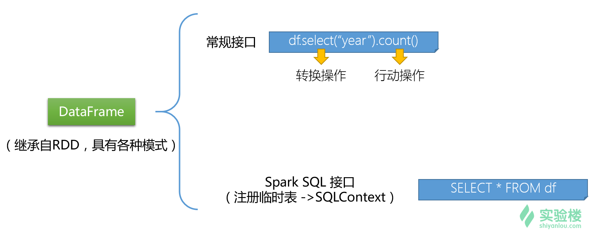

我们无法得知 RDD 内部数据元素的结构，但是我们可以通过 Spark SQL 来得知 DataFrame 中的更过结构信息。综上所述，Spark 中的 DataFrame 在发展过程中，其目标是成为事实上的大数据数据框，适用于各种分布式大数据的应用场景。

## 三、动手编起来！

我们通过上一小节的内容了解了 DataFrame 的由来，下面我们通过一个练习来学习如何使用 DataFrame。

### 3.1 导入数据集

这里我们将用到一个真实的数据集。我们选用了 2009 年 Data Expo 上提供的飞行准点率统计数据。数据集来自[2009\. Data expo - Airline on-time performance](http://stat-computing.org/dataexpo/2009/the-data.html)。其中 1987 年的航班数据下载链接为[`stat-computing.org/dataexpo/2009/1987.csv.bz2`](http://stat-computing.org/dataexpo/2009/1987.csv.bz2)。在实验楼中，我们已经为你准备好了这个数据集，请在终端中输入下面的命令来获得它：

```java
wget http://labfile.oss.aliyuncs.com/courses/536/1987.csv.bz2 
```

> 如果你是实验楼会员用户，可以尝试自己下载 2008 年的数据（108 MB），这是最大的一个数据集。

然后使用解压命令解压缩：

```java
bunzip2 1987.csv.bz2 
```

解压完毕后得到的是一个名为`1987.csv`的数据集（如果你未更改目录，它应该位于`/home/shiyanlou`中）。

实验过程如下图所示：

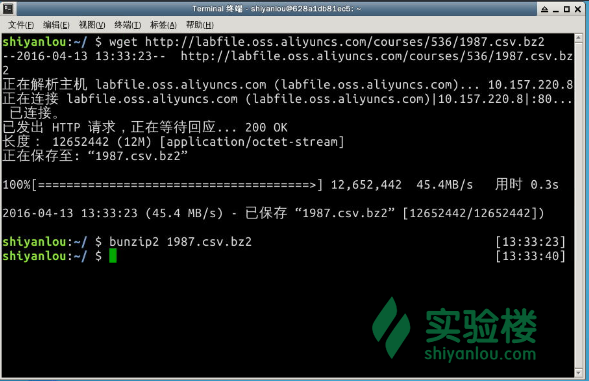

下图是来自该数据集官网的一个截图，它逐项说明了数据的各个字段的含义。在对任何数据进行处理和分析之前，了解它的格式和含义都是必要的。

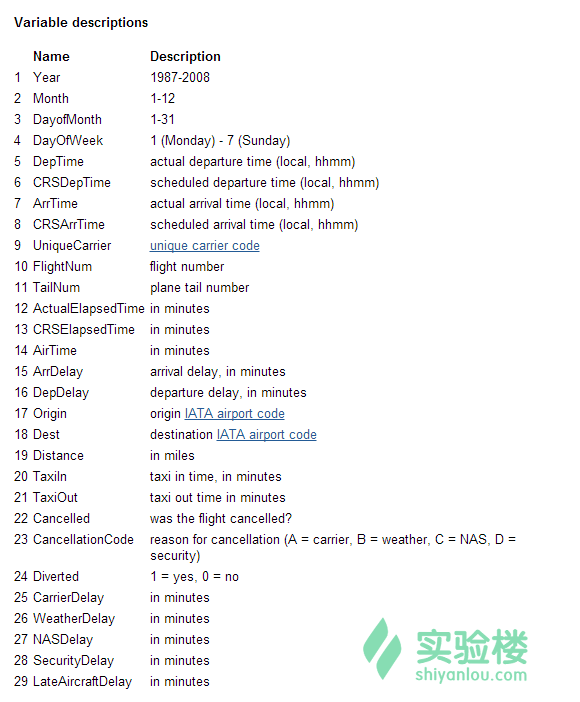

### 3.2 下载支持库

请输入下面的命令来下载支持库。主要是`com.databricks_spark-csv_2.11-1.1.0`这个库，用于支持 CSV 格式文件的读取和操作。

> 如果你是实验楼会员用户，当前实验环境有连接外网权限，那么你可以跳过此步，直接进入“3.3”小节进行实验。

> 如果因网络连接等原因导致第三方包无法被正常加载，则请回到此步进行支持库的配置。

```java
wget http://labfile.oss.aliyuncs.com/courses/536/com.databricks_spark-csv_2.11-1.1.0.jar

wget http://labfile.oss.aliyuncs.com/courses/536/commons-csv-1.1.jar

wget http://labfile.oss.aliyuncs.com/courses/536/univocity-parsers-1.5.1.jar 
```

接着，将依赖库的 jar 文件添加到 Maven 本地仓库。

首先是`com.databricks.spark.csv`：

```java
mvn install:install-file -DgroupId=com.databricks -DartifactId=spark-csv_2.11 -Dversion=1.1.0 -Dfile=/home/shiyanlou/com.databricks_spark-csv_2.11-1.1.0.jar -DgeneratePom=true -Dpackaging=jar 
```

然后是`org.apache.commons`：

```java
mvn install:install-file -DgroupId=org.apache.commons -DartifactId=commons-csv -Dversion=1.1 -Dfile=/home/shiyanlou/commons-csv-1.1.jar -DgeneratePom=true -Dpackaging=jar 
```

最后是`com.univocity.parsers`：

```java
mvn install:install-file -DgroupId=com.univocity -DartifactId=univocity-parsers -Dversion=1.5.1 -Dfile=/home/shiyanlou/univocity-parsers-1.5.1.jar -DgeneratePom=true -Dpackaging=jar 
```

### 3.3 在 Spark 中使用 DataFrame

所有的准备工作做好后，就可以启动 Spark Shell 了。

请输入下面的命令来启动 Spark Shell 并加载相关的包。

```java
spark-shell --packages com.databricks:spark-csv_2.11:1.1.0,com.univocity:univocity-parsers:1.5.1,org.apache.commons:commons-csv:1.1 
```

> 如果当前实验环境具有联网权限，则可以只输入`spark-shell --packages com.databricks:spark-csv_2.11:1.1.0`命令。

在 Spark Shell 的启动过程中，可以看到如下图所示的模块引用信息。在`modules in use`信息中，如果能看到如下三个包的名字，则说明之前的第三方模块的安装是成功的。

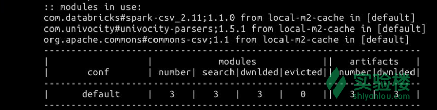

待 Spark Shell 启动完成后，我们首先要做的便是读入数据。我们当然可以手动地读入 CSV 格式的文件然后自己来划分。不过我们应该将精力放在数据分析上，所以这里使用了 Spark 的一个 CSV 包来直接读取数据集。这样做能够直接将 CSV 文件读入为 DataFrame。

请在 Spark Shell 中输入下面的代码：

```java
val df = sqlContext.read.format("com.databricks.spark.csv").option("header", "true").load("/home/shiyanlou/1987.csv")
// 此处的文件路径请根据实际情况修改 
```

读入数据的结果如下图所示：

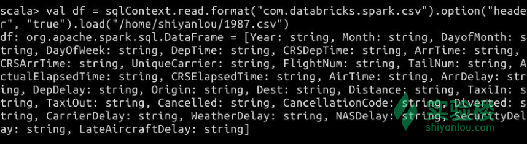

我们尝试取出这个数据集中的前 5 个数据，看一下是否读入成功。请输入下面的代码：

```java
df.take(5) 
```

执行结果如下图所示：

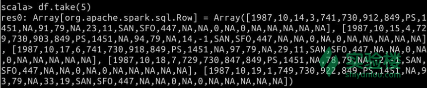

在引入数据集之后，下一步要做的便是确保我们所有数据的格式是正确的。可以通过下面的代码来检查其格式。

```java
df.printSchema() 
```

得到的输出如下图所示：

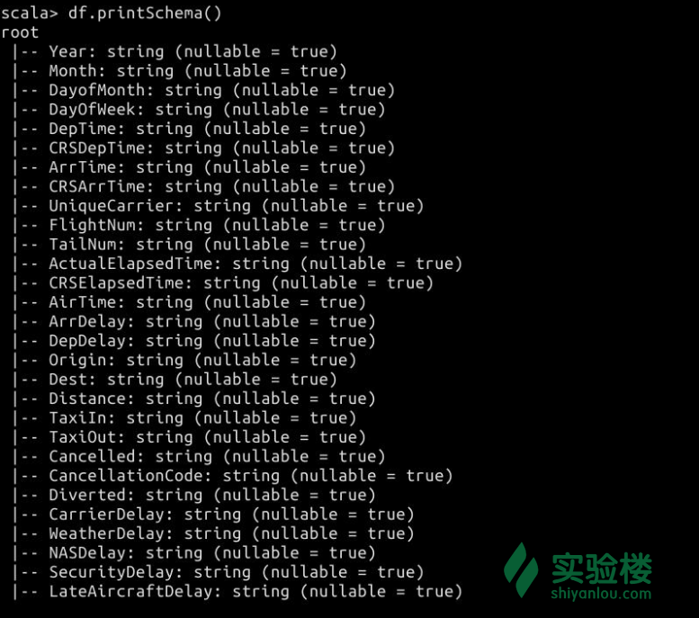

如你所见，这里的每一项都是`String`类型。尽管这样不是很碍眼，但是在处理数据时多少都有一点不方便。我们可以尝试将某些列转换成其它的类型。方法是提取出某列然后转换。例如：

```java
df.col("Year").cast("int") 
```

执行结果如图：

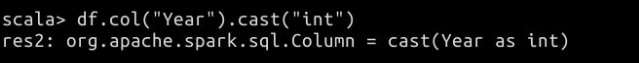

那么问题来了。当我们提取出某一列之后，又怎样将其放回去呢？下面我们提供一种 Spark 里改变 DataFrame 列类型的行之有效的办法。

```java
val df_1 = df.withColumnRenamed("Year","oldYear")
val df_2 = df_1.withColumn("Year",df_1.col("oldYear").cast("int")).drop("oldYear") 
```

执行结果如图：

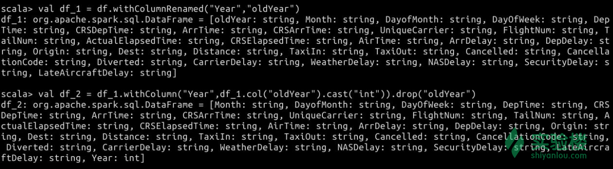

经历了这一步，我们用具有新格式类型的列替换了旧的列。试想一下，如果我们要对很多列都进行格式的转换，这样一个一个替换是不是很麻烦？所以我们应该想一下还有什么办法可以简化这个过程。不出意外的话，我认为你应该想到用一个函数来转换列的格式类型。就像下面这样，请动手输入下面的代码来定义一个简单的函数：

```java
// 这里的类型转换参数就可以由我们自己随意决定了
def convertColumn(df: org.apache.spark.sql.DataFrame, name:String, newType:String) = {
  val df_1 = df.withColumnRenamed(name, "swap")
  df_1.withColumn(name, df_1.col("swap").cast(newType)).drop("swap")
} 
```

定义该函数的结果如下图所示： 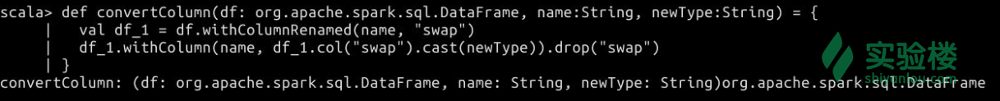

然后我们尝试调用该函数，看是否可以转换某个列的格式类型。请输入下面的代码：

```java
val df_3 = convertColumn(df_2, "ArrDelay", "int")
val df_4 = convertColumn(df_2, "DepDelay", "int") 
```

执行结果如图：

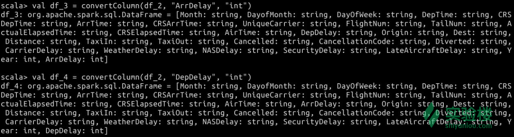

如果有必要，你还可以根据自己的需求来更改更多列的类型。此处便不再赘述。

接下来我们将目光转移到如何对 DataFrame 进行计数操作。例如，我们可以计算一些平均值。

下面的代码演示了如何计算数据集中，每个航班的平均延迟时间。请你尝试在 Spark Shell 中输入它们。

```java
val averageDelays = df_4.groupBy(df_4.col("FlightNum")).agg(avg(df_4.col("ArrDelay")), avg(df_4.col("DepDelay"))) 
```

执行结果如下图所示。

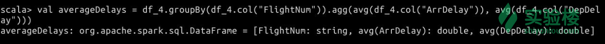

对于`averageDelays`这个临时结果，我们想要说的是：作为更加长远的考虑，你应该将数据集中一些重要的计算结果缓存下来，以加速后续的计算过程。如果你想知道为什么要这样做，可以查阅 Spark 的“懒加载”相关资料。

请输入下面的代码来缓存我们刚刚得到的数据。

```java
averageDelays.cache() 
```

执行结果如下图所示。

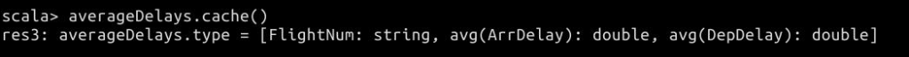

在缓存之后，我们如果要基于`averageDelays`做后续的计算，那么它的运算速度就会非常快了。Spark 对于所有的变量几乎都是懒计算的，如果你不缓存的话，只有在执行行动操作（Action）时，它们才会被真正地计算。

下面我们来用一个行动操作看一下刚刚的计算结果。请输入这些代码。

```java
averageDelays.show() 
```

可以看到由于数据量比较大，前台显示了运算过程分为多个 Stage，如下图所示。

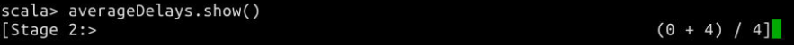

只有调用了行动操作时，这些值才被真正地计算出来。计算结果如下图所示：

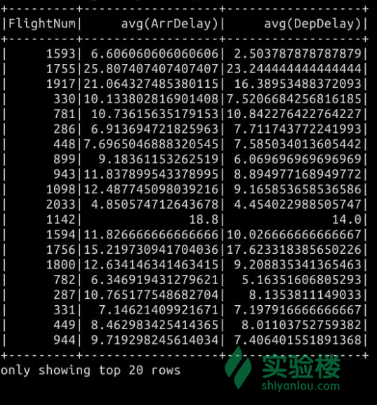

是不是感觉自己有点像飞常准的后台工作人员了？

既然我们已经得到了平均延迟时间的结果，那么我们可以更进一步，对其进行排序，然后看一下哪个航班的平均延迟最低或者最高。下面的代码是按照升序排列平均延迟时间。

```java
averageDelays.orderBy("AVG(ArrDelay)").show() 
```

执行结果如下图所示：

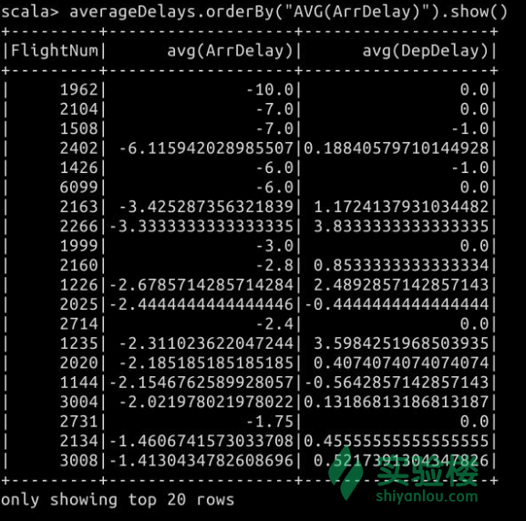

如果要按照降序排列，则请输入下面的代码：

```java
averageDelays.sort($"AVG(ArrDelay)".desc).show() 
```

执行结果如下图所示：

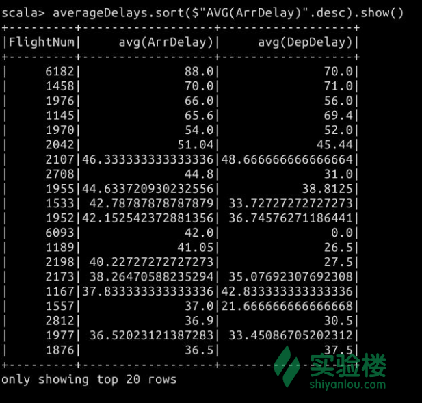

除此之外，我们还可以根据复合条件，排列多个列的数据。下面的代码演示了如何排列多个列的数据并显示结果。

```java
averageDelays.sort($"AVG(ArrDelay)".desc, $"AVG(DepDelay)".desc).show() 
```

结果如下图所示。

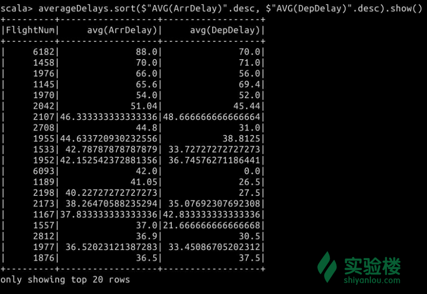

至此，全部实验就已经完成了。

## 四、实验总结

在这个实验中，我们使用了 CSV 格式的数据集来创建 DataFrame。如果是 JSON 格式的数据，则可以通过

```java
val df = sqlCoontext.read.json(filePath) 
```

这样的形式来读取。

由于篇幅所限，对于 DataFrame 操作的不能一一列举。这里我们为你提供了一些参考资料，供扩展阅读：

*   [Spark SQL, DataFrames and Datasets Guide](http://spark.apache.org/docs/latest/sql-programming-guide.html#dataframe-operations)：Spark 官方出品的指导手册。涵盖了 DataFrame 操作、与 RDD 相互转换等知识点。十分推荐阅读。
*   [DataFrame API Documentation](http://spark.apache.org/docs/latest/api/scala/index.html#org.apache.spark.sql.DataFrame)：官方 API 手册，这里列举了所有与 DataFrame 相关的操作，包括 DataFrame 类中的成员变量和成员方法。适合在开发时作为参考。

此外，我们将在 Spark SQL 相关课程中对其作进一步的讲解。

对于本课程用到的数据集，你不妨对其作更多的分析。欢迎你在实验报告中为我们展现你的新结果！

如对该课程有任何疑问或者建议，请到实验楼[【问答】](https://www.shiyanlou.com/questions/)版块与我们交流。