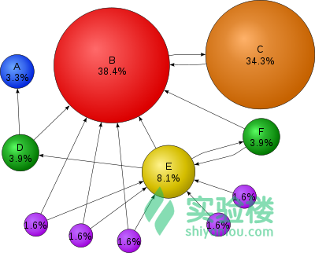
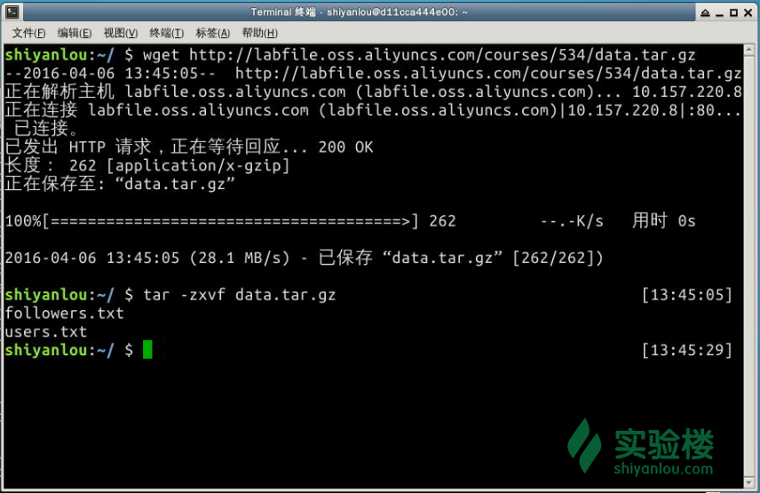
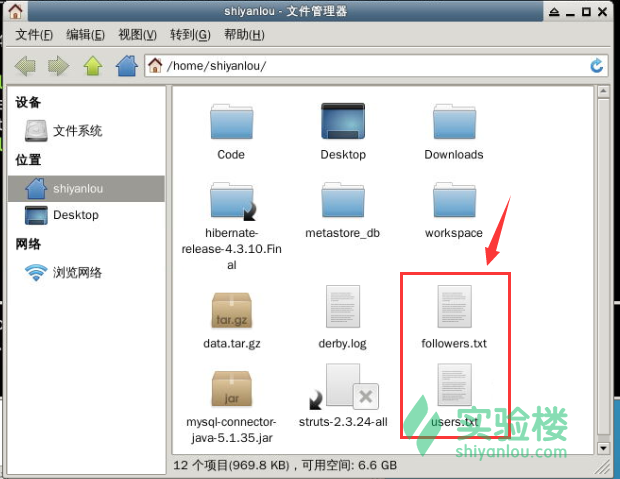
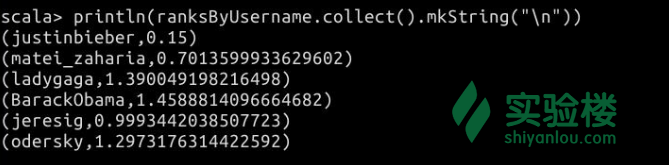
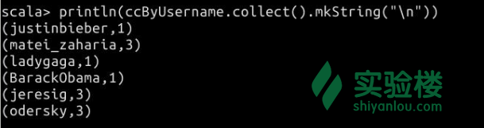
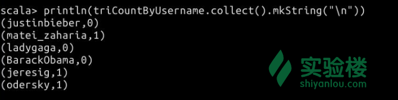

# 第 1 节 GraphX 常用图算法练习

## 一、实验简介

GraphX 包含了一些用于简化图分析任务的的图计算算法。这些算法在`org.apache.spark.graphx.lib`包内可以找到。当然，你也可以通过图操作符来直接调用其中的方法。我们将在本实验中讲解这些算法的含义，以及如何使用它们。

### 1.1 知识点

*   PageRank 算法
*   连通分量算法
*   三角形计数算法

### 1.2 准备工作

在本节学习之前，请在终端输入`spark-shell`来进入 Spark Shell，本节的代码主要在 Spark Shell 中执行。

```java
$ spark-shell 
```

## 二、常用图算法简介

### 2.1 PageRank

通常我们将 PageRank 称之为网页排名或者网页级别。它是由搜索引擎根据网页间交错的超链接来计算的一种技术，名字源于 Google 创始人拉里·佩奇（Larry Page）之姓，是网页排名的要素之一。Google 用它来体现网页的相关性和重要性。在[搜索引擎优化操作（SEO）](http://baike.baidu.com/view/1047.htm)中，它经常作为评估网页优化的指标。

> 近年来，Google 正在逐步使用更加精确的度量方式，来取代 PageRank 对网页进行排名。但作为一项图计算的经典算法，我们仍然有必要去学习它。

在所有的工作展开之前，不要忘了引入相关的包。请在 Spark Shell 中输入下面的语句：

```java
import org.apache.spark._
import org.apache.spark.graphx._
import org.apache.spark.rdd.RDD 
```

PageRank 用于度量图的每个顶点的重要性，假设从`u`到`v`有一条边代表了`v`对于`u`的重要性。举个例子，如果有很多的用户关注了某一个 Twitter 用户，那么这个 Twitter 用户的排名就会相对很高。

可以通过下图来体会 PageRank 的原理（图引用自维基百科）：



关于 PageRank 算法的详细原理，此处不过多展开。但我们仍然推荐你阅读下列相关的资料：

*   [深入浅出 PageRank 算法](https://segmentfault.com/a/1190000000711128)（非常详细）
*   [Google 的秘密- PageRank 彻底解说 中文版](http://www.t086.com/good/pagerank_cn.htm)
*   [维基百科 - PageRank](http://en.wikipedia.org/wiki/PageRank)

在 GraphX 中，自带了静态的和动态的 PageRank 实现，具体而言是指定义在 PageRank 对象上的方法。静态的 PageRank 用于执行固定次数的迭代，而动态的 PageRank 会一直执行，直到排名收敛为止（即每次迭代与上一次迭代的差值处于某个阈值之内时，停止迭代的执行）。GraphOps 允许在 Graph 上以方法的形式直接调用这些算法。

GraphX 还包含了一个作为样例的社交网络数据集，我们可以基于这个数据集来运行 PageRank。

首先需要下载这个数据集，请在**`重新打开`**的一个`Xfce 终端`中输入下面的命令：

```java
$ wget http://labfile.oss.aliyuncs.com/courses/534/data.tar.gz

$ tar -zxvf data.tar.gz 
```

解压出来的两个文件分别是`users.txt`和`followers.txt`，如下图所示。



这两个文件的路径应该是`/home/shiyanlou/users.txt`和`/home/shiyanlou/followers.txt`。



在`users.txt`上给出了一组用户，在`followers.txt`上给出了一组用户之间的关系。

接下来，请回到**`Spark Shell`**中，我们按下面的方式计算每一个用户的网页排名：

```java
// 读取各个边来组成图
val graph = GraphLoader.edgeListFile(sc, "/home/shiyanlou/followers.txt")

// 运行 PageRank
val ranks = graph.pageRank(0.0001).vertices

// 连结用户名与评级
val users = sc.textFile("/home/shiyanlou/users.txt").map { line =>
  val fields = line.split(",")
  (fields(0).toLong, fields(1))
}
val ranksByUsername = users.join(ranks).map {
  case (id, (username, rank)) => (username, rank)
}

// 输出结果
println(ranksByUsername.collect().mkString("\n")) 
```

结果如下图所示：



上图中的每一个用户对应了自己的 PageRank 值。

### 2.2 连通分量

连通分量算法将顶点中最小的 ID 标记在图的每一个连通分量上。举个例子，在社交网络里，连通算法可以用于近似地估算集群数量。该算法的实现可以在 GraphX 的`ConnectedComponents`对象中找到，并且我们可以按照如下的方式，计算作为样例的社交网络数据集中的连通分量：

```java
// 加载样本数据集中的图
val graph = GraphLoader.edgeListFile(sc, "/home/shiyanlou/followers.txt")

// 寻找连通分量
val cc = graph.connectedComponents().vertices

// 连结用户名和连通分量
val users = sc.textFile("/home/shiyanlou/users.txt").map { line =>
  val fields = line.split(",")
  (fields(0).toLong, fields(1))
}
val ccByUsername = users.join(cc).map {
  case (id, (username, cc)) => (username, cc)
}

// 输出结果
println(ccByUsername.collect().mkString("\n")) 
```

实验结果如下图所示：



上图中的每一个用户和数字即顶点对应的连通分量数。

### 2.3 三角形计数

当某个顶点有两个邻近顶点，并且它们之间存在一条边时，这个顶点就是三角形的一部分。在 GraphX 的`TriangleCount`对象里，实现了一个名为三角形计数的算法。该算法通过传入每个顶点来计算三角形的数量，从而提供了一种度量聚类的方式。

我们现在可以来计算上一小节里，用于计算 PageRank 的社交网络数据集中有多少个三角形。注意的是，`TriangleCount`需要边具有规范的取向（即`srcId` < `dstId`），并且图需要使用`Graph.partitionBy`来进行划分。

下面是算法的核心代码：

```java
// 以规范顺序加载边和分区图
val graph = GraphLoader.edgeListFile(sc, "/home/shiyanlou/followers.txt", true).partitionBy(PartitionStrategy.RandomVertexCut)

// 寻找每个顶点对应的三角形数量
val triCounts = graph.triangleCount().vertices

// 连结用户名和三角形数量
val users = sc.textFile("/home/shiyanlou/users.txt").map { line =>
  val fields = line.split(",")
  (fields(0).toLong, fields(1))
}
val triCountByUsername = users.join(triCounts).map { case (id, (username, tc)) =>
  (username, tc)
}

// 输出结果
println(triCountByUsername.collect().mkString("\n")) 
```

实验结果如下图所示：



每一个用户对应了他代表的顶点的三角形数量。

### 三、实验总结

本节通过三个例子进一步学习了如何利用 GraphX 框架来进行图的分析工作。

除此之外，Spark GraphX 还提供了 Pregel API。这个特性能够将目标图类问题的运算模型，转化为在图的拓扑节点上迭代执行的算法。我们将在稍后提供 Pregel API 的详细讲解。

## 四、作业

请你尝试阅读来自加州大学伯克利分校 AMPLab 主办的大数据金牌训练营 AMPCamp 中的 GraphX 课程，完成《[Running PageRank on Wikipedia](http://ampcamp.berkeley.edu/big-data-mini-course/graph-analytics-with-graphx.html#running-pagerank-on-wikipedia)》章节中留下的挑战题。