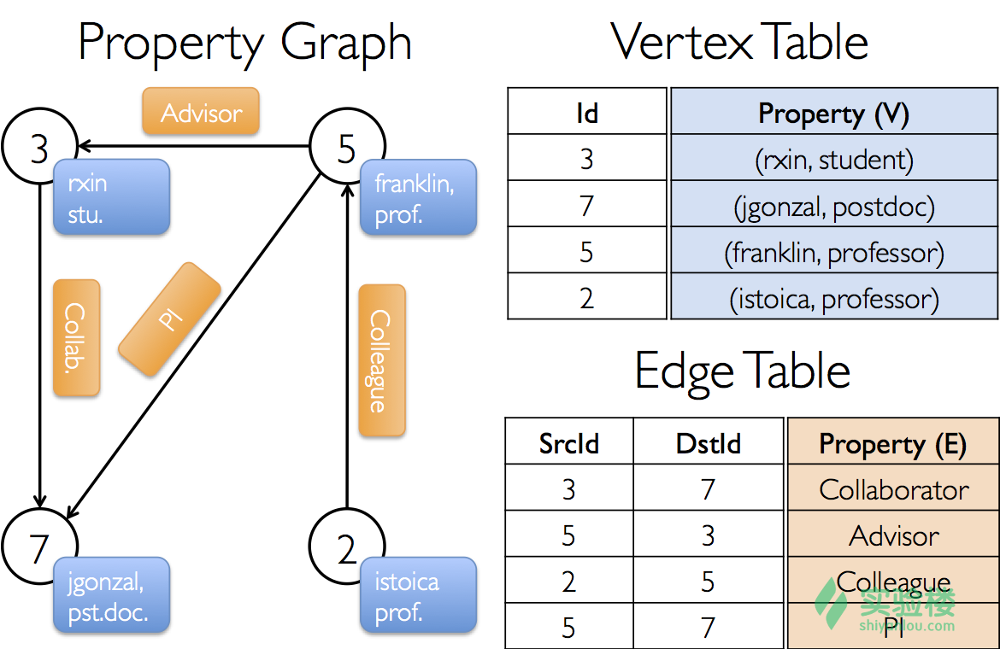
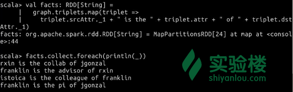

# 第 1 节 初识 GraphX

## 一、实验简介

GraphX 是 Spark 用于解决图和并行图计算问题的新组件。通过 RDD（Resilient Distributed Datasets，弹性分布式数据集）的扩展，GraphX 在其中引入了一个新的图抽象，即顶点和边带有特性的有向多重图。Graph 提供了一些基本运算符和优化了的 Pregel API，来支持图计算。另外，Graph 包含了大量的图算法和构造器来简化图的分析任务，并且这个数量还在增加。

本节我们就将学习如何使用这一强大的图计算组件。

本节实验知识点包括：

1.  GraphX 框架的使用
2.  属性图的定义

## 二、使用 GraphX

> 在本节学习之前，请在终端输入`spark-shell`来进入 Spark Shell，本节所有代码都将在 Spark Shell 中执行。

作为图计算框架应用的第一步，你应该引入 Spark 和 GraphX 相关的包，就像下面这样（请在 Spark Shell 中输入语句）：

```java
import org.apache.spark._
import org.apache.spark.graphx._

// 此处仍然需要用到 RDD 来让一些例子正常运行
import org.apache.spark.rdd.RDD 
```

如果你没有使用 Spark Shell（例如在外部的 IDE 中编辑项目），那么你还需要引入`SparkContext`。具体方法请参阅 Spark 官方文档，此处不再赘述。

### 2.1 属性图

属性图是一个有向多重图，它的每个顶点和每条边都附有用户定义的对象。作为有向图，有向多重图可能有多个平行的边来共享相同的源顶点和目标顶点。作为多重图，它支持并行边，这个特性简化了许多涉及多重关系的建模场景。每个顶点的主键是一个长度为 64 bit 的唯一标识符（`VertexID`）。GraphX 没有为顶点添加任何顺序的约束。类似地，每一条边有对应的源顶点和目标顶点的标识符。

因此，属性图的参数是通过顶点（`VD`）和边的类型（`ED`）来决定的。

在某些情况下，你可能希望在同一个图里面，顶点能够有不同的属性类型。这个想法可以通过继承实现。举个例子，我们可以对用户和产品进行建模，将其作为一个二分图，然后进行如下的定义（请在 Spark Shell 中输入语句）：

```java
class VertexProperty()
case class UserProperty(val name: String) extends VertexProperty
case class ProductProperty(val name: String, val price: Double) extends VertexProperty

// 图可能会有这个类型:
var graph: Graph[VertexProperty, String] = null 
```

类似于 RDD，属性图是不可变的、分布式的，并且具有容错性。对于图而言，它的值或者结构上的改变，是通过产生带有预期改变的新图来完成的。主要注意的是，原始图的主要部分（即不受影响的结构、属性和索引等）在新图中被重用，以减少固有功能的数据结构成本。通过使用大量的启发式顶点分区，图在不同的执行器里被划分。就像 RDD 一样，图的每个分区可以在发生故障时被不同的机器重建。

属性图在逻辑上对应于一对类型化集合（RDD），该集合编码了每个顶点和每条边属性。因而，图类包含了可以访问图的顶点和边的成员，它的定义如下（该定义仅作了解，无需自己手动定义该类）：

```java
class Graph[VD, ED] {
  val vertices: VertexRDD[VD]
  val edges: EdgeRDD[ED]
} 
```

`VertexRDD[VD]`类和`EdgeRDD[ED]`类分别继承和优化了`RDD[(VertexID, VD)]`类和`RDD[Edge[ED]]`类。两者都提供基于图计算和内部优化构建的额外功能。你可以在 GraphX 的[vertex and edge RDDs](https://spark.apache.org/docs/latest/graphx-programming-guide.html#vertex_and_edge_rdds)文档部分找到关于它们的详细说明。在此你可将其简单地理解为以`RDD[(VertexID, VD)]`和`RDD[Edge[ED]]`形式定义的 RDD。

### 2.2 一个属性图的例子

现在假设我们要构建一个由许多来自 GraphX 项目组的协作者组成的属性图。顶点的属性可能包含用户名和职业。我们应该用一个可以描述协作者间的关系的字符串来注释图的边。

这段话可以用下图来表示（图片来自 GraphX 官方文档）：



由这些因素构成的图将有下面的类型定义（该定义仅作了解即可，无需输入该语句）：

```java
val userGraph: Graph[(String, String), String] 
```

有很多办法可以由原始文件、RDD 或者综合生成器来构建一个属性图。可能最常用的方法还是使用一个 Graph Object。下面的代码展示了如何通过一个 RDD 的集合来构建图，你可以尝试在 Spark Shell 中输入下面的代码来完成构建。

```java
// 在 Spark Shell 中，这里的 SparkContext 已经默认给出了。可略过此步。
val sc: SparkContext

// 创建一个 RDD 用于表示顶点
val users: RDD[(VertexId, (String, String))] =
  sc.parallelize(Array((3L, ("rxin", "student")), (7L, ("jgonzal", "postdoc")),
                       (5L, ("franklin", "prof")), (2L, ("istoica", "prof"))))
// 创建一个 RDD 用于表示边
val relationships: RDD[Edge[String]] =
  sc.parallelize(Array(Edge(3L, 7L, "collab"),    Edge(5L, 3L, "advisor"),
                       Edge(2L, 5L, "colleague"), Edge(5L, 7L, "pi")))

// 定义默认的用户，用于建立与缺失的用户之间的关系
val defaultUser = ("John Doe", "Missing")

// 构造图对象，即初始化过程
val graph = Graph(users, relationships, defaultUser) 
```

在这个例子中，我们用到了名为`Edge`的 case 类。`Edge`类有`srcId`和`dstId`，它们对应于源顶点和目标庆典的标识符。另外，`Edge`类有一个名为`attr`的成员，用于存储边的属性。

我们也可以使用`graph.vertices`和`graph.edges`函数来解构一个图，将其转化为各个顶点和边的视图。用法如下，请尝试在 Shell 中输入这些语句：

```java
// 统计是博士后的用户数量
graph.vertices.filter { case (id, (name, pos)) => pos == "postdoc" }.count

// 统计符合 src > dst 条件的边的数量 
graph.edges.filter(e => e.srcId > e.dstId).count 
```

注意，`graph.vertices`函数的返回值类型是 `VertexRDD[(String, String)]`，它继承了 `RDD[(VertexID, (String, String))]`，所以我们可以用 Scala 的 case 表达式来解构这个元组。另外，`graph.edges`函数的返回值类型是`EdgeRDD`，它包含了`Edge[String]`对象。我们同样可以使用 case 类的类型构造器，请尝试在 Shell 中输入下面的代码：

```java
graph.edges.filter { case Edge(src, dst, prop) => src > dst }.count 
```

对于属性类的顶点和边视图，GraphX 还提供了三重视图（Triplet View）。这个三重视图从逻辑上联合了顶点和边的属性，产生了一个`RDD[EdgeTriplet[VD, ED]]`，它包含了`DegeTriplet`类的实例。这个`join`联合操作可以由下面的 SQL 表达式解释：

```java
SELECT src.id, dst.id, src.attr, e.attr, dst.attr
FROM edges AS e LEFT JOIN vertices AS src, vertices AS dst
ON e.srcId = src.Id AND e.dstId = dst.Id 
```

如果看不懂这段 SQL 代码，没关系，下图也能帮助你理解该操作的含义。


`EdgeTriplet`类继承了`Edge`类，并且添加了 `srcAttr`和`dstAttr`两个成员。这两个成员分别包含了源属性和目标属性。我们可以用一个图的三重视图来渲染一个描述用户间关系的字符串集合，就像下面这样：

```java
// 使用 triplets view 来创建一个事实（facts）的 RDD
val facts: RDD[String] =
  graph.triplets.map(triplet =>
    triplet.srcAttr._1 + " is the " + triplet.attr + " of " + triplet.dstAttr._1)
facts.collect.foreach(println(_)) 
```



## 三、实验总结

本节我们认识了 GraphX 框架，学习了如何定义属性图。建议保留实验环境（即直接进入下一个实验），进行下个实验的学习。