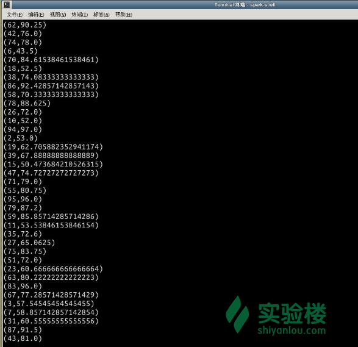

# 第 2 节 图操作符

## 一、实验简介

就像 RDD 有诸如`map`、`filter`和`reduceBykey`等基本的操作符，属性类也有一些基本的操作符。本节我们将认识 GraphX 框架里一些主要的操作符。

本节实验知识点包括：

1.  GraphX 操作符的种类
2.  属性操作符
3.  结构操作符
4.  关联操作
5.  近邻点聚合
6.  缓存和清除缓存

## 二、GraphX 的操作符

> 在本节学习之前，请在终端输入`spark-shell`来进入 Spark Shell，本节所有代码都将在 Spark Shell 中执行。

Graph 的操作符能让用户定义方法，以及产生带有已转换属性和结构的新图。已优化实现的核心操作符被定义在图中，而作为核心操作符的组成部分，一些便捷的操作符被定义在 GraphOps 中。然而，由于 Scala 对 GraphOps 中操作符进行了隐式转换，使得它们可以自动作为 Graph 的成员来使用。例如，我们可以下面的方法来计算每个顶点（在 GraphOps 中已定义）的入度（代码仅供了解，不必在 Shell 中输入）：

```java
val graph: Graph[(String, String), String]
// 使用隐式的 GraphOps.inDegrees 操作符
val inDegrees: VertexRDD[Int] = graph.inDegrees 
```

区分核心的图操作和 GraphOps 的意义在于能够支持未来可能出现的不同的图。每种图的出现必须提供核心操作的实现，必须重用许多定义在 GraphOps 中的实用的操作符。

### 2.1 操作符概览

下面是定义在图和 GraphOps 中的函数的概览（为了简化，都写成了图的成员）。可以看到，一些函数的特征被 简化了（例如默认的参数和类型约束被移除了），并且一些更高级的函数也没有写在这里。如果需要查看全部的函数使用方法，请参阅官方的 API 文档。

```java
/** 属性图中方法的概览 */
class Graph[VD, ED] {
  // 图的信息 ===================================================================
  val numEdges: Long
  val numVertices: Long
  val inDegrees: VertexRDD[Int]
  val outDegrees: VertexRDD[Int]
  val degrees: VertexRDD[Int]
  // 图作为集合的视图=============================================================
  val vertices: VertexRDD[VD]
  val edges: EdgeRDD[ED]
  val triplets: RDD[EdgeTriplet[VD, ED]]
  // 缓存图的方法 ==================================================================
  def persist(newLevel: StorageLevel = StorageLevel.MEMORY_ONLY): Graph[VD, ED]
  def cache(): Graph[VD, ED]
  def unpersistVertices(blocking: Boolean = true): Graph[VD, ED]
  // 更改分区的启发策略============================================================
  def partitionBy(partitionStrategy: PartitionStrategy): Graph[VD, ED]
  // 转换边和顶点的属性 ==========================================================
  def mapVerticesVD2 => VD2): Graph[VD2, ED]
  def mapEdgesED2: Graph[VD, ED2]
  def mapEdgesED2 => Iterator[ED2]): Graph[VD, ED2]
  def mapTripletsED2: Graph[VD, ED2]
  def mapTripletsED2 => Iterator[ED2])
    : Graph[VD, ED2]
  // 修改图的结构====================================================================
  def reverse: Graph[VD, ED]
  def subgraph(
      epred: EdgeTriplet[VD,ED] => Boolean = (x => true),
      vpred: (VertexID, VD) => Boolean = ((v, d) => true))
    : Graph[VD, ED]
  def maskVD2, ED2: Graph[VD, ED]
  def groupEdges(merge: (ED, ED) => ED): Graph[VD, ED]
  // 图与 RDD 的连结操作（join）======================================================================
  def joinVerticesU])(mapFunc: (VertexID, VD, U) => VD): Graph[VD, ED]
  def outerJoinVerticesU, VD2])
      (mapFunc: (VertexID, VD, Option[U]) => VD2)
    : Graph[VD2, ED]
  // 邻居节点的聚集信息 =================================================
  def collectNeighborIds(edgeDirection: EdgeDirection): VertexRDD[Array[VertexID]]
  def collectNeighbors(edgeDirection: EdgeDirection): VertexRDD[Array[(VertexID, VD)]]
  def aggregateMessagesMsg: ClassTag => Msg,
      tripletFields: TripletFields = TripletFields.All)
    : VertexRDD[A]
  // 迭代的并行图计算 ==========================================================
  def pregelA(
      vprog: (VertexID, VD, A) => VD,
      sendMsg: EdgeTriplet[VD, ED] => Iterator[(VertexID,A)],
      mergeMsg: (A, A) => A)
    : Graph[VD, ED]
  // 基本的图算法 ========================================================================
  def pageRank(tol: Double, resetProb: Double = 0.15): Graph[Double, Double]
  def connectedComponents(): Graph[VertexID, ED]
  def triangleCount(): Graph[Int, ED]
  def stronglyConnectedComponents(numIter: Int): Graph[VertexID, ED]
} 
```

### 2.2 属性操作符

类似于 RDD 的`map`操作，属性图包含下列的操作：

```java
class Graph[VD, ED] {
  def mapVerticesVD2 => VD2): Graph[VD2, ED]
  def mapEdgesED2: Graph[VD, ED2]
  def mapTripletsED2: Graph[VD, ED2]
} 
```

上述每个操作都会产生一个新图，这个新的图带有用户在 map 函数中修改了顶点或边的属性。

> 注意：在不同的操作情况下，图的结构都是不受影响的。这是这些操作的一个关键特性，它允许作为结果的图重用原始图在结构上的索引。下面的程序片段在逻辑上是等价的，但第一个`newVertices`没有保存结构索引，它便不能受到 GraphX 的系统优化。

> 本段代码仅供了解，不必在 Shell 中输入。

```java
val newVertices = graph.vertices.map { case (id, attr) => (id, mapUdf(id, attr)) }
val newGraph = Graph(newVertices, graph.edges) 
```

相反，使用`mapVertices`来保存索引：

> 本段代码仅供了解，不必在 Shell 中输入。

```java
val newGraph = graph.mapVertices((id, attr) => mapUdf(id, attr)) 
```

这个操作常用于初始化图，用于特别的计算。例如，可以给出一个图，将该图的出度作为顶点的属性（至于怎样构造这种图，将在后面的内容中谈到），我们可以将其初始化，用于 PageRank。

> 本段代码仅供了解，不必在 Shell 中输入。

```java
// 给出一个图，该图每个顶点的属性是出度
val inputGraph: Graph[Int, String] =
  graph.outerJoinVertices(graph.outDegrees)((vid, _, degOpt) => degOpt.getOrElse(0))

// 构造一个图，该图的每条边都含有权重，并且每个顶点就是其页面等级（PageRank）
val outputGraph: Graph[Double, Double] =
  inputGraph.mapTriplets(triplet => 1.0 / triplet.srcAttr).mapVertices((id, _) => 1.0) 
```

### 2.3 结构操作符

目前，GraphX 只支持一小部分常用的结构操作。下面给出了一些基本的结构操作的概览。

```java
class Graph[VD, ED] {
  def reverse: Graph[VD, ED]
  def subgraph(epred: EdgeTriplet[VD,ED] => Boolean,
               vpred: (VertexId, VD) => Boolean): Graph[VD, ED]
  def maskVD2, ED2: Graph[VD, ED]
  def groupEdges(merge: (ED, ED) => ED): Graph[VD,ED]
} 
```

`reverse`操作返回一个新图，该图的所有边的方向都被反转了。 在试图计算相反的页面等级（PageRank）时，这个操作很有用，因为反转操作不会修改顶点或边的属性，也不会改变边的数量。在实现时，也不用担心数据的移动或者复制。

`subgraph`操作实现了顶点和边的谓词操作，返回一个新图。这个新图只包含了各自满足其谓词条件的顶点和边，并且顶点间的连接也是满足谓词条件的。子图操作可用于很多需要限制的情况。例如需要按需限制图的顶点和边，或者消除已经断开的连接。下面的代码展示了如何删除已经断开的连接：

> 请在 Spark Shell 中输入下面的代码来练习。

```java
// 创建顶点的 RDD
val users: RDD[(VertexId, (String, String))] =
  sc.parallelize(Array((3L, ("rxin", "student")), (7L, ("jgonzal", "postdoc")),
                       (5L, ("franklin", "prof")), (2L, ("istoica", "prof")),
                       (4L, ("peter", "student"))))
// 创建边的 RDD
val relationships: RDD[Edge[String]] =
  sc.parallelize(Array(Edge(3L, 7L, "collab"),    Edge(5L, 3L, "advisor"),
                       Edge(2L, 5L, "colleague"), Edge(5L, 7L, "pi"),
                       Edge(4L, 0L, "student"),   Edge(5L, 0L, "colleague")))
// 为了防止数据丢失，需要定义一个默认的顶点
val defaultUser = ("John Doe", "Missing")

// 构造初始的图
val graph = Graph(users, relationships, defaultUser)

// 注意此处的 user 0 (它内部没有信息)连接到了 user 4 (peter) 和 5 (franklin)
graph.triplets.map(
    triplet => triplet.srcAttr._1 + " is the " + triplet.attr + " of " + triplet.dstAttr._1
  ).collect.foreach(println(_))

// 删除多余的顶点以及它所连接的边
val validGraph = graph.subgraph(vpred = (id, attr) => attr._2 != "Missing")

// 下面这个可用的字符将会通过删除 user 0 来断开 users 4 和 5 之间的边。
validGraph.vertices.collect.foreach(println(_))
validGraph.triplets.map(
    triplet => triplet.srcAttr._1 + " is the " + triplet.attr + " of " + triplet.dstAttr._1
  ).collect.foreach(println(_)) 
```

> 注意，在上面这个例子中，只提供了顶点的条件。如果顶点或者边的条件缺失的话，`subgraph`操作会默认其为`true`。

`mask`操作通过返回一个新图来构造子图。这个新图包含了输入图中所有的顶点和边。它可以与`subgraph`操作共用来限制一个图，使其基于相关的另一个图的属性。例如，我们可能用一个去掉了顶点的图来运行联通分量，同时限制其输出为一个合法的子图。

> 请在 Spark Shell 中输入下面的代码来练习。

```java
// 运行关联组件
val ccGraph = graph.connectedComponents() // 无论是否包含丢失的内容
// 移除丢失的顶点以及连接到它的边
val validGraph = graph.subgraph(vpred = (id, attr) => attr._2 != "Missing")
// 限制结果为合法的子图
val validCCGraph = ccGraph.mask(validGraph) 
```

这个`groupEdges`操作合并了多重图中的并行边（即重复顶点对之间的边）。在许多的数值应用中，平行边可被添加至单条边（合并它们的权重）来减少图的大小。

### 2.4 关联操作

在很多情况下，从外部集合（例如 RDD）中加入图的数据是必要的。例如我们可能有额外的用户属性想要与现有的图来合并，或者我们想将从某个图中将其顶点的属性转移到另一个图那里。这些操作就可能通过`join`操作来完成。下面是一些`join`操作的函数：

> 本段代码仅供了解，不必在 Shell 中输入。

```java
class Graph[VD, ED] {
  def joinVerticesU])(map: (VertexId, VD, U) => VD)
    : Graph[VD, ED]
  def outerJoinVerticesU, VD2])(map: (VertexId, VD, Option[U]) => VD2)
    : Graph[VD2, ED]
} 
```

`joinVertices`操作连结输入 RDD 的顶点并且返回一个新的图。这个新图带有顶点的属性，而这些属性是用户定义的`map`函数作用在被连接的点后得到的。顶点若没有匹配到 RDD 中的值，则会保留其原始的值。

需要注意的是，如果对于一个给出的顶点，RDD 含有不止一个值的话，那么只有其中一个会被用到。因此输入的 RDD 最好是唯一的，建议使用下面的`pre-index`来让后续的`join`操作加快。

> 本段代码仅供了解，不必在 Shell 中输入。

```java
val nonUniqueCosts: RDD[(VertexID, Double)]
val uniqueCosts: VertexRDD[Double] =
  graph.vertices.aggregateUsingIndex(nonUnique, (a,b) => a + b)
val joinedGraph = graph.joinVertices(uniqueCosts)(
  (id, oldCost, extraCost) => oldCost + extraCost) 
```

更加一般的`outerJoinVertices`操作有点类似于`joinVertices`，但对于后者而言，用户定义的`map`函数将被应用到所有的顶点， 并且可以改变顶点的属性类型。因为不是所有的顶点都能够匹配到输入 RDD 的值，所以`map`函数需要选择类型。举个例子，我们可通过`outDegree`来初始化顶点的属性，以设置一个图的页面等级（PageRank）。

> 本段代码仅供了解，不必在 Shell 中输入。

```java
val outDegrees: VertexRDD[Int] = graph.outDegrees
val degreeGraph = graph.outerJoinVertices(outDegrees) { (id, oldAttr, outDegOpt) =>
  outDegOpt match {
    case Some(outDeg) => outDeg
    case None => 0 // 没有出度则是 0
  }
} 
```

> 你可能已经注意到了，多个参数列表（例如`f(a)(b)`）携带了前述例子中用到的函数模式。 尽管我们可以将`f(a)(b)`写成`f(a,b)`，但这意味着类型推断`b`不再依赖于`a`。作为结果，用户需要为自定义的函数提供类型标注，就像下面这样：

> 本段代码仅供了解，不必在 Shell 中输入。 >

```java
val joinedGraph = graph.joinVertices(uniqueCosts,
  (id: VertexID, oldCost: Double, extraCost: Double) => oldCost + extraCost) 
```

### 2.5 近邻点聚合

在图分析任务中，一个关键的步骤是聚合每个顶点的邻居节点的信息。许多迭代的图算法（例如 PageRank、Shortest Path 和 connected components)重复地聚合邻近节点的信息（例如当前的 PageRank 值、相距源点的最短路径和最小可获得的顶点 id）。

> 为了提升性能，主要的聚合操作从`graph.mapReduceTriplets`变化为新的`graph.AggregateMessages`。尽管这些 API 中的变化相对来说很小，下面的内容仍然说明了它们是如何变化的，值得一看。

#### 2.5.1 聚合消息（`aggregateMessages`函数）

在 GraphX 中，核心的聚集操作是`aggregateMessages`。这个操作符将用户定义的`sendMsg`函数应用于图中每条边，随后使用`mergeMsg`函数在它们目标方向的顶点上来聚合这些消息。

> 本段代码仅供了解，不必在 Shell 中输入。

```java
class Graph[VD, ED] {
  def aggregateMessagesMsg: ClassTag => Msg,
      tripletFields: TripletFields = TripletFields.All)
    : VertexRDD[Msg]
} 
```

为了给源属性和目标属性发送消息，用户定义的`sendMsg`函数使用了`EdgeContext`来公开边的源、目标属性和函数（`sendTosrc`和`sendToDst`）。在 Map-Reduce 过程中，`sendMsg`作为了`map`函数。用户定义的`mergeMsg`函数将两个消息发给相同的顶点，形成单个消息。 `mergeMsg`作为 Map-Reduce 过程中的`reduce`函数。`aggregateMessages`操作符返回一个包含了发给每个顶点的聚合消息（消息的类型）的`VertexRDD[Msg]`。没有收到消息的顶点将不会被包含在返回的 VertexRDD 中。

另外，`aggregateMessages`用到了一个可选的`tripletsFields`，它指示了 `EdgeContext`将会访问到哪些数据（即源顶点属性，而不是目标顶点的属性）。 The possible options for the `tripletsFields`中所有可能的选项被定义在`TripletFields`中，并且其默认值是`TripletFields.All`。这个默认值意味着用户定义的`sendMsg`函数可能访问到`EdgeContext`中任一一个域。`tripletFields`这个变元能够用于通知 GraphX，使其知道`EdgeContext`的唯一部分是需要的，能够允许 GraphX 去选择一个优化了的联合策略。举个例子，如果我们要计算每个用户的粉丝的平均年龄，我们则只需要源域，然后用`TripletFields.Src`去指明它。

在下面的例子中我们使用`aggregateMessages`操作来计算每个用户的更加年长的的粉丝的平均年龄。

> 请在 Spark Shell 中输入下面的代码。

```java
// 引入用于生成随机图的库
import org.apache.spark.graphx.util.GraphGenerators

// 创建一个图，其顶点的属性为 age。为了简化，此处用一个随机图。
val graph: Graph[Double, Int] =
  GraphGenerators.logNormalGraph(sc, numVertices = 100).mapVertices( (id, _) => id.toDouble )

// 计算更加年长的粉丝的人数和他们的总年龄
val olderFollowers: VertexRDD[(Int, Double)] = graph.aggregateMessages(Int, Double) {
      // 给目标顶点发含有计数值和年龄的消息
      triplet.sendToDst(1, triplet.srcAttr)
    }
  },
  // 添加计数值和年龄
  (a, b) => (a._1 + b._1, a._2 + b._2) // Reduce 函数
)

// 计算较为年长的粉丝的平均年龄
val avgAgeOfOlderFollowers: VertexRDD[Double] =
  olderFollowers.mapValues( (id, value) => value match { case (count, totalAge) => totalAge / count } )

// 输出结果
avgAgeOfOlderFollowers.collect.foreach(println(_)) 
```

输出的结果如下：



> `aggregateMessages`操作在消息（消息的总和）都是固定大小时表现出的性能是最优的。

#### 2.5.2 Map Reduce Triplets 转换指南

> 本小节是针对较早版本内容的一个补充说明。

在之前版本的 GraphX 中，邻近节点的聚合是通过使用`mapReduceTriplets`操作完成的。

> 本段代码仅供了解，不必在 Shell 中输入。

```java
class Graph[VD, ED] {
  def mapReduceTripletsMsg],
      reduce: (Msg, Msg) => Msg)
    : VertexRDD[Msg]
} 
```

`mapReduceTriplets`操作符可以将用户定义的`map`函数作为输入，同时将`map`函数应用于每一个 triplet ，最后得到 triplet 上的所有顶点的信息。

下面的代码块用到了`mapReduceTriplets`：

> 本段代码仅供了解，不必在 Shell 中输入。

```java
val graph: Graph[Int, Float] = ...
def msgFun(triplet: Triplet[Int, Float]): Iterator[(Int, String)] = {
  Iterator((triplet.dstId, "Hi"))
}
def reduceFun(a: String, b: String): String = a + " " + b
val result = graph.mapReduceTripletsString 
```

可以用`aggregateMessages`重写成下面这样：

> 本段代码仅供了解，不必在 Shell 中输入。

```java
val graph: Graph[Int, Float] = ...
def msgFun(triplet: EdgeContext[Int, Float, String]) {
  triplet.sendToDst("Hi")
}
def reduceFun(a: String, b: String): String = a + " " + b
val result = graph.aggregateMessagesString 
```

#### 2.5.3 计算度信息

有一个通用的聚合任务是计算每个顶点的度，即每个顶点有多少个邻近节点。有向图中，我们经常需要知道入度、出度和每个顶点的总度数之类的信息。`GraphOps`类包含了一些计算度的操作符，例如下面的代码中给出的计算最大入度、出度和总度数的代码：

> 本段代码仅供了解，不必在 Shell 中输入。

```java
// 定义一个 reduce 操作来计算出具有最高的度的顶点
def max(a: (VertexId, Int), b: (VertexId, Int)): (VertexId, Int) = {
  if (a._2 > b._2) a else b
}
// 计算最大的度
val maxInDegree: (VertexId, Int)  = graph.inDegrees.reduce(max)
val maxOutDegree: (VertexId, Int) = graph.outDegrees.reduce(max)
val maxDegrees: (VertexId, Int)   = graph.degrees.reduce(max) 
```

#### 2.5.4 邻近点的聚集

在某些情况下，通过聚集邻近顶点和每个顶点的属性来进行计算的话，也许要容易得多。这个过程可以通过使用`collectNeighborIds`和`collectNeighbors`操作符来完成。其定义如下：

> 本段代码仅供了解，不必在 Shell 中输入。

```java
class GraphOps[VD, ED] {
  def collectNeighborIds(edgeDirection: EdgeDirection): VertexRDD[Array[VertexId]]
  def collectNeighbors(edgeDirection: EdgeDirection): VertexRDD[ Array[(VertexId, VD)] ]
} 
```

这些操作符在复制信息时，以及对于连续通信的需求上的花销上很大。如果可能的话，还是建议尝试用直接用`aggregateMessages`操作符来完成相同的计算。

### 2.6 缓存和清除缓存

在 Spark 中，RDD 在默认情况下不会在内存中持久化。在需要多次用到它们时，为了避免重复计算，它们必须显式地缓存。在 GraphX 中，这些图也是一样的：当需要多次重复地使用到一个图时，应当首先用`Graph.cache()`将其缓存下来。

在迭代计算中，为了得到更好的性能，及时的清空缓存也是必要的。默认情况下，缓存的 RDD 和图将留在内存中，当内存有存储压力时，会按照 LRU 上的顺序将其删除。对于迭代计算而言，先前迭代的中间结果将填满缓存。虽然缓存最终会被删除，但把不必要的数据存在内容中会减慢垃圾回收工作。一个有效的办法是在缓存不再需要的时候，让应用立刻清空这些中间结果。这个过程包含了在每次迭代时实例化（缓存）一个图或者 RDD、清除其他所有的数据集，并且在之后的迭代中只使用实例化了的数据集。但是由于图是多个 RDD 组成的，所以它更难以被正确地手动清除。对于迭代式计算，推荐使用 Pregel API，它能够更好地手动地清除中间结果。

## 三、实验总结

GraphX 通过扩展 RDD 引入了新的图的抽象，公开了一系列的基本运算，能够有效地简化图分析任务。通过本课程的学习，相信你已经掌握了一些 GraphX 的使用方法。但是，该框架仍然在不断地更新中，建议你在使用过程中跟进 Spark 官方的文档，以确保能够满足图分析的工作需要。