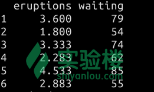
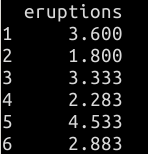
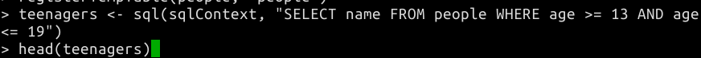

# 第 1 节 SparkR 入门

## 一、实验简介

SparkR 是一个提供轻量级前端的 R 包，在 R 的基础上加入了 Spark 的分布式计算和存储等特性。在 Spark 1.6.1 中，SparkR 提供了一个分布式数据框（DataFrame）的实现，它能够支持诸如选取、过滤和聚集等操作。这个特性与 R 语言自身提供的特性类似，但 SparkR 能够作用于更大规模的数据集。

同时， SparkR 也通过 MLlib 支持分布式的机器学习。

本课程就将以较为轻松的方式，带你学习如何使用 SparkR 。

### 1.1 知识点

*   SparkR 中 的 DataFrame 创建
*   SparkR 中 的常用 DataFrame 操作
*   在 SparkR 上运行 SQL 查询
*   在 SparkR 上实现机器学习
*   在 SparkR 中实现时间序列分析

### 1.2 准备工作

在学习本课程之前，建议你掌握一定的 R 语言语法基础。实验楼为你提供以下学习 R 语言的课程：

*   [R 语言教程](https://www.shiyanlou.com/courses/27)

## 二、SparkR 快速上手

R 语言常用于统计计算，而在单机上进行的传统统计计算在面临大规模数据分析任务时，通常在计算效率、内存限制等方面会遇到瓶颈。

SparkR 的出现，便是为了结合 R 语言在功能成熟稳定和 Spark 对于大规模数据的处理能力好等优势。

SparkR 的 Shell 提供了一个简单的方式来让你学习其 API 用法。

请双击打开桌面上的 Xfce 终端，然后在终端中输入 `sparkR` 命令来打开 SparkR 的交互式命令行窗口。


> 实验楼的在线实验环境已配置好 SparkR 的环境变量，因此可以直接通过 `sparkR` 命令启动。若是自己配置，你可以在 SparkR 所在的目录输入 `./sparkR` 命令或者将该目录加入系统环境变量 PATH 中。

在 SparkR 中，核心概念是数据框（DataFrame）。DataFrame 是一个分布式的数据集合，按照命名的列来组织存储。它在概念上与关系数据库总的表或 R 语言中的 data frame 等价，但在底层提供了更多的优化。

DataFrame 可以由大量的方式创建，例如结构化的数据文件、Hive 表、外部数据库和现有的本地 R 数据框等。

SparkR 的入口点与传统 Spark 应用类似，都是 SparkContext，它将 R 程序与 Spark 集群连接在一起。

在 SparkR 启动过程中你能看到它，如下图所示：


`sc` 代表了 Spark Context， `sqlContext` 代表了 SQL Context，后者是 SQL 查询相关的程序入口。

如果是在外部 IDE 开发独立的 SparkR 应用，你可以下面的方式来创建这两个程序入口。

> **注意：下面这段代码不必在 SparkR 的 Shell 中输入。**

```java
sc <- sparkR.init()
sqlContext <- sparkRSQL.init(sc) 
```

通过创建 Spark Context ，你可以指定应用的名称、Spark 集群的地址和需要依赖的外部包等。此外，在某些时候我们会用到 SQL Context 来操作 DataFrame 。由于在 SparkR 的启动过程中已经创建了二者，我们不再对其进行更加深入的介绍。

### 2.1 创建 DataFrame

我们知道，DataFrame 支持的数据源可以是本地的文件、Hive 表和本地 R 数据框等。

此处我们选择基于本地数据框来创建 SparkR ，其他的创建方式你可以查阅 SparkR 的官方文档，文档地址已在文末给出。

具体而言，从本地数据框来创建 DataFrame 需要用到 `createDataFrame` 函数，它负责将本地的 R 语言中的数据框转换为 SparkR 中的 DataFrame 。该函数需要两个参数，首先是一个 SQL Context 对象，其次是待转换的 R 语言的数据块。

> 请在 SparkR 的 Shell 中输入下面的代码。

```java
df <- createDataFrame(sqlContext, faithful) 
```


`sqlContext` 可以直接用系统创建的，这里的 `faithful` 是 R 语言内置的一个数据集，记录了一个间歇泉的爆发时间和持续时间。

接着可以通过 `head` 函数来得到 DataFrame 的内容并输出。

```java
head(df) 
```



> 在任何时候，如果系统的提示信息占据了 Shell 版面，没有输入代码的地方，只需要再输入一个回车，即可得到新的输入行。

### 2.2 常用 DataFrame 操作

SparkR 中的 DataFrame 支持大量的可用于处理结构化数据的函数。下面给出一些最基本的例子。

为了掌握更加详尽的 DataFrame 知识和操作方法，你可以查阅 API 手册，同时推荐你学习以下课程：

*   [Spark 讲堂之 DataFrame 入门](https://www.shiyanlou.com/courses/536)
*   [Spark 讲堂之 DataFrame 详解](https://www.shiyanlou.com/courses/543)

#### 2.2.1 选取行和列

在上一步里，我们创建了一个名为 `df` 的 DataFrame 。直接键入其名称可以查看各个字段的名称和类型。

```java
df 
```


下面选取名为 `eruptions` 的列。不要忘记 `head` 函数的作用是什么。在 `select` 函数中填写要从哪里选取，选取的列是什么。此处的语法特性是完全与 R 语言一致的。

```java
head(select(df, df$eruptions)) 
```


执行结果如下：



当然，你也可以直接将列名写成字符串的形式作为参数。

```java
head(select(df, "eruptions")) 
```


执行结果与上个命令相同。

如果需要对 DataFrame 进行过滤，使选取结果只保留等待时间（waiting time）小于 50 分钟的结果，则需要使用 `filter` 函数。

```java
head(filter(df, df$waiting < 50)) 
```


执行结果如下，结果的 wating 字段的值均小于 50 。


#### 2.2.2 分组和聚集

SparkR 的 DataFrame 支持大量的通用函数，例如分组后的聚集。下面我们就来计算一下这个数据集中关于 waiting 字段的统计数据。

```java
head(summarize(groupBy(df, df$waiting), count = n(df$waiting))) 
```


`n(df$waiting)` 中的 `n` 操作符用于统计每个等待时间（waiting）的数量。

执行结果如下：


```java
waiting_counts <- summarize(groupBy(df, df$waiting), count = n(df$waiting))
head(arrange(waiting_counts, desc(waiting_counts$count))) 
```


执行结果如下：


#### 2.2.3 列操作

SparkR 也提供了大量直接作用于数据中的列的函数。下面的这个例子展示了如何使用简单的算术关系。

```java
df$waiting_secs <- df$waiting * 60
head(df) 
```


上述代码的作用是将 `waiting` 的时间单位由小时转换成秒。需要注意的是我们仍然可以将这个新的列分配到之前的同一个 DataFrame 里。

执行结果如下：


### 2.3 在 SparkR 上运行 SQL 查询

SparkR 中的 DataFrame 可以像 Spark SQL 一样，注册为一个临时表。将 DataFrame 作为表对待之后，你可以对它进行一些 SQL 查询。

这种特性允许你编写的应用以固定的方式对 DataFrame 进行查询，并且返回的查询结果也是 DataFrame 。

下面通过一个简单的例子来学习该方法。

首先是加载 JSON 文件。

```java
people <- read.df(sqlContext, "/usr/local/spark-1.6.1-bin-hadoop2.6/examples/src/main/resources/people.json", "json") 
```


将 DataFrame 注册为临时表。

```java
registerTempTable(people, "people") 
```


通过 `sql` 函数运行 SQL 查询语句，并使用 `head` 函数查看结果。

```java
teenagers <- sql(sqlContext, "SELECT name FROM people WHERE age >= 13 AND age <= 19")

head(teenagers) 
```



查询的结果如下：


### 2.4 在 SparkR 上实现机器学习

SparkR 通过 glm() 函数来生成线性模型。GLM 为[广义线性模型](http://blog.csdn.net/acdreamers/article/details/44663091)，用于满足广义线性模型，指定给一个象征性的描述线性预测误差分布的描述。而在底层实现上， SparkR 使用 MLlib 来针对特定的族数据集训练模型。

因此，高斯和二项式族是被 MLlib 所支持的。诸如 `~`、`.`、`:`、`+` 和 `-` 等的操作符，在模型拟合过程中是允许使用的。由于篇幅所限，此处不再对上述操作符进行更加详细的解释，你可以自行搜索相关的资料。

`summary()` 函数可以计算出 `glm()` 函数产生的模型的一些统计信息。

如果需要对 R 语言中的 `glm()` 函数有更多的了解，我们推荐阅读下面的资料：

*   [广义线性模型 R--glm 函数 - 钮甲跳的博客](http://www.cnblogs.com/runner-ljt/p/4574275.html)
*   [广义线性模型（GLM） - vibe 的博客](http://www.cnblogs.com/dreamvibe/p/4259460.html)

接下来的两个例子将展示如何通过 SparkR，构建高斯广义线性模型和二项式广义线性模型。

#### 2.4.1 高斯 GLM 模型

这次使用的数据集为 iris ，是一个鸢尾花数据集。输入 `iris` 即可看到详细信息，如下图所示。


利用该数据集创建 DataFrame。

```java
df <- createDataFrame(sqlContext, iris) 
```


利用高斯 GLM 模型训练该数据集。

```java
model <- glm(Sepal_Length ~ Sepal_Width + Species, data = df, family = "gaussian") 
```


利用 `summary` 函数查看结果。该结果与 R 语言内置的 `glm()` 返回的结果类似。

```java
summary(model) 
```


执行结果如下：


最后基于此模型给出预测结果。

```java
predictions <- predict(model, newData = df)
head(select(predictions, "Sepal_Length", "prediction")) 
```


最后的预测结果为：


#### 2.4.2 二项式 GLM 模型

创建 DataFrame。

```java
df <- createDataFrame(sqlContext, iris) 
```


将其中物种为 `setosa` 的条目过滤出来，作为训练集。

```java
training <- filter(df, df$Species != "setosa") 
```


然后利用二项式 GLM 模型来训练数据集。

```java
model <- glm(Species ~ Sepal_Length + Sepal_Width, data = training, family = "binomial") 
```


利用 `summary` 函数查看结果。返回的模型系数与 R 语言原生的 `glm()` 函数产生的结果类似。

```java
summary(model) 
```


## 三、实例：在 SparkR 中实现时间序列分析

本实例的部分内容和代码节选自实验楼课程《[R 语言进行数据挖掘](https://www.shiyanlou.com/courses/360)》。

> 时间序列分解就是将时间序列按趋势性、季节性、周期性和不规则性依次分解。其中，趋势部分代表的是长期趋势，季节性指的是时间序列数据呈现季节性波动，周期性指的是指数据呈现周期性波动，不规则部分就是[残差](http://baike.baidu.com/view/1006910.htm)。

下面我们尝试使用 SparkR 来完成这个时间序列分析的任务。实验中使用的数据是 R 原因内置的数据集 —— AirPassengers 。该数据集是由 Box & Jenkins 国际航班的乘客数据组成，时间跨度为 1949 年到 1960 年，包含 144 个观测值。

下面请在 SparkR 中输入下面的代码。

首先是把这个数据集画出来认识一下。

```java
plot(AirPassengers) 
```


执行结果如下图所示。


然后将数据预处理成月度数据。`ts` 函数式专用于处理时间序列类型数据的函数， `frequency` 即为时间尺度。

```java
apts <- ts(AirPassengers, frequency=12) 
```


使用函数 `decompose()` 分解时间序列：

```java
f <- decompose(apts) 
```


查看季度数据：

```java
f$figure
plot(f$figure, type="b", xaxt="n", xlab="") 
```


执行结果如下图所示。


接着，使用当前的时间区域给月份赋予名称:

```java
monthNames <- months(ISOdate(2011,1:12,1)) 
```


使用月份名称标记 x 轴。`side=1` 表示设置 x 轴，`at` 指的是范围从 10 到 12，`las` 表示分割的单位刻度为 `2` 。

```java
plot(f)
axis(1, at=1:12, labels=monthNames, las=2) 
```


结果如下：


> 上图中，`observed`标注的表表示原始的时间序列分布图，往下第二个图是显示数据的呈现上升趋势图，第三个季节图显示数据受一定的季节因素影响，最后一个是在移除趋势和季节影响因素后的图。

## 四、实验总结

本课程较为详细地介绍了 SparkR 的背景和常用操作。SparkR 作为一个新兴的 R 语言应用平台，在面对大规模数据时，通常更能够显现出其优势。

因此，推荐你在实验楼学习《[R 语言进行数据挖掘](https://www.shiyanlou.com/courses/360)》课程后，尝试将其中的一些经典的分析方法在 SparkR 中再实现一遍。这样做能够对于数据科学中的数据分析和统计学相关应用有更加深入的认识，对于 SparkR 的使用也会更加熟练。

在后续的课程中，我们还会继续介绍如何通过 RStudio 链接到 SparkR 并使用其中的 API 来进行计算。

以上为本课程的全部内容，如果你在学习的过程中有任何的疑问或者建议，欢迎到实验楼的[问答](https://www.shiyanlou.com/questions/)版块与我们交流。

## 参考资料

*   [SparkR (R on Spark)](http://spark.apache.org/docs/1.6.1/sparkr.html)