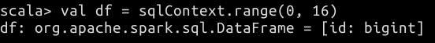
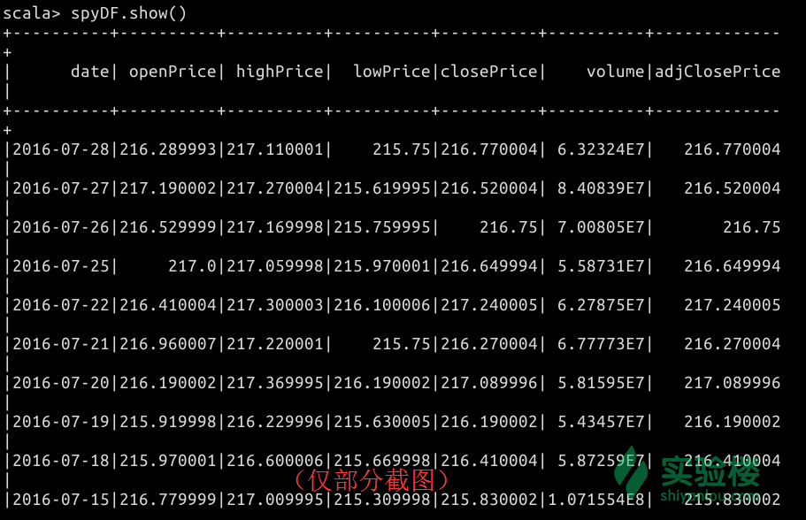

# 第 1 节 Spark SQL 入门

## 一、实验简介

在本课程中，你将可以学习到 Spark SQL 的基础知识和常用 API 用法，了解常用的数学和统计函数。最后将通过一个分析股票价格与石油价格关系的实例进一步学习如何利用 Spark SQL 分析数据。

### 1.1 知识点

*   SQL 基本概念
*   SQL Context 的生成和使用
*   1.6 版本新 API：Datasets
*   常用 Spark SQL 数学和统计函数
*   SQL 语句
*   Spark DataFrame 文件保存

## 二、Spark SQL 及相关 API 介绍

Spark SQL 是 Spark 中用于处理结构化数据的模块。它与基本的 Spark RDD API 不同的地方在于其接口提供了更多关于结构化数据的信息，能够更好地应用于计算过程。这些额外的信息也能够帮助系统进行优化，从而提高计算的性能。

这个体系中，DataFrame 是非常重要的一种数据结构。在实验楼之前发布的课程中，[《Spark 大讲堂之 DataFrame 详解》](https://www.shiyanlou.com/courses/543)为你讲述了关于 DataFrame 的各方面知识。建议在此之前对 DataFrame 有所深入了解，否则你也可以将其简单理解为一个由命名列组成的分布式数据集。

我们可以通过文件、Hive 表以及各类数据库或者当前环境中的 RDD 来创建 DataFrame 。这在之前的课程中已有详细的探讨，此处不再赘述。本课程主要通过 SQL Context 对象，以已有的 RDD 来创建 DataFrame，大家可以在具体的代码中去了解创建过程。

### 2.1 万物始于 SQL Context

对于整个 Spark SQL 里错综复杂的功能来说，程序的入口便是 `SQLContext` 类（或是该类的子类）。而创建一个 SQLContext 对象，则需要 SparkContext 。

`sqlContext` 在 Spark shell 的启动过程中就已经完成了初始化。如果你想要在外部开发环境中使用 SQL Context，则需要由 Spark Context 来创建它（请注意二者的区别）。

> ** 注意：在实验楼的环境中，Spark Shell 已经完成了 SQL Context 的初始化工作，因此下面这个语句无需输入。**

```java
// 在 Spark-shell 中无需输入这句代码，可以直接使用 sqlContext
val sqlContext = new org.apache.spark.sql.SQLContext(sc) 
```

### 2.2 新的接口： Datasets

Spark 从 1.6 版本起，引入了一个实验性的接口，名为 Dataset 。提供该接口的目的是为了在 RDD 的特性上，再集成 Spark SQL 的一些优化操作引擎。Dataset 可以由 JVM 对象构造，并且可以通过 map 、flatMap 、filter 等函数对其进行计算。

鉴于它的构造特点，因此我们只能使用 Scala 或者 Java 语言来使用它的 API 。对于 Python 的支持可能会在后续的 Spark 版本中提供。

Dataset 与 RDD 十分类似，一个简单的创建方法如下：

> **请在终端中输入 `spark-shell` 命令，等待 Spark shell 启动。** > 

Spark Shell 启动完成后，请输入下面的代码来创建 Dataset 。

首先是通过已有的变量来创建。

```java
// 数据类型的转化是自动完成的，大多数情况下可以直接使用 toDS() 函数创建 Dataset
val ds = Seq(1, 2, 3).toDS()

// Dataset 支持 map 等操作
ds.map(_ + 1).collect() 
```

执行结果如下：


我们还可以通过 Case Class 来创建 Dataset：

```java
// 构造一个 case class
case class Person(name: String, age: Long)

// 使用 case class 创建 Dataset
val ds = Seq(Person("Shiyanlou", 18)).toDS() 
```

执行结果如下：


### 2.3 Select 函数的应用：一些数学和统计函数

Spark SQL 中最常用的函数，莫过于检索函数 `select()`。就像其他语言中的检索一样，你可以通过该函数实现一些数据上的 CURD 操作。

Spark SQL API 中涉及到检索的函数主要有：

*   `select(col: String, cols: String*)`：该函数基于已有的列名进行查询，返回一个 DataFrame 对象。使用方法如 `df.select($"colA", $"colB")` 。
*   `select(cols: Column*)`：该函数可以基于表达式来进行查询，返回一个 DataFrame 对象。使用方法如 `df.select($"colA", $"colB" + 1)`。
*   `selectExpr(exprs: String*)`：该函数的参数可以是一句完整的 SQL 语句，仍然返回一个 DataFrame 对象。具体的 SQL 语法规则可以参考通用的 SQL 规则。该函数使用方法如 `df.selectExpr("colA", "colB as newName", "abs(colC)")` ，当然你也可以进行表达式的组合，如 `df.select(expr("colA"), expr("colB as newName"), expr("abs(colC)"))` 。

接下来，我们结合一些数学和统计的例子，来学习如何使用这些 SQL 函数（主要为 select 函数）。

> 下面部分内容翻译自博文《[Statistical and Mathematical Functions with DataFrames in Apache Spark](https://databricks.com/blog/2015/06/02/statistical-and-mathematical-functions-with-dataframes-in-spark.html)》，内容上有改编。原文提供了 Python 代码。实验楼为你提供 Scala 版本的代码，可直接在 Spark Shell 中使用。

#### 2.3.1 产生随机数据

在很多时候，我们可能需要去验证一个算法（无论是自己设计的还是现有的），或者是实现一个随机的算法（例如[随机投影](http://blog.csdn.net/ljj583905183/article/details/47980169)）。这些时候我们手头上又找不到合适的数据集怎么办？产生随机的数据就是一个很好的选择。

在 Spark SQL 中，`org.apache.spark.sql.functions` 包提供了一些实用的函数，其中就包含了产生随机数的函数。它们可以从一个特定的分布中提取出独立同分布值，例如产生均匀分布随机数的函数 `rand()` 和产生服从正态分布的随机数的函数 `randn()` 。我们可以通过下面的例子来简单使用一下随机数产生函数。

**请按照下面的步骤完成操作。**

首先我们需要产生一个数据框（ DataFrame ）来存放随机数。

在获得 SQL Context 对象 `sqlContext`后，使用 `range`方法产生一个指定范围大小的 DataFrame。

```java
// 创建含有单列数据的 DataFrame
val df = sqlContext.range(0, 16) 
```

执行结果如下：



接着，用 `show` 函数查看当前 DataFrame 的内容（如果数据条目超过 20 个，默认只会显示前 20 行）。

```java
df.show() 
```

执行结果如下：


最后，使用均匀分布函数 `rand` 和标准正态分布函数 `randn` 来随机产生其他两列的数据，并用 `show` 函数查看结果。两个随机数函数中的参数为种子值（ Seed ）。

```java
df.select($"id",rand(57).alias("uniform distribution"), randn(15).alias("standard normal distribution")).show() 
```

执行结果如下（由于是随机数，列表中的数值可能不同）： 

### 2.3.2 数据概要和描述性统计

在实际工程中，我们在导入数据后，通常需要通过数据的描述性统计信息来验证这些数据是否是我们想要的那些。数据的描述性统计信息能够刻画一堆数据的分布情况，例如非空实体的数量、所有数据的平均值和标准差、每个数值列的最大最小值等等。

这一切都只需要通过一个简单的 `describe()` 函数来实现。

首先我们还是需要产生一个 DataFrame ，这次仍然可以通过随机的方式来产生。代码如下：

```java
val df1 = sqlContext.range(0, 15).withColumn("uniform distribution", rand(99)).withColumn("standard normal distribution", randn(234)) 
```

执行结果如下：


接下来，调用 `describe()` 函数来计算描述性信息，并通过 `show()` 函数展现出来。代码如下：

```java
df1.describe().show() 
```

执行结果如下图所示（数值可能不同）：


试想：如果需要计算的 DataFrame 体量非常大，我们为了得到这个描述信息就可能需要花费更多的时间。因此，在选择计算对象的时候，我们可以将范围缩小在某一列上。达到这个目的只需要在 `describe()` 函数中填入指定的列名即可。

不妨试试下面的代码：

```java
df1.describe("uniform distribution").show() 
```

执行结果如下图所示：


我们可以看到结果中只针对 `uniform distribution` 一列进行了描述性信息的计算。

当然，除了通过 `describe()` 函数去进行数据分析，我们也可以把这些描述性信息的计算手段用到一个普通的 select 检索过程中。在需要什么信息的时候，就填入相应的计算函数即可，如下面的代码：

```java
// 这里的 uniform distribution 为列名
df1.select(mean("uniform distribution"), min("uniform distribution"), max("uniform distribution")).show() 
```

执行结果如下图所示：


### 2.3.3 样本协方差和相关性计算

对于两个变量 A 和 B 而言，协方差表示了它们总体的误差大小。如果协方差为正数，说明变量 A 可能会随着变量 B 的增加而增加；如果协方差为负数，则说明 变量 A （或 B）随着变量 B （或 A）的增加而减少。

现在，我们随机产生两个列的数据，从而创建一个 DataFrame：

```java
// 这里我们使用了 withColumn 方法来为已有的 DataFrame 附加列数据。每一次调用都会附加相应的列。
val df2 = sqlContext.range(0, 18).withColumn("data1", rand(1290)).withColumn("data2", rand(5223)) 
```

执行结果如下：


接下来，使用 `cov()` 函数来计算任意两列之间的样本协方差。代码如下：

```java
df2.stat.cov("data1", "data2") 
```

计算结果如下图所示：


可以观察到，这个样本协方差的数值十分地小，几乎接近于 0。这也说明了随机产生的 `data1` 列与 `data2` 列的数据之间的差异较大。

如果是两个相同的列来比较呢？我们用 `id` 列尝试一下：

```java
df2.stat.cov("id", "id") 
```

计算结果如下图所示（因为有取样过程，所有数值可能不同）：


可以看到这个数字非常地大。试想一下造成这二者巨大区别的原因是什么呢？

最后我们再来计算一下数据的相关性。相关性是协方差的归一化度量，因此它能够更好地被理解，因为它的范围始终在正负的 0 到 1 之间。

计算两个不同列的相关性：

```java
df2.stat.corr("data1", "data2") 
```

计算结果如下图所示：


同样地，计算两个相同列的相关性：

```java
df2.stat.corr("id", "id") 
```

计算结果如下图所示：


此时两个相同列的相关性肯定就为 1 了。

## 三、实例：分析股票和石油价格的关系

下面我们通过实例来体验一个真实的数据分析问题。

在 2016 年的早些时候，美国联邦储备委员会主席 Ben S. Bernanke 在他的文章[《The relationship between stocks and oil prices》](http://www.brookings.edu/blogs/ben-bernanke/posts/2016/02/19-stocks-and-oil-prices)中提到了股票价格和油价的关系：

> 过去的十年里，石油价格就像坐过山车一样经历了数次涨跌，这段时间里包含了太多的波动，以及两个非常尖锐的暴跌。导致了市场参与者不能够轻易地去驾驭这种趋势。第一次暴跌在 2008 年，它与世界范围内的财政危机和经济大衰退有关系。第二次暴跌则可能还在持续，石油价格在 2014 年中期跌破了每桶 100 美元，在最近一段时间（2016 年 7 月）内收于每桶约 30 美元。

看完整篇文章，我们的感受可能是：看似不同的两个行业（石油和股市）的数据，在某种机缘巧合之下却有千丝万缕的联系。那么这种联系是否能被找出来呢？

接下来，我们就通过一个实例来分析一下石油价格与股市的关系。

### 3.1 获取数据集

此次实验涉及到三个数据集，分别是：

*   标普 500ETF 指数（S&P 500 ETF ， 即 SPY）
*   埃克森美指数（XOM）
*   阿纳达科石油指数（APC）

下图是在 Google Finance 上对[三个指数的比较](http://www.google.com/finance?chdnp=1&chdd=1&chds=1&chdv=1&chvs=maximized&chdeh=0&chfdeh=0&chdet=1469781529838&chddm=1173&chls=IntervalBasedLine&cmpto=INDEXSP:.INX;NYSE:APC&cmptdms=0;0&q=NYSE:XOM&ntsp=0&ei=FhabV9mJD4aR0ASa47nICQ)：


业内几个著名的财经类网站（[Google](http://www.google.com/finance)、[Yahoo!](http://finance.yahoo.com/) 和 [MarketWatch](http://www.marketwatch.com/) 等）都提供了上述数据。

实验楼为你整理了上述指数自 2010 年 1 月 04 日至 2016 年 7 月 28 日的数据，请通过下面的方式下载。

请在实验楼的实验环境中，找到桌面上的 Xcfe 终端，双击打开一个新的终端窗口。

> **注意：当前正在运行 Spark Shell 的终端请不要关闭。**

在新打开的终端中，输入下面的命令：

```java
wget http://labfile.oss.aliyuncs.com/courses/586/data586.tar.gz 
```

然后对其进行解压：

```java
tar -zxvf data586.tar.gz 
```

执行的结果如下图所示：


上述数据集默认情况下，位于 `/home/shiyanlou` 目录中。

三个数据集都是 CSV 文件，其内部的数据组织方式相同。下面为你介绍一下各个字段（逐列）。

*   Date：交易日期
*   Open：开盘价
*   High：交易日最高价
*   Low：交易日最低价
*   Close：收盘价
*   Volume：成交量
*   Adj Close：调整后的收盘价

这些描述股市信息的术语可以自行搜索其含义，上述价格单位均为美元。

### 3.2 分析数据

#### 3.2.1 设定分析的方向

在分析数据之前，我们可能需要先问问自己，到底想要得到一个什么样的结果？

这种问题在数据分析进行之前是必要的，我们所有后续的操作步骤都是要基于此来设计。因此，不妨提出以下几个目标：

*   对于每个指数而言，计算其每年或每月的调整后收盘价的平均值
*   获取标普指数中，上涨或者下跌超过 2 美元的收盘价的数量
*   计算标普指数和埃克森美指数之间的统计相关性

#### 3.2.3 准备工作

进行数据分析之前，首先需要导入几个包。请在 Spark Shell 中输入下面的代码：

> 提示：如果 Spark Shell 已经关闭，在终端中输入 `spark-shell` 即可启动。

```java
import sqlContext._
import sqlContext.implicits._
import org.apache.spark.rdd._
import org.apache.spark.sql._
import org.apache.spark.sql.functions._
import org.apache.spark.sql.types._
// 部分统计学函数位于 mllib 包内
import org.apache.spark.mllib.stat.Statistics 
```


按照惯例，我们需要定义一个 Case Class 来映射 CSV 文件中的各个字段。需要注意的是，对于不同类型的字段，对应的数据类型也不一样。例如，表示价格的数值应该采用 Double 类型。

```java
case class Stock(date: String, openPrice: Double, highPrice: Double, lowPrice: Double, closePrice: Double, volume: Double, adjClosePrice: Double) 
```


然后定义一个用于解析 CSV 数据的函数，可以取名为 `parseData`。此函数用于将 CSV 文件中的每一行按逗号进行分解，然后将文本值转换为具体的数据类型。

```java
def parseDataset(str: String): Stock = {
    val line = str.split(",")
    Stock(line(0), line(1).toDouble, line(2).toDouble, line(3).toDouble, line(4).toDouble, line(5).toDouble, line(6).toDouble)
} 
```


继续定义一个 `parseRDD` 函数，将 `parseData` 函数的返回值转化为 RDD，并缓存下来供后续使用。

```java
// map 函数会将 parseData 函数作用于文件中的每一行
def parseRDD(rdd: RDD[String]): RDD[Stock] = {
    rdd.map(parseDataset).cache()
} 
```


最后，将三个不同的指数数据集导入到各自的 DataFrame 中。

```java
val spyDF = parseRDD(sc.textFile("/home/shiyanlou/SPY_2016.csv")).toDF.cache()

val apcDF = parseRDD(sc.textFile("/home/shiyanlou/APC_2016.csv")).toDF.cache()

val xomDF = parseRDD(sc.textFile("/home/shiyanlou/XOM_2016.csv")).toDF.cache() 
```


按照惯例，在导入数据后，我们一般会检查 DataFrame 的结构和数据是否正确。

首先通过 `printSchema()` 函数来查看 `spyDF` 的结构。

```java
spyDF.printSchema() 
```


对于 `apcDF` 和 `xomDF`，请自行验证它们的结构是否与 `spyDF` 相同。

接着，使用 `show()` 函数来查看 DataFrame 的前 20 个数据：

```java
spyDF.show() 
```



请你以相同的方式查看 `apcDF` 和 `xomDF` 的数据是否有误。

> 思考一下：为何 show 操作比导入数据操作 textFile 更耗时（联想到 Spark 中两种操作类型）？

在上述创建 DataFrame 的过程中，你可能注意到我们使用了 `cache()` 方法。该方法是用于将数据缓存于内存之中，以便于加速后续的计算。但缓存的设置时机是需要慎重考虑的，如果缓存了太多的数据，则会造成内存占用过高，导致整个平台的计算性能下降。关于该知识点的更多介绍，你可以搜索“ Spark 默认存储级别 “ 来了解。

经过一轮检查之后，我们便可以进入到后续的步骤。

#### 3.2.4 计算三个指数每年及每个月的平均调整后收盘价

我们在“准备工作”一节中完成了 DataFrame 的创建和实例化工作，下面我们就能够基于 DataFrame 的各种 API 来进行各种 SQL 查询。

这一次，我们来回答最初提出的那个问题：对于每个指数而言，其各自哪一年的调整后收盘价的平均值最高？

这个问题实际上是对三个 DataFrame 分别进行按年、按月份的查询。在编写代码之前，我们可以回忆一下：如果把这个问题放在传统的关系数据库系统（RMDBS）中，我们应该如何去定义一条 SQL 查询语句？

在 RMDBS 中，我们可能首先要通过 select 去筛选特定范围的数据，然后通过 groupby 来组织数据，通过 avg 等系统 API 函数来计算特殊的数值。

事实上，这样的步骤同样适用于 Spark 中的 SQL 查询工作。

因此我们可以编写如下的一个查询代码：

```java
val spyQueryResult = spyDF.select(year($"date").alias("year"), $"adjClosePrice") 
```


在`select`函数中填入查询的条件，`$`用于标记列名，`alias`是为当前查询结果的字段取一个别名。该函数的返回结果如下图所示，红色方框圈住的内容表明了这个查询结果仍然是一个 DataFrame 。

初步的查询结果出来了，我们可以继续在中间结果的基础上进行下一步的查询、组织等。

接着使用 `groupBy` 来按年进行分组，通过 `orderBy` 对其进行排序（`desc` 为降序排列，`asc` 为升序排列），然后调用 `show` 函数来查看结果。

```java
spyQueryResult.groupBy("year").avg("adjClosePrice").orderBy(desc("year")).show() 
```


> 请你用同样的方式，计算埃克森美指数（XOM）和阿纳达科石油指数（APC）的**年**平均调整后收盘价。

这里只提供查询的结果截图以供验证，请自行编写代码。

XOM：


APC：


做完上述分析后，再计算按月的平均调整后收盘价就显得简单许多。此处只需要增加一个 `month` 字段的查询和排序即可。

代码如下所示：

```java
val spyQueryResult2 = spyDF.select(year($"date").alias("year"),month($"date").alias("month"), $"adjClosePrice")

spyQueryResult2.groupBy("year","month").agg(avg("adjClosePrice")).orderBy(desc("year"),desc("month")).show() 
```

执行结果如下图所示。


可以看出，历史上平均调整后收盘价最高的日期出现在 2016 年 7 月；整个 2015 年的最低平均调整后收盘价出现在 2015 年 9 月。

> 请你用同样的方式，计算埃克森美指数（XOM）和阿纳达科石油指数（APC）的**月**平均调整后收盘价。

#### 3.2.5 找出标普指数（SPY）中，上涨或者下跌超过 5 美元的收盘价

在 3.2.4 小节中，我们查询的方式是逐个对 DataFrame 应用各种 SQL 相关的 API。但在大批量的查询中，我们这样做可能需要编写非常多的代码。

因此，将 DataFrame 注册为一个临时表，然后通过完整的 SQL 语句进行查询，不失为一种高效的方法。

那么首先通过 `registerTempTable` 函数，将标普指数的 DataFrame 注册为一个临时表。

```java
spyDF.registerTempTable("spy") 
```


然后编写 SQL 语句，通过 sqlContext 的 `sql()` 函数去查询。其实，此处最难的不是如何利用 `sql()` 函数，而是如何去设定条件、构造出合适的 SQL 查询语句去得到想要的结果。

我们需要选择 spy 表中的日期、开盘价、收盘价以及计算后的涨跌幅绝对值（当然也可以不加绝对值，以表明是涨还是跌）。需要执行的查询代码如下：

```java
var spyQueryResult3 = sqlContext.sql("SELECT spy.date, spy.openPrice, spy.closePrice, abs(spy.closePrice - spy.openPrice) as  rangeability FROM spy WHERE abs(spy.closePrice - spy.openPrice) > 5 ") 
```


最后将查询结果展现出来：

```java
spyQueryResult3.show() 
```


结果中显示涨跌幅超过 5 美元的日期有三个，分别是 2015 年 8 月 25 日、 2015 年 10 月 2 日和 2016 年 1 月 13 日。

在财经行业，标普指数暴涨暴跌（变化范围在 4 或 5 美元以上的），通常都对应了某个重大的事件。在上面的查询结果中，我们可以发现 2015 年 8 月 25 日，该指数暴跌了 8 美元。在[相关的新闻](http://mt.sohu.com/20150825/n419658633.shtml)中，我们可以看到下面的字样：


> 不妨对 XOM 和 APC 数据也进行类似的分析，再搜索是否对应了历史上财经行业的重大事件。

#### 3.2.6 计算标普指数和埃克森美指数之间的统计相关性

言归正传，我们最终是想要找到股市价格和石油价格之间的关系。

如果是涉及到多个数据之间的关系，在数据库中通常会应用到联合查询（ join ）。在 Spark SQL 中也是这样，开始之前，我们先把另外两个指数的 DataFrame 注册为临时表。

```java
xomDF.registerTempTable("xom")
apcDF.registerTempTable("apc") 
```


然后通过 join 操作，将 SPY 、XOM 和 APC 三个指数的所有数据都按照日期的索引，放在一个结果集中 （ 即 DataFrame ）。

查询的代码如下：

```java
val allDataQueryResult=sqlContext.sql("SELECT apc.date, apc.adjClosePrice as apcClose, spy.adjClosePrice as spyClose, xom.adjClosePrice as xomClose from apc join spy on apc.date = spy.date join xom on spy.date = xom.date").cache() 
```


对于这种体量较大的查询结果，我们可以采取输出结果的方式，将结果永久保存在硬盘中。

保存的方式是利用 DataFrame 的文件读写 API ，通过 write 、format、 save 等函数设置保存的格式、路径等。

其中，保存的文件格式可以有 csv、 json 和 parque t 等。此次采用 parquet 格式，它是一种列式存储格式，可以通过 [Apache Parquet](https://parquet.apache.org/) 对数据进行管理，在数据分析类业务中十分常见。

保存结果的代码为：

```java
allDataQueryResult.write.format("parquet").save("/home/shiyanlou/allDataQueryResult.parquet") 
```


> 对于 SLF4J 的警告信息，不在本课程的讨论范围内，故忽略。

保存后可以在 home 文件夹中看到保存的内容：


回到本小节的主题中来，我们需要计算标普指数和埃克森美指数之间的统计相关性。这里都以同一个指标，即收盘价（ Close Price ）作为比较对象。

需要编写的代码如下：

```java
val spyData = allDataQueryResult.select($"spyClose").map{row:Row => row.getAsDouble}

val xomData = allDataQueryResult.select($"xomClose").map{row:Row => row.getAsDouble} 
```


最后，调用 Statistic 包的 `corr()` 函数来计算统计相关性：

```java
val correlation = Statistics.corr(spyData, xomData, "pearson") 
```

计算比较耗时，最后的结果为：


在 `corr()` 函数中，第三个参数为 `pearson`。它指代的是 [Pearson 相关系数](http://baike.baidu.com/view/3891263.htm) 。当然，这个参数根据统计要求的不同，可以进行更改，其他参数你可以在 `corr` 函数所在 Statistic 包的 API 文档中找到，此处不再赘述。

作为结果，我们可以看到这个数字约为 0.8 。在 Pearson 相关系数中，相关系数越接近于 1 或 -1，其相关度越强；反之，相关系数越接近于 0，其相关度越弱。

因此，我们可以认为标普指数与埃克森美指数之间具有极强的关联性。即股市价格走高时，石油价格通常也处于高位。

> 请自行计算一下标普指数（ SPY ）和阿纳达科石油指数（ APC ）之间的统计相关性。

## 四、实验总结

在本课程中，我们首先了解了 Spark SQL 的基础知识，并且学习了数据分析过程中常用的一些 API 用法。在此基础上，我们通过一个分析股票价格与石油价格关系的实例进一步掌握了 Spark SQL 的使用方法。

尽管如此，Spark SQL 中的知识点讲解没有完全覆盖。在后续的学习过程中，实验楼将持续为你提供更新的课程，请保持关注。

趁热打铁是最好的巩固方式，文中留下了较多的需要自己完成的内容，请尝试实现它们，并写在实验报告中。此外，“作业”一节也为你提供了部分练习。

如果你在学习过程中，对于本课程有任何疑问或者建议，都欢迎到实验楼的[问答](https://www.shiyanlou.com/questions/)板块与我们交流。

## 五、作业

### 5.1 使用交叉分类汇总表（ Cross tabulation ）功能

请参考本文第二小节的内容，创建一个含有两列内容的 DataFrame，并且调用 `stat.crosstab` 函数计算两列之间的交叉分类汇总表，最后用 `show` 函数展现结果，写到实验报告中。

可供参考的资料：

*   [维基百科 - 交叉分类汇总表](https://en.wikipedia.org/wiki/Contingency_table)
*   [百度百科 - 列联表（即交叉分类汇总表）](http://baike.baidu.com/view/1906447.htm)
*   [Spark API 手册 - org.apache.spark.sql.DataFrameStatFunctions](http://spark.apache.org/docs/1.6.1/api/scala/index.html#org.apache.spark.sql.DataFrameStatFunctions)

### 5.2 使用频繁项（Frequent Items）功能

请参考本文第二小节的内容，创建一个含有三列内容的 DataFrame， 要求 DataFrame 中的三列各含有一定的交集。例如，三列的内容可以分别为 `(1, 2, 3), (1, 3, 4), (2, 3, 4)`。

创建好后，可以调用 `stat.freqItems` 函数计算这三列中的频繁项，最后用 `show` 函数展现结果，写到实验报告中。

可供参考的资料：

*   [Spark API 手册 - org.apache.spark.sql.DataFrameStatFunctions](http://spark.apache.org/docs/1.6.1/api/scala/index.html#org.apache.spark.sql.DataFrameStatFunctions)

## 参考资料

*   [Spark SQL, DataFrames and Datasets Guide](http://spark.apache.org/docs/1.6.1/sql-programming-guide.html)
*   [The relationship between stocks and oil prices](https://www.brookings.edu/2016/02/19/the-relationship-between-stocks-and-oil-prices/)