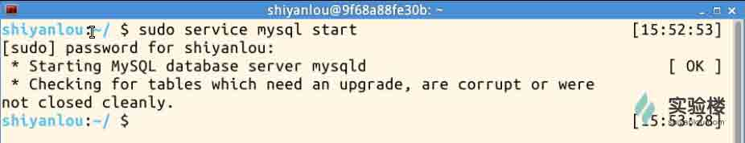
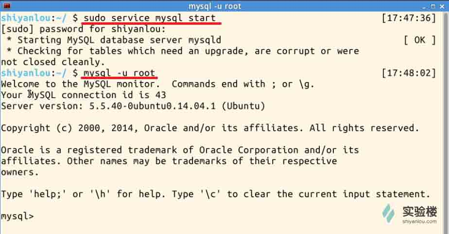
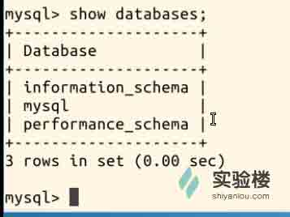
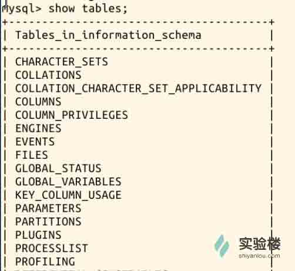

# 第 1 节 SQL 的介绍及 MySQL 的安装

## 实验简介

本小节对数据库、SQL、MySQL 做了简单介绍，并介绍了 Ubuntu Linux 下 MySQL 的安装。现在你对这门课程有了简单的了解，接下来的课程也将在此基础上进行。

## 一、实验说明

### 1\. 环境登录

无需密码自动登录，系统用户名 shiyanlou

### 2\. 环境介绍

本实验环境采用 Ubuntu Linux 桌面环境，实验中会用到桌面上的程序：

1.命令行终端: Linux 命令行终端，打开后会进入 Bash 环境，可以使用 Linux 命令；

2.Gedit：简单、便捷的代码编辑器。

### 3\. 环境使用

使用命令行终端运行所需命令进行操作，使用编辑器输入实验所需的代码及文件。

“实验记录”页面可以在“我的主页”中查看，每次实验的截图及笔记，以及有效学习时间（指的是在实验桌面内操作的时间，如果没有操作，系统会记录为发呆时间）。这些都是您在实验楼学习的真实性证明。

## 二、数据库和 SQL 介绍

数据库（Database）是按照数据结构来组织、存储和管理数据的仓库，它的产生距今已有六十多年。随着信息技术和市场的发展，数据库变得无处不在：它在电子商务、银行系统等众多领域都被广泛使用，且成为其系统的重要组成部分。

数据库用于记录数据，使用数据库记录数据可以表现出各种数据间的联系，也可以很方便地对所记录的数据进行增、删、改、查等操作。

结构化查询语言(Structured Query Language)简称 SQL，是上世纪 70 年代由 IBM 公司开发，用于对数据库进行操作的语言。更详细地说，SQL 是一种数据库查询和程序设计语言，用于存取数据以及查询、更新和管理关系数据库系统；同时也是数据库脚本文件的扩展名。

## 三、MySQL 介绍

MySQL 是一个 DBMS（数据库管理系统），由瑞典 MySQLAB 公司开发，目前属于 Oracle 公司，MySQL 是最流行的关系型数据库管理系统（关联数据库：将数据保存在不同的表中，而不是将所有数据放在一个大仓库内，这样就增加了速度并提高了灵活性。）。由于其体积小、速度快、总体拥有成本低，尤其是开放源码这一特点，一般中小型网站的开发都选择 MySQL 作为网站数据库。MySQL 使用 SQL 语言进行操作。

## 四、MySQL 安装

**注意：实验楼环境中已经安装好了 mysql，可以直接使用，无需再次安装，以下安装仅用于大家学习使用。**

### 1、安装之前的检查

先要检查 Linux 系统中是否已经安装了 MySQL，输入命令尝试打开 MySQL 服务：

```sql
sudo service mysql start 
```

输入 root 密码后，如果出现以下提示，则说明系统中已经安装有 MySQL：



如果提示是这样的，则说明系统中没有 MySQL，需要继续安装：

```sql
mysql: unrecognized service 
```

### 2、Ubuntu Linux 安装配置 MySQL

在 Ubuntu 上安装 MySQL，最简单的方式是在线安装。只需要几行简单的命令（“#”号后面是注释）：

```sql
sudo apt-get install mysql-server     #安装 MySQL 服务端、核心程序
sudo apt-get install mysql-client          #安装 MySQL 客户端 
```

在安装过程中会提示确认输入 YES，设置密码（之后也可以修改）等，稍等片刻便可安装成功。

安装结束后，用命令验证是否安装成功：

```sql
sudo netstat -tap | grep mysql 
```

如果出现如下提示，则安装成功：


此时，可以根据自己的需求，用 gedit 修改 MySQL 的配置文件（my.cnf）,使用以下命令:

```sql
sudo gedit /etc/mysql/my.cnf 
```

至此，MySQL 已经安装、配置完成，可以正常使用了。

## 五、尝试 MySQL

### 1、打开 MySQL

使用如下两条命令，打开 MySQL 服务并使用 root 用户登录：

```sql
sudo service mysql start             #打开 MySQL 服务

mysql -u root                        #使用 root 用户登录 
```

执行成功会出现如下提示：



### 2、查看数据库

使用命令“show databases;”，查看有哪些数据库（**注意不要漏掉“;”**）：



可见已有三个数据库，分别是“information-schema”、“mysql”、“performance-schema”。

### 3、连接数据库

选择连接其中一个数据库，语句格式为“use <数据库名>”，这里我们选择：

```sql
use information_schema 
```


### 4、查看表

使用命令“show tables;” 查看数据库中有哪些表（**注意不要漏掉“;”**）：



### 5、退出

使用命令“quit”或者“exit”退出 MySQL。

## 七、作业

1、如果你的计算机操作系统或虚拟机中有 Ubuntu Linux，尝试在 Ubuntu Linux 中完成 MySQL 的安装、配置、试用。

2、通过谷歌百度或其他方式，进一步了解数据库、SQL 和 MySQL。