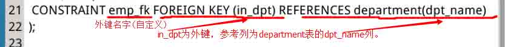

# 第 3 节 约束

## 实验简介

约束是一种限制，它通过对表的行或列的数据做出限制，来确保表的数据的完整性、唯一性。本节实验就在操作中熟悉 MySQL 中的几种约束。

## 一、实验说明

### 1、环境登录

无需密码自动登录，系统用户名 shiyanlou

### 2、环境介绍

本实验环境采用 Ubuntu Linux 桌面环境，实验中会用到的程序：

1、MySQL：流行的数据库管理系统，实验楼环境已经安装

2、Gedit：简单、快捷的文档编辑器

## 二、实验内容

### 1、约束分类

听名字就知道，约束是一种限制，它通过对表的行或列的数据做出限制，来确保表的数据的完整性、唯一性。

在 MySQL 中，通常有这几种约束：

```sql
|约束类型：|  主键  |    默认值   |   唯一    |   外键  |非空 |
|--------|-----|-----------|-----------|--------|-------|
|关键字： |PRIMARY KEY|DEFAULT| UNIQUE|FOREIGN KEY|NOT NULL|
```

### 2、建立含约束的表

为了方便介绍这几种约束，我们先建立一个数据库。

当然不用你一行一行地输入命令搭建这个数据库，实验楼已经为你准备好了。首先输入命令进入 Desktop：

```sql
cd Desktop 
```

```sql
git clone http://git.shiyanlou.com/shiyanlou/SQL3 
```

下载完成后，输入“cd ~”（注意有空格）退回到原先目录，然后输入命令开启 MySQL 服务并使用 root 用户登录：

```sql
sudo service mysql start        #打开 MySQL 服务

mysql -u root                   #使用 root 用户登录 
```

刚才从 github 下载的 SQL3 目录下，有个文件“MySQL-03-01.sql”，其中包含的代码可以新建一个数据库“mysql_shiyan”,然后在其中创建三张表“department”，“employee”，“project”，它们包含了各种约束。

（SQL3 目录在桌面上，你可以用 Gedit 查看里面的 MySQL-03-01.sql 文件。）

运行这个文件，输入命令：

```sql
source /home/shiyanlou/Desktop/SQL3/MySQL-03-01.sql 
```

查看一下这个数据库，输入命令“show tables;”，可见：


### 3、主键

主键(PRIMARY KEY)是用于约束表中的一行，作为这一行的标识符，在一张表中通过主键就能准确定位到一行，因此主键十分重要。行中的主键不能有重复且不能为空。

在 MySQL-03-01.sql 中，这里有主键：


也可以这样定义主键：


还有一种特殊的主键——复合主键。主键不仅可以是表中的一列，也可以由表中的两列或多列来共同标识，比如：


### 4、默认值约束

默认值约束(DEFAULT)规定，当有 DEFAULT 约束的列，插入数据为空时，该怎么办。

在 MySQL-03-01.sql 中，这段代码包含了 DEFAULT 约束：


DEFAULT 约束只会在使用 INSERT 语句（上一实验介绍过）时体现出来，INSERT 语句中，如果被 DEFAULT 约束的位置没有值，那么这个位置将会被 DEFAULT 的值填充，如语句：

```sql
INSERT INTO department(dpt_name,people_num) VALUES('dpt1',11);
INSERT INTO department(dpt_name) VALUES('dpt2');  #people_num 为空 
```

输入命令“SELECT * FROM department;”，可见表中第二行的 people_num 被 DEFAULT 的值(10)填充：


### 5、唯一约束

唯一约束(UNIQUE)比较简单，它规定一张表中指定的一列的值必须不能有重复值，即这一列每个值都是唯一的。

在 MySQL-03-01.sql 中，也有 UNIQUE 约束：


当 INSERT 语句新插入的数据和已有数据重复的时候，如果有 UNIQUE 约束，则 INSERT 失败，比如：

```sql
INSERT INTO employee VALUES(01,'Tom',25,3000,110110,'dpt1');
INSERT INTO employee VALUES(02,'Jack',30,3500,110110,'dpt2'); 
```

结果如图：


### 6、外键约束

外键(FOREIGN KEY)既能确保数据完整性，也能表现表之间的关系。

一个表可以有多个外键，每个外键必须 REFERENCES(参考)另一个表的主键，被外键约束的列，取值必须在它参考的列中有对应值。



在 INSERT 时，如果被外键约束的值没有在参考列中有对应，比如以下命令，参考列(department 表的 dpt_name)中没有 dpt3，则 INSERT 失败：

```sql
INSERT INTO employee VALUES(02,'Jack',30,3500,114114,'dpt3'); 
```

可见之后将 dpt3 改为 dpt2（department 表中有 dpt2），则插入成功：


### 7、非空约束

非空约束(NOT NULL),听名字就能理解，被非空约束的列，在插入值时必须非空。


在 MySQL 中违反非空约束，不会报错，只会有警告，比如以下语句：

```sql
INSERT INTO employee(id,name,salary,phone,in_dpt) VALUES(03,'Jim',3400,119119,'dpt2');  #INSERT 成功 age 为空，因为没有非空约束，表中显示 NULL
INSERT INTO employee(id,name,age,phone,in_dpt) VALUES(04,'Bob',23,123456,'dpt1'); #警告 salary 被非空约束，值为空，表中显示 0 
```

结果如图，出现警告，但还是插入数据成功：


此时 employee 表的内容为：


## 三、作业

按照实验过程完整操作一遍：先用 github 中的文件建立数据库，然后用实验过程的各条语句，试探各种约束的作用。实验过程截图。