# 第 4 节 SELECT 语句详解

## 实验简介

MySQL 中最常用的 SELECT 语句，详细讲解它的用法。

## 一、实验说明

### 1、环境登录

无需密码自动登录，系统用户名 shiyanlou

### 2、环境介绍

本实验环境采用 Ubuntu Linux 桌面环境，实验中会用到的程序：

1、MySQL：流行的数据库管理系统，实验楼环境已经安装

2、Gedit：简单、快捷的文档编辑器

## 二、实验准备

在正式开始本实验内容之前，需要先从 github 下载相关代码，搭建好一个名为 mysql_shiyan 的数据库(有三张表：department，employee，project)，并向其中插入数据。

具体操作如下,首先输入命令进入 Desktop：

```sql
cd Desktop 
```

然后再输入命令，下载代码：

```sql
git clone http://git.shiyanlou.com/shiyanlou/SQL4 
```

下载完成后，输入“cd ~”（注意有空格）退回到原先目录，然后输入命令开启 MySQL 服务并使用 root 用户登录：

```sql
sudo service mysql start        #打开 MySQL 服务

mysql -u root                   #使用 root 用户登录 
```

刚才从 github 下载的 SQL4 目录下，有个两文件“MySQL-04-01.sql”和“MySQL-04-02.sql”，其中第一个文件用于创建数据库，第二个文件向数据库中插入数据。

（**SQL4 目录在桌面上，你可以用 Gedit 查看里面两个的文件。**）

输入命令运行第一个文件，搭建数据库：

```sql
source /home/shiyanlou/Desktop/SQL4/MySQL-04-01.sql 
```

运行第二个文件，向数据库中插入数据：

```sql
source /home/shiyanlou/Desktop/SQL4/MySQL-04-02.sql 
```

## 三、实验内容

在数据库操作语句中，使用最频繁，也被认为最重要的是 SELECT 查询语句。之前的实验中，我们已经在不少地方用到了 **SELECT * FROM table_name;** 这条语句用于查看一张表中的所有内容。 而 SELECT 与各种限制条件关键词搭配使用，具有各种丰富的功能，这次实验就进行详细介绍。

### 1、基本的 SELECT 语句

SELECT 语句的基本格式为：

```sql
SELECT 要查询的列名 FROM 表名字 WHERE 限制条件; 
```

如果要查询表的所有内容，则把**要查询的列名**用一个 * 号表示(实验 2、3 中都已经使用过)，代表要查询表中所有的列。 而大多数情况，我们只需要查看某个表的指定的列，比如要查看 employee 表的 name 和 age：

```sql
SELECT name,age FROM employee; 
```

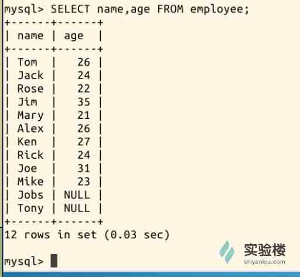

### 2、数学符号条件

SELECT 语句常常会有 WHERE 限制条件，用于达到更加精确的查询。WHERE 限制条件可以有数学符号 (**=,<,>,>=,<=**) ，刚才我们查询了 name 和 age，现在稍作修改：

```sql
SELECT name,age FROM employee WHERE age>25; 
```

筛选出 age 大于 25 的结果：

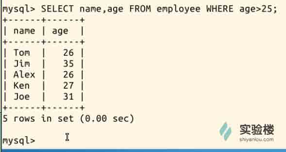

或者查找一个名字为 Mary 的员工：

```sql
SELECT name,age,phone FROM employee WHERE name='Mary'; 
```

结果当然是：

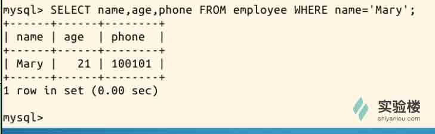

### 3、“AND”与“OR”

从这两个单词就能够理解它们的作用。WHERE 后面可以有不止一条限制，而根据条件之间的逻辑关系，可以用**OR(或)**和**AND(且)**连接：

```sql
SELECT name,age FROM employee WHERE age<25 OR age>30;     #筛选出 age 小于 25，或 age 大于 30 
```

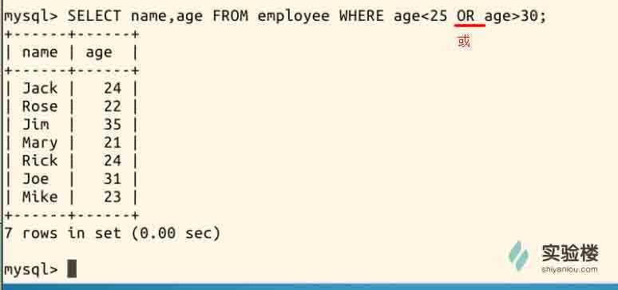

```sql
SELECT name,age FROM employee WHERE age>25 AND age<30;    #筛选出 age 大于 25，且 age 小于 30 
```

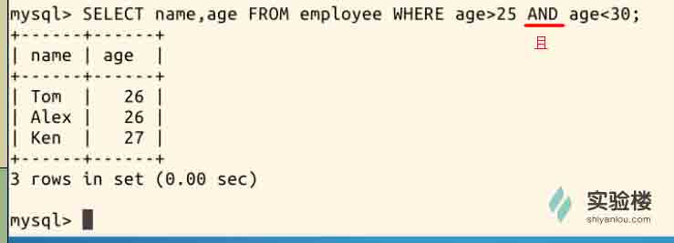

而刚才的限制条件 **age>25 AND age<30** ，如果需要包含 25 和 30 的话，可以替换为 **age BETWEEN 25 AND 30** ：

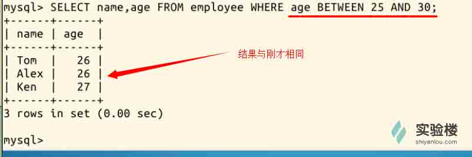

### 4、IN 和 NOT IN

关键词**IN**和**NOT IN**的作用和它们的名字一样明显，用于筛选**“在”**或**“不在”**某个范围内的结果，比如说我们要查询在**dpt3**或**dpt4**的人:

```sql
SELECT name,age,phone,in_dpt FROM employee WHERE in_dpt IN ('dpt3','dpt4'); 
```

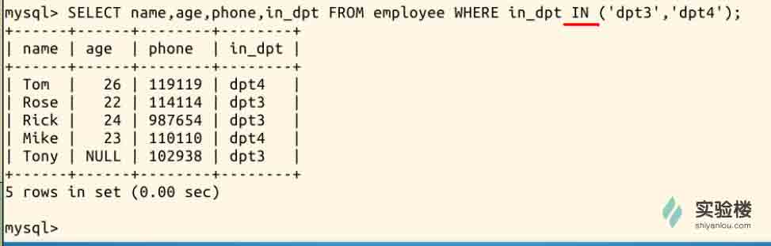

而**NOT IN**的效果则是，如下面这条命令，查询出了不在**dpt1**也不在**dpt3**的人：

```sql
SELECT name,age,phone,in_dpt FROM employee WHERE in_dpt NOT IN ('dpt1','dpt3'); 
```

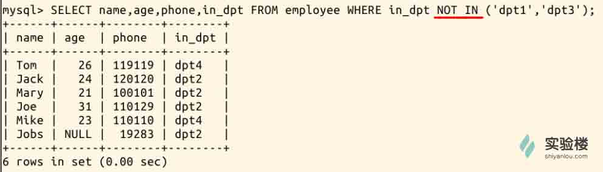

### 5、通配符

关键字 **LIKE** 在 SQL 语句中和通配符一起使用，通配符代表未知字符。SQL 中的通配符是 _ 和 % 。其中 _ 代表一个未指定字符，% 代表**不定个**未指定字符。

比如，要只记得电话号码前四位数为 1101，而后两位忘记了，则可以用两个 _ 通配符代替：

```sql
SELECT name,age,phone FROM employee WHERE phone LIKE '1101__'; 
```

这样就查找出了**1101 开头的 6 位数电话号码**：

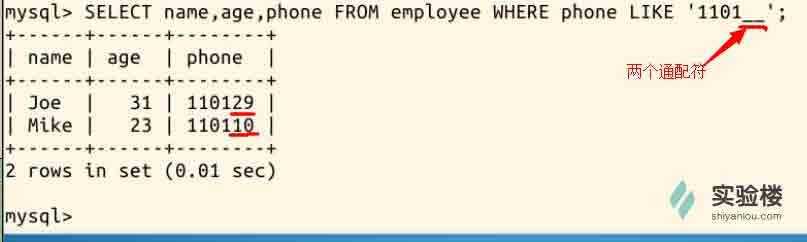

另一种情况，比如只记名字的首字母，又不知道名字长度，则用 % 通配符代替不定个字符：

```sql
SELECT name,age,phone FROM employee WHERE name LIKE 'J%'; 
```

这样就查找出了首字母为 **J** 的人：

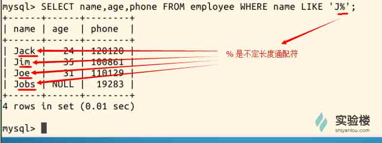

### 6、对结果排序

为了使查询结果看起来更顺眼，我们可能需要对结果按某一列来排序，这就要用到 **ORDER BY** 排序关键词。默认情况下，**ORDER BY**的结果是**升序**排列，而使用关键词**ASC**和**DESC**可指定**升序**或**降序**排序。 比如，我们**按 salary 降序排列**，SQL 语句为：

```sql
SELECT name,age,salary,phone FROM employee ORDER BY salary DESC; 
```

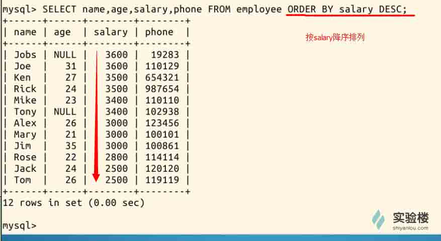

### 7、SQL 内置函数和计算

SQL 允许对表中的数据进行计算。对此，SQL 有 5 个内置函数，这些函数都对 SELECT 的结果做操作：

```sql
|函数名：|COUNT|SUM |AVG     |MAX   |MIN   |
|--------|-----|----|--------|------|------|
|作用：  |计数 |求和|求平均值|最大值|最小值|
```

>其中 COUNT 函数可用于任何数据类型(因为它只是计数)，而另 4 个函数都只能对数字类数据类型做计算。

具体举例，比如计算出 salary 的最大、最小值，用这样的一条语句：

```sql
SELECT MAX(salary) AS max_salary,MIN(salary) FROM employee; 
```

有一个细节你或许注意到了，**使用 AS 关键词可以给值重命名**，比如最大值被命名为了 max_salary：

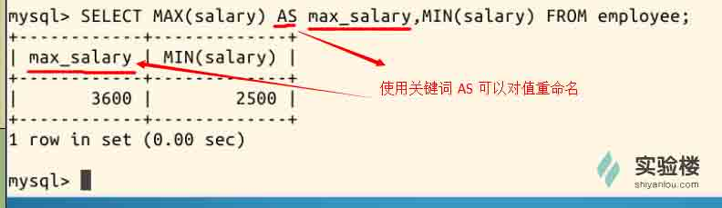

### 8、子查询

上面讨论的 SELECT 语句都仅涉及一个表中的数据，然而有时必须处理多个表才能获得所需的信息。例如：想要知道名为"Tom"的员工所在部门做了几个工程。员工信息储存在 employee 表中，但工程信息储存在 project 表中。 对于这样的情况，我们可以用子查询：

```sql
SELECT of_dpt,COUNT(proj_name) AS count_project FROM project
WHERE of_dpt IN
(SELECT in_dpt FROM employee WHERE name='Tom'); 
```

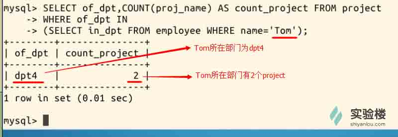

>子查询还可以扩展到 3 层、4 层或更多层。

### 9、连接查询

在处理多个表时，子查询只有在结果来自一个表时才有用。但如果需要显示两个表或多个表中的数据，这时就必须使用连接**(join)**操作。 连接的基本思想是把两个或多个表当作一个新的表来操作，如下：

```sql
SELECT id,name,people_num
FROM employee,department
WHERE employee.in_dpt = department.dpt_name
ORDER BY id; 
```

这条语句查询出的是，各员工所在部门的人数，其中员工的 id 和 name 来自 employee 表，people_num 来自 department 表：

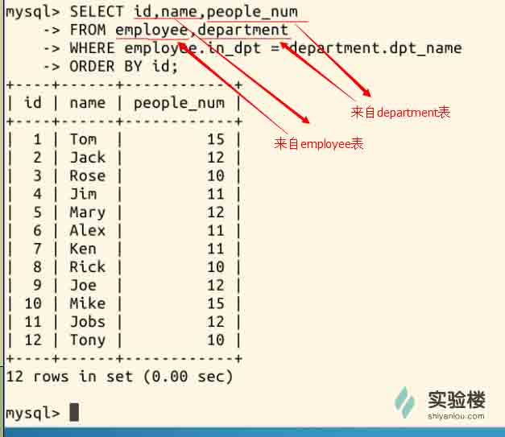

另一个连接语句格式是使用 JOIN ON 语法，刚才的语句等同于：

```sql
SELECT id,name,people_num
FROM employee JOIN department
ON employee.in_dpt = department.dpt_name
ORDER BY id; 
```

结果也与刚才的语句相同。

## 四、作业

1、按照实验过程完整操作一遍：先用 git 中的代码建立数据库并插入数据，然后试用各种 SELECT 语句。实验过程截图。

2、使用连接查询的方式，查询出各员工所在部门的人数与工程数，工程数命名为 count_project。（连接 3 个表，并使用 COUNT 内置函数）