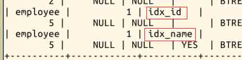
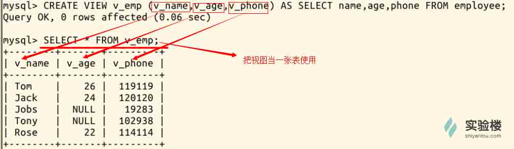
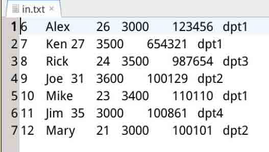
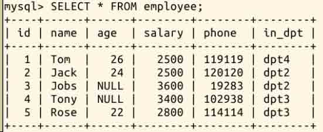
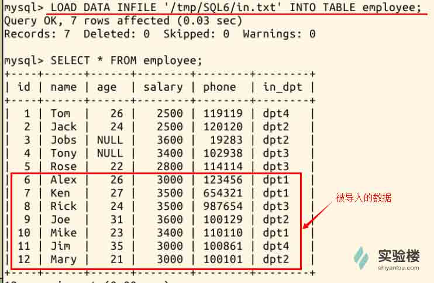
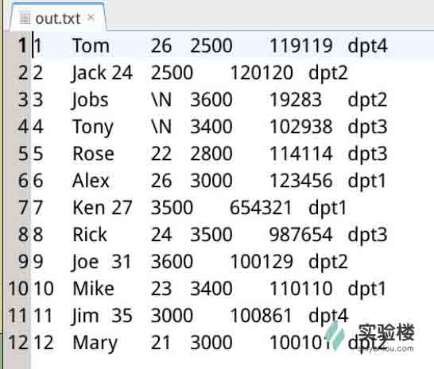
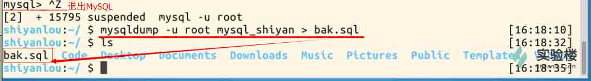
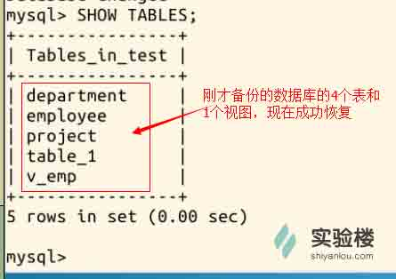
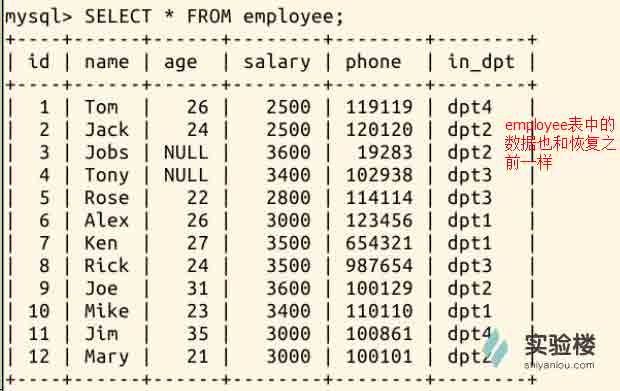

# 第 6 节 其它

## 实验简介

介绍数据库的其它操作：索引、视图，导入和导出，备份和恢复等。

## 一、实验说明

### 1、环境登录

无需密码自动登录，系统用户名 shiyanlou

### 2、环境介绍

本实验环境采用 Ubuntu Linux 桌面环境，实验中会用到的程序：

1、MySQL：流行的数据库管理系统，实验楼环境已经安装

2、Gedit：简单、快捷的文档编辑器

## 二、实验准备

在正式开始本实验内容之前，需要先从 github 下载相关代码，搭建好一个名为 mysql_shiyan 的数据库(有三张表：department，employee，project)，并向其中插入数据。

具体操作如下,首先输入命令进入 tmp 目录：

```sql
cd /tmp 
```

然后再输入命令，下载代码：

```sql
git clone http://git.shiyanlou.com/shiyanlou/SQL6 
```

下载完成后，输入“cd ~”（注意有空格）退回到原先目录，然后输入命令开启 MySQL 服务并使用 root 用户登录：

```sql
sudo service mysql start        #打开 MySQL 服务

mysql -u root                   #使用 root 用户登录 
```

刚才从 github 下载的 SQL6 目录下，有个两文件“MySQL-06.sql”和“in.txt”，其中第一个文件用于创建数据库并向其中中插入数据，第二个文件用于之后的实验步骤。

（**你可以进入/tmp/SQL6 目录用 Gedit 查看里面两个文件的内容。**）

输入命令运行第一个文件，搭建数据库并插入数据：

```sql
source /tmp/SQL6/MySQL-06.sql 
```

## 三、实验内容

### 1、索引

索引是一种与表有关的结构，它的作用相当于书的目录，可以根据目录中的页码快速找到所需的内容。 当表中有大量记录时，若要对表进行查询，没有索引的情况是全表搜索：将所有记录一一取出，和查询条件进行一一对比，然后返回满足条件的记录。这样做会消耗大量数据库系统时间，并造成大量磁盘 I/O 操作。 而如果在表中已建立索引，在索引中找到符合查询条件的索引值，通过索引值就可以快速找到表中的数据，可以**大大加快查询速度**。

对一张表中的某个列建立索引，有以下两种语句格式：

```sql
ALTER TABLE 表名字 ADD INDEX 索引名 (列名);

CREATE INDEX 索引名 ON 表名字 (列名); 
```

我们用这两种语句分别建立索引：

```sql
ALTER TABLE employee ADD INDEX idx_id (id);  #在 employee 表的 id 列上建立名为 idx_id 的索引

CREATE INDEX idx_name ON employee (name);   #在 employee 表的 name 列上建立名为 idx_name 的索引 
```

索引的效果是加快查询速度，当表中数据不够多的时候是感受不出它的效果的。这里我们使用命令 **SHOW INDEX FROM 表名字;** 查看刚才新建的索引：



在使用 SELECT 语句查询的时候，语句中 WHERE 里面的条件，会**自动判断有没有可用的索引**。

### 2、视图

视图是从一个或多个表中导出来的表，是一种**虚拟存在的表**。它就像一个窗口，通过这个窗口可以看到系统专门提供的数据，这样，用户可以不用看到整个数据库中的数据，而只关心对自己有用的数据。

注意理解视图是虚拟的表：

*   数据库中只存放了视图的定义，而没有存放视图中的数据，这些数据存放在原来的表中；
*   使用视图查询数据时，数据库系统会从原来的表中取出对应的数据；
*   视图中的数据依赖于原来表中的数据，一旦表中数据发生改变，显示在视图中的数据也会发生改变；
*   在使用视图的时候，可以把它当作一张表。

创建视图的语句格式为：

```sql
CREATE VIEW 视图名(列 a,列 b,列 c) AS SELECT 列 1,列 2,列 3 FROM 表名字; 
```

可见创建视图的语句，后半句是一个 SELECT 查询语句，所以**视图也可以建立在多张表上**，只需在 SELECT 语句中使用**子查询**或**连接查询**，这些在之前的实验已经进行过。

现在我们创建一个简单的视图，名为 **v*emp***，包含**vname**，**v*age***，**vphone**三个列：



### 3、导入

导入操作，可以把一个文件里的数据保存进一张表。导入语句格式为：

```sql
LOAD DATA INFILE '文件路径' INTO TABLE 表名字; 
```

现在 /tmp/SQL6 目录下有一个名为 **in.txt** 的文件，我们尝试把这个文件中的数据导入数据库 **mysql_shiyan** 的 **employee** 表中。

先按住 **Ctrl+Z** 退出 MySQL，再使用命令 **gedit /tmp/SQL6/in.txt** 查看 **test.txt** 文件中的内容：



再使用以下命令以 root 用户登录数据库，再连接 **mysql_shiyan** 数据库：

```sql
mysql -u root

use mysql_shiyan 
```

查看一下没有导入数据之前，employee 表中的数据：



现在执行导入语句，文件中的数据成功导入 employee 表：



### 4、导出

导出与导入是相反的过程，是把数据库某个表中的数据保存到一个文件之中。导出语句基本格式为：

```sql
SELECT 列 1，列 2 INTO OUTFILE '文件路径和文件名' FROM 表名字; 
```

**注意：语句中 “文件路径” 之下不能已经有同名文件。**

现在我们把整个 employee 表的数据导出到 /tmp 目录下，导出文件命名为 **out.txt** 具体语句为：

```sql
SELECT * INTO OUTFILE '/tmp/out.txt' FROM employee; 
```

用 gedit 可以查看导出文件 out.txt 的内容：



### 5、备份

数据库中的数据或许十分重要，出于安全性考虑，在数据库的使用中，应该注意使用备份功能。

>备份与导出的区别：导出的文件只是保存数据库中的数据；而备份，则是把数据库的结构，包括数据、约束、索引、视图等全部另存为一个文件。

**mysqldump**是 MySQL 用于备份数据库的实用程序。它主要产生一个 SQL 脚本文件，其中包含从头重新创建数据库所必需的命令 CREATE TABLE INSERT 等。

使用 mysqldump 备份的语句：

```sql
mysqldump -u root 数据库名>备份文件名;   #备份整个数据库

mysqldump -u root 数据库名 表名字>备份文件名;  #备份整个表 
```

我们尝试备份整个数据库 **mysql_shiyan**，将备份文件命名为 **bak.sql**，先 **Ctrl+Z** 退出 MySQL，再使用语句：

```sql
mysqldump -u root mysql_shiyan > bak.sql; 
```

使用命令“ls”可见已经生成备份文件 bak.sql：



>你可以用 gedit 查看备份文件的内容，可以看见里面不止保存了数据，还有所备份的数据库的其他信息。

### 6、恢复

用备份文件恢复数据库，其实我们早就使用过了。在本次实验的开始，我们使用过这样一条命令：

```sql
source /tmp/SQL6/MySQL-06.sql 
```

这就是一条恢复语句，它把 MySQL-06.sql 文件中保存的 mysql_shiyan 数据库恢复。

还有另一种方式恢复数据库，但是在这之前我们先使用命令新建一个**空的数据库 test**：

```sql
mysql -u root          #因为在上一步已经退出了 MySQL，现在需要重新登录

CREATE DATABASE test;  #新建一个名为 test 的数据库 
```

再次 **Ctrl+Z** 退出 MySQL，然后输入语句进行恢复，把刚才备份的 **bak.sql** 恢复到 **test** 数据库：

```sql
mysql -u root test < bak.sql 
```

我们输入命令查看 test 数据库的表，便可验证是否恢复成功：

```sql
mysql -u root          #因为在上一步已经退出了 MySQL，现在需要重新登录

use test               #连接数据库 test

SHOW TABLES;           #查看 test 数据库的表 
```

可以看见原数据库的 4 张表和 1 个视图，现在已经恢复到 test 数据库中：



再查看 employee 表的恢复情况：



## 四、作业

1、按照实验过程完整操作一遍，实验过程截图。

2、使用子查询或连接，建立多张表的视图，再用 SELECT 语句展示出视图的内容，并截图。