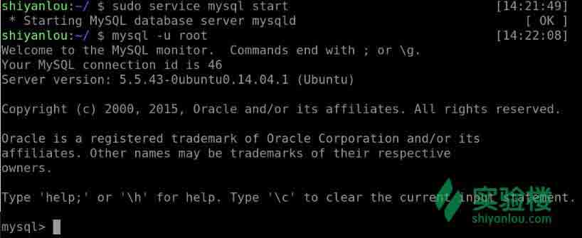
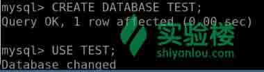
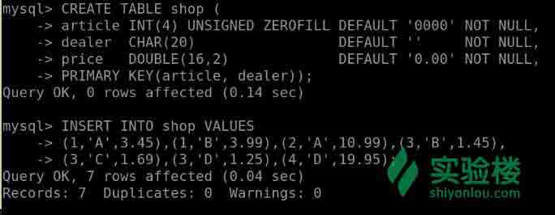
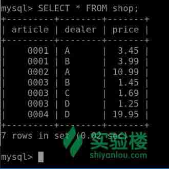
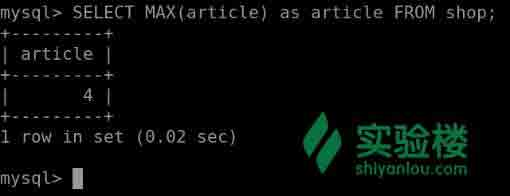
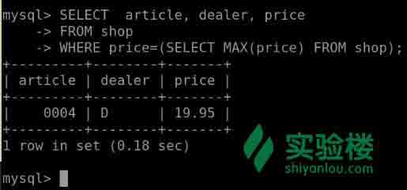
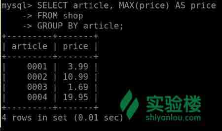
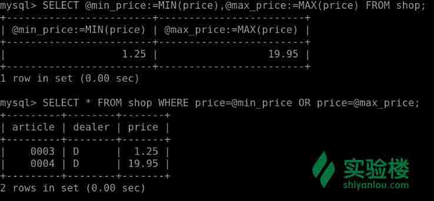

# 第 3 节 MySQL 常用查询

## 1\. 环境登录

无需密码自动登录，系统用户名 shiyanlou

## 2\. 环境介绍

本实验环境采用带桌面的 Ubuntu Linux 环境，实验中会用到桌面上的程序：

1.  命令行终端: Linux 命令行终端，打开后会进入 Bash 环境，可以使用 Linux 命令

2.  Firefox 及 Opera：浏览器，可以用在需要前端界面的课程里，只需要打开环境里写的 HTML/JS 页面即可

3.  gvim：非常好用的 Vim 编辑器，最简单的用法可以参考课程[Vim 编辑器](http://www.shiyanlou.com/courses/2)

4.  gedit 及 Brackets：如果您对 gvim 的使用不熟悉，可以用这两个作为代码编辑器，其中 Brackets 非常适用于前端代码开发

## 3\. 环境使用

使用 GVim 编辑器输入实验所需的代码及文件，使用 Xfce 终端（XfceTerminal）运行所需命令进行操作。

实验报告可以在个人主页中查看，其中含有每次实验的截图及笔记，以及每次实验的有效学习时间（指的是在实验桌面内操作的时间，如果没有操作，系统会记录为发呆时间）。这些都是您学习的真实性证明。

## 4\. 实验内容

接下来会给大家介绍 MySQL 中的常用查询。

在下面的例子中使用数据表`shop`来存储商人（经销商）的每件物品（物品号）对应的价格。假如每个商人对应的每个物品都有一个固定的价格，那么该表中的关键字就是`物品`和`商人`。

首先你需要启动服务器并连接到 MySQL：



然后创建一个数据库`TEST`，并切换到该数据库：



再通过如下代码创建一个示例表：

```sql
mysql> CREATE TABLE shop (
    -> article INT(4) UNSIGNED ZEROFILL DEFAULT '0000' NOT NULL,
    -> dealer  CHAR(20)                 DEFAULT ''     NOT NULL,
    -> price   DOUBLE(16,2)             DEFAULT '0.00' NOT NULL,
    -> PRIMARY KEY(article, dealer));
# 插入数据
mysql> INSERT INTO shop VALUES
    -> (1,'A',3.45),(1,'B',3.99),(2,'A',10.99),(3,'B',1.45),
    -> (3,'C',1.69),(3,'D',1.25),(4,'D',19.95); 
```



执行以下语句查看表的内容：

```sql
mysql> SELECT * FROM shop; 
```



### 4.1 寻找列的最大值

使用`MAX()`函数计算物品号`article`的最大值：

```sql
mysql> SELECT MAX(article) as article FROM shop; 
```



### 4.2 查询某列最大值所在的行

```sql
# 显示 price 这一列最大值对应的行
mysql> SELECT article, dealer, price
    -> FROM   shop
    -> WHERE  price=(SELECT MAX(price) FROM shop); 
```



另外一个方法是对所有行进行价格的降序排序，然后使用 MySQL 特有的 LIMIT 子句显示其中一行（这里是指定第一行显示最高价格）：

```sql
mysql> SELECT article, dealer, price
    -> FROM shop
    -> ORDER BY price DESC
    -> LIMIT 1; 
```

大家可以输入上述语句查询结果是否一样。

**注：如果有多项物品的价格都是 19.95（最贵的物品不止一个），那么 LIMIT 的显示结果也只会显示其中一个**

### 4.3 按组显示列的最大值

通过以下代码找出每项物品中对应出价最高价格

```sql
mysql> SELECT article, MAX(price) AS price
    -> FROM shop
    -> GROUP BY article; 
```



### 4.4 使用[用户变量](http://doc.mysql.cn/mysql5/refman-5.1-zh.html-chapter/language-structure.html#variables)

通过使用用户变量找出价格最高或者最低的物品：

```sql
mysql> SELECT @min_price:=MIN(price),@max_price:=MAX(price) FROM shop;
mysql> SELECT * FROM shop WHERE price=@min_price OR price=@max_price; 
```



思考其他的方式求出价格的最大值和最低值所对应的物品。

### 4.5 使用[外键](http://doc.mysql.cn/mysql5/refman-5.1-zh.html-chapter/introduction.html#ansi-diff-foreign-keys)

在 MySQL 中，[InnoDB](http://doc.mysql.cn/mysql5/refman-5.1-zh.html-chapter/storage-engines.html#innodb)表支持外键约束的检查。

在连接两个表的时候并不需要外键约束。对于除`InnoDB`表以外的表，可以使用`REFERENCES tbl_name(col_name)`语句定义将它的列设置为外键，但是该语句并没有实际的作用，只是作为备注来提醒你现在正在定义的列指向另外一个表的列。在执行该语句的时候需要注意以下几点：

*   MySQL 并不会执行任何操作检查列`col_name`是否存在于表`tbl_name`中（它甚至不会检查`tbl_name`这个表是否真正存在）。
*   MySQL 不执行表`tbl_name`中的操作，例如对你正定义的行的进行更改行为，致使 ON DELETE 或 ON UPDATE 语句在该行上不会生效（意思是如果你在 REFERENCES 子句中写入 ON DELETE 或 ON UPDATE 子句，将被忽略）。
*   该句法可以创建一个列；但不创建任何索引或关键字。

你可以使用以上语句建立两个表并定义外键连接两个表中的列：

```sql
mysql> CREATE TABLE person (
    -> id SMALLINT UNSIGNED NOT NULL AUTO_INCREMENT,
    -> name CHAR(60) NOT NULL,
    -> PRIMARY KEY (id)
    -> );

mysql> CREATE TABLE shirt (
    -> id SMALLINT UNSIGNED NOT NULL AUTO_INCREMENT,
    -> style ENUM('t-shirt', 'polo', 'dress') NOT NULL,
    -> color ENUM('red', 'blue', 'orange', 'white', 'black') NOT NULL,
    -> owner SMALLINT UNSIGNED NOT NULL REFERENCES person(id),
    -> PRIMARY KEY (id)
    -> );

mysql> INSERT INTO person VALUES (NULL, 'Antonio Paz');

mysql> SELECT @last := LAST_INSERT_ID();

mysql> INSERT INTO shirt VALUES
    -> (NULL, 'polo', 'blue', @last),
    -> (NULL, 'dress', 'white', @last),
    -> (NULL, 't-shirt', 'blue', @last);

mysql> INSERT INTO person VALUES (NULL, 'Lilliana Angelovska');

mysql> SELECT @last := LAST_INSERT_ID();

mysql> INSERT INTO shirt VALUES
    -> (NULL, 'dress', 'orange', @last),
    -> (NULL, 'polo', 'red', @last),
    -> (NULL, 'dress', 'blue', @last),
    -> (NULL, 't-shirt', 'white', @last); 
```

尝试查询`person`和`shirt`这两个的内容

按照以上方式建立表，并使用语句`SHOW CREATE TABLE`或者`DESCRIBE`查看输出结果，你会发现`REFERENCES`子句并不会出现在结果中：

```sql
SHOW CREATE TABLE shirt\G 
```

看看你的输出结果吧~

### 4.6 使用两个关键字进行搜索

充分利用`OR`连接两个关键字（`AND`也是一样的道理）

```sql
# 这里面的 test_table 可以是任何一个表，关键词也是类似
SELECT field1_index, field2_index FROM test_table
WHERE field1_index = '1' OR  field2_index = '1' 
```

还可以使用`UNION`将两个表里面的关键字一起使用进行搜索

```sql
SELECT field1_index, field2_index
    FROM test_table WHERE field1_index = '1'
    UNION
SELECT field1_index, field2_index
    FROM test_table WHERE field2_index = '1'; 
```

### 4.7 计算每月的访问量

下面使用`BIT_COUNT`函数计算每个月中某用户访问网页的天数：

```sql
CREATE TABLE t1 (year YEAR(4), month INT(2) UNSIGNED ZEROFILL,
    day INT(2) UNSIGNED ZEROFILL);
INSERT INTO t1 VALUES(2000,1,1),(2000,1,20),(2000,1,30),(2000,2,2),
    (2000,2,23),(2000,2,23); 
```

上述建立的表中有用户访问网页的年月日，可以使用以下语句查询每个月的访问天数：

```sql
SELECT year,month,BIT_COUNT(BIT_OR(1<<day)) AS days FROM t1
    GROUP BY year,month; 
```

### 4.8 使用`AUTO_INCREMENT`语句

在定义列属性的时候添加`AUTO_INCREMENT`语句可以使得每条记录都能被唯一标识：

```sql
CREATE TABLE animals (
     id MEDIUMINT NOT NULL AUTO_INCREMENT,
     name CHAR(30) NOT NULL,
     PRIMARY KEY (id)
 );

INSERT INTO animals (name) VALUES 
    ('dog'),('cat'),('penguin'),
    ('lax'),('whale'),('ostrich');

SELECT * FROM animals; 
```

查看以上语句的返回结果，你会发现`id`是自动生成的。

要想`AUTO_INCREMENT`语句生成的起始值不是 1，可以通过`CREATE TABLE`或`ALTER TABLE`来设置该值，如下所示:

```sql
mysql> ALTER TABLE tbl AUTO_INCREMENT = 100; 
```

更多关于`AUTO_INCREMENT`语句的学习：

*   如何为列指定`AUTO_INCREMENT`属性：[CREATE TABLE 语法](http://doc.mysql.cn/mysql5/refman-5.1-zh.html-chapter/sql-syntax.html#create-table)和[ALTER TABLE 语法](http://doc.mysql.cn/mysql5/refman-5.1-zh.html-chapter/sql-syntax.html#alter-table)。
*   找出含有最新的`AUTO_INCREMENT`值的行：[比较函数和操作符](http://doc.mysql.cn/mysql5/refman-5.1-zh.html-chapter/functions.html#comparison-operators)。

## 5\. 作业

尝试建立一个图书馆数据库，任由发挥，但必须包含基本信息：图书信息，借书人的信息，出版社信息。并运用这一节课学到的索引知识对数据库进行索引，把你的思想和步骤写入实验报告，在实验课环境下建立系统并索引，记得截图哦。