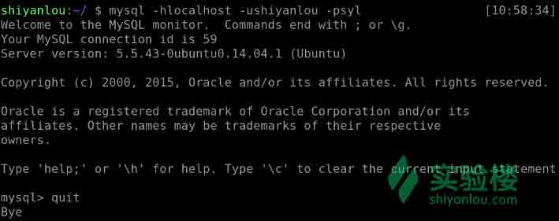

# 第 1 节 MySQL 数据库对象管理

## 一、实验介绍

MySQL 是一个开源的关系型数据库，被广泛使用。学习关系型数据库，有两个方向，一个是开发，另一个则是管理。本次实验着重讲的是 MySQL 数据库的权限管理与字符集，这部分知识是 DBA 所需掌握的基本知识。学习本次实验之前建议先学习[SQL 基础语法](https://www.shiyanlou.com/courses/9)与[MySQL 参考手册](https://www.shiyanlou.com/courses/28)。
（注：两门课程中涉及的约束、视图、触发器等知识点，会在本此实验最后的思考题中提到。）

## 二、实验内容

### 1\. 进入数据库

首先，我们要开启数据库的服务

```sql
sudo service mysql start 
```

成功后如下


接着连接进数据库


（说明：MySQL 的连接方法可以使用 --help 命令来获取帮助，-h 代表 IP 地址白名单，127.0.0.1 代表本机环回地址，同样本机也可以使用 localhost 连接，-u 后跟用户名）

### 2\. 添加密码

因为 MySQL 的 root 用户默认是没有密码的，所以可以直接连接。但作为最高权限用户，没有密码是绝对的不安全，不论是不是 DBA 都应该知道给 root 用户加一个密码。

使用 quit 退出 MySQL，输入如下命令：

```sql
mysqladmin -uroot password xxx 
```

其中“xxx”是你自己设置的 root 密码，同样，更改密码也可以使用这个命令，只需加一个“-pxxxx”，“xxxx”为旧密码。完成后则需要通过密码登录 root 用户：


### 3\. 新建用户

了解 Linux 的同学都知道，使用 root 用户作为日常使用是极其不安全的，MySQL 也是同理，不论是 DBA 还是开发者，都不会直接操作 root 用户，因此我们需要新添加一个用户使用：

```sql
CREATE USER 'shiyanlou'@'localhost' IDENTIFIED BY 'syl'; 
```


使用新建的 shiyanlou 用户登录进去了，这里注意一点，-p 之后跟的是密码，但为了安全起见，不要直接输入密码，-p 后直接回车，在“Enter password”后面输入密码，这是因为 Linux 会默认保留一部分命令行输入的历史记录，如果直接填写，密码则可以通过查看历史记录的方式直接被看到。如图：




接下来要给新建的用户赋权,在此之前可以用 shiyanlou 用户登录，查看有哪些权限

```sql
show grants； 
```


可以看到只有连接权限，其中“ *.* ”，第一个 “ * ” 代表的是数据库，可以是数据库的名字， “ * ” 代表全部数据库，第二个 “ * ” 代表的是表，与前一个同理，密码是经过哈希后的密文。
另外，可以使用 “show grants” 语句查看其它用户的权限，命令为后面加上 “for 'xxx'@'xxxx' ”，格式与前面的同理。

### 4\. 权限管理

使用 grant 语句为用户赋权

```sql
GRANT all privileges ON *.* TO 'shiyanlou'@'localhost'; 
```

`一般情况下，修改 MySQL 密码，授权，是需要有 mysql 里的 root 权限`

这个命令可以让 shiyanlou 用户获得所有所有数据库下所有表的所有权限，一般情况下不会这么做，这时 “all privileges” 可以替换成其他的权限，如 select，insert 等，权限之间直接用逗号隔开。


语句后面可以加入 “with grant option”，如

```sql
GRANT all privileges ON *.* TO 'shiyanlou'@'localhost' with grant option; 
```

这样的话，shiyanlou 用户就可以将他获得的权限再赋给其他用户了。
当权限不需要时，可以回收用户的权限

```sql
REVOKE all privileges ON *.* FROM 'shiyanlou'@'localhost'; 
```

这是回收对所有数据库下所有表的所有权限，具体到某个权限或某个数据库、某张表的权限回收操作，与 grant 相同。


### 5\. grant 用法拓展

grant 不仅仅可以用来赋权，还可以用来创建用户和更改密码

```sql
GRANT all privileges ON *.* TO 'shiyanlou1'@'localhost' IDENTIFIED BY '123' with grant option; 
```


这样就可以直接创建一个密码为 123，拥有全部权限并可以赋权给其他用户的 shiyanlou1 用户。需要注意的是，如果本身存在 shiyanlou1 这个用户，那么这个操作将可能会修改 shiyanlou1 用户的密码。对于 DBA 来说，此时如果 shiyanlou1 用户正在连接数据库，那么将会导致其连接断开。所以使用 grant 创建用户并赋权前需要确认是否存在此用户。

### 6\. 删除用户

删除用户的操作比较简单，删除用户时相应的权限也会被自动回收

```sql
DROP USER 'shiyanlou1'@'localhost'; 
```

### 7\. 权限操作的原理

权限的管理主要有 4 张表，user、db、tables_priv、columns_priv，当用户执行操作如 select 时，数据库是由大到小，从 user 表开始到 columns_priv 表，逐个验证用户是否有权限的，查询到有权限就执行操作，没有查询到将验证下一张表。

```sql
SELECT * FROM mysql.user WHERE user = 'shiyanlou'; 
```

（注：使用 “\G” 代替 “；” 可以使排版更美观）


虽然比较乱，但可以看出 shiyanlou 用户在 user 表中所列的这些权限都是 yes。这里可以尝试一下新建一个用户，不赋权 all privileges，只赋予几个权限，然后查看对应的表。
用户的权限是保存在表里的，那么自然可以想到直接操作表来创建用户以及给用户赋权，使用 insert 插入相关数据可以实现创建用户，赋权与回收权限可以使用 update 来更改表中对应的数据。但是需要注意的是，直接对表的更改需要执行 “flush privileges” 使更改生效，且权限涉及的表之间的关联较多，不注意将导致出错且比较难排错，因此不建议使用这种方式创建用户与赋权，这里也就不再举例。

### 8\. 字符序与字符集

字符序是对字符集的排序，不同的字符集中可能有多种字符序，不同的字符序所能排序的字符不同，精度和性能也不同，想要详细了解可以参考[维基百科](https://en.wikipedia.org/wiki/Collation)。可以用一下命令查看 MySQL 中的字符序：

```sql
show collation; 
```

可以看到很多很多的字符序，它们遵从一定的命名规则，_ci 表示对大小写不敏感，_cs 表示对大小写敏感，_bin 表示用编码值进行比较。
字符集的概念可以参考[百度百科](http://baike.baidu.com/item/charset)或者更为详细的[维基百科](https://en.wikipedia.org/wiki/Character_encoding)。
默认字符序与字符集的设置级别：服务器 > 数据库 > 表 > 列。

*   服务器级

    *   character_set_server：默认的内部操作字符集
    *   character_set_system：系统元数据（字段名等）字符集
*   数据库级

    *   character_set_database：当前选中数据库的默认字符集（主要影响 load data 等语句的默认字符集，CREATE DATABASE 的字符集如果不设置，默认使用 character_set_server 的字符集）

    ```sql
    CREATE DATABASE xxx CHARACTER SET xxx COLLATE xxx； 
    ```

    第一个 xxx 为所建数据库名，后两个则为字符集与字符序名。

*   表级

    ```sql
    CREATE TABLE xxx (.....) DEFAULT CHARASET xxx DEFAULT COLLATE xxx; 
    ```

    同上一个，第一个 xxx 代表的是表名，括号里为所建的列，后面两个 xxx 分别为字符集与字符序。

*   列级

    ```sql
    CREATE TABLE xxx (xx xxxxx CHARACTER SET xxx COLLATE xxx); 
    ```

    在这里，第一个 xxx 为表名，xx 为列名，xxxxx 为数据类型，后面两个 xxx 分别为字符集与字符序。（并不推荐使用）

当用户自己设置了字符序与字符集时，使用规则则与默认相反，最先使用列级别的，最后才是服务器级别的。
使用如下命令可以查看与修改系统级别的字符集：

```sql
show global variables like '%chara%';

set global character_set_server = utf8; 
```


如果仅仅是修改当前连接的字符集，将 global 去掉即可。
接下来新建一个数据库 shiyanlou，并进入

```sql
CREATE DATABASE shiyanlou;
use shiyanlou; 
```

创建一张表

```sql
CREATE TABLE t(
user_id int(10) not null,
user_name nvarchar(20) not null,
study_num int(5) not null,
PRIMARY KEY (`user_id`)
)ENGINE=InnoDB DEFAULT CHARSET=latin1; 
```

接着修改表的字符集

```sql
ALTER TABLE t CONVERT TO CHARACTER SET utf8; 
```


查看修改已成功。

客户端与数据库连接时有三个字符集：

*   character_set_client：客户端来源数据使用的字符集
*   character_set_connection：连接层字符集
*   character_set_results：查询结果字符集

一般建议将三个字符集设置为同一类型，否则容易出现乱码现象。

把刚刚建的表修改为 latin1 字符集，尝试向其中添加中文数据

```sql
INSERT INTO t VALUES ('1','语法基础','5'); 
```

出现警告


查看表中的数据，中文部分无法显示


修改字符集为 utf8 ，再次插入数据

```sql
INSERT INTO t VALUES ('2','信息安全','6'); 
```

这里就可以正确显示了


将连接字符集设置成 gbk ，再次插入一条数据


发现可以正确显示，而前一条本来正确的不能正确显示了，这里事实上并不是正确显示，而是实际错误刚好显示正确而已，可以通过查看 user_name 列数据的大小判断是否是正确显示

```sql
SELECT LENGTH(user_name) FROM t; 
```


utf8 中，一个汉字占 3 个字节，可以看出第二个数据是正确的，而第三个数据所占大小既不符合 utf8 ，也不符合 GBK ，是一种乱码，可以将连接字符集切换回 utf8 查看。


这里可以看到第三个完全是乱码。

新建一张表

```sql
CREATE TABLE t1(
course nvarchar(20) not null,
)ENGINE=InnoDB DEFAULT CHARSET=gbk; 
```

退出 MySQL ，新建一个文件 test.txt ，里面只有简单的一点数据


重新进入数据库，将当前数据库字符集设置为 GBK ，连接字符集设置为 utf8


导入刚才建立的 txt 文本，查看同样为乱码


这是常见的出现乱码的几种情况，在使用数据库的时候需要注意，尽量手动设置一样的字符集，不要使用系统默认的字符集。

## 三、补充知识

### 1\. test 数据库

自己安装过 MySQL 数据库的同学应该知道，其自带了一个数据库 test ，对于学习计算机不久的人来说，经常将自己写的试验性程序等命名为 test，这并没有什么影响。但在 MySQL 中不同，test 数据库不受权限管理的影响，因此为了安全，应该将其删除。

### 2\. 查看权限帮助

MySQL 中提供了查看权限的功能

```sql
show privileges; 
```


第一列列出了权限，第二列为适合的对象，第三列对其做出了解释。

### 3\. 权限粒度

1.  数据权限
    *   数据：select、insert、update、delete
2.  定义权限
    *   数据库：create、alter、drop
    *   表：create、alter、drop
    *   视图/函数/触发器/存储过程：create、alter、drop
3.  管理员权限
    *   关闭数据库
    *   主从复制
    *   客户端复制
    *   文件权限

## 四、思考题

1.  [SQL 基础语法](https://www.shiyanlou.com/courses/9)与[MySQL 参考手册](https://www.shiyanlou.com/courses/28)中包含了外键约束的相关知识，实际生产中一般是禁用外键约束的，思考一下，这是为什么？

2.  在比较大的数据量的情况下，视图、触发器在实际生产中是建议少用的，更多的是依靠程序实现查询的封装、操作的约束，这是为什么？

3.  不受权限控制的 test 数据库如果留着会有什么危害？

（注：思考题仅作为自己思考，对于回答不做要求，想要分享自己看法的同学可以将其写在实验报告中，或者加入实验楼 QQ 群与大家交流！）