# 使用 Electron 编写跨平台桌面应用

本次课程主要学习如何用 Electron 配合 JavaScript 等 web 技术创建跨 Linux/Windows/macOS 平台的桌面应用。

## # 使用 Electron 编写跨平台桌面应用 - Electron 安装、配置及基本概念

## 一、概述

### 课程来源

本课程主要设计参考自[这里](https://medium.com/developers-writing/building-a-desktop-application-with-electron-204203eeb658#.anr4vzihf)。

本课程的内容在原文档基础上做较多修改，使用了最新的 Electron 框架(v1.2.5)进行实现。

### 实验所需的前置知识

*   HTML/CSS/JS 基本知识
*   Node.js+CommonJS(可选)

### 实验知识点

*   Electron 安装
*   Electron 框架的基本概念和结构
*   Electron 原生 GUI 、主线程、渲染线程间通信及交互
*   Electron 键盘快捷键监听

### Electron 概述

近年来，前端技术显得越来越强大，诸如使用 JavaScript 构建移动端应用的框架 `React Native`、提倡 Web Component 的 `Polymer`、基于 MVC 模式的 `AngularJS`等等，`Electron`就是这些新兴技术之一。

简单来说，`Electron` 为用纯 JavaScript 创建桌面应用提供了运行时。它的原理是，Electron 可以调用你在 `package.json` 中定义的程序入口文件并执行它。入口文件（通常被命名为 main.js）会创建一个内含渲染完的 web 页面的应用窗口，并添加与你操作系统的原生的图形界面交互的功能。

> **注意** > > Electron 依然是一个非常活跃且快速迭代的项目，由 GitHub 发起，析取自 Atom 编辑器，最初是基于 `io.js` 开发的，而 `io.js` 和 `node.js` 现在又已经合并了，从最初发布到如今的 `1.x` 版本在框架逻辑和写法上，Electron 都有了较多改动，本次实验首次创建时间为：2016 年 06 月 24 日，使用 `Electron v1.2.5`。

详细地说，当 Electron 启动一个应用时，会创建一个主进程。这个主进程负责与系统原生的 GUI 进行交互并根据你的 JS 代码创建应用。

而仅仅通过主进程是不足以驱动整个应用的，在创建窗口时，应用的入口文件中的主进程将调用 Electron 提供的 `BrowserWindow` 模块创建一个窗口的界面，创建每个窗口界面将由其自身的渲染进程渲染相应的 Web 页面（或本地开发的 HTML/CSS/JS、或某个网站链接）。其渲染引擎为 Chromium 。如下图所示：

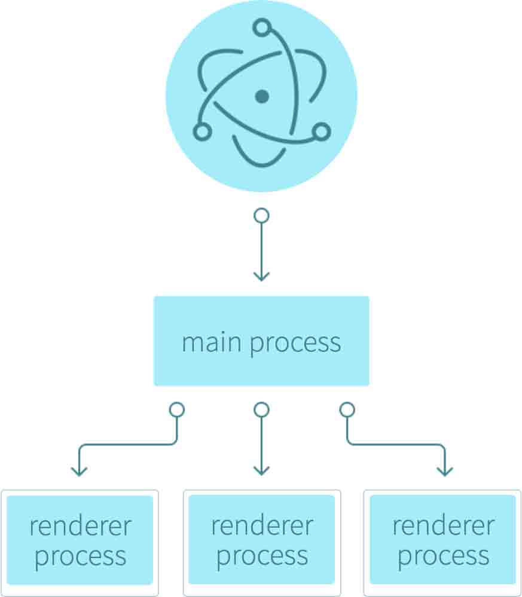

由于存在多个进程，进程之间的通讯则成为了首要问题，比如某个渲染进程所渲染的内容需要和原生 UI 进行交互，这时候便依赖进程通讯。得益于 NodeJS，Electron 提供的进程通信同样是基于消息回调机制。

而主进程通过一套可直接调用的 Electron 模块与原生 GUI 进行交互，桌面应用可以使用所有的 Node 模块，比如使用 `node-notifier` 模块来推送系统通知，`request` 模块来发起 HTTP 请求。

## 一、Hello Electron!

Hello World 已经成为编程界的鼻祖级的口号了，我们要进行的第一个问题就是安装 Electron。

首先我们在 `~/Code/` 目录下创建 `electron-learn` 目录，然后创建自己的 `package.json`：

```
npm init 
```

填写一些基本的信息：

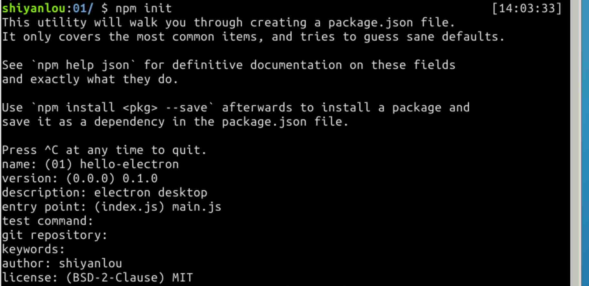

再将 `package.json` 中的 `test` 修改为 start，这样我们就可使使用 `npm start` 来运行整个项目了。

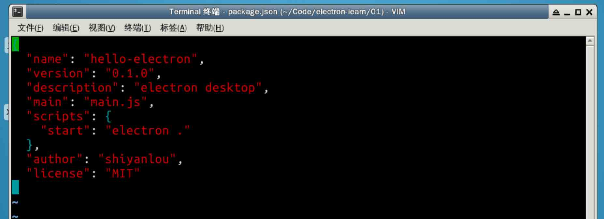

接下来就是安装 `electron` 框架：

```
npm install electron-prebuilt --save-dev 
```

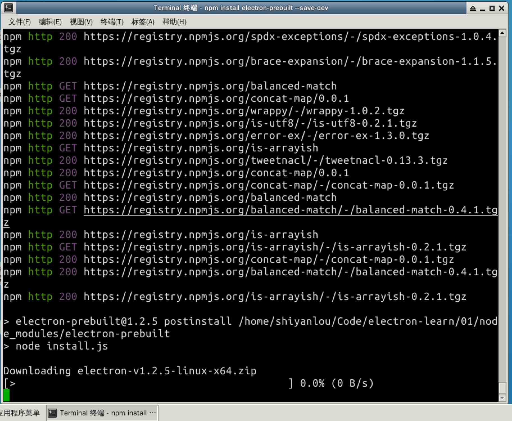

现在开始 Electron 开发所需要的一切都准备好了。

> > 如果 npm 很慢，这里有一些不可描述的原因，我们为你提供了 Electron 的 node_modules 包，你可以使用 wget 命令在下面的链接中下载： > > `> wget https://labfile.oss.aliyuncs.com/courses/563/node_modules.tar.gz > tar zxf node_nodules.tar.gz >` > 将解压出来的 `node_modules` 文件夹和 `package.json` 放置在同一路径下。 > 如果出现 `错误：没有匹配的证书主体别名`的报错，则可以通过添加 `--no-check-certificate` 解决

不过好在实验楼已经给你装好这个环境了，因此，你只需要在这个目录下创建应用的核心代码就可以了。

这时候在 `electron-learn` 目录下有一个 node_modules 和 一个 `package.json` 文件，文件的内容为：

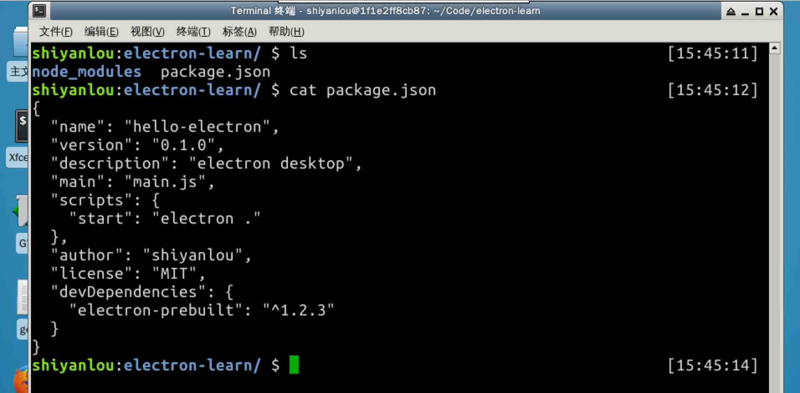

下面我们来写一些简单的代码让应用程序跑起来。

首先我们创建一个 main.html 来显示应用的主界面：

```
echo 'hello electron!' > main.html 
```

再编写 `main.js`：

```
// 启用 JavaScript 严格模式
'use strict';

// 引入 Electron 模块
let {app, BrowserWindow} = require('electron');

let mainWindow = null;

// app 会响应 Electron 的 ready 事件，
// 并执行创建窗口的回调，加载对应的 HTML 文件
app.on('ready', () => {
    mainWindow = new BrowserWindow({
        height: 600,
        width: 800
    });
    mainWindow.loadURL(`file://${__dirname}/main.html`);
}); 
```

这时候回到终端使用 `npm start` 便能跑起整个应用了。

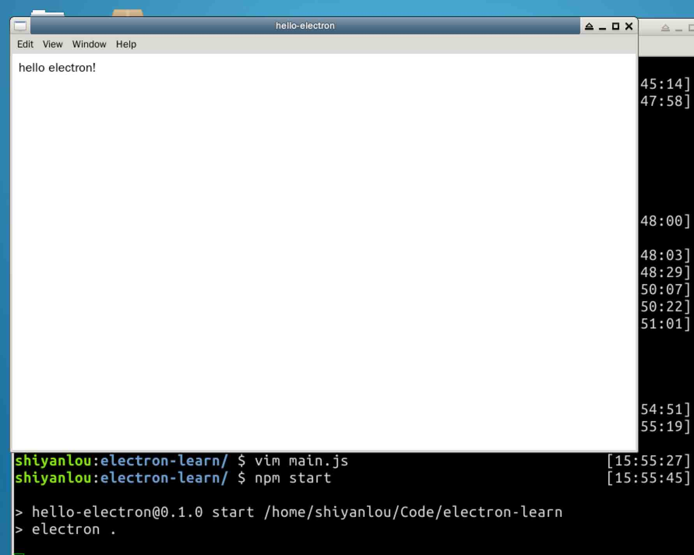

从图中可以看到，Electron 甚至还帮我们初始化好了程序的菜单栏。

## 二、创建一个完整的应用

我们已经实现了一个正常运行的 Hello Electron 应用了，现在我们来实现一个发生器应用。

典型的发生器功能包括几排按钮，点击播放生硬，这些声音大部分是卡通事的或特效式的。

我们先完成第一个功能———对点击状态作出响应的发生器。

> 由于实验楼环境中没有声卡驱动，因此我们也不能听到来自实验楼环境中的声音，这里我们将作出反应后的结果输出到终端来查看实现效果。 > > 同时，为了专注于 Electron 的使用，我们已经帮你把页面呈现的内容写好了，目前你只需要下载相关文件: > > `> wget https://labfile.oss.aliyuncs.com/courses/563/app.zip > unzip app.zip >` > > 然后再将 `app` 目录与 `package.json` 文件放置在同一目录下即可开始下面的核心业务逻辑的编写了

### 编写主线程

首先我们删除之前创建的`main.html`然后修改`main.js`文件如下：

```
'use strict';
let {app, BrowserWindow} = require('electron');

let mainWindow = null;
app.on('ready', () => {
    mainWindow = new BrowserWindow({
        height: 700,
        width: 368,
        frame: false,
        resizable: false,
    });
    mainWindow.loadURL(`file://${__dirname}/app/index.html`);
}); 
```

在这里我们修改了 mainWindow 加载的 HTML 的路径，但是最重要的修改是在创建 BrowserWindow 时传递的 JavaScript 对象多增加了两个字段：`frame` 和 `resizable`。

`frame`字段为 false 时，将不会创建窗口的边框（标题栏、菜单栏等），而 `resizable` 为 false 时，窗口将不能调整大小。

这时候我们可以运行一下程序：

```
npm start 
```

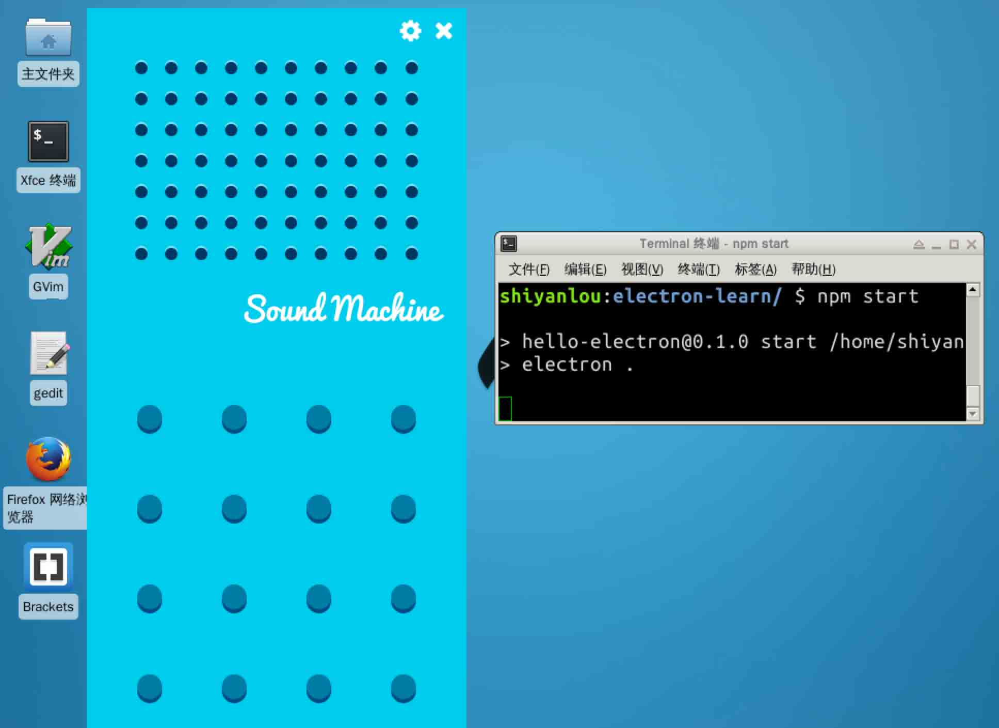

但是这时候我们完全不能关闭它——因为我们把边栏给关闭了，那么问题就来了：如何关闭它？我们等下再来考虑这个问题。

### 实现与用户交互

现在的窗口只显示了一个页面，完全没有任何与用户交互的动画，这不是体验友好的。下面我们来添加交互效果，在 `app/js/index.js` 中：

```
'use strict';

// 查询所有的按钮
let soundButtons = document.querySelectorAll('.button-sound');

// 遍历所有的按钮读取 data-sound 属性
for (let i = 0; i < soundButtons.length; i++) {
    let soundButton = soundButtons[i];
    let soundName = soundButton.attributes['data-sound'].value;
    prepareButton(soundButton, soundName);
}

// 给每个按钮添加背景图
function prepareButton(buttonEl, soundName) {
    buttonEl.querySelector('span').style.backgroundImage = `url("img/icons/${soundName}.jpg")`;

    // 添加一个事件来播放音频
    buttonEl.addEventListener('click', function () {
        console.log(`audio ${soundName}.wav played.`);
    });
} 
```

这时候我们使用 `npm start` 运行后点击按钮并没有发现任何效果，在终端里并没有增加任何输出。这是因为在 HTML 页面中的 JS 代码是运行在渲染进程中的，所以我们需要查看渲染进程的 console.log 结果。

首先我们要修改 main.js 文件中的代码，在 loadURL 代码的后面添加一句：

```
mainWindow.webContents.openDevTools(); 
```

这时候我们再运行`npm start`，就能够看到应用的右侧弹出了一个类似 Chrome 开发者工具的边栏：

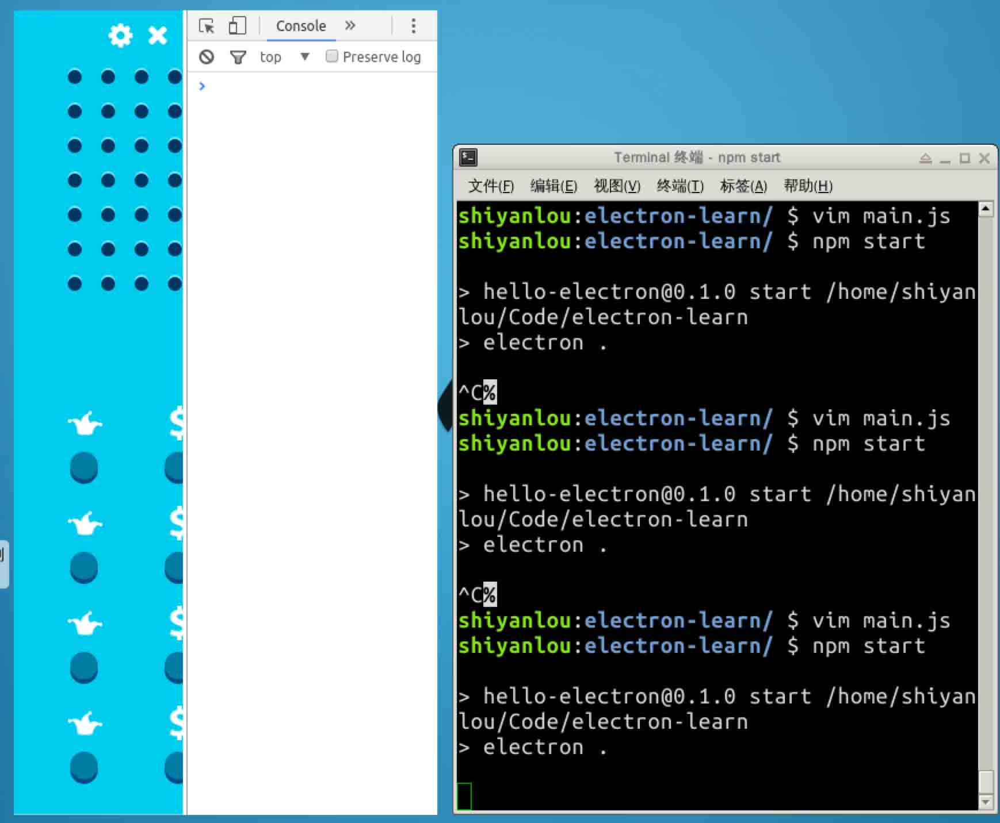

我们双击应用的界面，这时候应用全屏，右侧的开发者工具切换到 console，然后再点击几个按钮，就能够看到右侧终端的输出了：

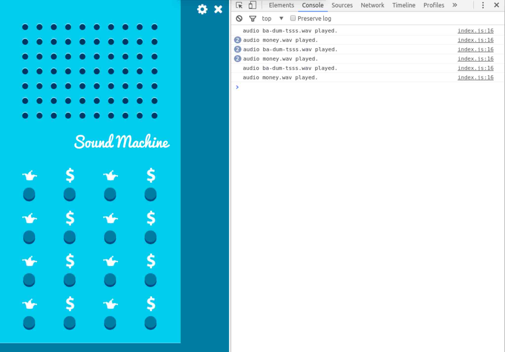

### 主进程和渲染进程之间的通信——关闭应用

Electron 官方的文档提到：

> In normal browsers, web pages usually run in a sandboxed environment and are not allowed access to native resources. Electron users, however, have the power to use Node.js APIs in web pages allowing lower level operating system interactions.

> ……

> In web pages, calling native GUI related APIs is not allowed because managing native GUI resources in web pages is very dangerous and it is easy to leak resources. If you want to perform GUI operations in a web page, the renderer process of the web page must communicate with the main process to request that the main process perform those operations.

用 Web 页面管理原生 GUI 资源是非常危险的，很容易造成内存泄露，因此如果你希望在 Web 页面执行 GUI 操作，Web 页面的渲染进程就必须要和主进程通信，请求主进程完成这些操作。

Electron 提供了 `ipcRenderer` 和 `ipcMain` 两个模块来实现这类通信机制。

当渲染进程发送消息时，订阅者订阅了这个消息后一旦受到此消息，就会做出回复。这么做的最大的好处就是个例，因为主进程无需知道哪个渲染进程发出了消息。

下面我们来实现关闭应用，其主要的应用窗口关闭的逻辑如下图所示：

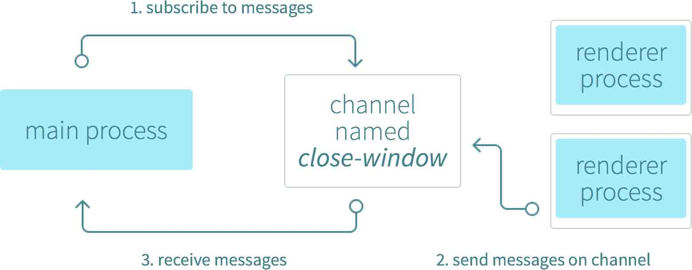

在 main.js 中代码修改如下：

```
'use strict';
let {app, BrowserWindow, ipcMain} = require('electron');

let mainWindow = null;
app.on('ready', () => {
    ……
});

ipcMain.on('close-main-window', () => {
    app.quit();
}); 
```

相应的，渲染进程于鏊发送相关消息，再编辑 `app/js/index.js` ：

```
let {ipcRenderer} = require('ipcRenderer');

let closeEl = document.querySelector('.close');
closeEl.addEventListener('click', function () {
    ipcRenderer.send('close-main-window');
}); 
```

### 监听键盘全局事件

现在我们来思考这个应用本身，我们很容易发现应用窗口需要手动点击（即应用进程必须处于运行状态）才能使用，那这并没有什么用，我们需要实现一套快捷键保证发声器能够快捷执行。

Electron 提供了一个全局快捷键模块，它允许你监听自定义的键盘组合并作出反应。键盘组合快捷键模块被包含在 Accelerator，由一系列键盘点击组成的字符串组成（如 Ctrl+Shift+1 ）。

首先，这个全局快捷键本质上是一个原生的 GUI 事件，在捕获后应用窗口需要作出反应，则依然是主线程和渲染线程之间的通信，我们仍然需要 ipcMain 和 ipcRenderer 之间进行配合。我们有两件事情需要考虑：

1.  全局快捷键应该在 `ready` 事件被出发后被注册（在 ready 代码块中）
2.  当 ipcMain 从主进程发送消息到渲染进程的时候，你要引用到那个窗口）（例如 createWindow.webContent.send('channel')）

下面我们再来修改 main.js：

```
var {app, BrowserWindow, ipcMain, globalShortcut} = require('electron');

app.on('ready', () => {
    ...

    // 注册快捷键，响应 ctrl+shift+1 组合
    globalShortcut.register('ctrl+shift+1', () => {
        mainWindow.webContents.send('global-shortcut', 0);
    });
    // 注册快捷键，响应 ctrl+shift+2 组合
    globalShortcut.register('ctrl+shift+2', () => {
        mainWindow.webContents.send('global-shortcut', 1);
    });
}); 
```

在上面的代码中，两组快捷键都会触发一个 `global-shortcut` 的带参数消息。我们在渲染进程中还需要接收这个消息，下面修改 `app/js/index.js`：

```
ipcRenderer.on('global-shortcut', (arg) => {
    console.log('shortcut clicked');
}); 
```

这时，我们再重新执行，狂按快捷键，便能看到 console.log 的输出结果了。

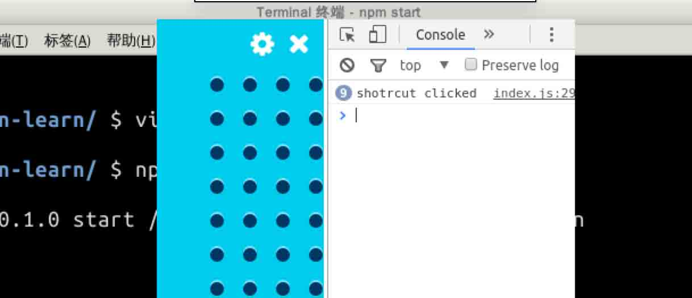

## 四、总结

经过本次实验，我们初步了解了 Electron 构建应用的一些基本的逻辑，了解了 Electron 在构建应用时候的主进程(ipcMain)和渲染进程(ipcRenderer)。

同时学习了利用主进程之间的通信 `.send()` 方法来实现键盘快捷键。

Electron 是一个非常强大的构建跨平台应用的框架，我们在这里学习了一些非常基本的概念和方法，要深入开发一款完整的应用，还需要配合大量的 Web 前端知识。由于 Electron 配备了完整的浏览器环境和 Node.js 环境，所以我们能够使用诸如 React/AngularJS 之类的大型前端框架，构建更加易用的应用。

除此之外，Electron 提供的接口也非常之多，所以还需要对 Electron 的文档进行深入的阅读，例如 Electron 提供了以下常用的接口：

1.  自动更新；
2.  原生 UI 的提示框；
3.  原生 UI 的菜单；
4.  应用启动的协议；
5.  剪切板

等等……想知道更多，就阅读下面的链接吧。

## 进一步阅读的参考

1.  [Electron API 参考](http://electron.atom.io/docs/) 要深入 Electorn 框架，官方提供的 API 文档自然少不了，Electron 提供的功能还很多。
2.  [Electron API Demo](https://github.com/electron/electron-api-demos)

## # 使用 Electron 编写跨平台桌面应用 - 应用的打包和发布

## 一、概述

### 课程来源

本课程主要设计参考自[这里](https://medium.com/developers-writing/building-a-desktop-application-with-electron-204203eeb658#.anr4vzihf)。

本课程的内容在原文档基础上做较多修改，使用了最新的 Electron 框架进行实现。

### 实验所需的前置知识

*   HTML/CSS/JS 基本知识
*   Node.js+CommonJS(可选)

### 实验知识点

*   Electron 应用的打包和发布
*   electron-packager 的基本使用

## 一、将应用打包

如果我们编写的应用不能给别人使用，那写出来的应用有什么意义？

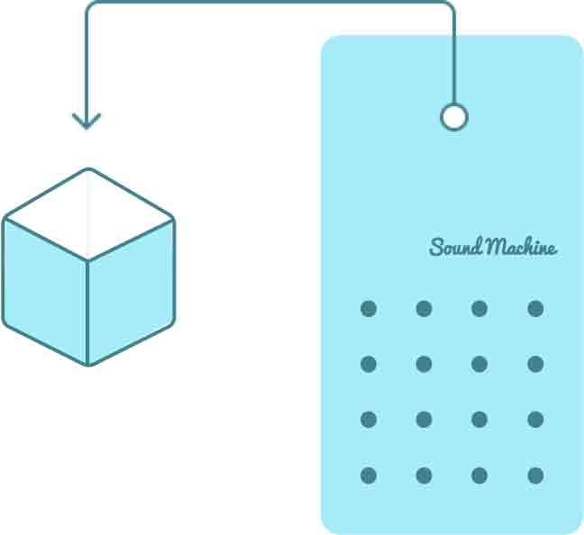

Electron 提供了一个 `electron-packager` 的工具包，方便用于完成编码之后的应用打包，最终生成要发布的平台的安装包。

它可以作为 CLI 应用或构建过程的一部分，Electron 的构建可以很复杂，我们先来考虑最简单的情况。 `electron-packager` 的打包命令为：

```
electron-packager <项目路径> <项目名> <打包平台> <平台架构> <electron 版本> <其他选项> 
```

我们现在项目中安装这个 package：

```
npm install electron-packager --save-dev 
```

> 还是那个不可描述的原因，很可能安装起来会非常的慢，解决方法是： > > `> wget https://labfile.oss.aliyuncs.com/courses/563/electron-packager.tar.gz > tar zxf electron-packager.tar.gz >` > > 然后把解压出来的文件夹放置到 `node_modules` 文件夹内，创建一个 electron-packager 的链接到 node_modules/.bin/目录下： > > `> ln -s ../electron-packager/cli.js electron-packager >` >

现在我们来打包编写的应用。我们把下面的命令写到 `package.json` 中：

```
electron-packager . SoundMachine --platform=linux --arch=x64 --overwrite --out=./dist --icon=app/img/app-icon.icns 
```

并且在 `"devDepencencies"` 中添加 `electron-packager`：

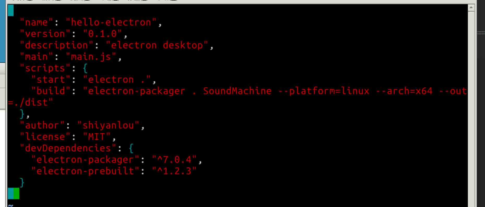

命令的选项理解起来都比较简单。--platform 给出了要构建的平台，我们可以选择 linux, win32, darwin 三个选项，而 --arch 则有 x64 和 ia32 两个选项。

> darwin 指的是 macOS

此外，为了获得精美的图标，你首先要找一款类似这个软件可以把 PNG 文件转换到这些格式的工具，把它转换成.icns 格式（Mac 用）或者.ico 格式（Window 用）。如果在非 Windows 系统给 Windows 平台的应用打包，你需要安装 wine（Mac 用户用 brew，Linux 用户用 apt-get）。

那么，接下来我们可以开始构建了：

```
npm run build 
```

> 如果你看到有这样的报错： > > `SyntaxError: Use of const in strict mode.` > > 这是因为实验楼中的 nodejs 版本尚不支持 ES6 的全部相关语法，我们需要更新 nodejs 版本： > > `> sudo apt-get update > sudo apt-get upgrade >`

这时候，我们静静的等待应用打包完成就可以了。

打包完成后，我们能够在 `./dist` 中看到打包好的应用，打包好的应用普遍有 100M+ 这是跨平台造成的代价，因为 Electron 不仅仅集成了整个 Web 浏览器的环境，同时还将完整的 NodeJS 打包了进去，所以才有这么大的体积。好在如果我们将整个打包后的结果压缩，能够将体积控制在 50M 以内，算是比较满意的结果了。

如果你想要更进一步，可以尝试 `electron-builder`，它用 electron-packager 生成的打包好的文件，可以生成自动安装包。

## 三、深入 Electron

在这些实验里，我们只接触到了 Electron 比较浅显知识。实际上，实现如查看主机电源选项或在界面上显示多种信息都很简单。这些功能已经内建好，请查阅 [Electronde API 文档](http://electron.atom.io/docs/)。

Electron 的 API 文档只是 Electron 在 Github 上资料库的一小部分，其他文件夹也值得一看。

Sindre Sorhus 正在维护 [Awesome Electron](https://github.com/sindresorhus/awesome-electron)，你可以在列表中找到很多很酷的项目，也有 Electron 应用构架方面很好的总结，可以学习之后重构我们的代码。

现在你可以使用你的 Web 前端知识创建更复杂的应用了。在本实验中，我们没有选择用更多函数库和构建工具，只强调了 Electron 重要的一些概念，如主进程和渲染进程、他们之间的通信、应用的打包等等。你也可以用 ES6 或 Typescript 来写你的应用，使用 Angular 或 React 框架，用 gulp 或 Grunt 来简化你的构建过程。

## 进一步阅读的参考

1.  [Electron API 参考](http://electron.atom.io/docs/)
2.  [Electron 官方 API Demo 程序](https://github.com/electron/electron-api-demos)
3.  [Awesome Electron](https://github.com/sindresorhus/awesome-electron)