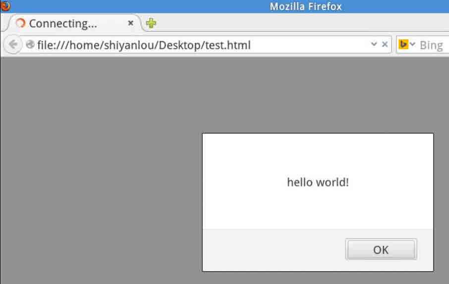

# 第 1 节 JavaScript 简介

## 实验简介

本节实验主要是对一些基本概念的介绍，JavaScript 是什么，有什么用处。

以 “hello world!”为例，编写第一个 JavaScript 程序。

将 JavaScript 代码放在不同位置，及其区别。

> 在学习 JavaScript 之前，建议先学习 HTML 基础知识——[HTML 基础入门](https://www.shiyanlou.com/courses/19) 。

## 实验说明

### 1\. 环境登录

无需密码自动登录，系统用户名 shiyanlou

### 2\. 环境介绍

本实验环境采用 Ubuntu Linux 桌面环境，实验中会用到桌面上的程序：

1.命令行终端: Linux 命令行终端，打开后会进入 Bash 环境，可以使用 Linux 命令

2.Firefox 及 Opera：浏览器，可以用在需要前端界面的课程里，只需要打开环境里写的 HTML/JS 页面即可

3.gvim：非常好用的 Vim 编辑器，最简单的用法可以参考课程[Vim 编辑器](http://www.shiyanlou.com/courses/2)

4.gedit 及 Brackets：如果您对 gvim 的使用不熟悉，可以用这两个作为代码编辑器，其中 Brackets 非常适用于前端代码开发

### 3\. 环境使用

使用编辑器输入实验所需的代码及文件，使用命令行终端运行所需命令进行操作。

完成实验后可以点击“截图”保存并分享实验结果到微博，向好友展示自己的学习进度。实验楼提供后台系统截图，可以真实有效证明您已经完成了实验。

实验记录可以在“我的主页”中查看，每次实验的截图及笔记，以及有效学习时间（指的是在实验桌面内操作的时间，如果没有操作，系统会记录为发呆时间）。这些都是您在实验楼学习的真实性证明。

## 一、JavaScript 是什么？

### 1\. JavaScript 特点

JavaScript 是一种脚本语言，它的解释器被称为 JavaScript 引擎。JavaScript 被发明用于在 HTML 网页上使用，给 HTML 网页增加动态功能。

由于 JavaScript 简单易用，在现在世界上大多数网页中都能找到 JavaScript 代码，也是这个原因，现在所有的主流浏览器包含 JavaScript 引擎。

JavaScript 可以让网页呈现各种特殊效果，为用户提供良好的互动体验，对于一个互联网开发者来说，如果你想提供漂亮的网页、令用户满意的上网体验、各种基于浏览器的便捷功能、前后端之间紧密高效的联系，JavaScript 是必不可少的工具。

此外，近年来 JavaScript 的使用范围，慢慢超越了浏览器，正在向通用的系统语言发展，你一定听说过“Node.js”、“JSON”等关键词。

### 2\. 简单易学

JavaScript 的语法和 C/C++、Java 等大家都了解的语言很类似，如果学过这些语言，JavaScript 的入门会非常容易。

还有一点，JavaScript 的学习环境十分简单，无处不在，只需要浏览器（FireFox、Chrome，甚至是 IE）和文本编辑器，不需要另外安装配置编译器、解释器、IDE 等。

> 在学习 JavaScript 之前，建议先学习 HTML 基础知识——[HTML 基础入门](https://www.shiyanlou.com/courses/19) 。

## 二、第一个 JavaScript 程序

在学习一门新语言的时候，大家都喜欢用“hello world”作为第一个程序，那么现在我们写一个 JavaScript 版本的：

```
<html>
<head></head>
<body>

<script>
alert("hello world!");
</script>

</body>
</html> 
```

JavaScript 代码放在 `<script>……</script>` 标签里，这段代码的效果是，弹出一个小框，显示“hello world!”。

在实验楼环境中，把这段代码保存为一个 HTML 文件，命名为“test.html”，然后双击文件，系统会调用 FireFox 浏览器打开它：



可见编写 JavaScript 程序是十分方便的。

## 三、JavaScript 放在哪里？

刚才我们编写了第一个 JavaScript 程序，强调过 JavaScript 代码必须放置在 `<script>……</script>` 标签里。

我们把包含代码的 `<script>……</script>` 标签放在了 `<body>……</body>` 标签里。其实不止可以这样做，我们还有另外两种方式在 HTML 中使用 JavaScript 。

### head 中的 JavaScript

我们除了可以把包含代码的 `<script>` 标签放在 `<body>……</body>` 标签里，还可以把它放在 `<head>……</head>` 标签里，比如这样：

```
<html>

<head>
<h1> JavaScript in head. </h1>

<script>
alert("hello word!");
</script>

</head>

<body></body>
</html> 
```

这个程序的执行结果和刚才的没什么不同，但其实把 JavaScript 代码放在 `<head></head>` 和放在 `<body></body>` 里是有区别的：

简单地说，放在 `<head></head>` 里的会比放在 `<body></body>` 先执行。head 标签里的代码会在页面还未开始绘制之前被解析，而在 body 里的代码则会在页面渲染的同时在读取到这段代码的时候才被执行。

### 外部的 JavaScript

除了直接把 JavaScript 代码写在 HTML 里，我们还可以把 JavaScript 的代码写在一个 js 文件中，在 HTML 里调用这个 js 文件。我们还是以“hello world”举例。

在实验楼环境中，把以下代码保存并命名为“out.js”，放在桌面上：

```
alert("hello word!"); 
```

把以下代码保存并命名为“test2.html”，放在桌面：

```
<html>
<head>
<h1> my JavaScript code in "out.js" </h1>
</head>

<body>

<script src="out.js"></script>

</body>

</html> 
```

同样，双击桌面上的“test2.html”文件，调用浏览器运行，你会发现运行效果和前两个程序也没什么区别。

其实，前两种方式都是直接把 JavaScript 代码放在 HTML 中，在页面加载的同时，那些 JavaScript 的代码就被解析了。而把 JavaScript 代码放在外部文件中，只有在事件被触发，需要该段 JavaScript 代码时，才调用执行。

这样做有个好处，当页面比较复杂的时候，把大量的 JavaScript 代码放到外部文件，只有在需要的时候才执行，那么会明显地加快页面加载速度。

## 作业

在一个 HTML 文件中，不同位置加入不同的 JavaScript 代码，运行观察不同位置的 JavaScript 代码执行的顺序。

参考如下，观察弹框顺序：

```
<html>

<head>
<script>
alert("in head");
</script>
</head>

<body>
<script>
alert("in body");
</script>
</body>

</html> 
```