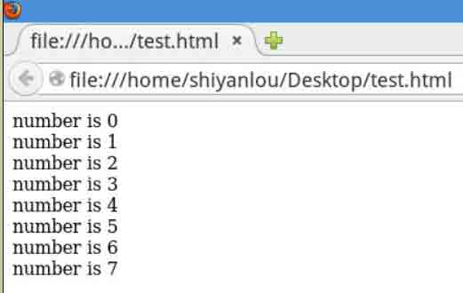

# 第 3 节 JavaScript 基本语法（下）

## 实验简介

继续介绍 JavaScript 的基本语法，本节内容包括 if/else、for、while 等循环、控制语句，以及函数的使用。

## 一、JavaScript 语句

### 1\. if/else 语句

JavaScript 中的 if/else 判断选择，你会发现，就像 C 语言。语法格式是这样的：

```js
if (条件 1)
  {
  当条件 1 为 true 时执行的代码;
  }
else if (条件 2)
  {
  当条件 2 为 true 时执行的代码;
  }
else
  {
  当条件 1 和 条件 2 都不为 true 时执行的代码;
  } 
```

### 2\. switch/case 语句

在做大量的选择判断的时候，如果依然使用 if/else 结构，那么代码有可能会变得很凌乱，于是我们采用 switch/case 结构：

```js
switch(k)
{
case k1:
  执行代码块 1 ;
  break;

case k2:
  执行代码块 2 ;
  break;

default:
  默认执行（k 值没有在 case 中找到匹配时）;
} 
```

### 3\. for 循环

for 循环是程序员进场经常用到的工具，在 JavaScript 中，for 循环的语法也十分类似 C 语言，格式是这样的：

```js
for(变量 = 初始值 ; 循环条件 ; 变量累加方法)
{
循环语句;
} 
```

举例说明更清楚，比如循环打印出 0～7 的数字：

```js
<html>
<head>
</head>

<body>
<script>
for(var i=0;i<8;i++)
{
document.write("number is "+i+"<br>");
}
</script>
</body>

</html> 
```

在浏览器中的效果：



### 4\. while 循环

区别于 for 循环的另一种循环方式：

```js
while (条件)
  {
  需要执行的代码;
  } 
```

此外，while 循环还有一种变体，称作 do/while 循环：

```js
do
  {
  需要执行的代码;
  }
while (条件); 
```

而这两者的区别是，do/while 循环在检测条件之前就会执行，也就是说，即使条件为 false，do/while 也会执行一次循环代码。

### 5\. break 和 continue 语句

有时候在循环体内，需要立即跳出循环或跳过循环体内其余代码而进行下一次循环，这便是 break 和 continue 的作用。

*   break 本语句放在循环体内，作用是立即跳出循环。

*   continue 本语句放在循环体内，作用是中止本次循环，并执行下一次循环。如果循环的条件已经不符合，就跳出循环。

比如：

```js
for (i = 1; i < 10; i++)
{
  if (i == 5 || i == 6) continue;
  if (i == 8) break;
  document.write(i);
} 
```

输出为“12347”，便是跳过了 5 和 6，然后在 i==8 的时候跳出了循环。

## 二、JavaScript 函数

在进行一个复杂的程序设计时，需要根据所要完成的功能，将程序划分为一些相对独立的部分，每部分编写一个“函数”。从而，使各部分充分独立，任务单一，程序清晰，易懂、易读、易维护。

JavaScript 的函数可以封装那些在程序中可能要多次用到的模块，并可作为 **事件驱动** 的结果而调用的程序，从而实现一个函数把它与事件驱动相关联，这是与其它语言不同的地方。

在 JavaScript 中，函数由关键词 function 定义，函数可以有多个参数。基本格式为：

```js
function 函数名 (参数 1，参数 2)
{
  函数体;

  return 返回值;
} 
```

调用（使用）函数时，传入对应的参数，执行 **函数体** 中如 if/else，switch/case，for，while 等各种语句，可以实现各种复杂的功能。

## 作业

#### 1.在“3\. for 循环”介绍时，有一处 for 循环代码，用于打印 0～7 的数字，现在将代码改为 while 循环。

#### 2.函数的重复声明：如果多次采用 function 命令重复声明同一个函数，则后面的声明会覆盖前面的声明，比如以下代码：

```js
<script>
function my_func(){
document.write(1);
}

my_func()

document.write("<br>");

function my_func(){
  document.write(2);
}

my_func()
</script> 
```

两次声明了同一个函数 my_func，观察运行结果，并思考。