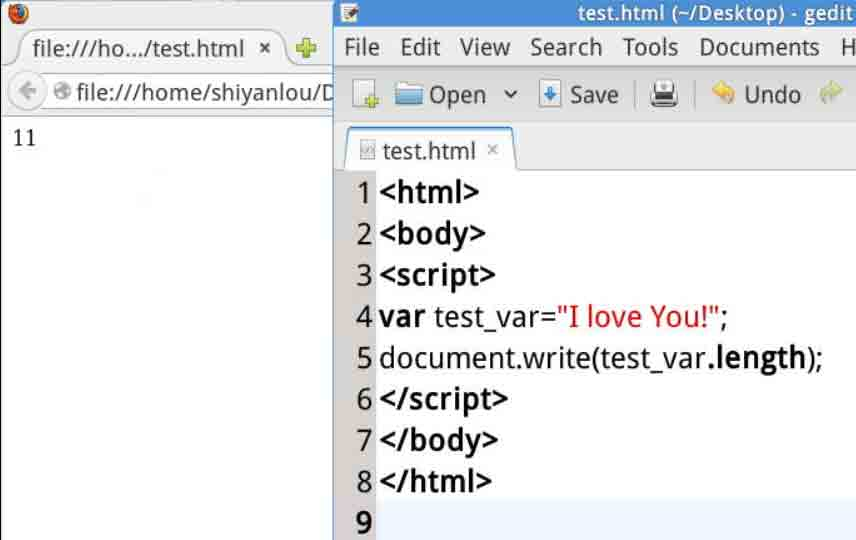

# 第 5 节 对象

## 实验简介

上一节实验说过，JavaScript 是一门基于对象的语言，现在我们对 JavaScript 的基于对象概念，做详细的介绍。

## 一、什么是对象

JavaScript 的所有数据都可以被视为对象，而每个对象都有其 **属性**（properties）和 **方法**（methods）。

对象的 **属性** 是反映该对象某些特定的性质的，例如：字符串的长度、图像的长宽、文字框（Textbox）里的文字等；

对象的 **方法** 能对该对象做一些事情，例如，表单的“提交”(Submit)，窗口的“滚动”（Scrolling）等。

比如当申请一个变量的时候：

```js
var my_var="shiyanlou"; 
```

其实也就是创建了一个 **字符串对象** ，这个对象拥有内建的属性 my_var.length = 9

同时，这个字符串对象还有数个内建的方法，比如 my_var.toUpperCase() 方法可以将字符转为大写；my_var.charAt(n) 方法可以返回第 n 个字符。

## 二、创建对象

JavaScript 提供了一些常用的内置对象（稍后介绍），但是有些情况下我们需要自定义地创建对象，以达到特殊的、丰富的功能。

比如我们创建一个“student”对象，并为其指定几个 **属性** 和 **方法**：

```js
student = new Object();  // 创建对象“student”

student.name = "Tom";   // 对象属性 名字
student.age  = "19";    // 对象属性 年龄

student.study =function() {   // 对象方法 学习
    alert("studying");
};

student.eat =function() {     // 对象方法 吃
    alert("eating");
}; 
```

此外，你也可以这样创建对象：

```js
var student = {};
student.name = "Tom";
…… 
```

或者这样：

```js
var student = {
    name:"Tom";
     age:"19";
    ……
} 
```

但是以上方法在创建多个对象时，会产生大量重复代码，所以我们也可以采用函数的方式新建对象：

```js
function student(name,age) {

    this.name = name;
    this.age = age;

    this.study = function() {
        alert("studying");
    };

    this.eat = function() {
        alert("eating");
    }
} 
```

然后通过 new 创建 student 对象的实例：

```js
var student1 = new student('Tom','19');

var student2 = new student('Jack','20'); 
```

## 三、访问对象的属性和方法

对象的存在意义，就是为了方便地操作数据，我们可以很容易地访问对象的属性或调用对象的方法，通过符号“.”。

比如我们刚才新建的 student1 对象，可以这样使用：

```js
<script>
var x = student1.name;  // 访问对象的属性
var y = student1.age;

document.write(x);
document.write(y);

student1.study();     // 调用对象的方法
</script> 
```


当我们需要 **反复访问** 某对象的时候，可以使用 with 语句简化操作，而不需要反复地用“.”符号，比如：

```js
with(student1) {
var x = name;
var y= age;
study();
eat();
} 
```

## 四、常用内置对象

JavaScript 为我们提供了一些非常有用的常用内置对象，这样我们就不用每次自己编代码来实现一些常用功能。

现在我们举例介绍 String、Math、Array 三中常用对象及其属性和方法。

### 1\. String 字符串对象

本节实验一开始就举例介绍过 String 对象，每当创建一个字符串变量的时候，也就相当于创建了一个 String 对象。

#### (1)String 的属性

该对象只有一个属性，即 length，表示字符串中的字符个数，包括所有的空格和符号：

```js
var test_var = "I love You!";
document.write(test_var.length); 
```

显示结果是“11”因为字符串长度将符号和空格也计算在内：



#### (2)String 的方法

String 对象共有 19 个内置方法，主要包括字符串在页面中的显示、字体大小、字体颜色、字符的搜索以及字符的大小写转换等功能，下面是一些常用的：

*   charAt(n) ：返回该字符串第 n 位的单个字符。（从 0 开始计数）

*   charCodeAt(n) ：返回该字符串第 n 位的单个字符的 ASCII 码。

*   indexOf() ：用法：string_1.indexOf(string_2,n); 从字符串 string_1 的第 n 位开始搜索，查找 string_2，返回查找到的位置，如果未找到，则返回 -1，其中 n 可以不填，默认从第 0 位开始查找。

*   lastIndexOf() ：跟 indexOf() 相似，不过是从后边开始找。

*   split('分隔符') ：将字符串按照指定的分隔符分离开，返回一个数组，例如：'1&2&345&678'.split('&')；返回数组：1,2,345,678。

*   substring(n,m) ：返回原字符串从 n 位置到 m 位置的子串。

*   substr(n,x) ：返回原字符串从 n 位置开始，长度为 x 的子串。

*   toLowerCase() ：返回把原字符串所有大写字母都变成小写的字符串。

*   toUpperCase() ：返回把原字符串所有小写字母都变成大写的字符串。

### 2\. Math 对象

“数学”对象，提供对数据的数学计算。

#### (1)Math 的属性

Math 的几个属性，是数学上几个常用的值：

*   E ：返回常数 e (2.718281828...)。

*   LN2 ：返回 2 的自然对数 (ln 2)。

*   LN10 ：返回 10 的自然对数 (ln 10)。

*   LOG2E ：返回以 2 为低的 e 的对数 (log2e)。

*   LOG10E ：返回以 10 为低的 e 的对数 (log10e)。

*   PI ：返回π（3.1415926535...)。

*   SQRT1_2 ：返回 1/2 的平方根。

*   SQRT2 ：返回 2 的平方根。

#### (2)Math 的方法

Math 的内置方法，是一些数学上常用的数学运算：

*   abs(x) ：返回 x 的绝对值。
*   round(x) ：返回 x 四舍五入后的值。
*   sqrt(x) ：返回 x 的平方根。

* * *

*   ceil(x) ：返回大于等于 x 的最小整数。
*   floor(x) ：返回小于等于 x 的最大整数。

* * *

*   sin(x) ：返回 x 的正弦。
*   cos(x) ：返回 x 的余弦。
*   tan(x) ：返回 x 的正切。
*   acos(x) ：返回 x 的反余弦值（余弦值等于 x 的角度），用弧度表示。
*   asin(x) ：返回 x 的反正弦值。
*   atan(x) ：返回 x 的反正切值。

* * *

*   exp(x) ：返回 e 的 x 次幂 (e^x)。
*   pow(n, m) ：返回 n 的 m 次幂 (nm)。
*   log(x) ：返回 x 的自然对数 (ln x)。

* * *

*   max(a, b) ：返回 a, b 中较大的数。
*   min(a, b) ：返回 a, b 中较小的数。
*   random() ：返回大于 0 小于 1 的一个随机数。

### 3\. Array 数组对象

数组对象是对象的集合，里边的对象可以是不同类型的。数组的每一个成员对象都有一个“下标”，用来表示它在数组中的位置（从 0 开始计数）。

数组下标表示方法是用方括号括起来，比如：

```js
myArray[2]="hello" 
```

> 注意：JavaScript 只有一维数组，要使用多维数组，请用这种虚拟法：

```js
var myArray = new Array(new Array(), new Array(), new Array(), ...); 
```

其实这是一个一维数组，里边的每一个元素又是一个数组。调用这个“二维数组”的元素时：

```js
myArray[2][3] = ...; 
```

#### (1)Array 的属性

length ：返回数组的长度，即数组里有多少个元素。它等于数组里最后一个元素的下标加一。

因此，想添加一个元素，只需要：

`` myArray[myArray.length] = ...; ```

#### (2)Array 的方法

*   join("指定分隔符") ：返回一个字符串，把数组元素串起来，元素间用指定分隔符隔开。

*   toString() ：把数组转为字符串，并返回结果。

*   reverse() ：使数组元素倒序。

*   slice(n,m) ：返回子数组，从数组第 n 个元素到第 m 个元素。

*   sort(SortFunction) ：按照指定的 SortFunction 将数组的元素排序。

*   concat(Array_1,Array_2) ：用于连接两个或多个数组。

## 作业

创建一个名为“car”的对象，表示汽车，根据生活经验为这个对象添加 **尽可能完善的** 属性和方法。