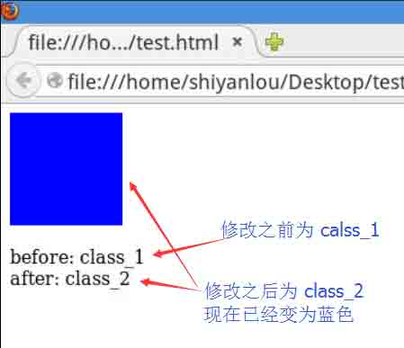

# 第 6 节 DOM

## 实验简介

本节 JavaScript 的 DOM 操作，内容主要包括：

*   通过 ID、名字、标签名 选取元素；

*   通过 getAttribute 和 setAttribute 获取和设置元素属性；

*   通过 parentNode 获取父元素、createElement 动态地创建节点、appendChild 和 removeChild 动态地添加或者删除节点。

## 一、基本概念

### 1\. 什么是 DOM

DOM 是 **文档对象模型**（Document Object Model）的简称，它的基本思想是把结构化文档（比如 HTML 和 XML）解析成一系列的节点，再由这些节点组成一个树状结构（DOM Tree）。所有的节点和最终的树状结构，都有规范的对外接口，以达到使用编程语言操作文档的目的，所以，DOM 可以理解成文档（HTML 文档、XML 文档）的编程接口。

严格地说，DOM 不属于 JavaScript，但是操作 DOM 是 JavaScript 最常见的任务，而 JavaScript 也是最常用于 DOM 操作的语言，本章介绍的就是 JavaScript 对 DOM 标准的实现和用法。

### 2\. 节点

DOM 的最小组成单位叫做 **节点**（node），一个文档的树形结构（DOM 树），就是由各种不同类型的节点组成。

对于 HTML 文档，节点主要有以下六种类型：

```js
节点|名称|含义
----|----|----
Document | 文档节点 | 整个文档（window.document）
DocumentType | 文档类型节点 | 文档的类型
Element | 元素节点 | HTML 元素（比如<head>、<body>等）
Attribute | 属性节点| HTML 元素的属性（比如 class="right"）
Text | 文本节点 | HTML 文档中出现的文本
DocumentFragment | 文档碎片节点 | 文档的片段
```

## 二、选取文档元素

### 1\. 通过 ID 选取元素

我们可以使用方法 getElementByID() 通过元素的 ID 而选取元素，并对其做操作，比如：

```js
<html>
<body>
<div id="my_div"></div>

<script>
    document.getElementById("my_div").style.height="100px";  // 设置 my_div 高度为 100px
    document.getElementById("my_div").style.background="red"; // 设置 my_div 颜色为 红色
</script>

</body>
</html> 
```

通过 getElementByID() 设置了 ID 为 my_div 的一个 div 标签的高度（100px）和颜色（red），效果：


### 2\. 通过名字（Name）或标签名（TagName）选取元素

除了通过 ID 选择元素，我们还可以使用 getElementByName() 方法或者 getElementsByTagName() 方法找到元素，不过如果有多个同类型标签，那我们需要以下标来确认：

```js
<html>
<body>
<input type="text" />
<input type="text" />

<script>
document.getElementsByTagName("input")[0].value="hello";   // 下标为 [0] 表示选取第 1 个 input 标签
document.getElementsByTagName("input")[1].value="shiyanlou"; // 下标为 [1] 表示选取第 2 个 input 标签
</script>

</body>
</html> 
```

效果如图：


## 三、节点、属性操作和文档遍历

### 1\. 查询和设置元素的属性

可以通过 getAttribute() 和 setAttribute() 查询和设置元素的属性：

```js
<html>
<head>
<style>
.class_1 {
    height:100px;
    width:100px;
    background:red;
}
.class_2 {
    height:100px;
    width:100px;
    background:blue;
}
</style>
</head>

<body>
<div id="div_1" class="class_1"></div>
<br/>
<a>before:</a>

<script>
document.write(document.getElementById("div_1").getAttribute("class")); // 查询 div_1 的属性
</script>

<br/>
<a>after:</a>

<script>
document.getElementById("div_1").setAttribute("class","class_2");  // 修改 div_1 的属性为 class_2
document.write(document.getElementById("div_1").getAttribute("class")); // 再次查询 div_1 的属性
</script>

</body>
</html> 
```

代码可见，一开始 div_1 的属性为 class_1，我们通过 getAttribute() 方法可以查看到该结果；

然后我们使用 setAttribute() 方法将 div_1 的属性设置为 class_2 ，然后再次使用 getAttribute() 方法查询，可见属性已经变为 class_2 ，结果如图：



### 父节点

通过 parentNode() 方法可以查看并操作一个节点的父节点，示例：找到 id 为 demo 的元素的父节点，并输出其 class 的名称：

```js
<html>
<body>
<div class="demo-parent">
    <div id="demo">        
    </div>
</div>

<script>
    document.write(document.getElementById("demo").parentNode.getAttribute("class"));
</script>
</body>
</html> 
```

### 创建和插入节点

在了解 JavaScript 之前，可能会以为一个 HTML 页面被写出来是什么样，那它就固定了是什么样子。

但是 JavaScript 可以动态地在页面中创建并插入节点，这便需要用到 createElement()、appendChild() 方法，它们的作用分别是创建节点和插入节点。

比如：创建一个 div 并为其设置高度（100px）和背景色（red），并追加到 body 后面：

```js
<html>
<body>
<div style="background:#00F; height:100px"></div>
<script>
    var mydiv = document.createElement("div");
    mydiv.style.height = "100px";
    mydiv.style.background = "red";
    document.getElementsByTagName("body")[0].appendChild(mydiv);
</script>
</body>
</html> 
```

### 删除节点

除了创建，我们还可以删除一个节点，通过 removeChild() 方法：

```js
<html>
<head>
<body>
<div>
    <div id="div_red" style="background:#F00; height:100px"></div>
    <div id="div_blue" style="background:#00F; height:100px"></div>
</div>
<script>
function remove_red(){
    var obj = document.getElementById("div_red");
    obj.parentNode.removeChild(obj);
    }
</script>
<button onclick="remove_red()">remove red div</button>
</body>
</html> 
```

点击按钮 “remove red div” 便可以删去页面上红色的部分：


## 作业

参考“删除节点”的方式，在一个页面内实现：

通过按钮改变页面颜色，通过按钮创建和插入节点等本节实验中的功能。