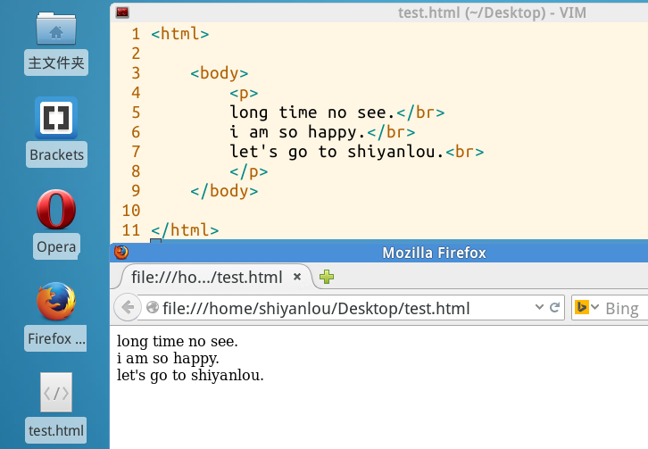
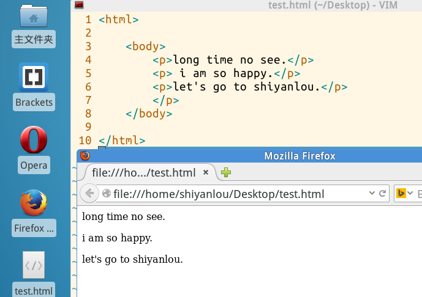
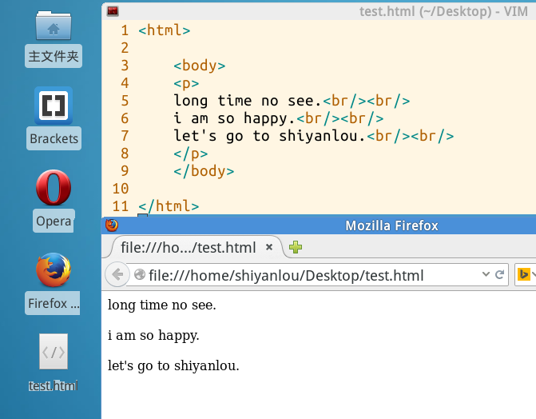
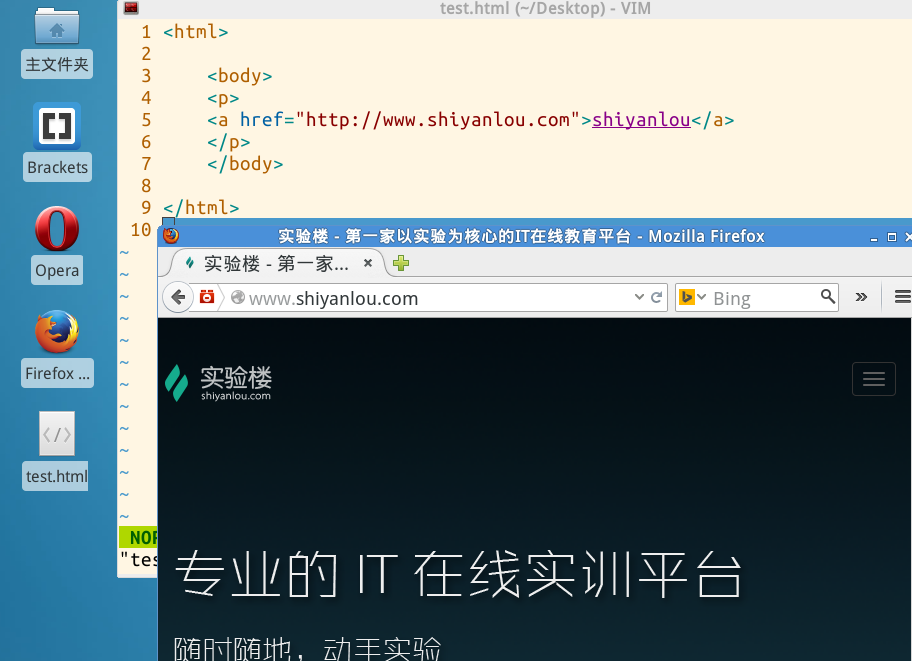
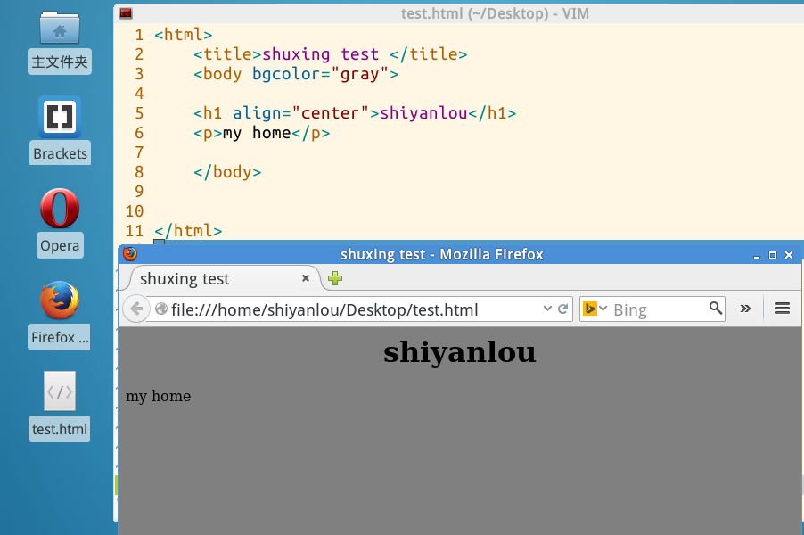
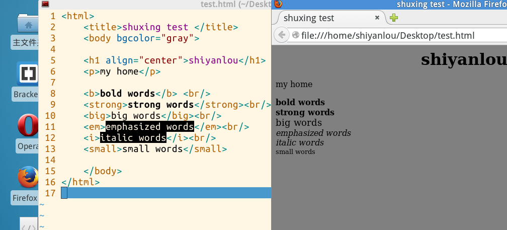
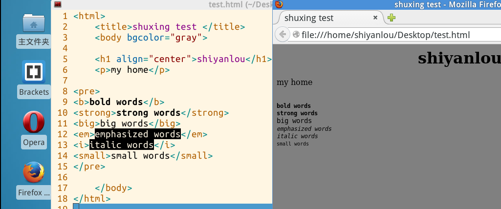
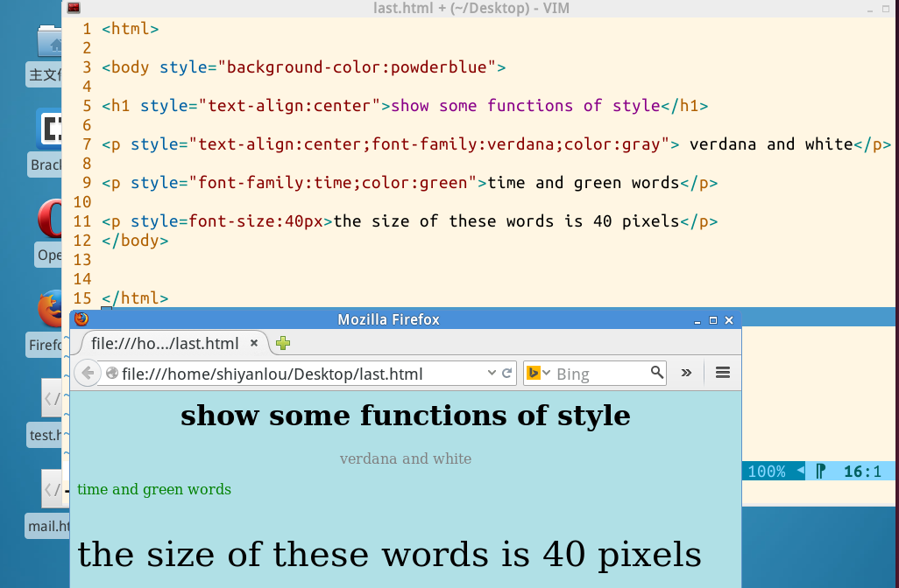

# 第 2 节 HTML 文本

* * *

## 实验简介

1.HTML 元素

2.HTML 属性

3.HTML 文本格式化

4.HTML 样式

## **1.HTML 元素**

**1.什么是 HTML 元素**

我们在第一章中在介绍标签的时候为了避免概念的混乱，我们简单介绍了下 HTML 元素，这里我们就详细开始介绍 HTML 元素。

HTML 元素指的是从开始标签（start tag）到结束标签（end tag）的所有代码。 HTML 网页实际上就是由许许多多各种各样的 HTML 元素构成的文本文件，并且任何网页浏览器都可以直接运行 HTML 文件。所以可以这样说，HTML 元素就是构成 HTML 文件的基本对象，HTML 元素可以说是一个统称而已。HTML 元素就是通过使用 HTML 标签进行定义的。

<开始标签> **元 素 内 容** <结束标签>

这就是一个元素：

```
<p>shiyanlou</p> 
```

**2.HTML 元素语法**

*   HTML 元素以开始标签起始
*   HTML 元素以结束标签终止
*   元素的内容是开始标签与结束标签之间的内容
*   某些 HTML 元素具有空内容（empty content）
*   空元素在开始标签中进行关闭（以开始标签的结束而结束）
*   大多数 HTML 元素可拥有属性(下面会讲)

**3.HTML 元素嵌套示例** 再把前面的例子拿出来，大家先看看，下面这个例子中有几个元素：

```
<html>
    <body>
        <p>let's go to shiyanlou</p>
    </body>
</html> 
```

答案当然是三个，应该很好理解吧，这就是所谓的嵌套。

**4.HTML 空元素**

没有内容的 HTML 元素被称为空元素。< br> 就是没有关闭标签的空元素（< br> 标签用来定义换行）。在 XHTML、XML 以及未来版本的 HTML 中，所有元素都必须被关闭。在开始标签中添加斜杠，比如 < br/>，是关闭空元素的正确方法，即使 < br> 在所有浏览器中都是有效的，但使用 < br/> 其实是更长远的保障，说了那么多就是想说以后换行就用< br/>。

前面我们从示例中看出，< p>标签结束以后也后一个换行的动作，那现在又介绍了下面我来给大家展示下< p>标签和< br>标签的区别

*   相同之处是 br 和 p 都是有换行的属性及意思
*   区别 < br/>是只需一个单独使用，而< p>和< /p>是一对使用
*   br 标签是小换行提行（相当于我们平时文本中输入一个回车），p 标签是大换行（分段，相当与两个回车）各行作用。

下面大家就一起动手看看两个标签的区别 先来个< br/>换行



再来个< p>< /p>换行



要想两个表现出一样的效果



这下你以后肯定就有对他两有比较好的把握了吧

## **2.HTML 属性**

某些标签要想按照作者的意愿来实现在网页上，就得需要一定信息的补充，这信息就叫属性，HTML 标签可以加上属性的描述。属性提供了有关 HTML 元素的更多的信息。

*   是在 HTML 元素的开始标签中定义。
*   总是以名称和值对应的形式出现，比如：name="value"。
*   属性值应该始终被包括在引号内。双引号是最常用的，不过使用单引号也没有问题。

我们先举例：

```
<a href="http://www.shiyanlou.com">shiyanlou</a> 
```



```
我们将就上面的< a>标签，再来换个属性，玩一个邮件编写，当你点击以后，你就可以登录你自己的邮箱，给指定的地址编写邮件来发送。


还记得我们在以前的例子中使用过的< h1>标签吗，接下来我么就在桌面上编写一个 test.html，这就是不自定义属性的内容和结果:


你也许想过，作为网页文本的标题，当然应该在网页的正中间对齐。那么下面我么就通过在标签中加属性来实现这样的目的。

这是所加属性的内容和结果：


下面我们再来给网页增添背景颜色，也许你已经猜到，这个属性就是属于< body>标签 
```

<body bgcolor="#000000"> <body bgcolor="rgb(0,0,0)"> <body bgcolor="black"> ``` 这三种方式都可以设置背景颜色（上面为黑色），这个属性值可以是十六进制数、RGB 值或颜色名。 这里就简单的选择最直观的方式：（颜色名支持 aqua, black, blue, fuchsia, gray, green, lime, maroon, navy, olive, purple, red, silver, teal, white, yellow。）



那么问题来了，既然大多数的标签都有各种各样的属性，那么我们需要全部背下来吗？

这个。。。在我看来，没有必要去特意的拿着所谓的 HTML 标签属性大全背，背完了说不定你也不会用或者一些属性根本就很难才用得到。在实践中积累才是好方法，在写的过程中你自然知道哪些属性是比较常用，是什么样的用法，多写才是硬道理。

## **3.HTML 文本格式化**

一般我们在网页中能看见有各种各样的字体、文本样式，这就是文本格式化标签的功劳。下面我们就来学习使用文本格式化标签（比较常用的）

|标签 |描述 | |--- |< b> |（bold）粗体 |< big>|（big）大字体 |< em>|（emphasized）强调字 |< i>|（italic）斜体 |< small>|（small）小字体 |< strong>|(strong)加重语气

这里我们来一个大汇总，接着刚刚我们的 HTML 文件（作为默认的比较）：



从图片我们就可以直观的看出字体的区别。

大家是不是觉得每写完一句要想换行每次都要加一个换行标签< br/>比较麻烦，下面我们就来介绍一下预格式文本（所谓预格式文本就是指代码叶和网页展示是一样的格式，不用额外添加换行符标签就能换行）

< pre>....< /pre>标签的使用

我们就在刚才的文件修改，把后面的换行符都删掉，将其内容丢到< pre>标签中，就可以得到与之前差不多的格式（但是看起来还是有区别的）。



这个标签适用于代码的粘贴，你想过没有，要是没有这个标签，要想控制网页中显示的代码格式，是一件多么难的事。

## **4.HTML 样式**

上面我们用了各种各样的标签来使 HTML 文本格式符合我们的意愿，其实有一个属性能帮助我们减少不少的麻烦。

style 提供了一种改变所有 HTML 元素的样式的通用方法。这里可以将，背景颜色，字体样式，字体尺寸，字体颜色，对齐方式一并定义好。下面我们就再来动手写一个 HTML 文件



看了效果以后是不是有倍感亲切的感觉，以后就不用再单独使用这些标签了，在 style 中一气呵成。将大部分的文本格式全都处理掉了，想必你的映像会很深。

## **小结**

在这一章中我们学习了一部分基础的用于定义网页文本，及文本格式的标签的使用，在以后面的操作中就不再重述，希望大家多多联系。

## **作业**

请大家跟着实验标签的讲解，把讲到的标签都用一篇，尽量的熟悉起来。