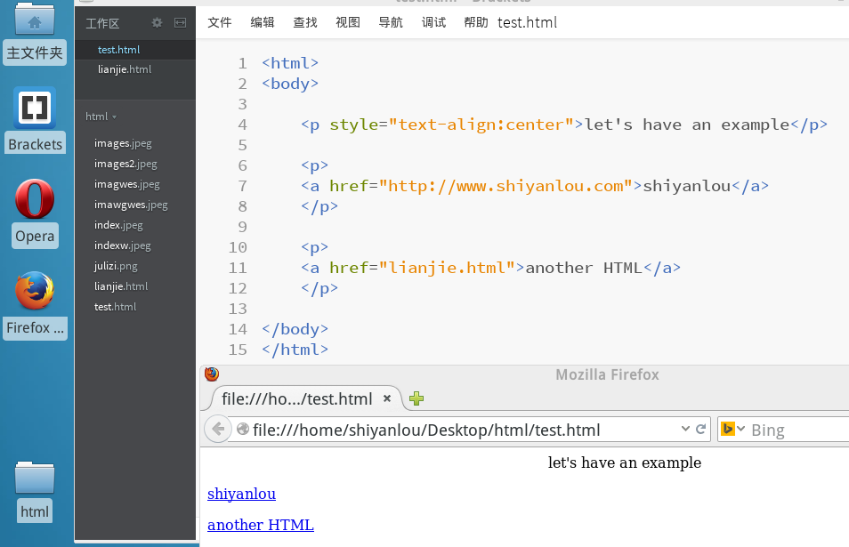
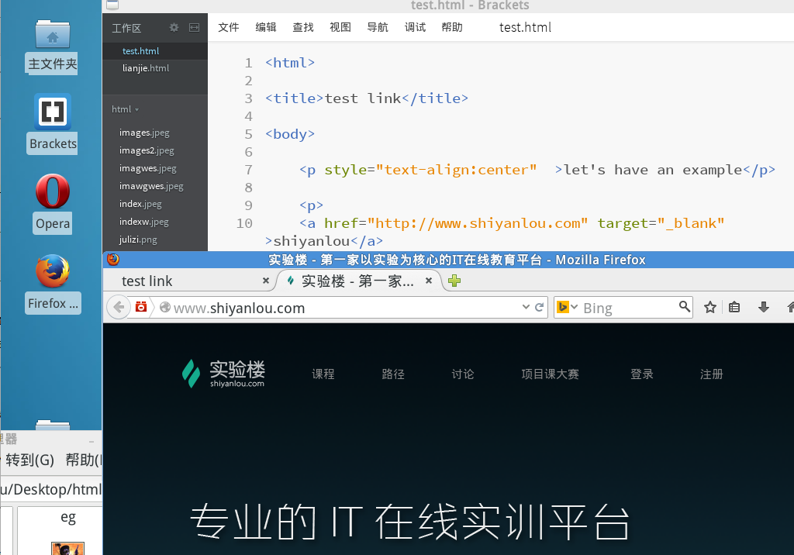
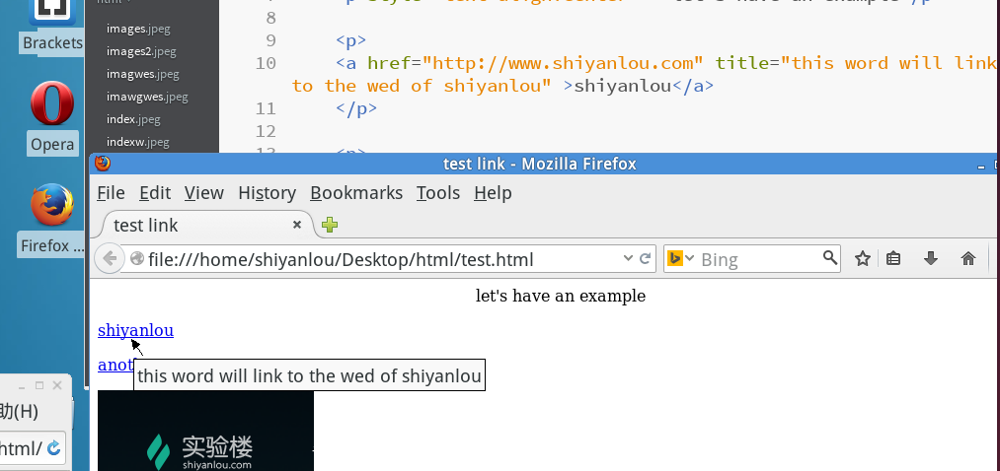
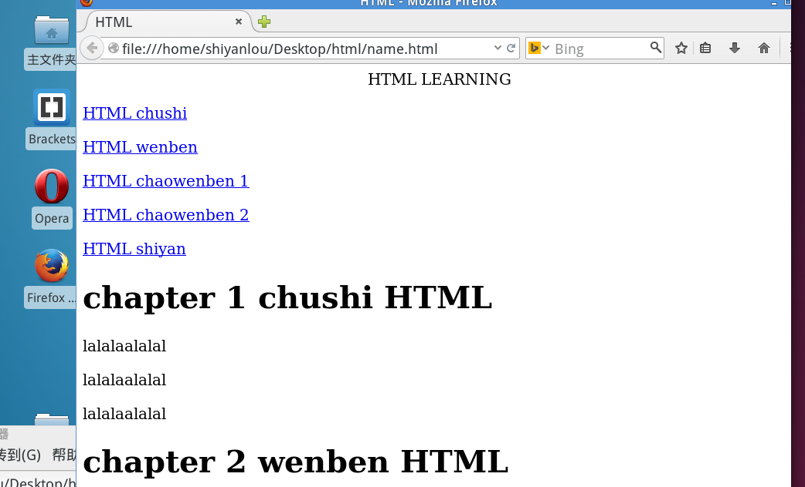
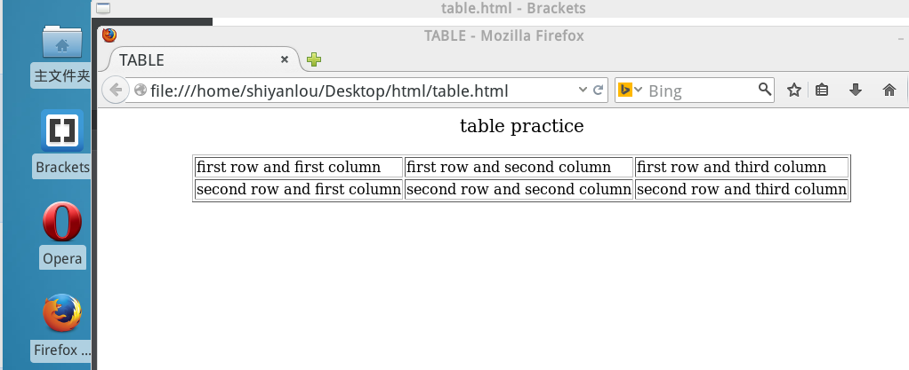
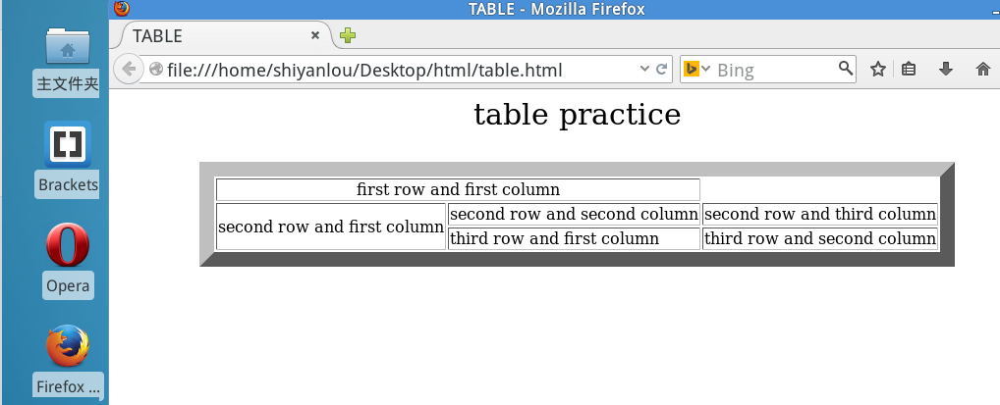
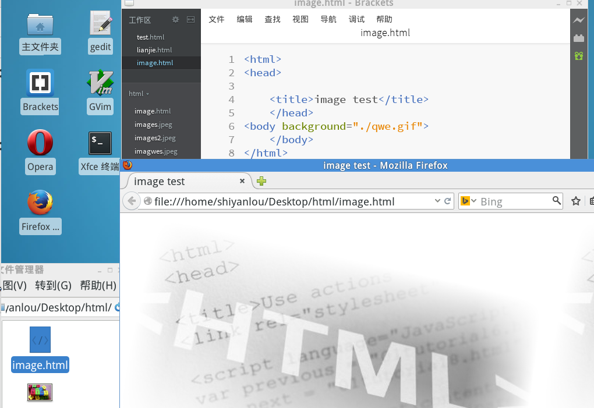
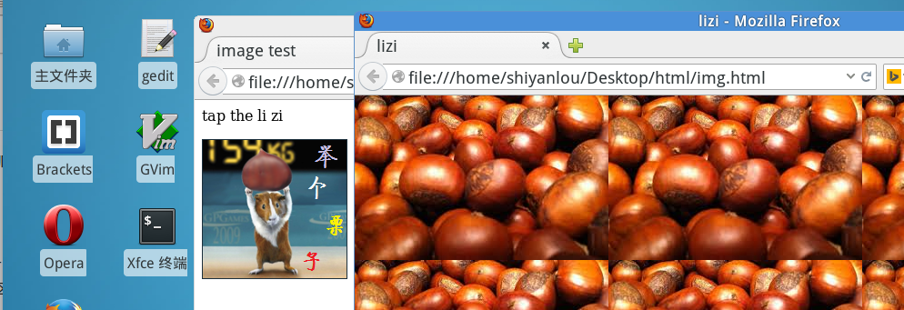

# 第 3 节 HTML 超文本（一）

* * *

## 实验简介

1.HTML 链接

2.HTML 表格

3.HTML 图像

* * *

写在前面：因为这节要方便实现图片的调用，从这一章我们就可以使用环境中的开发软件 Brackets（方便补全和查看），但是没有 google chrome，不能实时预览，但至少，还有补全。 打开开发环境以后我们在桌面新建一个文件夹，以后我们工程的所有要用的东西就放在里面，方便调用。

## **1.HTML 链接**

之所以你可以在浏览器屏幕上单击鼠标或在键盘上按下按键，从而选择并自动跳转到文档中自己感兴趣的那个主题，或跳转到世界上某处完全不同的集合中的某个文档。那是因为你点击的这就是超链接

相信大家对超链接不会陌生吧，天天都不知道点了多少个呢。超链接可以是一个字，一个词，或者一组词，也可以是一幅图像，你可以点击这些内容来跳转到新的文档或者当前文档中的某个部分。我们在前面的例子中只简单使用了< a>标签 ，用字符作为网业的超链接，还使用< a>实现了发送邮件的功能。下面我们要讲到的都是关于< a>标签的属性

我们这就详细来讲解 HTML 链接：

### **（1）给文字及图片添加超链接**

首先我们还是回顾一下最简单的链接使用，直接给文字添加链接到网页和另外的 HTML 文件。

HTML 内容如下

```js
< html>
< body>

    < p>let's have an example< /p>

    < p>   
        < a href="http://www.shiyanlou.com">shiyanlou< /a>
    < /p>

< /body>
< /html> 
```

这是自己在环境中的截图：


这是最简单的超链接,接下来我们就来让这个 HTML 文件链接到另一个 HTML 文件。（在相同的文件夹，再添加一个 HTMl 文件），然后下面是 HTML 内容和结果



点击进去以后（另一个 HTML 的内容就不再展示）：


**说完了给文字添加超链接，下面我们就来说说给给图片添加超链接，点击图片，链接到另一个页面**

这是内容与结果截图：


点击图片以后成功链接：


### **（2）超链接的打开方式**

打开方式分为在本页打开和在新的浏览器窗口打开，默认情况下，超级链接打开新页面的方式是自我覆盖（就是在本页打开）。根据浏览者的不同需要，读者可以指定超级链接的其他打开新窗口的方式。超级链接标签提供了 target 属性进行设置，取值分别为*self（自我覆盖，默认）、*blank（创建新窗口打开新页面）。下面我们就来动手区分下这两个属性的区别（由于我们已近写过默认的情况，这里我们就只添加 _blank 属性）

在前面的基础上我们在< a>标签加入 target 属性：target="_blank"



通过与第一张图的对比我们可以看出，*blank 属性加上以后，链接到的网页是在新窗口中打开的，而默认的*self 属性则是在本页面以覆盖的形式打开（第一张图）

### **（3）超链接添加提示文字**

有些时候超链接文字不足以说明点击以后所要链接的内容，所以这个时候我们就需要给超链接添加提示文字，加以描述下一个链接的内容，当光标停留在超链接上时，提示语言就会显现，会让页面显现的很简介。设计到的属性就是 title，下面我们再来动手实验一把 下面就是实验内容和效果

在前面的基础上，< a>标签加上 title 属性：title="this word will link to the wed of shiyanlou"



### **（4）超链接实现书签**

也许你在网页看过小说，当你在页首点击章节的题目，就会自动的跳转到相应的章节，这是怎样实现的呢？。要实现书签，你就要了解，什么是锚（anchor）。锚（anchor）是引自于船只上的锚，锚被抛下后，船只就不容易飘走、迷路。实际上锚就是用于在单个页面内不同位置的跳转，有的地方叫做书签。涉及到的标签当然还是< a>标签,超级链接标签的 name 属性用于定义锚的名称，一个页面可以定义多个锚，通过超级链接的 href 属性可以根据 name 跳转到对应的锚。 如下实现跳转：

```js
<a href="#跳转目的地名称">跳转起始字符</a>
...
...
...
<a name="跳转目的地名称">跳转目的地字符</a> 
```

下面我们就来具体的实现下：

```js
<html>
    <head>
    <title>HTML</title>  
    </head>  
<body style="font-size:20px">

    <p style="text-align:center">HTML LEARNING</p>

    <p>
    <a href="#c1">  HTML chushi</a>
    </p>
    <p>
    <a href="#c2">HTML wenben </a>
    </p>
    <p>
    <a href="#c3">HTML chaowenben 1 </a>
    </p>
    <p>
    <a href="#c4"> HTML chaowenben 2 </a>
    </p>
    <p>
    <a href="#c5">HTML shiyan </a>
    </p>

    <h1><a name="c1"></a>chapter 1 chushi HTML</h1>
    <p>lalalaalalal</p>
    <p>lalalaalalal</p>
    <p>lalalaalalal</p>

    <h1><a name="c2"></a>chapter 2 wenben HTML</h1>
    <p>lalalaalalal</p>
    <p>lalalaalalal</p>
    <p>lalalaalalal</p>

    <h1><a name="c3"></a>chapter 3 chaowenben 1 HTML</h1>
    <p>lalalaalalal</p>
    <p>lalalaalalal</p>
    <p>lalalaalalal</p>

    <h1><a name="c4"></a>chapter 4 chaowenben 2 HTML</h1>
    <p>lalalaalalal</p>
    <p>lalalaalalal</p>
    <p>lalalaalalal</p>

    <h1><a name="c5"></a>chapter 5 shiyan HTML</h1>
    <p>lalalaalalal</p>
    <p>lalalaalalal</p>
    <p>lalalaalalal</p>

    </body>
</html> 
```



点击实现跳转

## **2.HTML 表格**

HTML 網頁設計不可或缺的元素就是表格（Table），通常表格用來做版面的排版，而表格的用法包含了幾個重要的标签，分別是 table、tr 與 td 這幾個重點，組合起來才是個完整的表格，表格由 < table> 标签来定义。每个表格均有若干行（由 < tr> 标签定义），每行被分割为若干单元格（由 < td> 标签定义）。字母 td 指表格数据（table data），即数据单元格的内容。< th>标签用来定义表头。数据单元格可以包含文本、图片、列表、段落、表单、水平线、表格等等。

下面我们动手来写一个简单 HTML 文件来练习这几个标签：

```js
<html>
<title >TABLE</title>
<body style="font-size:20px">

    <p style="text-align:center">table practice</p>  

     <table  align="center" border="1">  
            <tr>
            <td>first row and first column</td>
            <td>first row and second column</td>
            <td>first row and third column</td>
            </tr>

             <tr>
             <td>second row and first column</td>
             <td>second row and second column</td>
             <td>thirt row and third column</td>
             </tr>

     </table>   

</body>
</html> 
```

这是实验截图：



border="1"定义的是最外面边框粗细，为 1，你也可以设置为 0，就是不显示边框（默认就是没有边框）这里我们将其改成 15 试试：


下面我们再介绍表格两个属性： colspan：控制此单位所占列数 rowspan：控制此单位所占行数

```js
<html>
<title >TABLE</title>
<body style="font-size:30px">
    <p style="text-align:center">table practice</p>
     <table  align="center" border="15" >

        <tr>
         <td align="center" colspan="2">first row and first column</td>
         </tr>

         <tr>
         <td rowspan="2">second row and first column </td>
            <td>second row and second column </td>
            <td >second row and third column</td>
         </tr>
         <tr>
         <td>third row and first column </td>
            <td>third row and second column </td>
         </tr>
        </table>   
</body>
</html> 
```

如果不是很理解，我们就来看看在网页上的表现，对比起来有助于我们理解。 让第一列第一行这个单位占两列，让第二行第一列这个单位占两行，就是这个效果。



表格还有很多细节可以定义,我们早这里就简单叙述，大家需要动手练习：

*   标签：< th>表头< /th>：设置表头

*   标签：< caption>标题< /caption>：设置表的标题

*   属性：cellpadding="..."设置单元格边距

*   属性：bgcolor="..."设置表格背景颜色

*   属性：background="..." 以某张图片作为表格背景

## **3.HTML 图像**

上面我们简单提到过用图像作为链接使用，接下来我们来详细讲述下图像的应用。 一般我们用到的就是插入图片，将图片多为背景，再者将图片作为链接。涉及到的标签就是< img>< /img> 接下来我们就动手开始写一个 HTML 文件加深了解 首先我们用浏览器在网页上下载几张图片（放到和 HTML 文件一个文件夹中）供后面使用。

1.先设置一张图片为网页背景图片 在 body 属性中加入 background 属性添加背景图片



2.举例插入一张图片 写法如下

```js
 
```

擦入图片以后： 

这时我们可以看出，字体和图片的低端是对其的，下面我们就来调整下对其方式

3.添加属性调整图片的对其方式

在< img>标签中加入 align 属性，调整对其。 相对习题的上下可以加的参数有 bottom、middle、top，默认就是我们刚看见的 bottom 相对字体左右可加的参数有 right，left 默认为 right

下面我们直接来比较下：

```js
<html>
<head>
    <title>image test</title>
    </head>
    <body background="./qwe.jpg">

    <p>let's have an example</p>
    <p> align top</p>
    <p>align middle</p>
    <p>align left</p>

    </body>
</html> 
```


4.调整插入图片尺寸 大多数的尺寸都没有那么合适，直接插入以后会破换整体页面的效果。所以在插入图片时，很有必要控制其尺寸，这是很容易办到的，就孩子需要在< img>标签中加入 width height 两个属性。 那我们顺势就控制下上面的那几副图吧

```js
width="80" height="80" 
```


（当然，我还调整了字体大小）

5.创建图像映射

在这之前我们动手试验过将图片作为链接来使用，触发链接的方式就是点击图片的任何地方都可以链接到跳转地址，有时我们需要实现，点击图片的不同地方跳转到不同的地方。意思就是，一张图片我们可以创建带有可供点击区域的图像地图，其中每个区域就是一个超链接。涉及到的标签就是< map>标签，用来指定图片,< area>用来指定超链接区域

```js
  
<map name="mp" id="mp">  
    <area>
    ...
    ...
    ...
    </area>  
</map> 
```

这里以一张图片作为地图， 在< area>标签中我们会涉及到 shape ，coords， href 属性，分别用来指定超链接区域形状，超链接区域坐标，还有超链接跳转地。

这是具体实现内容

```js
<html>
<head>
    <title>image test</title>
    </head>
    <body background="./qwe.jpg">

    <p>tap the li zi </p>
    

    <map name="lizi">
     <area shape="rect" coords="50,10,100,60" href="img.html" target="_blank"
    </map>  

    </body>
</html> 
```

然后，当我们点击小松鼠举起的栗子，你就会看见跟多栗子 

shape 属性的取值可以是：rect(矩形)、circle(圆形)、poly(多边形)和 default(整个图像区域)。这里采用的是矩形。

coords 属性对于矩形而言，coords 有 4 个值，分别用逗号隔开，表示矩形区域左上角 x 坐标、左上角 y 坐标、右下角 x 坐标和右下角 y 坐标，这里获取坐标的方式，就用截图工具帮忙就好。

具体的代码与图片大家可以使用命令克隆一个到桌面上以验证

```js
sudo git clone http://git.shiyanlou.com/shiyanlou/HTML1 
```

## 小结

这一章中我们学了几个关于超文本的标签在 HTML 中都比较重要。链接，表格，图像。简单的标签属性我们差不多都覆盖到了。

## 作业

按照课程上的讲解，将涉及到的标签，属性的使用都练习一遍，尽量有发散的联系，有不懂的地方可以直接在网上查找相应的知识点。