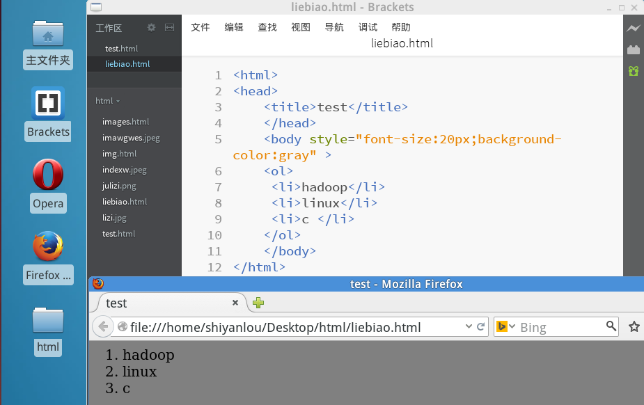
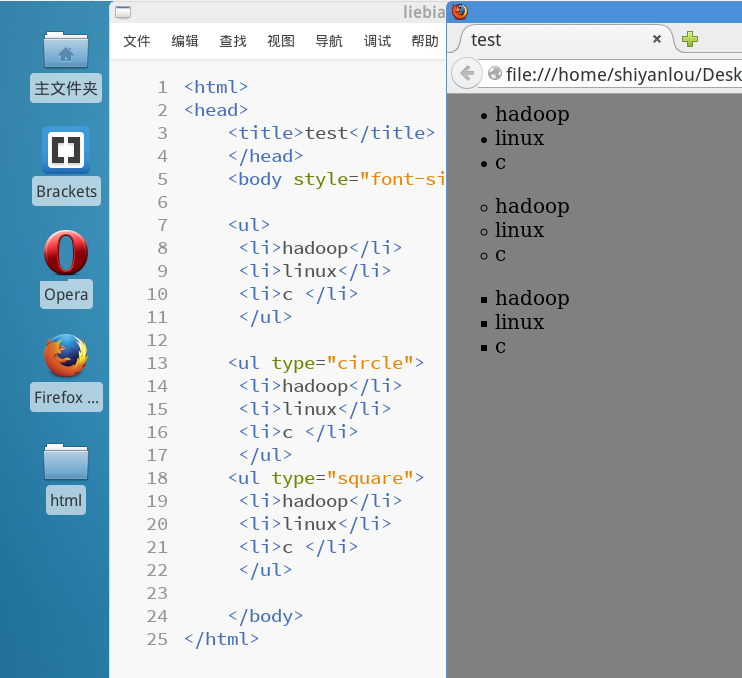
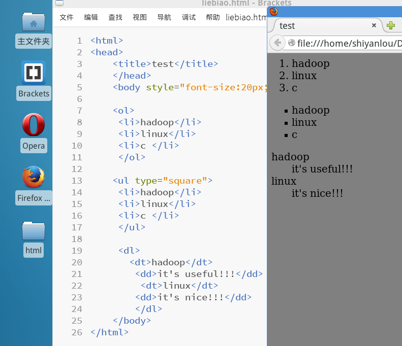
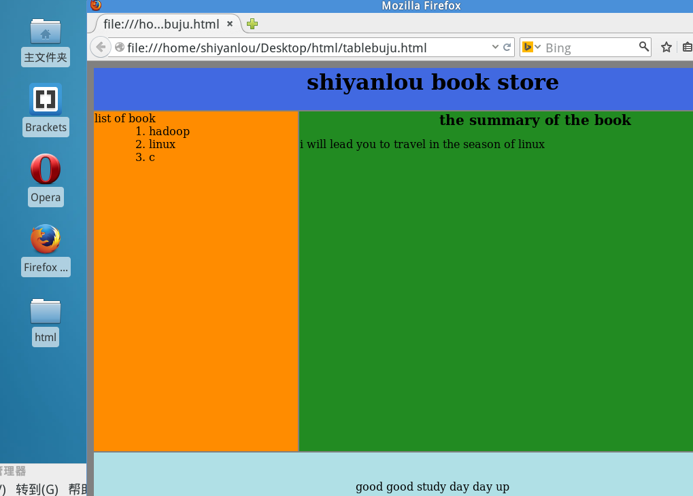
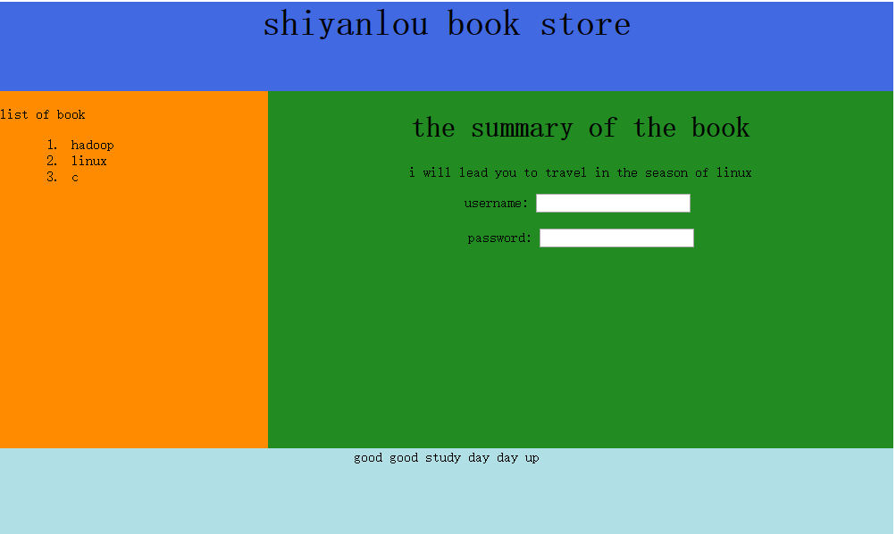
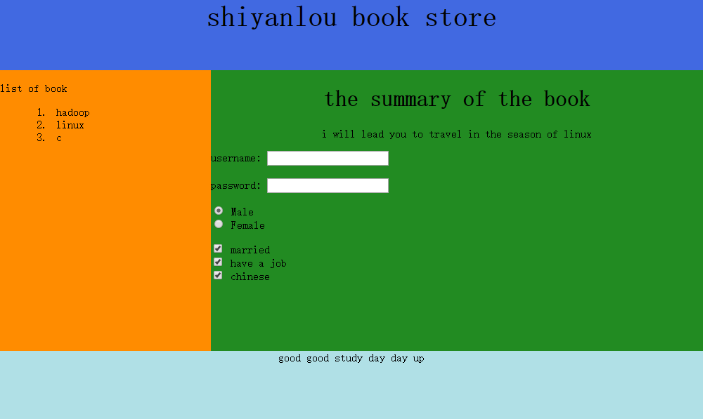

# 第 4 节 HTML 超文本（二）

* * *

## 实验简介

1.HTML 列表

2.HTML 块

3.HTML 布局

4.HTML 表单

* * *

## **1.HTML 列表**

HTML 列表标记主要有三种：有序列表、无序列表和定义列表。下面我们来一一的学习

**(1).有序列表**

有序列表始于 < ol> 标签。每个列表项始于 < li> 标签。列表项内部可以使用段落、换行符、图片、链接以及其他列表等等。

```
<ol>
<li>balabala</li>
</ol> 
```

这就是一个比较简单的有序列表的最小元素，默认的排序方式就是以数字开头，下面我们来动手写写。 首先来一个最简单的列表，下面是是内容和效果：



在有序列表中我们还能定义其他的排序方式，上面是默认的额数字排序，下面我们再加上字母排序和罗马数字排序 这里就只需要添加 type 属性就可以了，"a"表示以小写字母来排序;"A"就是使用大写字母来排序;"i"就是以小写罗马数字来排序;"I"就是以大写罗马数字来排序。 这里还可以添加 start 属性，决定起始地。 下面是范例：

```
<html>
<head>
    <title>test</title>
    </head>
    <body style="font-size:20px;background-color:gray" >

    <ol start="2">
     <li>hadoop</li>
     <li>linux</li>
     <li>c </li>
    </ol> 

    <ol type="a">
     <li>hadoop</li>
     <li>linux</li>
     <li>c </li>
    </ol>     

    <ol type="A">
     <li>hadoop</li>
     <li>linux</li>
     <li>c </li>
    </ol>       

    <ol type="i">
     <li>hadoop</li>
     <li>linux</li>
     <li>c </li>
    </ol> 

     <ol type="I">
     <li>hadoop</li>
     <li>linux</li>
     <li>c </li>
    </ol>     
    </body>
</html> 
```


看了效果图再回头对比下属性值

**(2).无序列表**

说完了有序列表，下面来讲讲无序列表。无序列表在 HTML 中还是很常用的。 无序列表始于 < ul> 标签。每个列表项始于 < li>（有序无序是一样的）。 无需列表排序的时候就是给每个列表项加各种小符号其中分为 Disc（默认）实心黑点;Cirle 小圈;square 方点，与有序列表的属性都是用的一样的，接下来我么就来动动手



同样的，看了效果图再回头看看属性的设置

**(3).定义性列表**

定义列表通常用于术语的定义和解释。定义列表由< dl>开始，术语由< dt>开始，解释说明有< dd>开始，< dd>....< /dd>里的文字缩进显示。 下面我们就简单的操作下



## **2.HTML 块**

首先 我们要知道，HTML 元素被定义为块级元素或内联元素。那么什么是块级元素，什么是内联函数呢：

块级元素(block)特性： 总是独占一行，表现为另起一行开始，而且其后的元素也必须另起一行显示; 宽度(width)、高度(height)、内边距(padding)和外边距(margin)都可控制;就像以前用到的 < h1>, < p>, < ul>, < table>标签。

内联元素(inline)特性： 和相邻的内联元素在同一行;宽度(width)、高度(height)、内边距的 top/bottom(padding-top/padding-bottom)和外边距的 top/bottom(margin-top/margin-bottom)都不可改变，就是里面文字或图片的大小;以前用到的< b>, < td>, < a>, < img>标签。

在这里我们先介绍两个标签< div>标签和< span>标签。

< div>用来定义文档中的分区或节（division/section），没有特定的含义。它是可用于组合其他 HTML 元素的容器

< span>用来组合文档中的行内元素，也没有特定的含义

下面我们来看看< div>标签的用法。


## **3.HTML 布局**

大多的网页布局要配合 css 来完成;css 用于对元素进行定位或者为页面创建背景以及色彩丰富的外观。由于这里我们涉及到 HTML 的基础知识，我们就用我们现有的知识来进行布局。

网页布局可以通过< table>元素，或者< div>元素实现。 先来个简单的< table>布局网页 我们在上一章中学习了表格，那么下面我们就来将一个网页的一个板块用没有边框的表格来布局（添加背景颜色和布置文本内容）

```
<html>
<body bgcolor="gray">

<table width="1000">
    <tr>
        <td colspan="2" style="background-color: royalblue">
            <h1 align="center">shiyanlou book store</h1>
        </td>
    </tr>

    <tr valign="top">
        <td style="background-color: darkorange;width:300px">
          <dl>
              <dt>list of book</dt>
              <dd>
                  <ol>
                      <li>hadoop</li>
                      <li>linux</li>
                      <li>c</li>
                  </ol>
              </dd>
          </dl>
        </td>
        <td style="background-color: forestgreen;height:500px;width:700px;">
            <h1 style="font-size: 20px;text-align: center">the summary of the book</h1>
        i will lead you to travel in the season of linux
        </td>
    </tr>

    <tr>
        <td colspan="2" style="background-color: powderblue;text-align:center;height: 100px">
            good good study day day up</td>
    </tr>

</table>
</body>
</html> 
```



大家可以看出，这个网页只是一个简单的表格，所用的都是我们学过的标签我而已，橙色中的还加入了我们上面刚学习的定义性列表嵌套有序列表。

下面我们再使用< div>元素进行布局（尽量达到上面的页面效果）： 一般的 div 元素结构就如下图（思路也是用 table 的思路）： 

这里是具体实现内容：

```
<html>
<head>
    <style>
        div#container{width:1000px}
        div#header {background-color: royalblue ;height: 100px;text-align:center;font-size: 20px}
        div#sidebar{background-color: darkorange;height:400px;width:300px;float:left;}
        div#mainbody {background-color: forestgreen;height:400px;width:700px;float:left;}
        div#footer {background-color: powderblue;height: 100px;clear:both;text-align:center;}
    </style>
</head>
<body>
<div id="container">
    <div id="header">
        <h1>shiyanlou book store</h1>
    </div>
    <div id="sidebar">
       <dl>
           <dt>list of book</dt>
            <dd>
                <ol>
                    <li>hadoop</li>
                    <li>linux</li>
                    <li>c</li>
                </ol>
            </dd>
       </dl>
    </div>
    <div id="mainbody">
        <h1>the summary of the book</h1>
        <p>i will lead you to travel in the season of linux</p>
    </div>
    <div id="footer">good good study day day up</div>
</div>
</body>
</html> 
```

只要将上面的 style 里的 div 定义和下面的 div 块对应就很好理解，这里的逻辑表达的很清晰，就不再赘述。直接来看看效果截图吧


## **4.HTML 表单**

学习表单首先我们要知道，表单标签是什么，表单标签就是用于网页中的数据提交，比如我们注册网页，在留言板中留言、评论等可以填写数据，提交处理地方都需要表单标签，form 表单标签内有输入框 input、单选、多选、select 下拉列表菜单与跳转菜单、提交按钮等标签内容。下面我们就赶紧来动手试一试。

我们就直接在上面的代码中修改，首先我们尝试的，当然是搜集不同类型的用户输入，这里我们就只涉及文本和密码 只需要涉及到一个 input type 标签就能完成

```
<form>
user：
<input type="text" name="user">
<br />
password：
<input type="password" name="password">
</form> 
```

下面是页面截图： 

当你输入时你会发现，username 是可见的，password 是被点替换了的，这就是这两个类型的区别。

下面我们再增增添两种选框，一种是多选，一种是单选。 当用户从若干给定的的选择中选取其一时，就会用到单选框。

单选框：

```
<form>
<input type="radio" name="sex" value="male" /> Male
<br/>
<input type="radio" name="sex" value="female" /> Female
</form> 
```

多选框：

```
<form>
<input type="checkbox" name="married" />
married
<br/>
<input type="checkbox" name="have a job" />
have a job
<br/>
<input type="checkbox" name="chinese" />
chinese
</form> 
```



## **小结**

在这一章中，我们学习了列表，块，布局，表单的基础知识，差不多对 HTML 的超文本类型有所掌握，到这里为止，我们的基础知识概念就差不多完结了，但是对于使用 HTML 还远远不够，后面我们会再推出一章实践篇，回顾我们前面学到的标签与属性，希望大家多练习，达到熟练使用的地步。

## **作业**

按照教程，有发散地练习前面讲到的列表，快，特别针对布局和表单。