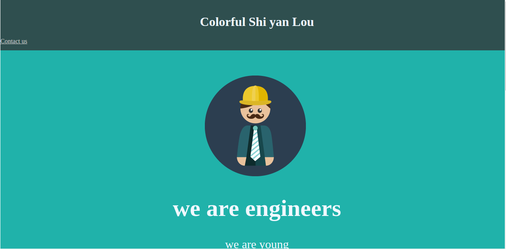

# 第 5 节 HTML 基础汇总实验

* * *

## 实验简介

1.实验总体设计

2.总体框架及布局

3.具体模块实现

4.添加表单实现输入和邮件发送

* * *

实验中的代码可以通过命令下载在实验楼环境中下载运行测试

```
git clone http://git.shiyanlou.com/shiyanlou/finaltest 
```

## 1.实验总体设计

在开始之前我们对网页应该有大致的把握，也就是说，在开始之前我们就要清楚我们要实现的目标，对应的最基础的框架结构，并且通过使用我们学过的那些标签和属性来实现，对于这个实验。我们可以随便在网上找一个样式简单点的网页来实现，这可能要涉及到一小部分的 css 样式的内容（毕竟只用 HTML 很难写出相同的效果）。下面我们就先展示一下我们要完成的效果：




大家可以看出，这个页面实现起来难度应该不大，这里涉及到布局，图片的插入，背景颜色调整，链接实现页面内的跳转，表单实现文本输入和邮件发送，再加上最基础的文本格式，用我们前面讲过的知识，足以对付。

下面，我们就先来用一个结构图将这个页面的结构为大家剖析一下。让大家对这个实验结构有更好的理解： 

## 2.总体框架及布局

前面的章节中我们讲过两种实现布局的方式，一个是表格元素，一个是 div 元素，这里我们选择使用 div 元素来实现。这里涉及到一点 css 的东西，用了 style。但是无关紧要，完全能理解。下面我们就来具体讲解下：

首先我们将整个页面横向分为五个块，整个页面我们先看作一个大的块，其他的块嵌套在其中。我们现在就为他们命名。

整个页面我们看作时一个块，我们将其命名为 container，所有的块都嵌套在其中 下面就是标题，命名为 header，这是整个页面的头部，一个标题加一个本页面链接，没什么多说的

下一个是我们第一个大的部分，占了第一篇页面的额绝大多部分，有一张工程师的插图，命名为 paragraph。

接下来有四张插图的部分，我们将其算为一个大的块（其实有四个块，水平并列，每一个块插一张图）这四个小块分别命名为 leftside、middle1、middle2、rightside。

再下来就是表单发送邮件的块，主要实现文本输入和邮件发送，将其命名为 footer1.

最后就是一个美化的底边框，将其命名为 footer2。

下面就是具体的代码，在这个 style 中，顺便设置了一些对这个块的总体设置（所占宽度，高度，对齐等）：

```
<style>
        #container{width:1300px}
        #header {background-color: darkslategray;height: 130px;font-size: 16px;}
        #paragraph {background-color: lightseagreen ;height: 550px;text-align:center;font-size: 30px}
        #leftside{height:350px;width:310px;float: left}
        #middle1{height:350px;width:340px;float: left}
        #middle2{height:350px;width:340px;float: left}
        #rightside {height:350px;width:300px;float:left}
       #footer1 {background-color: powderblue;height: 600px;clear:both;text-align:center;}
        #footer2 {background-color: lightslategrey;height: 100px;clear:both;text-align:center;}
    </style> 
```

## 3.具体模块实现

上面介绍了总体的模块，这里我们就具体来看看如何实现每一块的实现：

**header：**

```
 <div id="header" >
        <br/>
        <h1 style="color: aliceblue;text-align: center">Colorful Shi yan Lou</h1>
        <a href="#con" style="float: left;color: lightgray">Contact us</a>
    </div> 
```

这是头块的具体内容，设置了字体颜色对其方式，还加入了一个页面间跳转的链接，链接的另一半在后面的 footer1 中，点击这里以后，页面会跳转到 footer1。

**paragraph：**

```
<div id="paragraph">
      <br/>
      <p>
          
          <br/>
          <h1 style="color: aliceblue">we are engineers</h1>
          <p style="color: aliceblue">we are young</p>
      </p>
  </div> 
```

这个 paragraph 块插入了一张图，定义了字体颜色，而且在前面的总体声明中可以看出，还设置了这个模块的字体对齐方式及字体大小。

**中间模块**：

```
<div id="leftside" align="center">
      <h1 style="color: lightslategray">Working</h1>
      
  </div>

  <div id="middle1" align="center">
      <h1 style="color: lightslategray">Eating</h1>
     
  </div>

  <div id="rightside" align="center">
      <h1 style="color: lightslategray">Playing</h1>
      
  </div>

  <div id="middle2" align="center">
      <h1 style="color: lightslategray">Sleeping</h1>
      
  </div> 
```

这四个块就一起讲了，这里要实现的就是在每个块中插入图片，在图片上面有字体描述，由于定义的每个块的宽度是大于图片的大小，所以才能产生图片与图片之间白色边框的效果，不然，会挤在一起。要想实现几个块水平并列的放置，还可以采用列表的形式。这里我们就只是简单的通过定义大小来实现水平排列，这就是我们实现的效果


这些都是很简单的实现方式，很容易理解，接下来我着重讲讲 footer1 块（表单实现文本输入和邮件发送）

## **4.添加表单实现文本输入和邮件发送**

以前我们讲到过使用< a>标签实现邮件发送，就是在标签中加入 mailto 属性，其实表单实现邮件发送也是很相似的在 form 标签中 action 加入 mailto。这里还有要注意的就是，表单输入到类型以前讲的很清楚，要是大家有疑惑可以回头看看。下面时具体的代码内容

```
<div id="footer1" >

       <br/>
           <a name="con">
               <h1 style="color: lightslategray;">let's learn with us
       <br/>good good study, day day up
       </h1>
       </a>

       <div style="background-color: powderblue;width:450;height: 400;float: left">
       </div>
       <div style="background-color: orange;width: 400;height: 400;float:left">
           
           <br /><br />
           <form action="MAILTO:support@shiyanlou.com" method="post" enctype="text/plain">

               <h3>Send emali to shiyanlou</h3>
              your name:<br/>
               <input type="text" name="name" value="yourname" size="20">
               <br />
               your email:<br/>
               <input type="text" name="mail" value="yourmailaddress" size="20">
               <br />
               what you wanna say:<br/>
               <input type="text" name="comment" value="yourcomment" size="20">
               <br /><br />
               <input type="submit" value="send">
               <input type="reset" value="rewrite">

           </form>
       </div>

   </div> 
```

在上面这个模块中，首先开头的就是链接的跳转地址，触发地是在 header 里面定义的。接下来我们为了使发送表单的块居中，采用了最原始的方法，就是再前面加上一个与背景颜色一样的空块，使他们并列。再后面就是表单的应用，定义表单，并规定长度，实现文本和密码的输入。最后加上两个按钮，实现确认和重置。所有的写法都很基础，没有涉及到更高深的东西。

这就是 footer 模块的具体样子 

## **小结**

到此为止，实验就完结了，动手熟悉了前面讲到的知识，定制了自己的页面，到此为止，这门课也就完结了，但是要想写出很好的页面，这远远不够的，现在的网页，一般 html 文件知识作为 index，要想做出好看的页面，css 是大家要学习的下一门课程，了解 html 知识以后，css 上手起来会很快。

## **作业**

自己动手写一个简单的 HTML 文件，将学到过的标签属性都用一遍，定制属于自己的网页。