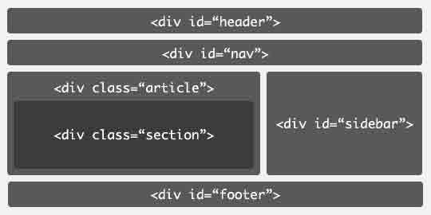
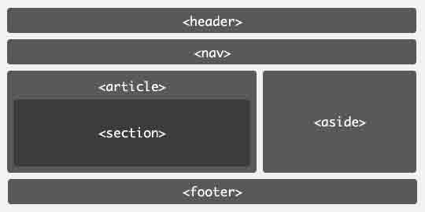

# 第 2 节 HTML5 的新的结构元素介绍

## 一、HTML5 与 HTML4 的区别

### 1\. 取消了一些过时的 HTML4 的标签

其中包括纯粹显示效果的标记，如`<font>`和`<center>`，它们已经被 `CSS`完全取代。

其他取消的属性:`acronym`, `applet`, `basefont`, `big`, `center`, `dir`, `font`, `frame`, `frameset`, `isindex`, `noframes`, `strike`,`tt`

### 2\. 添加了一些新的元素

更加智能的表单元素：`date`, `email`, `url`等; 更加合理的标签：`<section>`, `<video>`, `<progress>`, `<nav>`, `<meter>`, `<time>`, `<aside>`, `<canvas>`等。

### 3\. 文件类型声明

仅有一种类型，<!DOCTYPE html>

## 二、HTML5 的新结构标签

在讲这些新标签之前，我们先看一个普通的页面的布局方式：



以上是很常见的`div`+`css`布局模式，通过`class`来区分不同的结构，包括头部、导航、文章内容、右边栏，还有底部模块。

而 HTML5 新标签带来的新的布局则是下面这种情况：



代码如下：

```js
<!DOCTYPE html>
<html>
    <head>
        <title>my page</title>
    </head>
    <body>
        <header>header</header>
        <nav>nav</nav>
        <article>
            <section>section</section>
        </article>
        <aside>aside</aside>
        <footer>footer</footer>
    </body>
</html> 
```

拥有具体含义的标签，使得代码有很直观的感受，搜索器也能很容易地抓取合适的信息。

下面介绍 HTML5 中相关的结构标签

#### `<section>`

定义文档中的节。它用来表现普通的文档内容或应用区块，但`section`元素标签并非一个普通的容器元素，它表示一段专题性的内容，一般会带有标题。

```js
<section>
    <h1>section 是什么？</h1>
    <h2>一个新章节</h2>
    <article>
        <h2>关于 section</h2>
        <p>section 的介绍</p>
        ...
    </article>
</section> 
```

#### `<article>`

特殊的`section`标签，它比`section`具有更明确的语义，它代表一个独立的、完整的相关内容块。当我们描述一件具体的事物的时候，通常鼓励使用`article`来代替`section`。

`article`会有标题部分（通常包含在`header`内），也可以包含`footer`。

`article`可以嵌套，内层的`article`对外层的`article`标签有隶属关系。

```js
<article>
    <header>
        <hgroup>
            <h1>这是一篇介绍 HTML 5 结构标签的文章</h1>
            <h2>HTML 5 的革新</h2>
        </hgroup>
        <time datetime="2011-03-20">2011.03.20</time>
    </header>
    <p>文章内容详情</p>
</article> 
```

#### `<nav>`

可以作为页面导航的链接组，其中的导航元素链接到其它页面或者当前页面的其它部分，使 html 代码在语义化方面更加精确，同时对于屏幕阅读器等设备的支持也更好。

```js
<nav>
    <ul>
        <li>厚德 IT</li>
        <li>FlyDragon</li>
        <li>J 飞龙天惊</li>
    </ul>
</nav> 
```

#### `<aside>`

`aside`标签用来装载非正文的内容，被视为页面里面一个单独的部分。它包含的内容与页面的主要内容是分开的，可以被删除，而不会影响到网页的内容、章节或是页面所要传达的信息。例如广告，成组的链接，侧边栏等等。

```js
<aside>
    <h1>作者简介</h1>
    <p>厚德 IT</p>
</aside> 
```

#### `<header>`

`header`标签定义文档的页眉，通常是一些引导和导航信息。它不局限于写在网页头部，也可以写在网页内容里面。

通常`header`标签至少包含一个标题标记（`h1`-`h6`），还可以包括`hgroup`标签，还可以包括表格内容、标识、搜索表单、`nav`导航等。

```js
<header>
    <hgroup>
        <h1>网站标题</h1>
        <h1>网站副标题</h1>
    </hgroup>
</header> 
```

#### `<footer>`

`footer`标签定义`section`或`document`的页脚，包含了与页面、文章或是部分内容有关的信息，比如说文章的作者或者日期。 它和`header`标签使用基本一样，可以在一个页面中多次使用，如果在一个区段的后面加入`footer`，那么它就相当于该区段的页脚了。

```js
<footer>
    页脚信息
</footer> 
```

#### `<hgroup>`

`hgroup`标签是对网页或区段`section`的标题元素（`h1`-`h6`）进行组合。例如，在一区段中你有连续的 h 系列的标签元素，则可以用`hgroup`将他们括起来。

```js
<hgroup>
    <h1>这是一篇介绍 HTML 5 结构标签的文章</h1>
    <h2>HTML 5 的革新</h2>
</hgroup> 
```

#### `<figure>`

用于对元素进行组合。多用于图片与图片描述组合。

```js
<figure>
    
    <figcaption>这儿是图片的描述信息</figcaption>
</figure> 
```