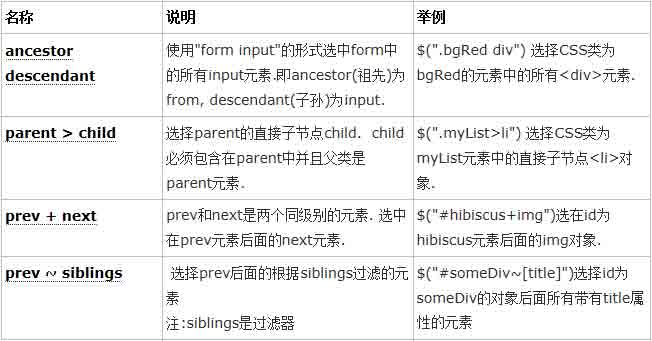
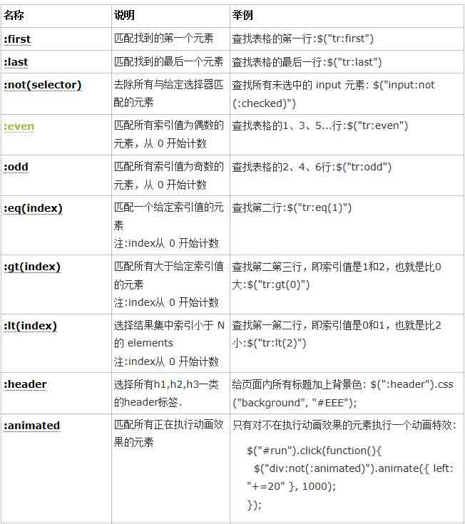
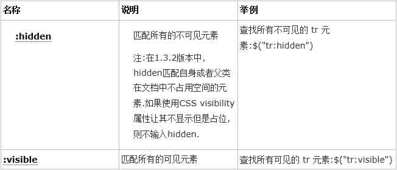
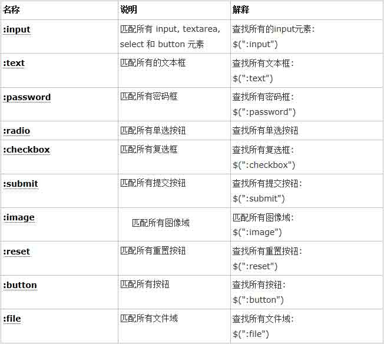

# 第 2 节 jQuery 选择器

## 一、 摘要

本章讲解 jQuery 最重要的选择器部分的知识，有了 jQuery 的选择器，我们几乎可以获取页面上任意的一个或一组对象，可以明显减轻开发人员的工作量。

## 二、前言

编写任何 JavaScript 程序我们要首先获得对象，jQuery 选择器能彻底改变我们平时获取对象的方式，可以获取几乎任何语义的对象，比如**“拥有 title 属性并且值中包含 test 的`<a>`元素”**，完成这些工作只需要编写一个 jQuery 选择器字符串，学习 jQuery 选择器是学习 jQuery 最重要的一步。

## 三、Dom 对象和 jQuery 包装集

无论是在写程序还是看 API 文档，我们要时刻注意区分 Dom 对象和 jQuery 包装集。

### 1\. Dom 对象

在传统的 JavaScript 开发中，我们都是首先获取 Dom 对象，比如：

```js
var div = document.getElementById("testDiv");
var divs = document.getElementsByTagName("div"); 
```

我们经常使用`document.getElementById`方法根据 id 获取单个 Dom 对象，或者使用`document.getElementsByTagName`方法根据 HTML 标签名获取 Dom 对象集合。

另外在事件函数中，可以通过在方法函数中使用`this`引用事件触发对象（但是在多播事件函数中 IE6 存在问题），或者使用`event`对象的`target`（Firefox）或`srcElement`（IE6）获取到引发事件的 Dom 对象。

注意我们这里获取到的都是 Dom 对象,Dom 对象也有不同的类型比如`input`,`div`,`span`等。Dom 对象只有有限的属性和方法。

### 2\. jQuery 包装集

jQuery 包装集可以说是 Dom 对象的扩充。在 jQuery 的世界中将所有的对象，无论是一个还是一组，都封装成一个 jQuery 包装集，比如获取包含一个元素的 jQuery 包装集：

```js
var jQueryObject = $("#testDiv"); 
```

jQuery 包装集都是作为一个对象一起调用的。jQuery 包装集拥有丰富的属性和方法。

### 3\. Dom 对象与 jQuery 对象的转换

（1）Dom 转 jQuery 包装集

如果要使用 jQuery 提供的函数，就要首先构造 jQuery 包装集。我们可以使用本文即将介绍的 jQuery 选择器直接构造 jQuery 包装集，比如：

```js
$("#testDiv"); 
```

上面语句构造的包装集只含有一个 id 是 testDiv 的元素。

或者我们已经获取了一个 Dom 元素,比如:

```js
var div = document.getElementById("testDiv"); 
```

上面的代码中 div 是一个 Dom 元素, 我们可以将 Dom 元素转换成 jQuery 包装集:

```js
var domToJQueryObject = $(div); 
```

（2）jQuery 包装集转 Dom 对象

jQuery 包装集是一个集合, 所以我们可以通过索引器访问其中的某一个元素:

```js
var domObject = $("#testDiv")[0]; 
```

**注意, 通过索引器返回的不再是 jQuery 包装集, 而是一个 Dom 对象!**

jQuery 包装集的某些遍历方法,比如 each()中, 可以传递遍历函数, 在遍历函数中的 this 也是 Dom 元素,比如:

```js
$("#testDiv").each(function() {
  alert(this)
}); 
```

如果我们要使用 jQuery 的方法操作 Dom 对象,怎么办? 用上面介绍过的转换方法即可:

```js
$("#testDiv").each(function() {
  $(this).html("修改内容")
}); 
```

**小结:** 先让大家明确 Dom 对象和 jQuery 包装集的概念,将极大的加快我们的学习速度。只要能够区分这两者, 就能够在写程序时变得清清楚楚。

## 四、什么是 jQuery 选择器

在 Dom 编程中我们只能使用有限的函数根据 id 或者 TagName 获取 Dom 对象。

在 jQuery 中则完全不同，jQuery 可提供异常强大的选择器用来帮助我们获取页面上的对象，并且将对象以 jQuery 包装集的形式返回。

首先来看看什么是选择器:

```js
//根据 ID 获取 jQuery 包装集
var jQueryObject = $("#testDiv"); 
```

上例中使用了 ID 选择器，选取 id 为 testDiv 的 Dom 对象并将它放入 jQuery 包装集，最后以 jQuery 包装集的形式返回。

`"$"`符号在 jQuery 中代表对 jQuery 对象的引用, "jQuery"是核心对象, 其中包含下列方法:

**jQuery( expression, context ) Returns:** jQuery

*这个函数接收一个 CSS 选择器的字符串，然后用这个字符串去匹配一组元素。*

This function accepts a string containing a CSS selector which is then used to match a set of elements.

**jQuery( html, ownerDocument ) Returns:** jQuery

*根据 HTML 原始字符串动态创建 Dom 元素.*

Create DOM elements on-the-fly from the provided String of raw HTML.

**jQuery( elements ) Returns:** jQuery

*将一个或多个 Dom 对象封装 jQuery 函数功能(即封装为 jQuery 包装集)*

Wrap jQuery functionality around a single or multiple DOM Element(s).

**jQuery( callback ) Returns:** jQuery

*$(document).ready()的简写方式*

A shorthand for $(document).ready().

上面摘选自 jQuery 官方手册。`Returns`的类型为 jQuery 即表示返回的是 jQuery 包装集.其中第一个方法有些问题,官方接口写的是 CSS 选择器,但是实际上这个方法不仅仅支持 CSS 选择器,而是所有 jQuery 支持的选择器,有些甚至是 jQuery 自定义的选择器(在 CSS 标准中不存在的选择器)。 为了能让大家理解的更清楚, 我将方法修改如下:

**jQuery( selector, context ) Returns:** jQuery 包装集

*根据选择器选取匹配的对象, 以 jQuery 包装集的形式返回。 context 可以是 Dom 对象集合或 jQuery 包装集, 传入则表示要从 context 中选择匹配的对象, 不传入则表示范围为文档对象(即页面全部对象)。*

上面这个方法就是我们选择器使用的核心方法。可以用`"$"`代替 jQuery 让语法更简洁, 比如下面两句话的效果相同:

```js
//根据 ID 获取 jQuery 包装集
var jQueryObject = $("#testDiv");
//$是 jQuery 对象的引用:
var jQueryObject = jQuery("#testDiv"); 
```

接下来让我们系统学习 jQuery 选择器。

## 五、jQuery 选择器全解

通俗的讲, `Selector`选择器就是"一个表示特殊语意的字符串"。只要把选择器字符串传入上面的方法中就能够选择不同的 Dom 对象并且以 jQuery 包装集的形式返回。

但是如何将 jQuery 选择器分类非常犯难。因为书上的分类和 jQuery 官方的分类截然不同。最后决定以实用为主,暂时不去了解 CSS3 选择器标准,而按照 jQuery 官方的分类进行讲解。

jQuery 选择器按照功能主要分为"选择"和"过滤"，并且是配合使用的，可以同时使用组合成一个选择器字符串。 主要的区别是"过滤"作用的选择器是指定条件从前面匹配的内容中筛选, "过滤"选择器也可以单独使用, 表示从全部"*"中筛选. 比如:

`$(":[title]")` 等同于 `$("*:[title]")`

而"选择"功能的选择器则不会有默认的范围, 因为作用是"选择"而不是"过滤"。

下面的选择器分类中, 带有"过滤器"的分类表示是"过滤"选择器, 否则就是"选择"功能的选择器。

**jQuery 选择器分为如下几类:**

*   **基础选择器 Basics**


*   **层次选择器 Hierarchy**



*   **基本过滤器 Basic Filters**



*   **内容过滤器 Content Filters**


*   **可见性过滤器 Visibility Filters**



*   **属性过滤器 Attribute Filters**


*   **子元素过滤器 Child Filters**


*   **表单选择器 Forms**



*   **表单过滤器 Form Filters**


## 六、总结

本章节讲解的 jQuery 依然属于基础支持, 所以没有太多的应用实例。 虽然基础但是很难一次全部记住, jQuery 选择器可以说是最考验一个人 jQuery 功力的地方。下一章我们讲解如何操作 jQuery 包装集以及动态创建新元素.

## 七、练习

请举出使用每大类中的一个选择器的例子。