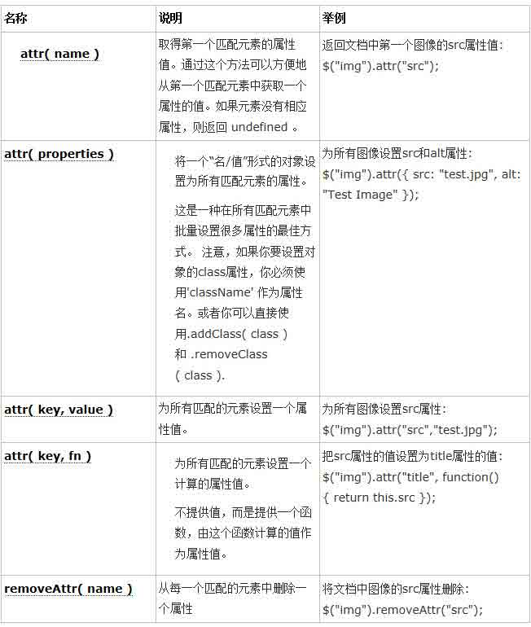
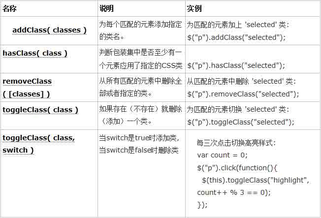
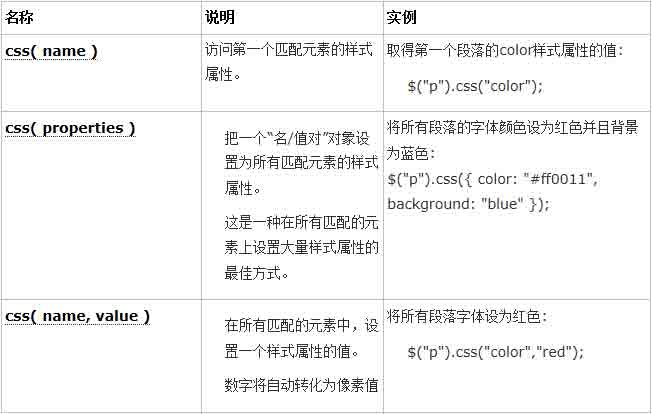
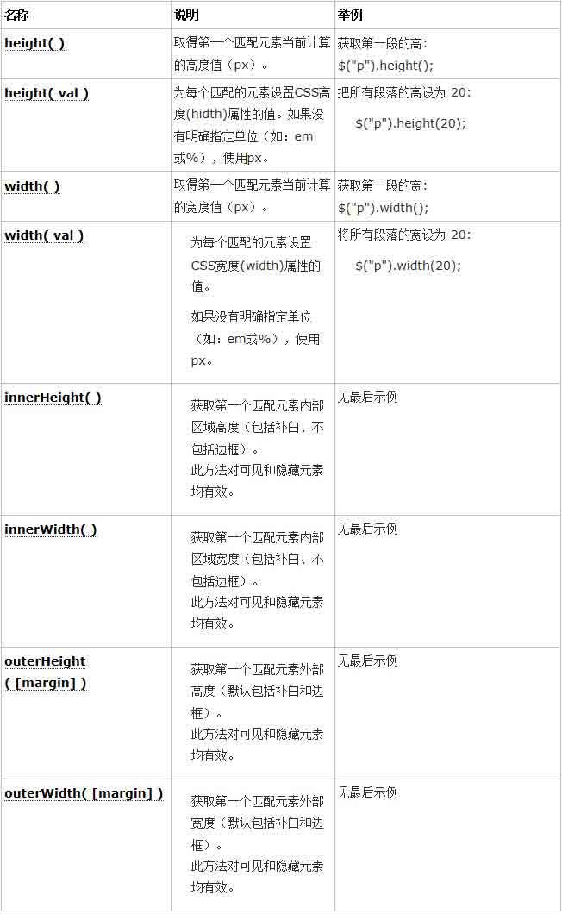
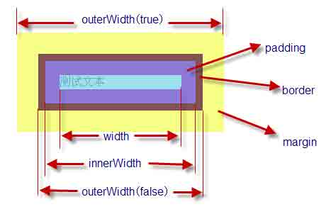

# 第 4 节 使用 jQuery 操作元素的属性与样式

## 一、摘要

本篇文章讲解如何使用 jQuery 获取和操作元素的属性和 CSS 样式。其中 DOM 属性和元素属性的区分值得大家学习。

## 二、前言

通过前面几章我们已经能够完全控制 jQuery 包装集了,无论是通过选择器选取对象,或者从包装集中删除,过滤元素。本章将讲解如何使用 jQuery 获取和修改元素属性和样式。

## 三、区分 DOM 属性和元素属性

一个 img 标签:

``

通常开发人员习惯将`id`,`src`,`alt`等叫做这个元素的"属性"。我们将其称为"元素属性"。但是在解析成 DOM 对象时,实际浏览器最后会将标签元素解析成"DOM 对象", 并且将元素的"元素属性"存储为"DOM 属性"，两者是有区别的。

虽然我们设置了元素的 src 是相对路径：`images/image.1.jpg`

但是在"DOM 属性"中都会转换成绝对路径：`http://localhost/images/image.1.jpg`

甚至有些"元素属性"和"DOM 属性"的名称都不一样,比如上面的元素属性 class, 转换为 DOM 属性后对应 className。

牢记, 在 javascript 中我们可以直接获取或设置"DOM 属性":

```
<script type="text/javascript">
    $(function() {
        var img1 = document.getElementById("hibiscus");
        alert(img1.alt);
        img1.alt = "Change the alt element attribute";
        alert(img1.alt);
    })
</script> 
```

所以如果要设置元素的 CSS 样式类, 要使用的是 DOM 属性"className"而不是元素属性"class:

```
img1.className = "classB"; 
```

## 四、操作"Dom 属性"

在 jQuery 中没有包装操作"DOM 属性"的函数,因为使用 javascript 获取和设置"DOM 属性"都很简单. 在 jQuery 提供了`each()`函数用于遍历 jQuery 包装集,其中的`this`指针是一个 DOM 对象,所以我们可以应用这一点配合原生 javascript 来操作元素的 DOM 属性:

```
$("img").each(function(index) {
    alert("index:" + index + ", id:" + this.id + ", alt:" + this.alt);
    this.alt = "changed";
    alert("index:" + index + ", id:" + this.id + ", alt:" + this.alt);
}); 
```

## 五、操作"元素属性"

我们可以使用 javascript 中的`getAttribute`和`setAttribute`来操作元素的"元素属性"。

在 jQuery 中给你提供了`attr()`包装集函数, 能够同时操作包装集中所有元素的属性:



当使用 id 选择器时常常返回只有一个对象的 jQuery 包装集,这个时侯常使用 attr(name)函数获得它的元素属性:

```
function testAttr1(event) {
   alert($("#hibiscus").attr("class"));
} 
```

注意 attr(name)函数只返回第一个匹配元素的特定元素属性值.而 attr(key, name)会设置所有包装集中的元素属性:

```
//修改所有 img 元素的 alt 属性
$("img").attr("alt", "修改后的 alt 属性"); 
```

而 attr( properties ) 可以一次修改多个元素属性:

```
$("img").attr({title:"修改后的 title", alt: "同时修改 alt 属性"}); 
```

另外虽然我们可以使用`removeAttr(name)`删除元素属性,但是对应的 DOM 属性是不会被删除的, 只会影响 DOM 属性的值.

比如将一个`input`元素的`readonly`元素属性去掉,会导致对应的 DOM 属性变成`false`(即`input`变成可编辑状态):

```
$("#inputTest").removeAttr("readonly"); 
```

## 六、修改 CSS 样式

修改元素的样式, 我们可以修改元素 CSS 类或者直接修改元素的样式。

一个元素可以应用多个 css 类,但是不幸的是在 DOM 属性中是用一个以空格分割的字符串存储的, 而不是数组。所以如果在原始 javascript 时代我们想对元素添加或者删除多个属性时, 都要自己操作字符串。

jQuery 让这一切变得异常简单。

### 1\. 修改 CSS 类

下表是修改 CSS 类相关的 jQuery 方法：



使用上面的方法, 我们可以将元素的 CSS 类像集合一样修改,再也不必手工解析字符串。

注意`addClass(class)`和`removeClass(classes)`的参数可以一次传入多个 css 类, 用空格分割,比如:

```
$("#btnAdd").bind("click", function(event) {
    $("p").addClass("colorRed borderBlue");
}); 
```

removeClass 方法的参数可选, 如果不传入参数则移除全部 CSS 类:

```
$("p").removeClass(); 
```

### 2\. 修改 CSS 样式

同样当我们想要修改元素的具体某一个 CSS 样式,即修改元素属性"style"时, jQuery 也提供了相应的方法:



## 七、获取常用属性

虽然我们可以通过获取属性,特性以及 CSS 样式来取得元素的几乎所有信息, 但是注意下面的实验:

```
<!doctype html>
<html lang="zh">
<head>
  <meata charset="utf-8"/>
  <title>get object width</title>
  <script src="jquery-1.11.2.min.js"></script>
  <script>
    $(function() {
      alert("attr(\"width\"):" + $("#testDiv").attr("width")); //undifined
      alert("css(\"width\"):" + $("#testDiv").css("width")); //auto(ie6) 或 1264px(ff)
      alert("width():" + $("#testDiv").width()); //正确的数值 1264
      alert("style.width:" +  $("#testDiv")[0].style.width); //空值
    })
  </script>
</head>
<body>
  <div id="testDiv">test text</div>
</body>
</html> 
```

我们希望获取测试图层的宽度,使用 attr 方法获取"元素特性"为 undefined, 因为并没有为 div 添加 width。而使用 css()方法虽然可以获取到 style 属性的值, 但是在不同浏览器里返回的结果不同,IE6 下返回 auto,而 FF 下虽然返回了正确的数值但是后面带有"px"。所以 jQuery 提供了 width()方法,此方法返回的是正确的不带 px 的数值。

针对上面的问题,jQuery 为常用的属性提供了获取和设置的方法,比如 width()用户获取元素的宽度,而 width(val)用来设置元素宽度。

下面这些方法可以用来获取元素的常用属性值:

### 1\. 宽和高相关 Height and Width



关于在获取长宽的函数中,要区别"inner","outer"和 height/width 这三种函数的区别:



outerWidth 可以接受一个 bool 值参数表示是否计算 margin 值。

相信此图一目了然各个函数所索取的范围。图片以 width 为例说明的,height 的各个函数同理。

### 2\. 位置相关 Positioning

另外在一些涉及到弹出对象的脚本中,常常需要动态获取弹出坐标并且设置元素的位置。

但是很多的计算位置的方法存在着浏览器兼容性问题，jQuery 中为我们提供了位置相关的各个函数:


## 八、总结

本篇文章主要讲解如何使用 jQuery 操作元素的属性和修改样式，请大家主要注意元素属性和 DOM 属性的区别。下一篇文章将讲解最重要的事件，介绍如何绑定事件，操作事件对象等。

## 九、练习

请实现一个功能，能够动态地改变图片的大小。