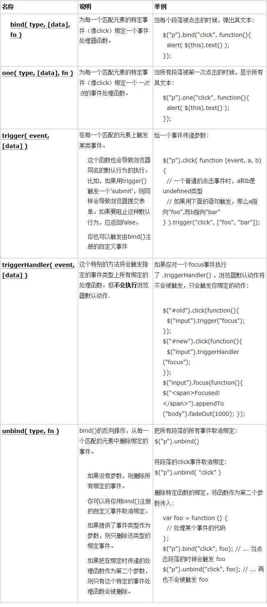
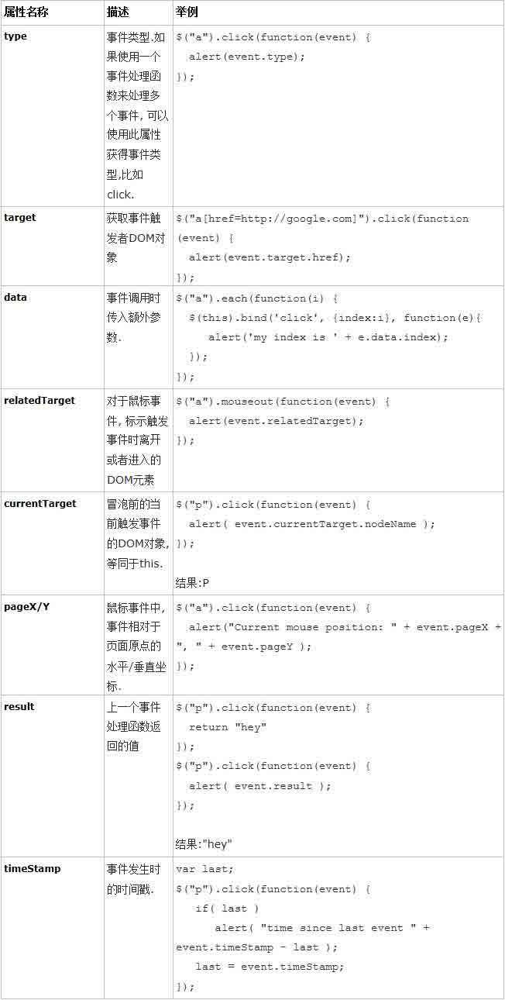
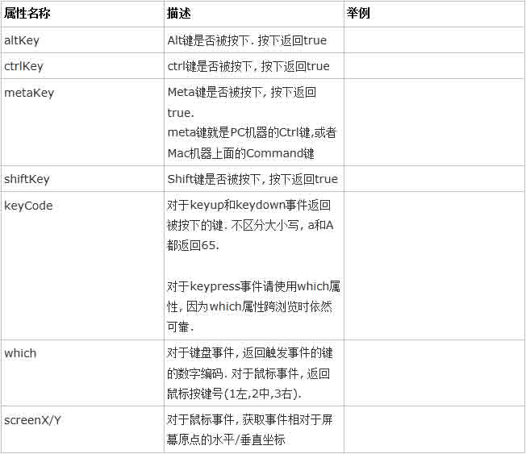
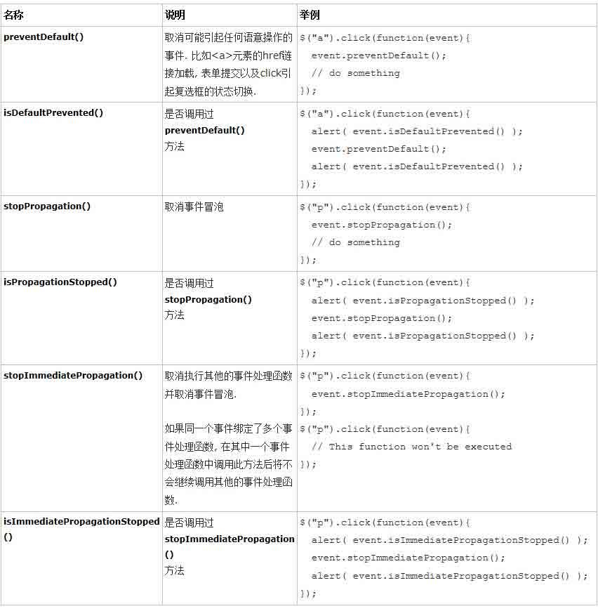

# 第 5 节 jQuery 的事件与事件对象

## 一、摘要

事件是脚本编程的灵魂，所以本章内容也是 jQuery 学习的重点。本文将对 jQuery 中的事件处理以及事件对象进行详细的讲解。

## 二、前言

本篇文章是至今为止本系列课程内容最多的一篇，足以可见其重要性，并有许多示例。

## 三、事件与事件对象

首先看一下我们经常使用的添加事件的方式:

```
<!doctype html>
<html lang="zh">
<head>
  <meta charset="utf-8"/>
  <title>javascript event</title>
  <script src="jquery-1.11.2.min.js"></script>
  <script>
    $(function() {
      document.getElementById("testDiv2").onclick = showMsg;
    });

    function showMsg(event) {
      alert("!!!");
    }
  </script>
</head>
<body>
  <div id="testDiv1" onclick="showMsg();">click event 1</div>
  <div id="testDiv2">click event 2</div>
</body>
</html> 
```

我们最常使用为元素添加 onclick 元素属性的方式添加事件。

为 testDiv2 的添加 onclick 事件的方式是修改 Dom 属性。

在上一章中已经说明了什么是元素属性,什么是 Dom 属性。这两种方式的效果相同。当单击 div 时会显示提示框。

**请注意, 虽然效果相同, 但是并不等效** `document.getElementById("testDiv2").onclick = showMsg;` 等效于： `<div id="testDiv1" onclick="alert('!!!');">click event 2</div>` 注意两者的区别了吗?我们常用的修改元素属性添加事件的方式,实际上是建立了一个匿名函数:

```
document.getElementById("testDiv1").onclick = function(event) {
    alert("!!!");
}; 
```

这个匿名函数的签名和我们手写的 showMsg 签名相同, 所以可以把 showMsg 直接赋值给 onclick。

**这种方式的弊端是：**

**1\. 只能为一个事件绑定一个事件处理函数.使用"="赋值会把前面为此事件绑定的所有事件处理函数覆盖掉.**

**2\. 在事件函数(无论是匿名函数还是绑定的函数)中获取事件对象的方式在不同浏览器中要特殊处理:**

IE 中，事件对象是 window 对象的一个属性。事件处理函数必须这样访问事件对象：

```
obj.onclick=function() {
    var oEvent = window.event;
} 
```

在 DOM 标准中,事件对象必须作为唯一参数传给事件处理函数:

```
obj.onclick=function() {
    var oEvent = arguments[0];
} 
```

除了使用 argument[0]访问此参数, 我们也可以指定参数名称,上面的代码等同于:

```
obj.onclick=function(oEvent) {
    ...
} 
```

**3\. 添加多播委托的函数在不同浏览器中是不一样的。**

下面是兼容多浏览器添加多播委托的方法：

```
//统一的为对象添加多播事件委托的方法
/*  
    参数说明:
    oTarget     : 要添加事件的对象.比如"document".
    sEventType  : 事件类型.比如单击事件"click".
    fnHandler   : 发生事件时调用的方法.比如一个静态函数"hideCalendar"

    使用举例:
    //单击页面的任何元素,只要没有取消冒泡,都可以关闭日历控件
    var cf = document.getElementById("CalFrame");
    if (cf != null && hideCalendar != null) {
        ScriptHelper.addEventListener(document,"click",hideCalendar);
    }
*/
scriptHelper.prototype.addEventListener = function(oTarget, sEventType, fnHandler) {
    if(oTarget.addEventListener) {  //for dom
        oTarget.addEventListener(sEventType, fnHandler, false);
    } else if(oTarget.attachEvent) {    //for ie
        oTarget.attachEvent("on" + sEventType, fnHandler);
    }
} 
```

所以我们首先应该摒弃`<div onclick="..."></div>`这种通过修改元素属性添加事件的方式。尽量使用添加多播事件委托的方式为一个事件绑定多个事件处理函数,比如为 document 对象的单击事件添加一个关闭弹出层的方法,使用多播就不会影响 document 对象原有的事件处理函数。

## 四、jQuery 中的事件

有了 jQuery,我们有了处理对象事件的一系列函数。上面基础知识还是要懂, 但是再也不用自己去实现处理多播事件委托的函数了。下面是在 jQuery 中最常使用的 bind()方法举例: `$("#testDiv4").bind("click", showMsg);` 我们为 id 是 testDiv4 的元素, 添加 click 事件的事件处理函数 showMsg。

**使用 jQuery 事件处理函数的好处：**

**1\. 添加的是多播事件委托，也就是为 click 事件又添加了一个方法，不会覆盖对象的 click 事件原有的事件处理函数。**

```
$("#testDiv4").bind("click", function(event) { alert("one"); });
$("#testDiv4").bind("click", function(event) { alert("two"); }); 
```

单击 testDiv4 对象时，依次提示“one”和“two”。

**2\. 统一了事件名称**

添加多播事件委托时,ie 中是事件名称前面有"on"。但是使用 bind()函数我们不用区分 ie 和 dom,因为内部 jQuery 已经帮我们统一了事件名称。

**3\. 可以将对象行为全部用脚本控制**

让 HTML 代码部分只注意"显示"逻辑.现在的趋势是将 HTML 的行为,内容与样式切分干净.其中用脚本控制元素行为,用 HTML 标签控制元素内容,用 CSS 控制元素样式.使用 jQuery 事件处理函数可以避免在 HTML 标签上直接添加事件.

下面是基础的 jQuery 事件处理函数 Event Handling:



## 五、使用 jQuery 事件对象

使用事件自然少不了事件对象。因为不同浏览器之间事件对象的获取,以及事件对象的属性都有差异,导致我们很难跨浏览器使用事件对象。

jQuery 中统一了事件对象,当绑定事件处理函数时,会将 jQuery 格式化后的事件对象作为唯一参数传入:

`$("#testDiv").bind("click", function(event) { });`

关于 event 对象的详细说明, 可以参考 jQuery 官方文档: http://docs.jquery.com/Events/jQuery.Event

jQuery 事件对象将不同浏览器的差异进行了合并,比如可以在所有浏览器中通过 event.target 属性来获取事件的触发者(在 IE 中使用原生的事件对象,需要访问 event.srcElement)。

**下面是 jQuery 事件对象可以在浏览器中支持的属性:**



上面是 jQuery 官方文档中提供的 event 对象的属性,下面还提供了多浏览器支持的属性：



事件对象除了拥有属性,还拥有事件。有一些是一定会用到的事件比如取消冒泡 `stopPropagation()` 等。下面是 jQuery 事件对象的函数列表:



这些函数中 `stopPropagation()` 是我们最常用的也是一定会用到的函数。 相当于操作原始 event 对象的`event.cancelBubble=true`来取消冒泡。

## 六、总结

本节花了很大的篇幅讲解 jQuery 的事件与事件对象，可见其重要性，希望大家能多多学习与总结。

接下来的文章将分别讲解 Ajax 和动画效果，最后通过讲解两个修改的 jQuery 插件来学习 jQuery 的插件开发。

## 七、练习

请实现一个表单验证功能，当表单提交前验证输入的合法性，例如电子邮箱是否有效、用户名是否合法等。