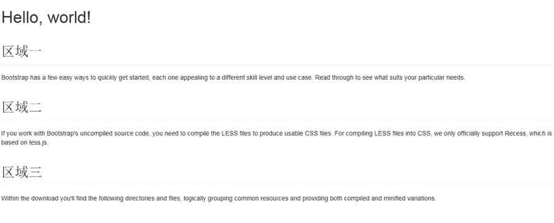
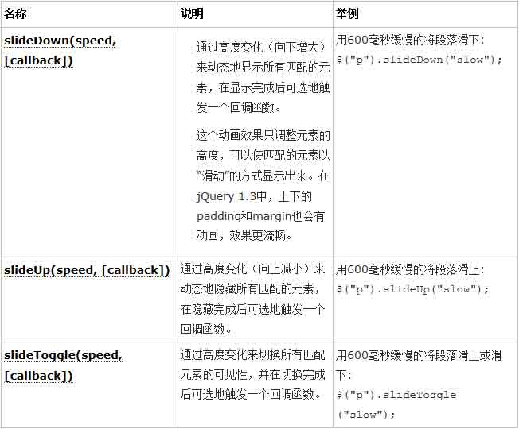
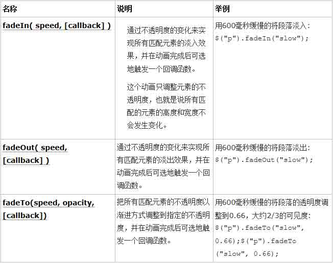
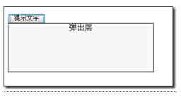
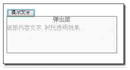
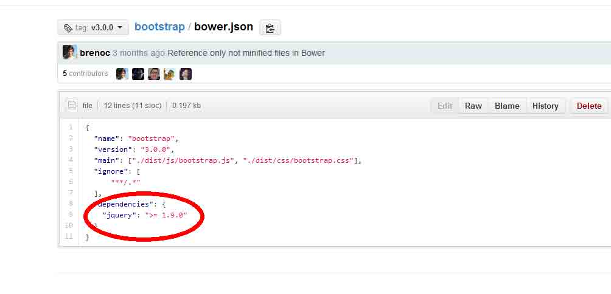

# 第 7 节 jQuery 动画

## 一、摘要

开发人员一直头疼做动画。但是有了 jQuery 你会瞬间成为别人(那些不知道 jQuery 的人)眼里的动画高手!本文将介绍 jQuery 的动画相关函数。原来做动画如此简单。

## 二、前言

本系列文章的实例都是针对某一个技术细节的, 因为我们要学习的是基础知识, 虽然总有人希望要复杂一些的应用示例, 但是还是让我们先把基础打牢, 有了扎实的基础凭借每个人的智慧一定能创造出更多更好的应用。

## 三、从实例开始

做 web 程序经常要使用弹出层，比如单击文字或按钮显示一段文字等。假设有如下需求：



*   单击图中的“显示提示文字”按钮，在按钮的下方显示一个弹出层。
*   单击任何空白区域或者弹出层，弹出层消失。

用原生 JavaScript 我们也可以完成这个工作，有以下几点注意事项：

1.弹出层的位置需要动态计算。因为触发弹出事件的对象可能出现在页面的任何位置。

2.为`document`绑定单击关闭弹出层的函数，要使用多播委托，否则可能覆盖其他人在`document`绑定的函数。

3.为`document`绑定了关闭函数后，需要在显示函数中取消事件冒泡，否则弹出层将显示后立刻关闭。

用 jQuery，我们可以轻松地实现此实例：

```js
<!doctype html>
<html lang="zh">
<head>
  <meta charset="utf-8"/>
  <title>jQuery - Start Animation</title>
  <script src="jquery-1.11.2.min.js"></script>
  <script>
    $(document).ready(function() {
      //动画速度
      var speed = 500;
      //绑定事件处理
      $("#btnShow").click(function(event) {
        //取消事件冒泡
        event.stopPropagation();
        //设置弹出层位置
        var offset = $(event.target).offset();
        $("#divPop").css({ top: offset.top + $(event.target).height() + "px", left: offset.left });
        //动画显示
        $("#divPop").show(speed);
      });
      //单击空白区域隐藏弹出层
      $(document).click(function(event) {
        $("#divPop").hide(speed)
      });
      //单击弹出层则自身隐藏
      $("#divPop").click(function(event) {
        $("#divPop").hide(speed)
      });
    });
  </script>
</head>
<body>
  <div>
    <button id="btnShow">Display the text prompt</button>
  </div>
  <!-- 弹出层 -->
  <div id="divPop" style="background-color: #f0f0f0; border: solid 1px #000000; position: absolute; display:none; width: 300px; height: 100px;">
    <div style="text-align: center;">pop div</div>
  </div>
</body>
</html> 
```

除了实现了基本的显示和隐藏功能，`现在显示和隐藏弹出层是渐变动画效果!`

jQuery 的动画函数主要分为三类：

1.  **基本动画函数：既有透明渐变，又有滑动效果，是最常用的动画效果函数**
2.  **滑动动画函数：仅使用滑动渐变效果。**
3.  **淡入淡出动画函数：仅使用透明度渐变效果**

这三类动画函数效果各不相同，用法基本一致。大家可以自己尝试。

另外 jQuery 也提供了**自定义动画函数**，将控制权放在我们手里让我们自己定义动画效果。

下面对三类内置动画函数和自定义动画函数分别讲解。

## 四、基本动画函数

#### 1\. 使用基本动画函数

基本的动画函数主要分为`show`，`hide`和`toggle`三个，都提供了无参数的版本，表示不适用动画切换元素的显示状态：

```js
$("#divPop").show();
$("#divPop").hide();
$("#divPop").toggle(); 
```

提供了两个参数的重载,因为回调函数可以省略,所以可以像开篇实例中使用的, 传入一个数值作为唯一参数,则会在参数规定的时间内用动画效果显示/隐藏元素:

```js
$("#divPop").show(200);
$("#divPop").hide("fast");
$("#divPop").toggle("slow"); 
```

如果传递了 200, 表示图层会在 200 毫秒内通过渐变的形式显示出来. speed 参数可以使用三种预定速度之一的字符串("slow", "normal", or "fast")或表示动画时长的毫秒数值(如：1000).

三个函数都可以传入回调函数`callback`,签名如下:

```js
function callback() {
  this; // dom element
} 
```

在回调函数中的 this 是执行此函数的 DOM 对象. 会在动画结束时执行。

#### 2\. 使用 toggle 函数

`toggle`函数是功能更强大的函数,可以切换元素的可见状态.我们经常遇到需要使用`toggle`的情况.比如希望一段文字第一次单击显示弹出层,第二次单击隐藏弹出层.

**注意: `toggle()`这个方法在 jQuery1.8 中宣告过时，在 jQuery1.9 中已经移除；jQuery `animation`也有一个名为`toggle`的方法。哪一个被调用取决于传递的参数的设置。**

我们将开篇实例稍作修改即可实现这个效果:

```js
<!doctype html>
<html lang="zh">
<head>
  <meta charset="utf-8"/>
  <title>jQuery - Start Animation</title>
  <script src="jquery-1.11.2.min.js"></script>
  <script>
    $(document).ready(function() {
      //动画速度
      var speed = 500;
      //绑定事件处理
      $("#btnShow").click(function(event) {
        //取消事件冒泡
        event.stopPropagation();
        //设置弹出层位置
        var offset = $(event.target).offset();
        $("#divPop").css({ top: offset.top + $(event.target).height() + "px", left: offset.left });
        //切换弹出层的显示状态
        $("#divPop").toggle(speed);
      });
      //单击空白区域隐藏弹出层
      $(document).click(function(event) {
        $("#divPop").hide(speed)
      });
      //单击弹出层则自身隐藏
      $("#divPop").click(function(event) {
        $("#divPop").hide(speed)
      });
    });
  </script>
</head>
<body>
  <div>
    <button id="btnShow">Display the text prompt</button>
  </div>
  <!-- 弹出层 -->
  <div id="divPop" style="background-color: #f0f0f0; border: solid 1px #000000; position: absolute; display:none; width: 300px; height: 100px;">
    <div style="text-align: center;">pop div</div>
  </div>
</body>
</html> 
```

## 五、滑动动画函数

基本动画函数的效果是一个综合了滑动和透明度渐变的函数，jQuery 还单独提供了只有滑动效果的相关函数。

#### 滑动动画函数 Sliding



**讲解**

`slideDown`就是`show`的滑动效果版本， `slideUp`就是`hide`的滑动效果版本， `slideToggle`就是`toggle`的滑动效果版本。

```js
$("#divPop").slideDown(200);
$("#divPop").slideUp("fast");
$("#divPop").slideToggle("slow"); 
```

## 六、淡入淡出动画函数

#### 淡入淡出函数 Fading



**讲解**

`fadeIn`和`fadeOut`两个函数对应`show`和`hide`，用于将对象以透明度渐变的效果显示和隐藏：

```js
$("#divPop").fadeIn(200);
$("#divPop").fadeOut("fast"); 
```

透明度渐变没有切换函数.

需要特别讲解的是`fadeTo`函数.这个函数能让对象渐变到指定的透明度上. `opacity`参数取值从 0-1, 比如 0.6 表示透明度为 60%.

和`fadeIn`与`fadeOut`不同的是,`fadeTo`函数只改变对象的透明度,即使透明度为 0 对象仍然占位.而`fadeIn`和`fadeOut`最后一定会改变对象的`display`属性, `fadeOut`后对象将从页面上消失(不占位),但是`fadeTo`仅仅是让其透明(占位).

`fadeTo`函数可以配合`fadeIn`使用.比如默认的情况下,`fadeIn`最后让对象完全显示:



但是如果之前使用过 fadeTo 设置弹出层的透明度, 则可以让其以半透明:



核心代码如下:

```js
//设置弹出层的透明度
$("#divPop").fadeTo(0, 0.66);

//让弹出层透明显示
if ($("#divPop").css("display") == "none"){
    $("#divPop").fadeIn(speed);
}else{
    $("#divPop").fadeOut(speed);
} 
```

用`fadeTo`设置了弹出层透明度后,再使用`fadeIn`会让对象显示并且渐变到`fadeTo`设置的透明度.

这里介绍的仅仅是两个函数的特性, 实际应用中并不一定要两者配合使用.

## 七、自定义动画函数

上面三个渐变动画函数已经基本满足了我们日常需求.但是如果我们一定要创建自己的特殊的效果, jQuery 也为我们提供了相关函数.

#### 自定义动画函数 Custom

*   **animate( params, [duration], [easing], [callback] )**
*   **animate( params, options )**
*   **stop( [clearQueue], [gotoEnd] )**

**参数说明**

**1.params(可选)**

类型:Options

说明:一组包含作为动画属性和终值的样式属性和及其值的集合.

讲解:通过把元素的样式属性值,从当前值逐渐调整到 params 设置的值而产生动画效果.

**2.duration(可选)**

类型:String,Number

说明:三种预定速度之一的字符串("slow","normal",or"fast")或表示动画时长的毫秒数值(如：1000)

讲解:动画效果持续的时间, 时间越长则变得越慢. 如果省略则不会产生动画.

**3.easing(可选)**

类型:String

说明:要使用的擦除效果的名称(需要插件支持).默认 jQuery 提供"linear" 和 "swing".

讲解:为了让元素逐渐达到 params 设置的最终效果,我们需要有一个函数来实现渐变, 这类函数就叫做 easing 函数.但是需要这里传递的只是 easing 函数名称, 使用前需要先将 easing 函数注册到 jQuery 上.

**4.options 参数**

类型:Options

说明:一组包含动画选项的值的集合。

讲解:所支持的属性如下:

*   duration: 与上面的 duration 参数相同
*   easing: 与上面的 easing 参数相同
*   complete :类型为 Function, 在动画完成时执行的函数
*   step: Callback
*   queue (Boolean): (默认值: true) 设定为 false 将使此动画不进入动画队列 (jQuery 1.2 中新增)

**讲解**

自定义动画属于高级应用,在这里暂时无法做详细的讲解.下面通过两个示例让大家简单了解如何使用自定义动画.

**Bug 提示: 下面两个示例使用 vsdoc2 智能提示版本的 jQuery 类库在 FireFox 下存在透明度无法渐变的问题.请使用其他版本.**

**自定义坠落动画:**

这个示例让一个图层从屏幕最上方掉落到最下方, 并且消失。

```js
<!doctype html>
<html lang="zh">
<head>
  <meta charset="utf-8"/>
  <title>jQuery Animation - fadeTo </title>
  <script src="jquery-1.11.2.min.js"></script>
  <script>
    $(document).ready(function() {
      $("#divPop").animate(
      {
        "opacity": "hide",
        "top": $(window).height() - $("#divPop").height() - $("#divPop").position().top
      },
      600,
      function() { $("#divPop").hide(); }
      );
    });
  </script>
</head>
<body>       
  <div id="divPop" style="background-color: #f0f0f0; border: solid 1px #000000; width: 300px; height: 100px; position:absolute;">
    <div style="text-align: center;">pop div</div>
  </div>
</body>
</html> 
```

**自定义消散动画**

这个示例让一个 div 越来越大，最后消失：

```js
<!doctype html>
<html lang="zh">
<head>
  <meta charset="utf-8"/>
  <title>jQuery Animation - fadeTo </title>
  <script src="jquery-1.11.2.min.js"></script>
  <script>
    $(document).ready(function() {
      $("#divPop").animate(
      {
        "opacity": "hide",
        "width": $(window).width()-100 ,
        "height": $(window).height()-100
      },
      500
      );
    });
  </script>
</head>
<body>       
  <div id="divPop" style="background-color: #f0f0f0; border: solid 1px #000000; width: 300px; height: 100px; position:absolute;">
    <div style="text-align: center;">pop div</div>
  </div>
</body>
</html> 
```

## 八、全局控制属性

最后讲一下和动画相关的属性:

**名称: jQuery.fx.off**

**返回值:** Boolean

**说明:**

关闭页面上所有的动画。

**讲解:**

把这个属性设置为 true 可以立即关闭所有动画(所有效果会立即执行完毕)。有些情况下可能需要这样，比如：

*   你在配置比较低的电脑上使用 jQuery。

*   你的一些用户由于动画效果而遇到了可访问性问题

当把这个属性设成 false 之后，可以重新开启所有动画。

比如下面的代码会执行一个禁用的动画:

```js
jQuery.fx.off = true;
$("#divPop").show(1000); 
```

虽然使用了动画效果的 show 函数, 但是因为关闭了所有动画, 所以 div 会立刻显示出来而没有渐变效果.

## 九、总结

本文讲解了 jQuery 提供的三种动画函数:基本动画，滑动动画和淡入淡出动画。 使用这三种动画已经基本可以满足我们的日常开发需求，让我们的页面动起来。简单举例讲解了自定义动画，对想深入研究的人本文起到抛砖引玉的效果。

## 十、练习

请使用 jQuery 的动画函数实现下图效果。

