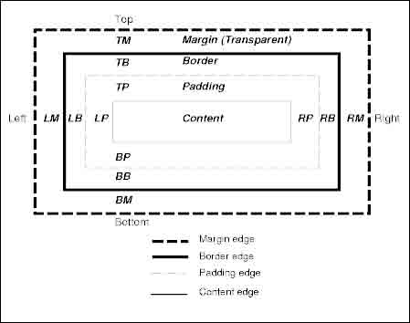
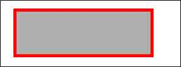
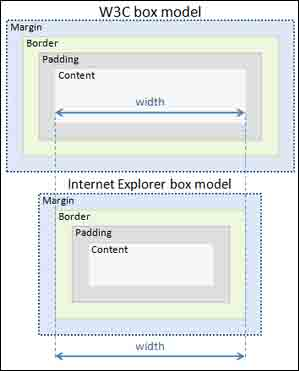
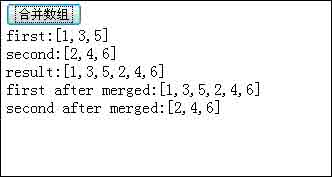

# 第 8 节 JQuery 工具函数

## 一、摘要

我们经常要使用脚本处理各种业务逻辑，最常见的就是数组和对象的操作，jQuery 工具函数为我们操作对象和数组提供了便利条件。

## 二、前言

大部分人仅仅使用 jQuery 的选择器选择对象, 或者实现页面动画效果，在处理业务逻辑时常常自己编写很多算法。本文提醒各位 jQuery 也能提高我们操作对象和数组的效率，并且可以将一些常用算法扩充到 jQuery 工具函数中，实现脚本函数的复用。

## 三、什么是工具函数

工具函数是指在 jQuery 对象(即变量"\$")上定义的函数，这些函数都是工具类函数，比如 C#中最常用的 trim()函数：

```js
$.trim("  text   "); 
```

在原始 javascript 中并没有提供同时去除前后空格的 trim 函数，所以这一类常用的工具函数统称为 "Utilities" 函数。对应 jQuery 官方文档： http://docs.jquery.com/Utilities

"\$"其实是"window"对象的属性，所以下面几句话是等价的：

```js
 $.trim("  text   ");
window.$.trim("  text   ");
window.jQuery("  text   ");
jQuery.trim("  text   "); 
```

## 四、工具函数分类

工具函数主要分为下面几类：

*   浏览器及特性检测
*   数组和对象操作
*   测试操作
*   字符串操作
*   Url 操作

区别于前几章的讲解方式，本文不在列举函数列表。大家在应用中，比如遇到想操作一个字符串，可以首先从在** “API 文档/Utilities/字符串操作” **中查找是否已经提供了快捷的工具函数，如果没有再考虑自己开发。

下面使用实例具体的每个分类下常用的工具函数。

## 五、浏览器及特性检测

jQuery 的优秀就在于其跨浏览器的特性，通常我们不用再针对不同浏览器书写不同的代码。但是如果是 jQuery 开发人员或者插件开发人员就要自行处理浏览器差异，以便为用户提供跨浏览器的特性。

jQuery 提供了下列属性用于获取浏览器特性：

[jQuery.support](http://api.jquery.com/jQuery.support/) ： 1.3 版本新增

[jQuery.browser](http://api.jquery.com/jQuery.browser/) ： 已废除

[jQuery.browser.version](http://api.jquery.com/jQuery.browser/) ： 已废除

[jQuery.boxModel](http://api.jquery.com/jQuery.boxModel/) ： 已废除

在 1.3 版本中已经废除了三个属性，这里不再讲解。让我们将注意力放在 **jQuery.support** 函数上。

### jQuery.support

**返回值**：[Object](http://api.jquery.com/Types/#Object)

**说明：**

jQuery 1.3 新增一组用于展示不同浏览器各自特性和 bug 的属性集合。

jQuery 提供了一系列属性，你也可以自由增加你自己的属性。其中许多属性是很低级的，所以很难说他们能否在日新月异的发展中一直保持有效，但这这些主要用于插件和内核开发者。

所有这些支持的属性值都通过特性检测来实现，而不是用任何浏览器检测。以下有一些非常棒的资源用于解释这些特性检测是如何工作的：

*   1、 http://peter.michaux.ca/articles/feature-detection-state-of-the-art-browser-scripting

*   2、 http://yura.thinkweb2.com/cft/

*   3、 http://www.jibbering.com/faq/faq*notes/not*browser_detect.html

jQuery.support 主要包括以下测试：

**boxModel** : 如果这个页面和浏览器是以 W3C CSS 盒式模型来渲染的，则等于 true。通常在 IE 6 和 IE 7 的怪癖模式中这个值是 false。在 document 准备就绪前，这个值是 null。

**cssFloat** : 如果用 cssFloat 来访问 CSS 的 float 的值，则返回 true。目前在 IE 中会返回 false,他用 styleFloat 代替。

**hrefNormalized** : 如果浏览器从 getAttribute("href")返回的是原封不动的结果，则返回 true。在 IE 中会返回 false，因为他的 URLs 已经常规化了。

**htmlSerialize** : 如果浏览器通过 innerHTML 插入链接元素的时候会序列化这些链接，则返回 true，目前 IE 中返回 false。

**leadingWhitespace** : 如果在使用 innerHTML 的时候浏览器会保持前导空白字符，则返回 true，目前在 IE 6-8 中返回 false。

**noCloneEvent** : 如果浏览器在克隆元素的时候不会连同事件处理函数一起复制，则返回 true，目前在 IE 中返回 false。

**objectAll** : 如果在某个元素对象上执行 getElementsByTagName("*")会返回所有子孙元素，则为 true，目前在 IE 7 中为 false。

**opacity** : 如果浏览器能适当解释透明度样式属性，则返回 true，目前在 IE 中返回 false，因为他用 alpha 滤镜代替。

**scriptEval** : 使用 appendChild/createTextNode 方法插入脚本代码时，浏览器是否执行脚本，目前在 IE 中返回 false，IE 使用 .text 方法插入脚本代码以执行。

**style** : 如果 getAttribute("style")返回元素的行内样式，则为 true。目前 IE 中为 false，因为他用 cssText 代替。

**tbody** : 如果浏览器允许 table 元素不包含 tbody 元素，则返回 true。目前在 IE 中会返回 false，他会自动插入缺失的 tbody。

**讲解** :

针对上面众多的浏览器特性属性，本文只讲解两个特性。

#### 1、盒式模型 boxModel

下图是 W3C 标准中的盒式模型图：



假设如下元素：

```js
<style type="text/css">
.boxModel
{
    width:200px;
    height:50px;
    padding:10px;
    border:solid 5px #FF0000;
    background-color:#acacac;
}
</style>
<div id="divBox" class="boxModel"> 
```

显示效果如图：



在 CSS 中设定元素宽度为 200px，下面以此元素为例讲解盒式模式。

**W3C 盒式模型：**

元素的宽度和高度为盒式模型图中的 Context 部分，不包括 padding，border 和 margin 部分。

目前除了 IE 所有的浏览器都仅支持 W3C 盒式模型。在 W3C 盒式模型中，示例中包含红框在内的区域内容宽度为 200+2*10+2*5=230px，高度为 50+2*10+2*5=80px。

**IE 盒式模型：**

设置的宽度包括 padding,border，实际内容宽度 content Width = width - padding – border

在 IE5.5 及更早的版本中，使用了此模型。在更高的 IE 版本上如果由于某些原因让浏览器运行在怪异模式下则也会使用此盒式模式。所以需要在页面上声明正确的 DOCTYPE，有关 DOCTYPE 请参考此文：

http://www.cnblogs.com/zhangziqiu/archive/2009/01/15/doctype.html

下面是两种盒式模式的对比：



我们可以使用 **jQuery.support.boxModel** 属性来获取浏览器是否使用了 W3C 盒式模型。true 表示使用 W3C boxModel。

#### 1、浮动样式

通过 javascript 脚本设置元素的 float 样式时，IE 和 FireFox 存在不同，IE 使用 style.styleFloat，FireFox 使用 style.cssFloat：

```js
div.style.styleFloat = "left"; //IE
div.stlye.cssFloat = "left"; //FF 
```

## jQuery.support.cssFloat## 属性返回 true 则表示可以使用 cssFloat 来设置 float 样式。IE 中返回 false；

注意，我们可以通过 CSS()方法设置 float 样式，jQuery 内部会自动帮我们判断是使用 styleFloat 还是 cssFloat：

```js
$("#divResult").css("float","left"); //兼容 IE 和 FF 
```

## 六、数组和对象操作

实现 UI 我们常常操作 DOM 对象或者 jQuery 包装集，但是实现算法或者业务逻辑时往往操作的是数组和对象。

下面讲解最常用的数组和对象相关的工具函数。

### 1、迭代

[jQuery.each(object,callback)](http://api.jquery.com/jQuery.each/#objectcallback)

**返回值：Object**

**说明：**

通用例遍方法，可用于例遍对象和数组。

不同于例遍 jQuery 对象的 $().each() 方法，此方法可用于例遍任何对象。回调函数拥有两个参数：第一个为对象的成员或数组的索引，第二个为对应变量或内容。如果需要退出 each 循环可使回调函数返回 false，其它返回值将被忽略。

**讲解：**

对于 jQuery 包装集我们可以使用 each(callback) 方法迭代包装集中的每一个元素。 callback 是一个会函数，接受一个参数表示当前访问对象的索引。

```js
$("img").each(function(i){
   this.src = "test" + i + ".jpg";
 }); 
```

对于数组我们可以使用 **jQuery.each(object,callback)** 来遍历，这等同于使用 for 循环。

注意传入的第一个参数可以是数组或者对象。如果数组，则遍历数组中的每一个对象。第一个参数表示索引,第二个参数表示值，this 表示当前遍历的元素，可以通过返回 false 终止迭代，比如下面的示例遍历到第二个元素后会终止：

```js
 $.each(["a", "b", "c"], function(i, n)
                {
                    alert("Item #" + i + ": " + n);//可以获取到 i 值
                    if (i >= 1)
                    {
                        return false;
                    }
                });

            $("#iterateArray").click(function(event)
            {
                var array = $.each(["a", "b", "c"], function(i, n)
                {
                    alert("Item #" + i + ": " + n ); //第一个参数 i 表示索引，this 表示当前遍历的对象
                    if (i >= 1)
                    {
                        return false;
                    }
                });
            }); 
```

如果传递的是对象，则遍历对象的每一个属性，即使函数返回 false 也依然会遍历完所有的属性，**第一个参数表示属性 key(属性名称,是 obejct 类型)，第二个参数表示值，this 表示当前属性的值：**

```js
 $("#iterateObject").click(function(event)
            {
                $.each({ name: "ziqiu.zhang", sex: "male", status: "single" }, function(i, n)
                {
                    alert("Item #" + i.toString() + ": " + n ); //第一个参数 i 表示属性的 key(object), this 表示属性值
                    if (i >= 1)
                    {
                        return false;
                    }
                });
            }); 
```

each 将是我们最常使用的函数，特别注意 each 虽然迭代每一个元素或属性，但是在迭代函数中并不会改变当前元素的值，也就是无法改变返回后的对象。如果需要改变数组中的每一个元素并且将结果返回，因使用 **jQuery.map(array,callback)** 函数。

### 2、筛选

[jQuery.grep(array,callback,[invert])](http://api.jquery.com/jQuery.grep/#arraycallbackinvert)

**返回值：Array**

**说明：**

使用过滤函数过滤数组元素。

此函数至少传递两个参数：待过滤数组和过滤函数。过滤函数必须返回 true 以保留元素或 false 以删除元素。

**讲解：**

默认 invert 为 false，即过滤函数返回 true 为保留元素。如果设置 invert 为 true，则过滤函数返回 true 为删除元素。

下面的示例演示如何过滤数组中索引小于 0 的元素：

```js
$.grep( [0,1,2], function(n,i){
  return n > 0;
}); 
```

返回的结果是[1,2]

### 3、转化

[jQuery.map(array,callback)](http://api.jquery.com/jQuery.map/#arraycallback)

**返回值：Array**

**说明：**

将一个数组中的元素转换到另一个数组中。

作为参数的转换函数会为每个数组元素调用，而且会给这个转换函数传递一个表示被转换的元素作为参数。转换函数可以返回转换后的值、null（删除数组中的项目）或一个包含值的数组，并扩展至原始数组中。

**讲解：**

1.3.2 版本中此函数和 each 函数已经几乎相同(以前稍有不同)，现在唯一的区别就是回调函数可以改变当前元素.返回 null 则删除当前元素。

下面是几个例子：

```js
 var arr = [ "a", "b", "c", "d", "e" ]
    $("div").text(arr.join(", "));

    arr = jQuery.map(arr, function(n, i){
      return (n.toUpperCase() + i);
    });
    $("p").text(arr.join(", "));

    arr = jQuery.map(arr, function (a) { return a + a; });
    $("span").text(arr.join(", ")); 
```

### 4、合并

合并对象是我们常常编写的功能，通常使用臃肿的 for 循环来进行。jQuery 为我们提供了很多功能的合并函数：

**(1)、** [jQuery.extend([deep],target,object1,[objectN])](http://api.jquery.com/jQuery.extend/#deeptargetobject1objectN)

**说明：**

*   用一个或多个其他对象来扩展一个对象，返回被扩展的对象。

*   如果不指定 target，则给 jQuery 命名空间本身进行扩展。这有助于插件作者为 jQuery 增加新方法。

*   如果第一个参数设置为 true，则 jQuery 返回一个深层次的副本，递归地复制找到的任何对象。否则的话，副本会与原对象共享结构。

*   为定义的属性将不会被复制，然而从对象的原型继承的属性将会被复制。

**举例：**

合并 settings 和 options，修改并返回 settings:

```js
var settings = { validate: false, limit: 5, name: "foo" }; 
var options = { validate: true, name: "bar" }; 
jQuery.extend(settings, options); 
```

结果：

```js
settings == { validate: true, limit: 5, name: "bar" } 
```

**(2)、** [jQuery.makeArray(obj)](http://api.jquery.com/jQuery.makeArray/#obj)

**说明：**

*   将类数组对象转换为数组对象。

*   类数组对象有 length 属性，其成员索引为 0 至 length - 1。实际中此函数在 jQuery 中将自动使用而无需特意转换。

**举例：**

将 DOM 对象集合转换为数组:

```js
var arr = jQuery.makeArray(document.getElementsByTagName("div")); 
```

**(3)、** [jQuery.inArray(value,array)](http://api.jquery.com/jQuery.inArray/#valuearray)

**说明：**

*   确定第一个参数在数组中的位置，从 0 开始计数(如果没有找到则返回 -1 )。

**举例：**

查看对应元素的位置：

```js
var arr = [ 4, "Pete", 8, "John" ];
jQuery.inArray("John", arr);  //3
jQuery.inArray(4, arr);  //0
jQuery.inArray("David", arr);  //-1 
```

**(4)、** [jQuery.merge(first,second)](http://api.jquery.com/jQuery.merge/#firstsecond)

**说明：**

*   合并两个数组

*   返回的结果会修改第一个数组的内容——第一个数组的元素后面跟着第二个数组的元素。要去除重复项，请使用$.unique()

**举例：**

合并两个数组到第一个数组上：

```js
$.merge( [0,1,2], [2,3,4] ) 
```

结果：

```js
[0,1,2,2,3,4] 
```

**(5)、** [jQuery.unique(array)](http://api.jquery.com/jQuery.unique/#array)

**说明：**

*   删除数组中重复元素。只处理删除 DOM 元素数组，而不能处理字符串或者数字数组。

**举例：**

删除重复 div 标签:

```js
$.unique(document.getElementsByTagName("div")); 

[<div>, <div>, ...] 
```

上面的函数看着有些混乱。看看我们以后会常用的。

首先是[jQuery.merge(first,second)](http://api.jquery.com/jQuery.merge/#firstsecond)，将两个数组合并。下面这个示例说明如何使用此函数：

```js
<html >
<head>
    <title>jQuery Utilities - jQuery.merge</title>

    <script src="../scripts/jquery-1.3.2-vsdoc2.js" type="text/javascript"></script>

    <script type="text/javascript">
        $(function()
        {
            $("#go").click(function(event)
            {
                $("#divResult").html("");
                var first = [1, 3, 5];
                $("#divResult").append("<span>first:[" + first.join(",") + "]</span>").append("<br/>");
                var second = [2, 4, 6];
                $("#divResult").append("<span>second:[" + second.join(",") + "]</span>").append("<br/>");
                var result = $.merge(first, second);
                $("#divResult").append("<span>result:[" + result.join(",") + "]</span>").append("<br/>");
                $("#divResult").append("<span>first after merged:[" + first.join(",") + "]</span><br/>");
                $("#divResult").append("<span>second after merged:[" + second.join(",") + "]</span><br/>");

            });
        });       

    </script>

</head>
<body>
    <button id="go">
        合并数组</button>
    <br />
    <div id="divResult">
    </div>
</body>
</html> 
```

结果如图：



**另外不能因为有了 jQuery 就忘记我们的原始 javascript。比 merge 更常用的其实是 join 和 split 函数。**

merge 函数会改变第一个合并的数组，如果是我设计我就不会这么做。因为返回值已经是合并后的数组了。如此设计让函数产生歧义。

列表中的那么多函数不再一一讲解。先用先查。除了 [jQuery.extend](http://api.jquery.com/jQuery.extend/#deeptargetobject1objectN) 这个不得不提的函数。下面单提一个小结讲解。

### 5、jQuery.extend

在开发插件的时候最常用此函数函数来处理 options。

下面是 fancybox 插件获取 options 的代码：

```js
settings = $.extend({}, $.fn.fancybox.defaults, settings); 
```

上面的代码 target 是一个空对象，将默认设置 defaults 作为第一个对象，将用户传入的设置 setting 合并到 default 上，setting 上有的属性以 setting 为准。setting 没有传入的属性则使用 default 的默认值。然后将合并的结果复制给 target 并作为函数返回值返回。

看一个完整的示例：

```js
var empty = {}
var defaults = { validate: false, limit: 5, name: "foo" };
var options = { validate: true, name: "bar" };
var settings = jQuery.extend(empty, defaults, options); 
```

结果：

```js
settings == { validate: true, limit: 5, name: "bar" }
empty == { validate: true, limit: 5, name: "bar" } 
```

target 参数要传递一个空对象是因为 target 的值最后将被改变。比如：

```js
var defaults = { validate: false, limit: 5, name: "foo" };
var options = { validate: true, name: "bar" };
var settings = jQuery.extend(defaults, options); 
```

上面的代码将 defaults 作为 target 参数，虽然最后 settings 的结果一样，但是**defaults 的值被改变了！而插件中的默认值应该都是固定！**所以使用时请注意 target 参数的用法。

下面是我的完整示例和结果：

```js
<html >
<head>
    <title>jQuery Utilities - jQuery.extend</title>

    <script src="../scripts/jquery-1.3.2-vsdoc2.js" type="text/javascript"></script>

    <script type="text/javascript">
        $.toObjectString = function (obj)
        {
            var result = "{";
            var counter = 0;
            $.each(obj, function(i, n)
            {
                if (counter > 0) { result += ","; }
                result += i.toString() + ":" + n.toString();
                counter++; 
            });
            result += "}";
            return result;
        }

        $(function()
        {
            $("#go1").click(function(event)
            {
                $("#divResult").html("");

                var empty = {}
                var defaults = { validate: false, limit: 5, name: "foo" };
                var options = { validate: true, name: "bar" };

                $("#divResult").append("<span>empty:" + $.toObjectString(empty) + "</span>").append("<br/>");
                $("#divResult").append("<span>defaults:" + $.toObjectString(defaults) + "</span>").append("<br/>");
                $("#divResult").append("<span>options:" + $.toObjectString(options) + "</span>").append("<br/>");                

                var settings = jQuery.extend(empty, defaults, options);
                $("#divResult").append("<span>settings after extend:" + $.toObjectString(settings) + "</span>").append("<br/>");
                $("#divResult").append("<span>defaults after extend:" + $.toObjectString(defaults) + "</span>").append("<br/>");
                $("#divResult").append("<span>options after extend:" + $.toObjectString(options) + "</span>").append("<br/>");

            });

            $("#go2").click(function(event)
            {
                $("#divResult").html("");

                var defaults = { validate: false, limit: 5, name: "foo" };
                var options = { validate: true, name: "bar" };
                $("#divResult").append("<span>defaults:" + $.toObjectString(defaults) + "</span>").append("<br/>");
                $("#divResult").append("<span>options:" + $.toObjectString(options) + "</span>").append("<br/>");

                var settings = jQuery.extend(defaults, options);
                $("#divResult").append("<span>settings after extend:" + $.toObjectString(settings) + "</span>").append("<br/>");
                $("#divResult").append("<span>defaults after extend:" + $.toObjectString(defaults) + "</span>").append("<br/>");
                $("#divResult").append("<span>options after extend:" + $.toObjectString(options) + "</span>").append("<br/>");

            });
        });       

    </script>

</head>
<body>
    <button id="go1" style="height:40px;width:400px;">
        jQuery.extend(empty, defaults, options)</button>
    <button id="go2"  style="height:40px;width:400px;">
        jQuery.extend(defaults, options)</button>
    <br />
    <div id="divResult">
    </div>
</body>
</html> 
```

**结果：**


## 七、测试工具函数

测试工具函数主要用于判断对象是否是某一种类型，返回的都是 Boolean 值：

[jQuery.isArray(obj)](http://api.jquery.com/jQuery.isArray/#obj)

[jQuery.isFunction(obj)](http://api.jquery.com/jQuery.isFunction/#obj)

同时别忘记了 javascript 中自带的 isNaN 和 isFinite：

```js
var test = "123";
alert(isNaN(test));
alert(isFinite(test)); 
```

isNaN 函数判断参数是否是非数字，如果是数字则返回 false。

isFinite 函数检查其参数是否是无穷大。如果参数是 NaN（非数字），或者是正、负无穷大的数，则返回 false.否则返回 true。

## 八、字符处操作工具函数

目前核心类库中只有一个字符串工具函数:

[jQuery.trim(str)](http://api.jquery.com/jQuery.trim/#str)

**返回值： string**

**说明：去掉字符串起始和结尾的空格。**

**举例：**

去掉字符串起始和结尾的空格：

```js
$.trim("  hello, how are you?  "); 
```

结果：

```js
"hello, how are you?" 
```

## 九、Url 操作工具函数

[jQuery.param(obj)](http://api.jquery.com/jQuery.param/#obj)

**88 返回值： string**

**说明：**

将表单元素数组或者对象序列化，是.serialize()的核心方法。

数组或 jQuery 对象会按照 name/value 对进行序列化，普通对象按照 key/value 对进行序列化。

**举例：**

```js
 var params = { width:1680, height:1050 };
    var str = jQuery.param(params);
    $("#results").text(str); 
```

结果：

```js
width=1680&height=1050 
```

jQuery 将其归为 Urls 分类，因为此方法通常用于发送 GET 请求时将对象作为 urls 参数传递给服务端。

## 十、扩展工具函数与 jQuery 包装集函数

扩展工具函数只需要对 jQuery(即"\$")进行扩展。通常开发工具函数或者插件的人希望在开发时使用"\$"，但因为"\$"有可能和其他脚本库冲突，所以通常我们使用下面的语法开发工具函数：

```js
 (function($)
        {
            $.myExtendMethod = function(o)
            {
                alert(0);
            };            
        })(jQuery); 
```

在函数体内的"\$"能保证是代表 jQuery 对象。

然后使用这种方式开发不能享受到智能感知的便利。一般我们将扩展工具函数和扩展 jQuery 包装集函数都放在一个单独的文件中。

下面这个示例演示如何添加自定义的 jQuery 工具方法和 jQuery 包装集方法：

```js
/// <reference path="jquery-1.3.2-vsdoc2.js" />
jQuery.myExtendMethod = function(o)
{
    ///    <summary>
    ///        扩展方法注释.
    ///    </summary>
    ///    <param name="o" type="String">参数提示文字</param>
    ///    <returns type="string" >返回值提示文字</returns>
    alert(0);
};

jQuery.fn.myExtendMethod = function(o)
{
    ///    <summary>
    ///        扩展方法注释.
    ///    </summary>
    ///    <param name="o" type="String">参数提示文字</param>
    ///    <returns type="string" >返回值提示文字</returns>
    alert(0);
}; 
```

通过第一行 reference，我们可以在此 js 文件中继续使用 jQuery 脚本智能感知。

jQuery.myExtendMethod 方法扩展的工具函数。

jQuery.fn.myExtendMethod 方法扩展的是 jQuery 包装集函数，即为使用$()获取到的对象添加了方法。

同理使用 XML 注释，比如<summary> 还可以为自定义方法添加智能感知提示。脚本中的 XML 注释和.NET 中的一样。

## 十一、总结

jQuery 提供了许多的工具函数，在一般情况下可以满足我们的需要。但是对于像 JSON 格式化一类的操作，需要我们自己扩展，现有的各种扩展组件资源将提高我们的开发效率，本系列 Ajax 章节就介绍的一个 JSON 序列化的组件 jQuery.json。更多的组件需要大家在工作中挖掘。