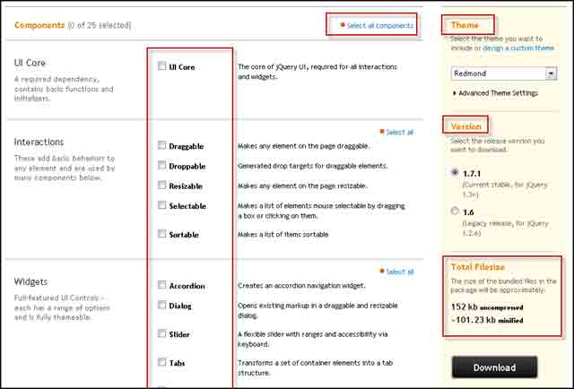
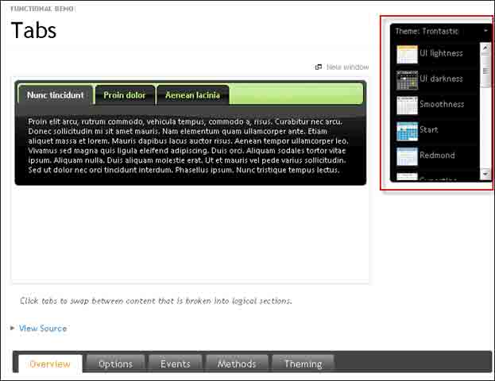
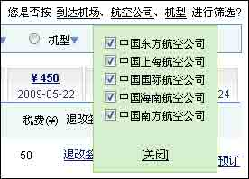
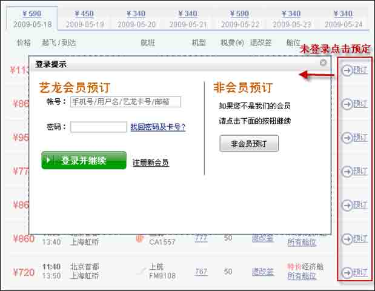
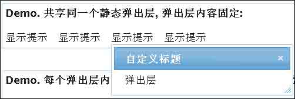
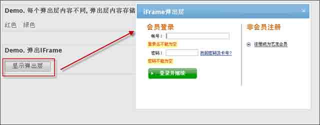
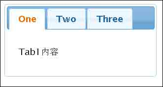
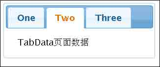
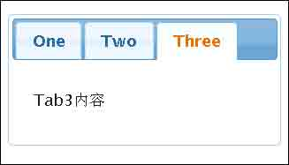
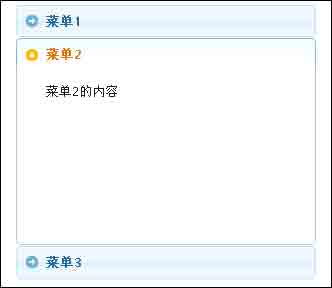

# 第 9 节 jQuery UI 常用功能实战

## 一、摘要

本文是实战篇，使用 jQueryUI 完成制作网站的大部分常用功能。

## 二、前言

经过收集，整理了一些经常使用 javascript 实现的功能。实现这些功能的主角不是让人眼花缭乱的 jQuery 插件，而是 jQuery UI。

如果你还在为了一个小小的特效而去下载并安装插件，发现 Bug 还没有人替你解决，记住插件是我们没有办法的最后选择。

**使用插件有太多的坏处：**

*   1.不利于维护

*   2.增加页面大小

*   3.不利于成员间交流共享，具有学习成本。

*   4.不够健壮，不能保证插件版本一直更新并修复所有问题。

下面就引入今天的主角：jQuery UI

## 三、jQuery UI

jQuery UI 是 jQuery 的一部分，是在 jQuery 之上的一套专门用于 UI 交互的类库。使用 jQuery UI 可以实现底层交互，各种高级特效，动画，并且可定制主题。

我们可以用它轻松的构建高度交互的 Web 应用程序。

官方首页： http://jqueryui.org/

下载： http://labfile.oss.aliyuncs.com/files0422/jquery-ui-1.11.4.custom.zip

示例和文档： http://jqueryui.com/demos/

皮肤： http://jqueryui.com/themeroller/

jQuery UI 的在线网站十分强大。 首先就是在下载时可以组装自己想要的功能定制下载：



并且针对各种控件不仅提供了详细的参数说明和实例， 还可以随时更换实例的皮肤：



本文主要讲解实例，大家可以通过实例代码快速上手 jQuery UI。使用 jQuery UI 我们可以再不借助其他插件的情况下完成大部分页面应用，说其是一个官方的超级 UI 插件也不为过。包含所有功能的 jQuery UI 类库文件为 188K，启用 Gzip 压缩后是 45K。虽然较大但是一次加载全网站获益。而且 45K 大小在当今的互谅网时代还算可以接受。

目前还没有 jQuery UI 的中文教程。因为本文是实战篇， 所以不会仔细讲解基础内容。在后面的章节中我会加入 jQuery UI 的基础教程。

## 四、准备工作

本章源代码下载（实验楼环境可下载）：

http://labfile.oss.aliyuncs.com/files0422/Code-jQueryStudy-10.rar

我将所有相关的文件， 包括各种类库文件， Theme 模板放置在如下路径：

http://www.dotnetapi.com/JSLib/

此路径开通了目录浏览， 可以直接查找需要的文件。

另外也可以从 Google 上引用文件，Google 的 CDN 速度更快也更有保证，参见：[Google's CDN](http://code.google.com/apis/ajaxlibs/documentation/index.html#jqueryUI)

本文的实例的所有引用都使用 WebConfig.ResourceServer 这个属性：

```js
public class WebConfig
{
    public static string ResourceServer = @"http://www.dotnetapi.com/";
} 
```

## 五、弹出层对话框

弹出框是最常用最实用的功能。 先来看一下艺龙网上的一些应用场景。

### 1\. 艺龙网应用场景举例

**(1) 静态提示类弹出层。弹出层的内容是固定的。**



**(2) 动态提示类弹出层。弹出层内容是根据事件源变化的。**


**(3)遮罩类弹出层。弹出时背景变灰并不可点击。**



### 2\. 应用实例

使用 jQuery UI 的 Dialog 组件。我以轻松实现上面三种效果。

Dialog 组件的主要特点是可以拖动(Draggable)，可以改变大小(Resizable) 。

示例完整代码如下：

```js
<%@ Page Language="C#" %>

<!DOCTYPE html PUBLIC "-//W3C//DTD XHTML 1.0 Transitional//EN" "http://www.w3.org/TR/xhtml1/DTD/xhtml1-transitional.dtd">
<html >
<head id="Head1" runat="server">
    <title>jQuery UI - 弹出层应用实例 Dialog</title>   
    <!--black-tie,blitzer,blitzer,dot-luv,excite-bike,hot-sneaks,humanity,mint-choc,redmond,smoothness,south-street,start,swanky-purse,trontastic,ui-darkness,ui-lightness,vader-->
    <link rel="stylesheet" type="text/css" href="<%=WebConfig.ResourceServer +"/JsLib/jquery/themes/redmond/style.css"%>" /> 
    <script type="text/javascript" src="<% =WebConfig.ResourceServer %>/JsLib/jquery/jquery-min-lastest.js"></script>    
    <script src="<% =WebConfig.ResourceServer %>/JsLib/jquery/ui/jquery-ui-all-min-lastest.js"
        type="text/javascript"></script>
    <% if (false)
       {%><script src="~/js/jquery-vsdoc-lastest.js" type="text/javascript"></script>
    <% }%>
    <script type="text/javascript">
        /*========== 必须放在头部加载的语句块。 尽量避免使用 ==========*/
    </script>
    <style type="text/css">
        </style>
</head>
<body>
    <!-- Demo 静态提示类弹出层 -->
    <div class="ui-widget ui-widget-content ui-corner-all" style="width: 700px; padding: 5px;">
        <h3>Demo. 共享同一个静态弹出层， 弹出层内容固定: </h3>
        <div>
            <span id="spanShowTip1">显示提示</span>&nbsp;&nbsp; <span id="spanShowTip2">显示提示</span>&nbsp;&nbsp;
            <span id="spanShowTip3">显示提示</span>&nbsp;&nbsp; <span id="spanShowTip4">显示提示</span>&nbsp;&nbsp;
        </div>
    </div>
    <br />
    <br />
    <!-- Demo 动态提示类弹出层 -->
    <div class="ui-widget ui-widget-content ui-corner-all" style="width: 700px; padding: 5px;">
        <h3>Demo. 每个弹出层内容不同， 弹出层内容存储在事件源的元素属性中: </h3>
        <div>
            <span id="spanShowDataTip1" data="颜色是红色">红色</span>&nbsp;&nbsp;
            <span id="spanShowDataTip2" data="颜色是绿色">绿色</span>&nbsp;&nbsp;
        </div>
    </div>
    <br />
    <br />
    <!-- Demo 遮罩类弹出层 -->
    <div class="ui-widget ui-widget-content ui-corner-all" style="width: 700px; padding: 5px;">
        <h3>Demo. 弹出 IFrame </h3>
        <div>
            <input type="button" id="btnShowIframe" name="btnShowIframe" value="显示弹出层"/>
        </div>
    </div>

    <!-- 提示类弹出层 -->
    <div id="divTip" title="自定义标题">
        <p>弹出层</p>
    </div>
    <!-- 遮罩类弹出层 -->
    <div id="divIframe" title="iFrame 弹出层" style="text-align:center;">
        <iframe src="http://mirrors.aliyuncs.com" width="450px" height="230px"></iframe>
    </div>
    <script type="text/javascript">
        /*==========用户自定义方法==========*/

        /*==========事件绑定==========*/
        $(function()
        {
            //静态提示类弹出层
            $("span[id^=spanShowTip]").css("cursor", "pointer").click(function(event)
            {
                $("*").stop();
                event.stopPropagation();
                var top = $(event.target).offset().top + 20;
                var left = $(event.target).offset().left;
                $("#divTip").dialog("option", "position", [left, top]);
                $("#divTip").dialog("open");
            });
            //动态提出类弹出层
            $("span[id^=spanShowDataTip]").css("cursor", "pointer").click(function(event)
            {
                $("*").stop();
                $("#divTip").dialog("close");
                event.stopPropagation();
                var top = $(event.target).offset().top + 20;
                var left = $(event.target).offset().left;
                $("#divTip").html($(event.target).attr("data"));
                $("#divTip").dialog("option", "position", [left, top]);
                $("#divTip").dialog("open");
            });
            //遮罩类弹出层
            $("#btnShowIframe").click(function(event)
            {
                event.preventDefault();
                event.stopPropagation();
                $("#divIframe").dialog("open");
            });

            //单击自身取消冒泡
            $("#divTip, #divIframe").bind("click", function(event)
            {
                event.stopPropagation();
            });

            //document 对象单击隐藏所有弹出层
            $(document).bind("click", function(event)
            {
                $("#divTip").dialog("close");
                $("#divIframe").dialog("close");
            });
        });

        /*==========加载时执行的语句==========*/
        $(function()
        {

            //初始化提示类弹出层
            $("#divTip").dialog({
                show: null,
                bgiframe: false,
                autoOpen: false
            });

            //初始化遮罩类弹出层
            $("#divIframe").dialog({
                show: null,
                bgiframe: false,
                autoOpen: false,
                width: 500,
                height: 300,
                draggable: true,                
                resizable: false,
                modal: true
            });            
        });
    </script>
</body>
</html> 
```

效果如图：

**静态提示类弹出层：**



**动态提示类弹出层：**


**遮罩类弹出层：**



### 3.关键点讲解

**(1) 计算弹出层位置**

提示类弹出框最重要的是计算弹出框的位置。 通过事件对象获取到事件源， 使用 offset()函数计算事件源相对于 document 的位置：

```js
 var top = $(event.target).offset().top;
           var left = $(event.target).offset().left; 
```

因为是相对于 document，即页面左上角的位置，所以**需要将弹出层放在 Body 元素中的第一层。**即父类就是 body。如果包含在其他元素中，需要确定任何一个父类的 position 样式设置为了 relative。

计算出来的 top 和 left 是事件源的位置，在此位置显示会将事件源对象遮盖住。所以通常需要手工做一些偏移，比如 top+20。

**(2) 取消冒泡和浏览器默认行为**

如果我们为 document 对象绑定了单击后关闭弹出层的事件，那么就一定要取消事件的冒泡。使用 event 对象的 stopPropagation()方法可以取消冒泡。

```js
event.stopPropagation(); 
```

对于具有默认行为的元素，比如提交按钮的提交表单行为，**< a >**元素的超链接行为等，我们如果在这些元素上应用事件，还需要取消它们的默认行为：

```js
event.preventDefault(); 
```

**(3) 设置动画效果与取消动画**

通过设置 dialog 的配置项的 show 属性， 可以设置显示 dialog 时候的动画效果：

```js
$('.selector').dialog({ show: 'slide' }); 
```

show 默认为 null 即无动画， 可以是使用下列值：

```js
'blind', 'clip', 'drop', 'explode', 'fold', 'puff', 'slide', 'scale', 'size', 'pulsate'. 
```

对于这些动画的效果， 可以在此页观看： http://jqueryui.com/demos/show/

当一个动画效果执行时， 如果用户在此对这个元素进行操作， 就会出现各种问题， 比如定位不准确等。 所以如果应用了动画， 我们在对其操作时需要使用 stop()函数来停止动画， 通常是停止虽有元素的动画：

```js
$("*").stop(); 
```

但是即使停止了动画再进行操作， 如果操作的太快也容易产生问题。 所以至于是否使用动画需要经过权衡决定。

**(4) 动态提示类弹出层的数据传递**

动态提示类弹出层的数据是不同的， 本文实例使用的是将数据存储在元素属性 data 上：

```js
<span id="spanShowDataTip1" data="颜色是红色">红色</span> 
```

这是一种简单直观的方式。比较容易编程实现(尤其是在使用 MVC 编程模型的时候。)

还有一种常用方式是使用 javascript 变量存储数据。这两种方式在第五章时有过讲解：

http://www.cnblogs.com/zhangziqiu/archive/2009/05/06/jQuery-Learn-5.html

**(5)更换主题**

大家注意实例中的弹出层没有为其编辑任何样式， 但是显示出来后已经被美化过了。 这是因为我引用了 jQuery UI 的主题：

```js
 <!--black-tie,blitzer,blitzer,dot-luv,excite-bike,hot-sneaks,humanity,mint-choc,redmond,smoothness,south-street,start,swanky-purse,trontastic,ui-darkness,ui-lightness,vader-->
    <link rel="stylesheet" type="text/css" href="<%=WebConfig.ResourceServer +"/JsLib/jquery/themes/redmond/style.css"%>" /> 
```

注释中有很多的主题， 只需要将引用路径中的"redmond"改为其中任何一个， 弹出层的样式会立刻发生变化。

VS 中有一个 Bug， 就是针对 link 标签， href 中的语句块编译有问题， 某些情况下<%%>不被编辑解析。 所以我使用上面代码中的方式构造 href 属性值。

可以在下面的地址查看各个主题的效果：

http://jqueryui.com/themeroller/#themeGallery

## 六、Tab 标签

不刷新页面， 在页面中的不同标签间切换：


本实例通过 jQuery UI 的 Tabs 组件实现。 Tabs 组件的使用与 dialog 一样十分简单， 默认的配置即可实现最简单的 tab， 通过设置更多的 options 可以实现更复杂的应用。

### 1.应用实例

源代码：

```js
<%@ Page Language="C#" %>
<!DOCTYPE html PUBLIC "-//W3C//DTD XHTML 1.0 Transitional//EN" "http://www.w3.org/TR/xhtml1/DTD/xhtml1-transitional.dtd">
<html >
<head id="Head1" runat="server">
    <title>jQuery UI - 弹出层应用实例 Dialog</title>
    <!--black-tie,blitzer,blitzer,dot-luv,excite-bike,hot-sneaks,humanity,mint-choc,redmond,smoothness,south-street,start,swanky-purse,trontastic,ui-darkness,ui-lightness,vader-->
    <link rel="stylesheet" type="text/css" href="<%=WebConfig.ResourceServer +"/JsLib/jquery/themes/redmond/style.css"%>" />
    <script type="text/javascript" src="<% =WebConfig.ResourceServer %>/JsLib/jquery/jquery-min-lastest.js"></script>
    <script src="<% =WebConfig.ResourceServer %>/JsLib/jquery/ui/jquery-ui-all-min-lastest.js"
        type="text/javascript"></script>
    <% if (false)
       {%><script src="~/js/jquery-vsdoc-lastest.js" type="text/javascript"></script>
    <% }%>
    <script type="text/javascript">
        /*========== 必须放在头部加载的语句块。尽量避免使用 ==========*/
    </script>
    <style type="text/css">
        </style>
</head>
<body>
    <!--Demo.默认 Tab 与 Ajax Tab -->
    <div id="tabs1" style="width:300px;">
        <ul>
            <li><a href="#tabs1-1">One</a></li>
            <!-- Ajax Tab -->
            <li><a href="TabData.htm">Two</a></li>
            <li><a href="#tabs1-3">Three</a></li>
        </ul>
        <div id="tabs1-1">
            <p>Tab1 内容</p>
        </div>
        <div id="tabs1-3">
            <p>Tab3 内容</p>
        </div>
    </div>
    <br />
    <br />
    <br />
    <!--Demo. 可折叠的 Tab -->
    <div id="tabs2" style="width: 300px;">
        <ul>
            <li><a href="#tabs2-1">One</a></li>
            <li><a href="#tabs2-2">Two</a></li>
            <li><a href="#tabs2-3">Three</a></li>
        </ul>
        <div id="tabs2-1">
            <p>Tab1 内容</p>
        </div>
        <div id="tabs2-2">
            <p>Tab2 内容</p>
        </div>
        <div id="tabs2-3">
            <p>Tab3 内容</p>
        </div>
    </div>
    <br />
    <br />
    <br />
    <!--Demo. 鼠标滑动即切换的 Tab -->
    <div id="tabs3" style="width: 300px;">
        <ul>
            <li><a href="#tabs3-1">One</a></li>
            <li><a href="#tabs3-2">Two</a></li>
            <li><a href="#tabs3-3">Three</a></li>
        </ul>
        <div id="tabs3-1">
            <p>Tab1 内容</p>
        </div>
        <div id="tabs3-2">
            <p>Tab2 内容</p>
        </div>
        <div id="tabs3-3">
            <p>Tab3 内容</p>
        </div>
    </div>
    <script type="text/javascript">
        /*==========用户自定义方法==========*/

        /*==========事件绑定==========*/
        $(function()
        {

        });

        /*==========加载时执行的语句==========*/
        $(function()
        {
            //默认 Tabs
            $("#tabs1").tabs();
            //可折叠的 Tabs
            $("#tabs2").tabs({
                collapsible: true
            });
            //鼠标滑动即切换的 Tabs
            $("#tabs3").tabs({
                event: "mouseover"
            });
        });        
    </script>
</body>
</html> 
```

**效果：**

**1\. **默认设置的 Tabs， Two 标签内容使用 Ajax 获取





**2\. **再折叠 tab


**3\. **鼠标滑动即切换的 tab



### 2.要点讲解

**(1) 注意 Tabs 中的 HTML 结构。**

使用 ul 构建标签。 内容 div 一定要和标签关联， 没有关联的 div 将不被处理直接显示。

**(2) 使用 Ajax 可以不指定内容容器， 但是也可以将 Ajax 内容放入指定容器中。**

```js
<li><a href="hello/world.html" title="Todo Overview"> ... </a></li>

<div id="Todo_Overview"> ... </div> 
```

**(3) 活用事件**

tab 有很多事件：

select, load, show, add, remove, enable, disable

使用这些事件可以完成很多复杂任务。 需要注意事件的签名：

```js
$('#example').bind('tabsselect', function(event, ui) {

    // Objects available in the function context:
    ui.tab     // anchor element of the selected (clicked) tab
    ui.panel   // element, that contains the selected/clicked tab contents
    ui.index   // zero-based index of the selected (clicked) tab

}); 
```

第一个是事件对象， 第二个 ui 对象是传递的额外参数， 我们可以获取 tab 对象， tab 所在容器和 tab 的索引值。

比如我们可以在事件中做验证：

```js
$('#example').tabs({
    select: function(event, ui) {
        var isValid = ... // form validation returning true or false
        return isValid;
    }
}); 
```

或者当添加一个 tab 时立刻切换到选中状态：

```js
var $tabs = $('#example').tabs({
    add: function(event, ui) {
        $tabs.tabs('select', '#' + ui.panel.id);
    }
}); 
```

活学活用， 更多应用大家也可以参见 tab 组件的官方文档：

http://jqueryui.com/demos/tabs

## 七、手风琴菜单

使用 jQuery UI 的 accordion 组件可以实现手风琴菜单。 效果见下图。

accordion 文档地址： http://jqueryui.com/demos/accordion/

### 1.实例效果



### 2.实例代码

```js
<%@ Page Language="C#" %>

<!DOCTYPE html PUBLIC "-//W3C//DTD XHTML 1.0 Transitional//EN" "http://www.w3.org/TR/xhtml1/DTD/xhtml1-transitional.dtd">
<html >
<head id="Head1" runat="server">
    <title>jQuery UI - 手风琴菜单应用实例 Accordion </title>
    <!--black-tie,blitzer,blitzer,dot-luv,excite-bike,hot-sneaks,humanity,mint-choc,redmond,smoothness,south-street,start,swanky-purse,trontastic,ui-darkness,ui-lightness,vader-->
    <link rel="stylesheet" type="text/css" href="<%=WebConfig.ResourceServer +"/JsLib/jquery/themes/redmond/style.css"%>" />
    <script type="text/javascript" src="<% =WebConfig.ResourceServer %>/JsLib/jquery/jquery-min-lastest.js"></script>
    <script src="<% =WebConfig.ResourceServer %>/JsLib/jquery/ui/jquery-ui-all-min-lastest.js"
        type="text/javascript"></script>
    <% if (false)
       {%><script src="~/js/jquery-vsdoc-lastest.js" type="text/javascript"></script>
    <% }%>
    <script type="text/javascript">
        /*========== 必须放在头部加载的语句块。 尽量避免使用 ==========*/
    </script>
    <style type="text/css">
        body
        {
            font-size: 12px;
        }
    </style>
</head>
<body>
    <!-- Demo. 默认配置的 Accordion 菜单 -->
    <div style="width: 300px; float:left; margin-left:20px;">
        <div id="accordion1">
            <h3><a href="#">菜单 1</a></h3>
            <div>
                菜单 1 的内容<br />
                菜单 1 的内容<br />
                菜单 1 的内容<br />
                菜单 1 的内容<br />
                菜单 1 的内容<br />
                菜单 1 的内容<br />
                菜单 1 的内容<br />
            </div>
            <h3><a href="#">菜单 2</a></h3>
            <div>
                菜单 2 的内容
            </div>
            <h3><a href="#">菜单 3</a></h3>
            <div>
                菜单 3 的内容
            </div>
        </div>
    </div>
    <!-- Demo. 取消自动高度， 可折叠 -->
    <div style="width: 300px; float: left; margin-left: 20px;">
        <div id="accordion2">
            <h3><a href="#">菜单 1</a></h3>
            <div>
                菜单 1 的内容<br />
                菜单 1 的内容<br />
                菜单 1 的内容<br />
                菜单 1 的内容<br />
                菜单 1 的内容<br />
                菜单 1 的内容<br />
                菜单 1 的内容<br />
            </div>
            <h3><a href="#">菜单 2</a></h3>
            <div>
                菜单 2 的内容
            </div>
            <h3><a href="#">菜单 3</a></h3>
            <div>
                菜单 3 的内容
            </div>
        </div>
    </div>
    <!-- Demo. 鼠标滑动触发， 自定义图标 -->
    <div style="width: 300px; float: left; margin-left: 20px;">
        <div id="accordion3">
            <h3><a href="#">菜单 1</a></h3>
            <div>
                菜单 1 的内容<br />
                菜单 1 的内容<br />
                菜单 1 的内容<br />
                菜单 1 的内容<br />
                菜单 1 的内容<br />
                菜单 1 的内容<br />
                菜单 1 的内容<br />
            </div>
            <h3><a href="#">菜单 2</a></h3>
            <div>
                菜单 2 的内容
            </div>
            <h3><a href="#">菜单 3</a></h3>
            <div>
                菜单 3 的内容
            </div>
        </div>
    </div>
    <script type="text/javascript">
        /*==========用户自定义方法==========*/

        /*==========事件绑定==========*/
        $(function()
        {

        });

        /*==========加载时执行的语句==========*/
        $(function()
        {
            //默认配置的 Accordion 菜单
            $("#accordion1").accordion();
            //取消自动高度， 可折叠
            $("#accordion2").accordion({
                autoHeight:false,
                collapsible: true
            });
            //鼠标滑动触发， 自定义图标
            $("#accordion3").accordion({
                icons: {
                            header: "ui-icon-circle-arrow-e",
                               headerSelected: "ui-icon-circle-arrow-s"
                        },
                event: "mouseover"
            });
        });   
    </script>
</body>
</html> 
```

### 3\. 关键点讲解

**(1) 注意高度设置过小问题**

当包含 accordion 控件的容器高度设计过小时， 在 FireFox3 中在此容器后面的内容会被 accordion 控件部分遮盖。 在 IE 中没有此问题。 经检查是因为容器高度小于菜单高度导致。 所以我们在应用时应当注意不要将容器高度设置过小。

**(2) 部分关键属性**

autoHeight： 设置是否自动将内容高度设置为容器高度。

collapsible： 设置是否可折叠

一般上面两个配合使用， 以为折叠后肯定会改变菜单高度， 会导致 autoHeight 设置为 true 无效。

更多属性和事件使用请参阅官方文档。

## 八、总结

本章简单介绍了 jQueryUI，并且使用 jQuery UI 完成了弹出层，tabs，手风琴菜单的应用实例。使用 jQuery UI 可以不需要额外寻找插件，并且实现简单。

但是有些功能是必须使用插件完成的，下一张讲解两个插件实例： 自动完成插件 AutoComplete 和 表单验证插件 jQuery Validate。

本章源代码下载：

http://labfile.oss.aliyuncs.com/files0422/Code-jQueryStudy-10.rar