# 第 5 节 表格

## 1\. 基本案例

为任意< table>标签添加.table 可以为其赋予基本的样式—少量的内补（padding）和水平方向的分隔线。这种方式看起来很多余！？但是我们觉得，表格元素使用的很广泛，如果我们为其赋予默认样式可能会影响例如日历和日期选择之类的插件，所以我们选择将其样式独立出来。

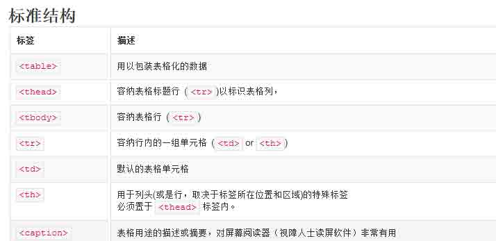

一个简单的 Table 示例

```js
<div class="container">
    <table class="table">  
      <caption>Table 基本案例</caption>  
      <thead>  
        <tr>  
          <th>First Name</th>  
          <th>Last Name</th>
          <th>User Name</th>  
        </tr>  
      </thead>  
      <tbody>  
        <tr>  
          <td>aehyok</td>  
          <td>leo</td> 
          <td>@aehyok</td>  
        </tr>
        <tr>  
          <td>lynn</td>  
          <td>thl</td> 
          <td>@lynn</td>  
        </tr>
      </tbody>  
    </table>  
 </div> 
```

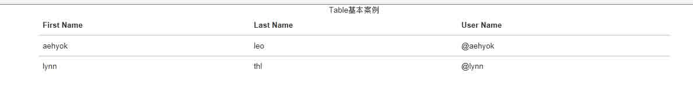

## 2\. 条纹状表格

利用.table-striped 可以给< tbody>之内的每一样增加斑马条纹样式。

在上面示例的 table 元素上再添加一个 样式类

```js
 <table class="table table-striped"> 
```

看现在的效果，还是有点变化的。

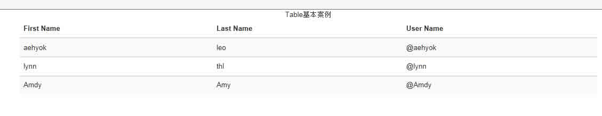

## 3\. 带边框的表格

利用.table-bordered 为表格和其中的每个单元格增加边框。

还是将第一个示例中的 table 元素上再添加一个样式类

```js
<table class="table  table-bordered"> 
```

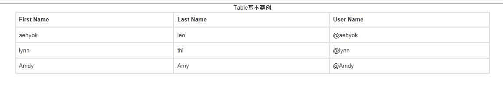

## 4\. 鼠标悬停

利用.table-hover 可以让< tbody>中的每一行响应鼠标悬停状态。

```js
<table class="table table-hover"> 
```

将鼠标移到那一行那一行就会有效果的

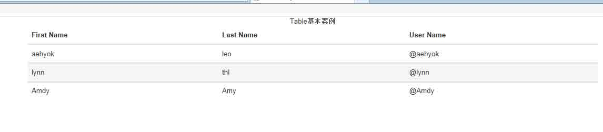

## 5\. 紧缩表格

利用.table-condensed 可以让表格更加紧凑，单元格中的内部（padding）均会减半。

```js
<table class="table table-condensed"> 
```

这个效果没那么明显，主要就是单元格中内容 padding 减半了。

## 6\. 状态 Class

通过这些状态 class 可以为行货单元格设置颜色。

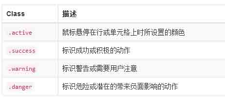

```js
<table class="table table-condensed">  
  <caption>Table</caption>  
  <thead>  
    <tr>  
      <th>#</th>
      <th>First Name</th>  
      <th>Last Name</th>
      <th>User Name</th>  
    </tr>  
  </thead>  
  <tbody>  
    <tr class="active">  
      <td>1</td>
      <td>aehyok</td>  
      <td>leo</td> 
      <td>@aehyok</td>  
    </tr>
    <tr class="success">  
      <td>2</td>
      <td>lynn</td>  
      <td>thl</td> 
      <td>@lynn</td>  
    </tr>
    <tr class="warning">  
      <td>3</td> 
      <td>Amdy</td>  
      <td>Amy</td> 
      <td>@Amdy</td>  
    </tr>
    <tr class="danger"> 
      <td>4</td> 
      <td>Amdy</td>  
      <td>Amy</td> 
      <td>@Amdy</td>  
    </tr>
    <tr > 
      <td class="success">5</td> 
      <td class="danger">Amdy</td>  
      <td class="warning">Amy</td> 
      <td class="active">@Amdy</td>  
    </tr>
  </tbody>  
</table> 
```

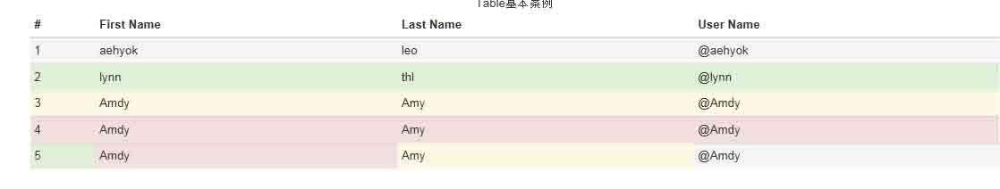

## 7\. 响应式表格

将任何.table 包裹在.table-responsive 中即可创建响应式表格，其会在小屏幕设备上（小于 768px）水平滚动。当屏幕大于 768px 宽度时，水平滚动条消失。

```js
<div class="table-responsive">
<table class="table">  
  <caption>Table</caption>  
  <thead>  
    <tr>  
      <th>#</th>
      <th>First Name</th>  
      <th>Last Name</th>
      <th>User Name</th>  
    </tr>  
  </thead>  
  <tbody>  
    <tr class="active">  
      <td>1</td>
      <td>aehyok</td>  
      <td>leo</td> 
      <td>@aehyok</td>  
    </tr>
    <tr class="success">  
      <td>2</td>
      <td>lynn</td>  
      <td>thl</td> 
      <td>@lynn</td>  
    </tr>
    <tr class="warning">  
      <td>3</td> 
      <td>Amdy</td>  
      <td>Amy</td> 
      <td>@Amdy</td>  
    </tr>
    <tr class="danger"> 
      <td>4</td> 
      <td>Amdy</td>  
      <td>Amy</td> 
      <td>@Amdy</td>  
    </tr>
    <tr > 
      <td class="success">5</td> 
      <td class="danger">Amdy</td>  
      <td class="warning">Amy</td> 
      <td class="active">@Amdy</td>  
    </tr>
  </tbody>  
</table>
</div> 
```

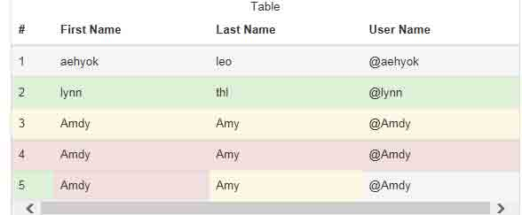

看滚动条出现了额。

## 一、表单

### 1\. 基本案例

单独的表单控件会被自动赋予一些全局样式。所有设置了.form-control 的< input>、< textarea>和< select>元素都将被默认设置为 width: 100%;。将 label 和前面提到的这些控件包裹在.form-group 中可以获得最好的排列。

```js
<form role="form">
  <div class="form-group">
    <label for="exampleInputEmail1">Email address</label>
    <input type="email" class="form-control" id="exampleInputEmail1" placeholder="Enter email">
  </div>
  <div class="form-group">
    <label for="exampleInputPassword1">Password</label>
    <input type="password" class="form-control" id="exampleInputPassword1" placeholder="Password">
  </div>
  <div class="form-group">
    <label for="exampleInputFile">File input</label>
    <input type="file" id="exampleInputFile">
    <p class="help-block">Example block-level help text here.</p>
  </div>
  <div class="checkbox">
    <label>
      <input type="checkbox"> Check me out
    </label>
  </div>
  <button type="submit" class="btn btn-default">Submit</button>
</form> 
```

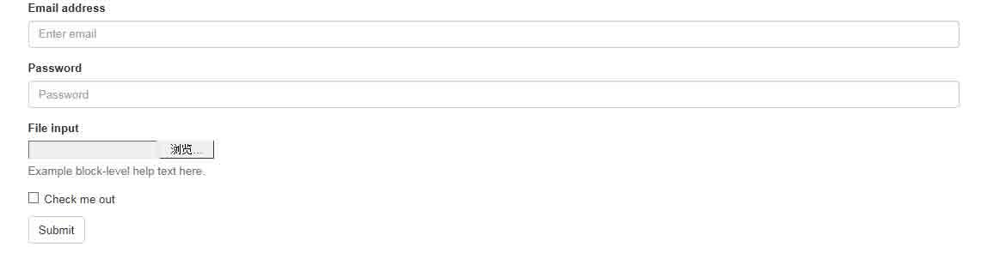

两个文本框的宽度的确为 100%。并且有三个 form-group。

### 2\. 内联表单

为左对齐和 inline-block 级别的控件设置.form-inline，可以将其排布的更紧凑。

**需要设置宽度：在 Bootstrap 中,input、select 和 textarea 默认被设置为 100%宽度。为了使用内联表单，你需要专门为使用到的表单控件设置宽度。**

**一定要设置 label:如果你没有为每个输入控件设置 label,屏幕阅读器将无法正确识读。对于这些内联表单,你可以通过为 label 设置.sr-only 已将其隐藏。**

```js
<form class="form-inline" role="form">
  <div class="form-group">
    <label class="sr-only" for="exampleInputEmail2">Email address</label>
    <input type="email" class="form-control" id="exampleInputEmail2" placeholder="Enter email">
  </div>
  <div class="form-group">
    <label class="sr-only" for="exampleInputPassword2">Password</label>
    <input type="password" class="form-control" id="exampleInputPassword2" placeholder="Password">
  </div>
  <div class="checkbox">
    <label>
      <input type="checkbox"> Remember me
    </label>
  </div>
  <button type="submit" class="btn btn-default">Sign in</button>
</form> 
```


### 3\. 水平排列的表单

```js
<form class="form-horizontal" role="form">
  <div class="form-group">
    <label for="inputEmail3" class="col-sm-2 control-label">Email</label>
    <div class="col-sm-10">
      <input type="email" class="form-control" id="inputEmail3" placeholder="Email">
    </div>
  </div>
  <div class="form-group">
    <label for="inputPassword3" class="col-sm-2 control-label">Password</label>
    <div class="col-sm-10">
      <input type="password" class="form-control" id="inputPassword3" placeholder="Password">
    </div>
  </div>
  <div class="form-group">
    <div class="col-sm-offset-2 col-sm-10">
      <div class="checkbox">
        <label>
          <input type="checkbox"> Remember me
        </label>
      </div>
    </div>
  </div>
  <div class="form-group">
    <div class="col-sm-offset-2 col-sm-10">
      <button type="submit" class="btn btn-default">Sign in</button>
    </div>
  </div>
</form> 
```

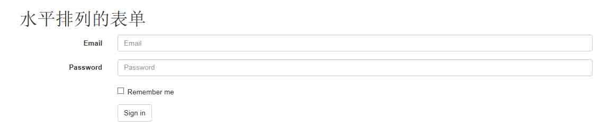

### 4\. 被支持的控件

在表单布局案例中展示了其所支持的标准表单控件。

**Input**

大部分表单控件、文本输入域控件。包括 HTML5 支持的所有类型：text、password、datetime、datetime-local、date、month、time、week、number、email、url、search、tel 和 color。

注意：有正确设置了 type 的 input 控件才能被赋予正确的样式。

文本框示例

```js
<input type="text" class="form-control" placeholder="Text input"> 
```

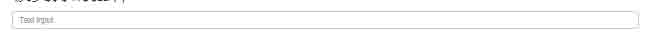

**Textarea**

支持多行文本的表单控件。可根据需要改变 rows 属性。

```js
<h1>textarea</h1>
<textarea class="form-control" rows="3"></textarea> 
```

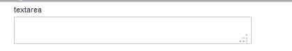

**Checkbox 和 radio**

Checkbox 用于选择列表中的一个或多个选项，而 radio 用于从多个选项中只选择一个。 默认外观(堆叠在一起)

```js
<div class="checkbox">
  <label>
    <input type="checkbox" value="">
    Option one is this and that&mdash;be sure to include why it's great
  </label>
</div>

<div class="radio">
  <label>
    <input type="radio" name="optionsRadios" id="optionsRadios1" value="option1" checked>
    Option one is this and that&mdash;be sure to include why it's great
  </label>
</div>
<div class="radio">
  <label>
    <input type="radio" name="optionsRadios" id="optionsRadios2" value="option2">
    Option two can be something else and selecting it will deselect option one
  </label>
</div> 
```

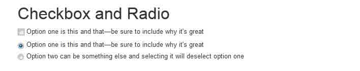

**Inline checkboxes**

通过将.checkbox-inline 或 .radio-inline 应用到一系列的 checkbox 或 radio 控件上，可以使这些控件排列在一行。

```js
<label class="checkbox-inline">
  <input type="checkbox" id="inlineCheckbox1" value="option1"> 1
</label>
<label class="checkbox-inline">
  <input type="checkbox" id="inlineCheckbox2" value="option2"> 2
</label>
<label class="checkbox-inline">
  <input type="checkbox" id="inlineCheckbox3" value="option3"> 3
</label> 
```


同理 Radio 是一样的，只需要添加一下样式即可。 **Select**

```js
<select class="form-control">
  <option>1</option>
  <option>2</option>
  <option>3</option>
  <option>4</option>
  <option>5</option>
</select>

<select multiple class="form-control">
  <option>1</option>
  <option>2</option>
  <option>3</option>
  <option>4</option>
  <option>5</option>
</select> 
```

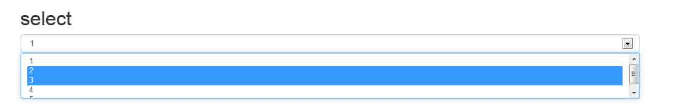

### 5\. 静态控件

在水平布局的表单中，如果需要将一行纯文本放置于 label 的同一行，为< p>元素添加.form-control-static 即可。

```js
<form class="form-horizontal" role="form">
  <div class="form-group">
    <label class="col-sm-2 control-label">Email</label>
    <div class="col-sm-10">
      <p class="form-control-static">email@example.com</p>
    </div>
  </div>
  <div class="form-group">
    <label for="inputPassword" class="col-sm-2 control-label">Password</label>
    <div class="col-sm-10">
      <input type="password" class="form-control" id="inputPassword" placeholder="Password">
    </div>
  </div>
</form> 
```

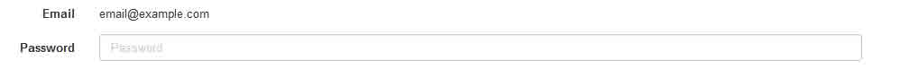

### 6\. 控件状态

通过为控件和 label 设置一些基本状态，可以为用户提供回馈。

**输入焦点**

我们移除了某些表单控件的默认 outline 样式，并对其:focus 状态赋予了 box-shadow 样式。

```js
<input class="form-control" id="focusedInput" type="text" value="This is focused..."> 
```

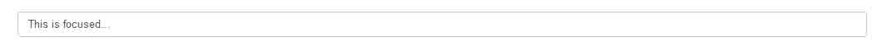

**被禁用的输入框**

为输入框设置 disabled 属性可以防止用户输入，并能改变一点外观，使其更直观。

```js
<input class="form-control" id="disabledInput" type="text" placeholder="Disabled input here..." disabled> 
```

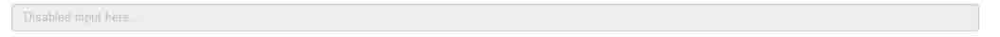

**被禁用的 fieldset**

为< fieldset>设置 disabled 属性可以禁用< fieldset>中包含的所有控件。 `<a>`标签的链接功能不受影响

这个 class 只改变< a class="btn btn-default">按钮的外观，并不能禁用其功能。建议自己通过 JavaScript 代码禁用链接功能。

跨浏览器兼容性:

虽然 Bootstrap 会将这些样式应用到所有浏览器上，Internet Explorer 9 及以下浏览器中的`<fieldset>`并不支持 disabled 属性。因此建议在这些浏览器上通过 JavaScript 代码来禁用 fieldset

```js
<form role="form">
  <fieldset disabled>
    <div class="form-group">
      <label for="disabledTextInput">Disabled input</label>
      <input type="text" id="disabledTextInput" class="form-control" placeholder="Disabled input">
    </div>
    <div class="form-group">
      <label for="disabledSelect">Disabled select menu</label>
      <select id="disabledSelect" class="form-control">
        <option>Disabled select</option>
      </select>
    </div>
    <div class="checkbox">
      <label>
        <input type="checkbox"> Can't check this
      </label>
    </div>
    <button type="submit" class="btn btn-primary">Submit</button>
  </fieldset>
</form> 
```

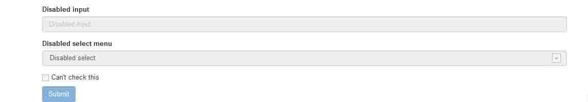

**校验状态**

Bootstrap 对表单控件的校验状态，如 error、warning 和 success 状态，都定义了样式。使用时，添加.has-warning、.has-error 或.has-success 到这些控件的父元素即可。任何包含在此元素之内的.control-label、.form-control 和.help-block 都将接受这些校验状态的样式。

```js
<div class="form-group has-success">
  <label class="control-label" for="inputSuccess">Input with success</label>
  <input type="text" class="form-control" id="inputSuccess">
</div>
<div class="form-group has-warning">
  <label class="control-label" for="inputWarning">Input with warning</label>
  <input type="text" class="form-control" id="inputWarning">
</div>
<div class="form-group has-error">
  <label class="control-label" for="inputError">Input with error</label>
  <input type="text" class="form-control" id="inputError">
</div> 
```

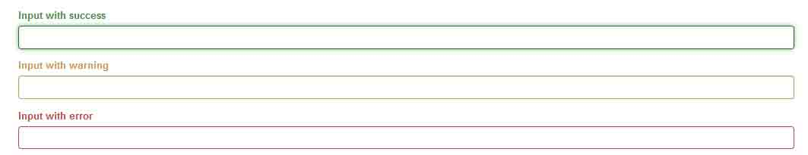

### 7\. 控件尺寸

通过.input-lg 之类的 class 可以为控件设置高度，通过.col-lg-*之类的 class 可以为控件设置宽度。

**高度尺寸**

创建大一些或小一些的表单控件以匹配按钮尺寸。

```js
<input class="form-control input-lg" type="text" placeholder=".input-lg">
<input class="form-control" type="text" placeholder="Default input">
<input class="form-control input-sm" type="text" placeholder=".input-sm">

<select class="form-control input-lg">...</select>
<select class="form-control">...</select>
<select class="form-control input-sm">...</select> 
```

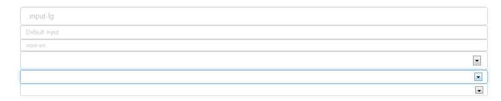

**调整列尺寸**

用栅格系统中的列包裹 input 或其任何父元素，都可很容易的为其设置宽度。

```js
<div class="row">
  <div class="col-xs-2">
    <input type="text" class="form-control" placeholder=".col-xs-2">
  </div>
  <div class="col-xs-3">
    <input type="text" class="form-control" placeholder=".col-xs-3">
  </div>
  <div class="col-xs-4">
    <input type="text" class="form-control" placeholder=".col-xs-4">
  </div>
</div> 
```


### 8\. 帮助文本

用于表单控件的块级帮助文本。

```js
<span class="help-block">自己独占一行或多行的块级帮助文本。</span> 
```