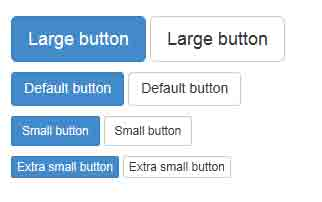
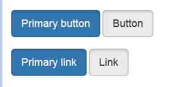
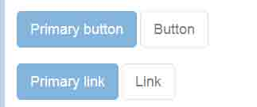

# 第 7 节 按钮

## 1\. 选项


使用上面列出的 class 可以快速创建一个带有样式的按钮。

```js
<button type="button" class="btn btn-default">Default</button>
<button type="button" class="btn btn-primary">Primary</button>
<button type="button" class="btn btn-success">Success</button>
<button type="button" class="btn btn-info">Info</button>
<button type="button" class="btn btn-warning">Warning</button>
<button type="button" class="btn btn-danger">Danger</button>
<button type="button" class="btn btn-link">链接</button> 
```


## 2\. 尺寸

需要让按钮具有不同尺寸吗？使用.btn-lg、.btn-sm、.btn-xs 可以获得不同尺寸的按钮。

```js
<p>
  <button type="button" class="btn btn-primary btn-lg">Large button</button>
  <button type="button" class="btn btn-default btn-lg">Large button</button>
</p>
<p>
  <button type="button" class="btn btn-primary">Default button</button>
  <button type="button" class="btn btn-default">Default button</button>
</p>
<p>
  <button type="button" class="btn btn-primary btn-sm">Small button</button>
  <button type="button" class="btn btn-default btn-sm">Small button</button>
</p>
<p>
  <button type="button" class="btn btn-primary btn-xs">Extra small button</button>
  <button type="button" class="btn btn-default btn-xs">Extra small button</button>
</p> 
```



通过给按钮添加.btn-block 可以使其充满父节点 100%的宽度，而且按钮也变为了块级（block）元素。

```js
<button type="button" class="btn btn-primary btn-lg btn-block">Block level button</button>
<button type="button" class="btn btn-default btn-lg btn-block">Block level button</button> 
```


## 3\. 活动状态

当按钮处于活动状态时，其表现为被按压下（底色更深，边框夜色更深，内置阴影）。对于 B< button>元素，是通过:active 实现的。对于< a>元素，是通过.active 实现的。然而，你还可以联合使用.active < button>并通过编程的方式使其处于活动状态。

**按钮元素**

由于:active 是伪状态，因此 无需添加，但是在需要表现出同样外观的时候可以添加.active。

```js
<button type="button" class="btn btn-primary btn-lg active">Primary button</button>
<button type="button" class="btn btn-default btn-lg active">Button</button> 
```


**链接元素**

可以为< a>添加.active class。

```js
<a href="#" class="btn btn-primary btn-lg active" role="button">Primary link</a>
<a href="#" class="btn btn-default btn-lg active" role="button">Link</a> 
```

可以和上面的 button 进行一下对比。



## 4\. 禁用状态

通过将按钮的背景色做 50%的褪色处理就可以呈现出无法点击的效果。

**按钮元素**

为< button>添加 disabled 属性。

```js
<button type="button" class="btn btn-lg btn-primary" disabled="disabled">Primary button</button>
<button type="button" class="btn btn-default btn-lg" disabled="disabled">Button</button> 
```


可以把鼠标放在按钮上点击查看效果。

```js
跨浏览器的兼容性

如果为<button>添加 disabled 属性，Internet Explorer 9 及更低版本的浏览器将会把按钮中的文本绘制为灰色，并带有恶心的阴影，目前还没有办法解决。 
```

**链接元素**

为< a>添加.disabled class。

```js
<a href="#" class="btn btn-primary btn-lg disabled" role="button">Primary link</a>
<a href="#" class="btn btn-default btn-lg disabled" role="button">Link</a> 
```



这是和上面的按钮做一个对比。

我们把.disabled 作为工具 class 使用，就像.active class 一样，因此不需要增加前缀。

```js
链接功能不受影响

上面提到的 class 只是改变<a>的外观，不影响功能。在此文档中，我们通过 JavaScript 代码禁用了链接的默认功能。

Context-specific usage

While button classes can be used on <a> and <button> elements, only <button> elements are supported within our nav and navbar components. 
```

## 5\. 可做按钮使用的 Html 标签

可以为< a>、< button>或< input>元素添加按钮 class。

```js
<a class="btn btn-default" href="#" role="button">Link</a>
<button class="btn btn-default" type="submit">Button</button>
<input class="btn btn-default" type="button" value="Input">
<input class="btn btn-default" type="submit" value="Submit"> 
```


```js
跨浏览器表现

作为最佳实践，我们强烈建议尽可能使用<button>元素以确保跨浏览器的一致性样式。

出去其它原因，这个 Firefox 的 bug 让我们无法为基于<input>标签的按钮设置 line-height，这导致在 Firefox 上，他们与其它按钮的高度不一致。 
```