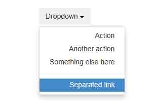
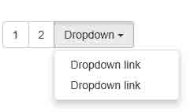
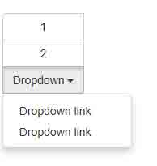
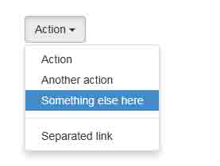

# 第 9 节 下拉菜单

用于显示链接列表的可切换、有上下文的菜单。

**案例**

将下拉菜单触发器和下拉菜单都包裹在.dropdown 里，然后添加组成菜单的 HTML 代码。

```
<div class="dropdown">
  <button class="btn dropdown-toggle" type="button" id="dropdownMenu1" data-toggle="dropdown">
    Dropdown
    <span class="caret"></span>
  </button>
  <ul class="dropdown-menu" role="menu" aria-labelledby="dropdownMenu1">
    <li role="presentation"><a role="menuitem" tabindex="-1" href="#">Action</a></li>
    <li role="presentation"><a role="menuitem" tabindex="-1" href="#">Another action</a></li>
    <li role="presentation"><a role="menuitem" tabindex="-1" href="#">Something else here</a></li>
    <li role="presentation" class="divider"></li>
    <li role="presentation"><a role="menuitem" tabindex="-1" href="#">Separated link</a></li>
  </ul>
</div> 
```

可以通过上面的代码发现，里面可能有很多陌生的样式类或者属性。

一个 Dropdown 按钮和右侧有个小图标 caret，当然这个小图标和按钮的文本是平级的。

首先看 button 按钮中有个 dropdown-toggle，还有一个 data-toggle 属性，根据这个属性来弹出下来列表。

紧接着 ul 标签的 dropdown-menu 应该是和上面 button 按钮的样式类 dropdown-toggle 联合使用，在通过 aria-labelledby 绑定上面的 button 按钮。

下来第四个 li 标签中有个 divider 其实是一个分割线的样式类。


**对齐选项**

给下拉菜单.dropdown-menu 加上.text-right 使文字右对齐。

```
<div class="dropdown">
<button class="btn dropdown-toggle" type="button" id="dropdownMenu1" data-toggle="dropdown">
Dropdown
<span class="caret"></span>
</button>
<ul class="dropdown-menu text-right" role="menu" aria-labelledby="dropdownMenu1">
<li role="presentation"><a role="menuitem" tabindex="-1" href="#">Action</a></li>
<li role="presentation"><a role="menuitem" tabindex="-1" href="#">Another action</a></li>
<li role="presentation"><a role="menuitem" tabindex="-1" href="#">Something else here</a></li>
<li role="presentation" class="divider"></li>
<li role="presentation"><a role="menuitem" tabindex="-1" href="#">Separated link</a></li>
</ul>
</div> 
```

只是在上面的代码中的 ul 标签上添加了一个 text-right 的样式类。



**标题**

在任何下拉菜单中均可通过添加标题来标明一组动作。

```
<h1>下拉菜单</h1>
<div class="dropdown">
<button class="btn dropdown-toggle" type="button" id="dropdownMenu1" data-toggle="dropdown">
Dropdown
<span class="caret"></span>
</button>
<ul class="dropdown-menu text-right" role="menu" aria-labelledby="dropdownMenu1">
<li role="presentation" class="dropdown-header">Dropdown header</li>
<li role="presentation"><a role="menuitem" tabindex="-1" href="#">Action</a></li>
<li role="presentation"><a role="menuitem" tabindex="-1" href="#">Another action</a></li>
<li role="presentation"><a role="menuitem" tabindex="-1" href="#">Something else here</a></li>
<li role="presentation" class="divider"></li>
<li role="presentation" class="dropdown-header">Dropdown header</li>
<li role="presentation"><a role="menuitem" tabindex="-1" href="#">Separated link</a></li>
</ul>
</div> 
```

主要是添加了< li role="presentation" class="dropdown-header">Dropdown header</li> 里面有个.dropdown-header 的样式类。


**禁用的菜单项**

给下拉菜单中的< li>加上.disabled 禁用链接。

继续修改上面的代码将 Something else here 行的代码进行替换

```
<li class="disabled" role="presentation"><a role="menuitem" tabindex="-1" href="#">Something else here</a></li> 
```

主要是在 li 标签中添加.disabled 的样式类。

你运行之后可以查看效果，其实效果和上面的标题样式差不多，当你点击的时候会有一个禁用的图标显示。

## 二、按钮组

```
按钮组中的工具提示和弹出框需要特别的设置

当为.btn-group 中的元素应用工具提示或弹出框时，必须指定 container: 'body'选项，这样可以避免不必要的副作用（例如工具提示或弹出框触发时，会让页面元素变宽和/或失去圆角）。 
```

**基本案例**

把一系列的.btn 按钮放入.btn-group。

```
<div class="btn-group">
  <button type="button" class="btn btn-default">Left</button>
  <button type="button" class="btn btn-default">Middle</button>
  <button type="button" class="btn btn-default">Right</button>
</div> 
```

通过.btn-group 就可以将一组 button 按钮并且为其添加样式类 btn


**按钮工具栏**

把一组< div class="btn-group">组合进一个< div class="btn-toolbar">做成更复杂的组件。

```
<div class="btn-toolbar" role="toolbar">
  <div class="btn-group">
      <button type="button" class="btn btn-default">1</button>
      <button type="button" class="btn btn-default">2</button>
      <button type="button" class="btn btn-default">3</button>
      <button type="button" class="btn btn-default">4</button>
      <button type="button" class="btn btn-default">5</button>
      <button type="button" class="btn btn-default">6</button>
  </div>
  <div class="btn-group">
      <button type="button" class="btn btn-default">7</button>
      <button type="button" class="btn btn-default">8</button>
  </div>
  <div class="btn-group">
      <button type="button" class="btn btn-default">9</button>
  </div>
</div> 
```


**尺寸**

只要给.btn-group 加上.btn-group-*，而不是给组中每个按钮都应用大小类。

```
<div class="btn-group btn-group-lg">
  <button type="button" class="btn btn-default">1</button>
  <button type="button" class="btn btn-default">2</button>
  <button type="button" class="btn btn-default">3</button>
  <button type="button" class="btn btn-default">4</button>
  <button type="button" class="btn btn-default">5</button>
  <button type="button" class="btn btn-default">6</button>
</div>
<div class="btn-group btn-group-sm">
  <button type="button" class="btn btn-default">7</button>
  <button type="button" class="btn btn-default">8</button>
</div>
<div class="btn-group btn-group-xs">
  <button type="button" class="btn btn-default">9</button>
</div> 
```


**嵌套**

想要把下拉菜单混合到一系列按钮中，就把.btn-group 放入另一个.btn-group 中。

```
<div class="btn-group">
  <button type="button" class="btn btn-default">1</button>
  <button type="button" class="btn btn-default">2</button>

  <div class="btn-group">
    <button type="button" class="btn btn-default dropdown-toggle" data-toggle="dropdown">
      Dropdown
      <span class="caret"></span>
    </button>
    <ul class="dropdown-menu">
      <li><a href="#">Dropdown link</a></li>
      <li><a href="#">Dropdown link</a></li>
    </ul>
  </div>
</div> 
```



**垂直排列**

让一组按钮竖直显示而不是水平显示。

```
<div class="btn-group btn-group-vertical">
  <a href="#">
  <button type="button" class="btn btn-default">1</button>
  <button type="button" class="btn btn-default">2</button>

  </a>
  <div class="btn-group">
    <a href="#">
      <button type="button" class="btn btn-default dropdown-toggle" data-toggle="dropdown">
        Dropdown
      </button>
    </a>
    <ul class="dropdown-menu">
      <li><a href="#">Dropdown link</a></li>
      <li><a href="#">Dropdown link</a></li>
    </ul>
  </div>
</div>
</div> 
```



**两端对齐的链接排列**

让一组按钮拉长为相同的尺寸，适应父元素的宽度。

```
特定元素的用法

这只适用 <a> 元素因为 <button> 不能应用这些样式。 
```

```
<div class="btn-group btn-group-justified">
      <button type="button" class="btn btn-default">Left</button>
      <button type="button" class="btn btn-default">Middle</button>
      <button type="button" class="btn btn-default">Right</button>
</div> 
```


## 三、按钮式下拉菜单

把任何按钮放入.btn-group 然后加入正确的菜单标记，就可以做成下拉菜单触发器。

**单按钮下拉菜单**

只要改变一些基本的标记，就能把按钮变成下拉菜单开关。

```
<div class="btn-group">
  <button type="button" class="btn btn-default dropdown-toggle" data-toggle="dropdown">
    Action <span class="caret"></span>
  </button>
  <ul class="dropdown-menu" role="menu">
    <li><a href="#">Action</a></li>
    <li><a href="#">Another action</a></li>
    <li><a href="#">Something else here</a></li>
    <li class="divider"></li>
    <li><a href="#">Separated link</a></li>
  </ul>
</div> 
```



**分裂式按钮下拉菜单**

相似地，分裂式按钮下拉菜单也需要同样的改变标记，但只要多一个分开的按钮。

```
<div class="btn-group">
  <button type="button" class="btn btn-danger">Action</button>
  <div class="dropdown">
      <button type="button" class="btn btn-danger dropdown-toggle" data-toggle="dropdown">
        <span class="caret"></span>
        <span class="sr-only">Toggle Dropdown</span>
      </button>
      <ul class="dropdown-menu" role="menu">
        <li><a href="#">Action</a></li>
        <li><a href="#">Another action</a></li>
        <li><a href="#">Something else here</a></li>
        <li class="divider"></li>
        <li><a href="#">Separated link</a></li>
      </ul>
  </div>
</div> 
```


**尺寸**

下拉菜单按钮适用所有尺寸的按钮。

```
<div class="btn-group">
  <button class="btn btn-default btn-lg dropdown-toggle" type="button" data-toggle="dropdown">
    Large button <span class="caret"></span>
  </button>
  <ul class="dropdown-menu">
    ...
  </ul>
</div>

<!-- Small button group -->
<div class="btn-group">
  <button class="btn btn-default btn-sm dropdown-toggle" type="button" data-toggle="dropdown">
    Small button <span class="caret"></span>
  </button>
  <ul class="dropdown-menu">
    ...
  </ul>
</div>

<!-- Extra small button group -->
<div class="btn-group">
  <button class="btn btn-default btn-xs dropdown-toggle" type="button" data-toggle="dropdown">
    Extra small button <span class="caret"></span>
  </button>
  <ul class="dropdown-menu">
    ...
  </ul>
</div> 
```


**向上弹出式菜单**

给父元素添加.dropup 就能使触发的下拉菜单在元素上方。

```
<div class="btn-group dropup">
  <button type="button" class="btn btn-default">Dropup</button>
  <button type="button" class="btn btn-default dropdown-toggle" data-toggle="dropdown">
    <span class="caret"></span>
    <span class="sr-only">Toggle Dropdown</span>
  </button>
  <ul class="dropdown-menu">
    <!-- Dropdown menu links -->
  </ul>
</div> 
```

