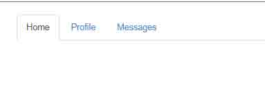
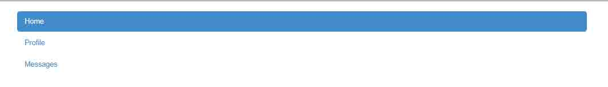
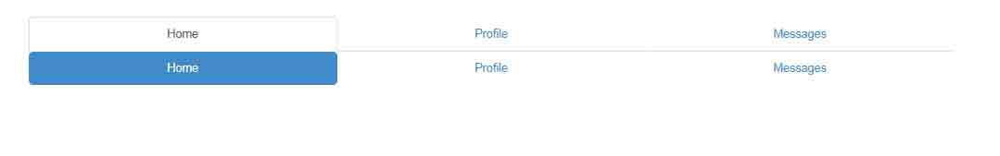
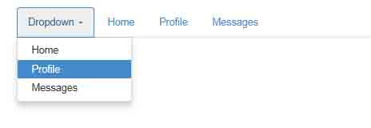
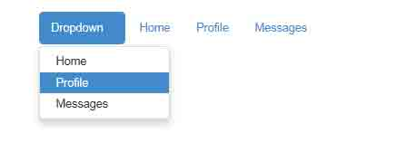
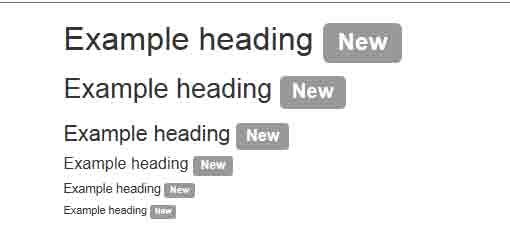
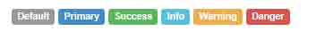
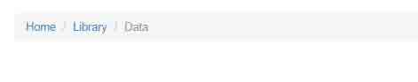

# 第 11 节 一、导航

Bootstrap 中可用的导航有相似的标记，用基类.nav 开头，这是相似的部分。改变修饰类可以改变样式。

## 1\. 标签页

注意.nav-tabs 类需要.nav 基类。

```js
<ul class="nav nav-tabs">
  <li class="active"><a href="#">Home</a></li>
  <li><a href="#">Profile</a></li>
  <li><a href="#">Messages</a></li>
</ul> 
```



## 2\. 胶囊式标签页

用相同的 HTML 标记，但要用.nav-pills 代替。

```js
<ul class="nav nav-pills">
  <li class="active"><a href="#">Home</a></li>
  <li><a href="#">Profile</a></li>
  <li><a href="#">Messages</a></li>
</ul> 
```


Pills 可以竖直堆叠。只要加上.nav-stacked。



## 3\. 两端对齐的导航

在大于 768px 的屏幕上，通过.nav-justified 可以很容易的让标签页或胶囊式标签呈现出同等宽度。在小屏幕上，导航链接呈现堆叠样式。

```js
<ul class="nav nav-tabs nav-justified">
  <li class="active"><a href="#">Home</a></li>
  <li><a href="#">Profile</a></li>
  <li><a href="#">Messages</a></li>
</ul>
<ul class="nav nav-pills nav-justified">
  <li class="active"><a href="#">Home</a></li>
  <li><a href="#">Profile</a></li>
  <li><a href="#">Messages</a></li>
</ul> 
```



## 4\. 禁用的链接

对任何导航（包括标签页，pills，或列表，加入.disabled 使链接为灰色且没有鼠标悬停效果。

```js
链接功能没有受到影响

这个类只改变<a>的外观，而不是它的功能。用自定义的 JavaScript 禁用这里的链接。 
```

```js
<ul class="nav nav-pills nav-justified">
  <li class="active"><a href="#">Home</a></li>
  <li class="disabled"><a href="#">Profile</a></li>
  <li><a href="#">Messages</a></li>
</ul> 
```

通过将鼠标悬停你就可以查看简单的效果了。

## 5\. 使用下拉菜单

```js
<ul class="nav nav-tabs">
  <li class="dropdown">
    <a class="dropdown-toggle" data-toggle="dropdown" href="#">
      Dropdown <span class="caret"></span>
    </a>
    <ul class="dropdown-menu">
        <li><a href="#">Home</a></li>
          <li><a href="#">Profile</a></li>
          <li><a href="#">Messages</a></li>
    </ul>
  </li>
  <li><a href="#">Home</a></li>
  <li><a href="#">Profile</a></li>
  <li><a href="#">Messages</a></li>
</ul> 
```



## 6\. 带下拉菜单的胶囊式标签页

```js
<ul class="nav nav-pills">
  <li class="dropdown active">
    <a class="dropdown-toggle" data-toggle="dropdown" href="#">
      Dropdown <span class="caret"></span>
    </a>
    <ul class="dropdown-menu">
        <li><a href="#">Home</a></li>
          <li><a href="#">Profile</a></li>
          <li><a href="#">Messages</a></li>
    </ul>
  </li>
  <li><a href="#">Home</a></li>
  <li><a href="#">Profile</a></li>
  <li><a href="#">Messages</a></li>
</ul> 
```



## 二、标签

简单案例

```js
<h1>Example heading <span class="label label-default">New</span></h1>
<h2>Example heading <span class="label label-default">New</span></h2>
<h3>Example heading <span class="label label-default">New</span></h3>
<h4>Example heading <span class="label label-default">New</span></h4>
<h5>Example heading <span class="label label-default">New</span></h5>
<h6>Example heading <span class="label label-default">New</span></h6> 
```



**可用的变体**

用下面的任何一个 class 即可改变标签的外观。

```js
<span class="label label-default">Default</span>
<span class="label label-primary">Primary</span>
<span class="label label-success">Success</span>
<span class="label label-info">Info</span>
<span class="label label-warning">Warning</span>
<span class="label label-danger">Danger</span> 
```



## 三、面包屑导航

用一个带方向的层次表明当前页面的位置。

分割符自动地通过 CSS 的:before 和 content 添加上了。

```js
<ol class="breadcrumb">
  <li><a href="#">Home</a></li>
  <li><a href="#">Library</a></li>
  <li class="active">Data</li>
</ol> 
```

