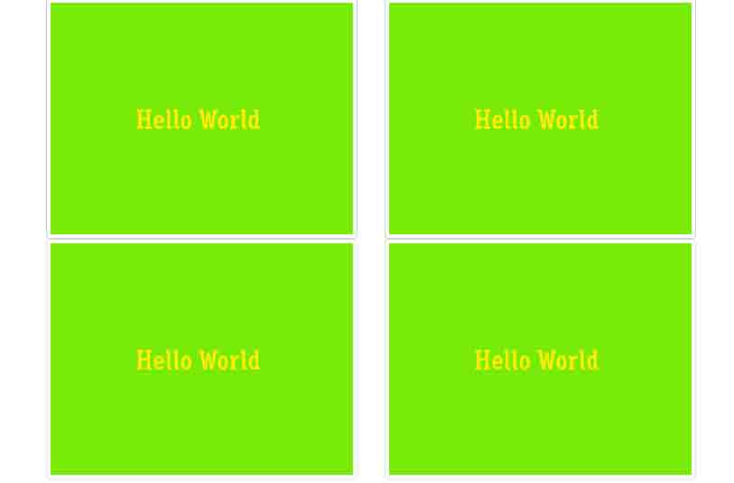

# 第 14 节 一、大屏幕介绍

轻量，灵活的可选组件，扩展整个视角，展示您站点上的关键内容。要让大屏幕介绍是屏幕宽度，请别把它包括在.container。

```
<div class="jumbotron">
  <h1>Hello, world!</h1>
  <p>This is a simple hero unit, a simple jumbotron-style component for calling extra attention to featured content or information.</p>
  <p><a class="btn btn-primary btn-lg" role="button">Learn more</a></p>
</div> 
```


如果需要让大屏幕介绍（jumbotron）占据全部宽度并且去掉圆角，只需将其放到所有.container 外面，并在其内部添加一个.container。

```
<div class="jumbotron">
    <div class="container">
      <h1>Hello, world!</h1>
      <p>This is a simple hero unit, a simple jumbotron-style component for calling extra attention to featured content or information.</p>
      <p><a class="btn btn-primary btn-lg" role="button">Learn more</a></p>
    </div>
</div> 
```

这两种效果差不多，但是还有是有区别的。

## 二、页面标题

简单的 h1 样式，可以适当地分出空间且分开页面中的章节。像其它组件一样，它可以使用 h1 的默认 small 元素（添加了一些额外的样式）。

```
<div class="page-header">
  <h1>Example page header <small>Subtext for header</small></h1>
</div> 
```


## 三、缩略图

用缩略图组件扩展 Bootstrap 的栅格系统，可以简单地显示栅格样式的图像，视频，文本，等等。

## 1\. 默认案例

Boostrap 的缩略图的默认设计仅需最小的标记，就能展示带链接的图片。

```
<div class="row">
  <div class="col-sm-6 col-md-3">
    <a href="#" class="thumbnail">
      
    </a>
  </div>
    <div class="col-sm-6 col-md-3">
    <a href="#" class="thumbnail">
      
    </a>
  </div>
    <div class="col-sm-6 col-md-3">
    <a href="#" class="thumbnail">
      
    </a>
  </div>
    <div class="col-sm-6 col-md-3">
    <a href="#" class="thumbnail">
      
    </a>
  </div>
</div> 
```


当页面放缩到一定程度会变成



## 2\. 定制内容

用一点点额外的标记，可以把任何种类的 HTML 内容像标题，段落或按钮加入缩略图。

```
<div class="row">
  <div class="col-sm-6 col-md-4">
    <div class="thumbnail">
      
      <div class="caption">
        <h3>Thumbnail label</h3>
        <p>Cras justo odio, dapibus ac facilisis in, egestas eget quam. Donec id elit non mi porta gravida at eget metus. Nullam id dolor id nibh ultricies vehicula ut id elit.</p>
        <p><a href="#" class="btn btn-primary" role="button">Button</a> <a href="#" class="btn btn-default" role="button">Button</a></p>
      </div>
    </div>
  </div>
  <div class="col-sm-6 col-md-4">
    <div class="thumbnail">
      
      <div class="caption">
        <h3>Thumbnail label</h3>
        <p>Cras justo odio, dapibus ac facilisis in, egestas eget quam. Donec id elit non mi porta gravida at eget metus. Nullam id dolor id nibh ultricies vehicula ut id elit.</p>
        <p><a href="#" class="btn btn-primary" role="button">Button</a> <a href="#" class="btn btn-default" role="button">Button</a></p>
      </div>
    </div>
  </div>
  <div class="col-sm-6 col-md-4">
    <div class="thumbnail">
      
      <div class="caption">
        <h3>Thumbnail label</h3>
        <p>Cras justo odio, dapibus ac facilisis in, egestas eget quam. Donec id elit non mi porta gravida at eget metus. Nullam id dolor id nibh ultricies vehicula ut id elit.</p>
        <p><a href="#" class="btn btn-primary" role="button">Button</a> <a href="#" class="btn btn-default" role="button">Button</a></p>
      </div>
    </div>
  </div>
</div> 
```


## 四、警示框

为典型的用户动作提供少数可用且灵活的反馈消息。

## 1\. 案例

为了得到基本的警告信息，把任何文本和可选的关闭按钮放入.alert 和四种有意义的类中（例如，.alert-success）。

```
没有默认类

警告框没有默认类，只有基类和修饰类。默认的灰色警告框并没有多少意义。所以您要使用一种内容类。从成功，消息，警告或危险中任选其一。 
```

```
<div class="alert alert-success">Well done! You successfully read this important alert message.</div>
<div class="alert alert-info">Well done! You successfully read this important alert message.</div>
<div class="alert alert-warning">Well done! You successfully read this important alert message.</div>
<div class="alert alert-danger">Well done! You successfully read this important alert message.</div> 
```


## 2\. 可关闭的警告框

可以用一个可选的.alert-dismissable 和关闭按钮。

```
<div class="alert alert-warning alert-dismissable">
  <button type="button" class="close" data-dismiss="alert" aria-hidden="true">&times;</button>
  <strong>Warning!</strong> Best check yo self, you're not looking too good.
</div> 
```


```
确定在所有设备上的正确行为

一定要给 data-dismiss="alert"属性用上<button>。 
```

## 3\. 警告框中的链接

用.alert-link 工具类，可以快速提供在任何警告框中相符的颜色。

```
<div class="alert alert-success">Well done! 
    <a href="#" class="alert-link">You successfully read this important alert message.</a></div>
<div class="alert alert-info">Well done! 
    <a href="#" class="alert-link">You successfully read this important alert message.</a></div>
<div class="alert alert-warning">Well done! 
    <a href="#" class="alert-link">You successfully read this important alert message.</a></div>
<div class="alert alert-danger">Well done!
    <a href="#" class="alert-link">You successfully read this important alert message.</a></div> 
```


## 五、Well

## 1\. 默认效果

把 Well 用在元素上，能有嵌入(inset)的的简单效果。

```
<div class="well">Look, I'm in a well!</div> 
```


## 2\. 可选类

用这两种可选修饰类，可以控制内补（padding）和圆角。

```
<div class="well well-lg">...</div>
<div class="well well-sm">...</div> 
```