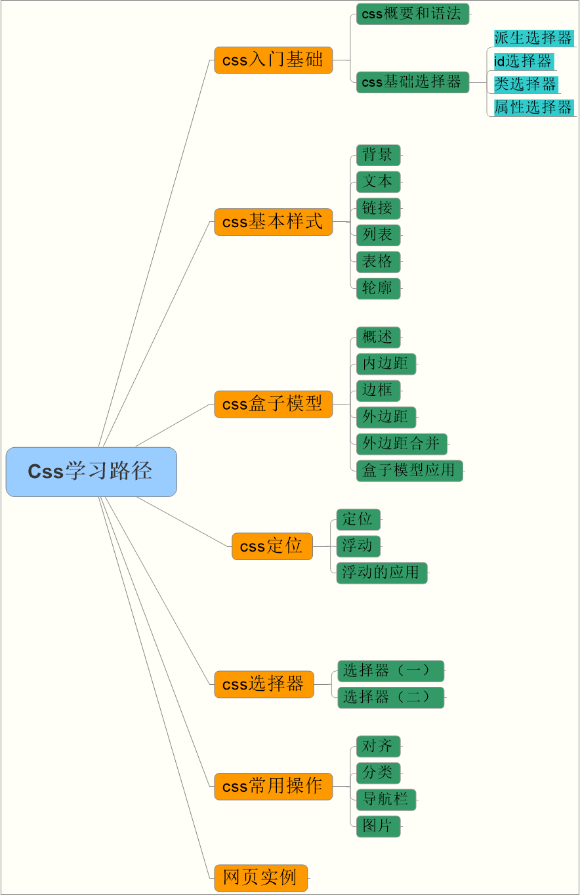
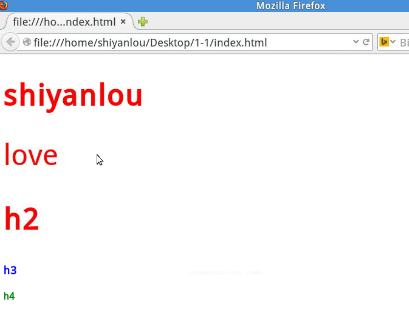

# 第 1 节 CSS 入门基础

## 一、CSS 介绍及学习路径

学习本课程的同学都应该深入学习了 HTML 基础，所以相信大家对 CSS 并不陌生。

CSS 指的是层叠样式表（Cascading StyleSheet）。在网页制作时采用层叠样式表技术，可以有效地对页面的布局、字体、颜色、背景和其它效果实现更加精确的控制。

我下面用一张图来展示我们本套教程的学习路径



## 二、Brackets-开源、简洁强大的前端集成开发环境

前端开发的工具很多，我们本套教程采用 Brackets 作为我们的集成开发环境。 Brackets 的特点是简约、优雅、快捷！它没有很多的视图或者面板，也没太多花哨的功能，它的核心目标是减少在开发过程中那些效率低下的重复性工作，例如浏览器刷新，修改元素的样式，搜索功能等等。和 Sublime Text、Everedit 等通用代码编辑器不一样，Brackets 是专门针对 WEB 前端开发而生……


## 四、CSS 的基础语法

### 基础语法规则

CSS 规则由两个主要的部分构成：选择器，以及一条或多条声明。

```
selector {
    declaration1; 
    declaration2;
    ... 
    declarationN;
} 
```

选择器通常是您需要改变样式的 HTML 元素。 每条声明由一个属性和一个值组成。每个属性有一个值。属性和值被冒号分开。

```
selector {property: value} 
```

例如：

```
h1{
   color:red;
   font-size:14px;
} 
```

属性大于 1 个之后，属性之间用分号隔开。这行代码的作用是将 h1 元素内的文字颜色定义为红色，同时将字体大小设置为 14 像素。

下面的示意图为您展示了上面这段代码的结构：


**注意**：如果值大于 1 个单词，则需要加引号,如下：

```
p{font-family:"sans serif"} 
```

### 程序举例：

我们在桌面建立一个空文件夹-1-1，并用 brackets 打开（下图中 2），之后在编辑区右键新建 index.html 和 MyCss.css 两个文件：


两个文件分别输入以下代码（brackets 支持代码补全哦）： index.html

```
<!doctype html>
<html>
    <head>
        <meta charset="UTF-8">
        <title></title>
        <!--引外部资源 MyCss.css-->
        <link rel="stylesheet" href="MyCss.css" type="text/css">
    </head>
    <body>
        <h1>
            shiyanlou
        </h1>
    </body>
</html> 
```

MyCss.css

```
h1{
    color: red;font-size: 50px;
} 
```

h1 元素内的文字颜色定义为红色，同时将字体大小设置为 50 像素。

Ctrl+s 保存两个文件，点击 index.html 查看运行效果：


## css 高级语法

### 1.选择器的分组

你可以对选择器进行分组，这样被分组的选择器就可以分享相同的声明。用逗号将需要分组的选择器分开。在下面的例子中，我们对所有的标题元素进行了分组。所有的标题元素都是红色的。

```
h1，h2，h3，h4，h5，h6{
      color：red;
   } 
```

### 2.继承

根据 CSS，子元素从父元素继承属性。看看下面这条规则：

```
body{
     color：green;
} 
```

通过 CSS 继承，子元素将继承最高级元素（在本例中是 body）所拥有的属性（这些子元素诸如 p, td, ul, ol, ul, li, dl, dt,和 dd）。不需要另外的规则，所有 body 的子元素都应该显示绿色，子元素的子元素也一样。并且在大部分的现代浏览器中，也确实是这样的。

### 3.程序举例

index.html

```
<!doctype html>
<html>
    <head>
        <meta charset="UTF-8">
        <title></title>
        <link rel="stylesheet" href="mycss.css" type="text/css">
    </head>
    <body>
        <h1>
            shiyanlou
        </h1>
        <a>love</a>
        <h2>h2</h2>
        <h3>h3</h3>
        <h4>h4</h4>
    </body>
</html> 
```

mycss.css

```
h1,a,h2{
    color: red;font-size: 50px;
}
body{color: blue;}
h4{
   color:green;
} 
```

运行效果：



在 css 的代码中大家可以看到我们单独定义了 h1,a,h2,h4 和颜色，而没有定义 h3，考虑到继承，h3 的颜色为 body 定义的部分为蓝色。

## 小结

我们本节课讲述了 css 的基础语法和高级语法，下节课我们将讲述 css 的简单常用的选择器。