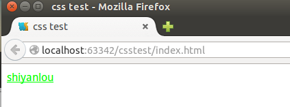
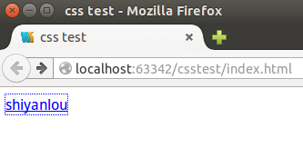
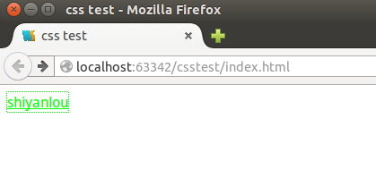
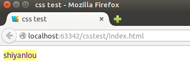
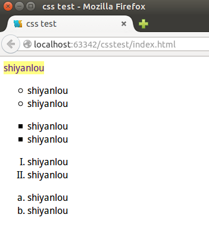
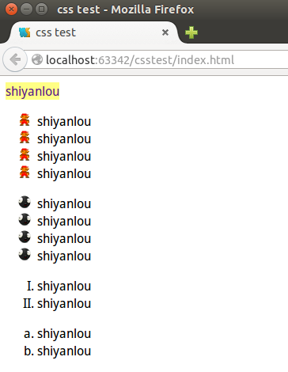
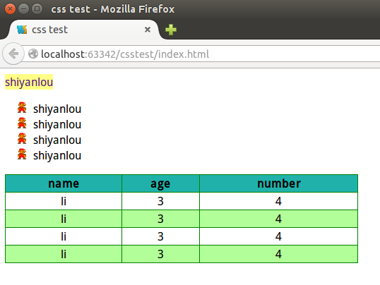

# 第 4 节 CSS 基本样式（二）

## 1.CSS 链接

在 CSS 的链接属性设置中，我们能设置 color, font-family, background 等等，不同的状态我们可以设置对应的样式。下面我们就来看看对应样式的属性设置。

### 1.1CSS 链接的四种状态：

a:link --普通的、未被访问的链接 a:visited --用户已访问的链接 a:hover --鼠标指针位于链接的上方 a:active --链接被点击的时刻

下面我们就来动手先设置下这几个对应行为的颜色属性： 还是和以前的流程一样我们先创建一个 index.html，然后再建立一个 test.css 文件，将其链接到 html 中。 下面是 html 文件内容：

```js
<!DOCTYPE html>
<html>
<head lang="en">
    <meta charset="UTF-8">
    <title>css test</title>
    <script src="app.js"></script>
    <link rel="stylesheet" type="text/css" href="test.css">
</head>
<body >

<a href="http://www.shiyanlou.com">shiyanlou</a>

</body>
</html> 
```

下面是 CSS 文件内容：

```js
a:link {color:#FF0000;}    /* 未被访问的链接 */
a:visited {color:#00FF00;} /* 已被访问的链接 */
a:hover {color:#FF00FF;}   /* 鼠标指针移动到链接上 */
a:active {color:#0000FF;}  /* 正在被点击的链接 */ 
```

我们先来看看效果： 这是未被访问的颜色：



这是鼠标移动到链接上面的颜色：


这是正在被点击的颜色：



这是被点击之后的颜色：



这里我们需要注意的是这四个属性设置要遵循的顺序问题： a:hover 必须位于 a:link 和 a:visited 之后 a:active 必须位于 a:hover 之后

### 1.2CSS 设置链接背景颜色

这个一样的简单，修改对应的属性 background-color 就好。 我们动手实验的话，就将刚才的 CSS 文件替换或者添加：

```js
a:link {background-color:#B2FF99;}
a:visited {background-color:#FFFF85;}
a:hover {background-color:#FF704D;}
a:active {background-color:#FF704D;} 
```

大家可以实验，这里就不再一一截图了

### 1.3 修改链接下划线

不是所有的时候我们都需要链接下面的下划线，有时很影响美观。所以这里我们要在 link 属性中加入 text-decoration 属性，将传指改为空就行，修改过后就是下面的结果：



## 2.CSS 列表

CSS 列表允许防止、改变列表标志，或者将图片作为列表项标志。 学习过 html 的同学应该都比较列了解列表。在这里我们就简单的讲解下常用的三个属性，列表类型、列表项图像和简写列表属性。

### 2.1 列表类型

我们知道，列表有无序，有序之分，无序列表又可以用不同的标记来区分。而 list-style-type 这个属性我们就可以用来控制标记类型。下面我们就动手实验一把 在 html 文件中添加：

```js
<ul class="circle">
    <li>shiyanlou</li>
    <li>shiyanlou</li>
</ul>

<ul class="square">
    <li>shiyanlou</li>
    <li>shiyanlou</li>
</ul>

<ol class="upper-roman">
    <li>shiyanlou</li>
    <li>shiyanlou</li>
</ol>

<ol class="lower-alpha">
    <li>shiyanlou</li>
    <li>shiyanlou</li>
</ol> 
```

在 CSS 文件中添加：

```js
ul.circle {list-style-type:circle}
ul.square {list-style-type:square}
ol.upper-roman {list-style-type:upper-roman}
ol.lower-alpha {list-style-type:lower-alpha} 
```

下面就是我们所得到的结果：



### 2.2 列表项图片

说实话，无序列的标记有时看上去确实有些寒酸，就几个小点变变样子，下面我们就试着用 list-style-image 属性让标记变得高大上。

下载一个小图标放入工程文件夹，然后在 CSS 中添加：

```js
ul.img1{list-style-image:url("4.ico")}
ul.img2{list-style-image: url("11.ico")} 
```

url 中是图片名称

在 html 中我们需要修改添加的就是：

```js
<ul class="img1">
    <li>shiyanlou</li>
    <li>shiyanlou</li>
    <li>shiyanlou</li>
    <li>shiyanlou</li>
</ul>

<ul class="img2">
    <li>shiyanlou</li>
    <li>shiyanlou</li>
    <li>shiyanlou</li>
    <li>shiyanlou</li>
</ul> 
```

下面就是实现结果：



是不是好看多了。

### 2.3 简写列表样式

所谓的简写列表样式就是说，把所有用于列表的属性设置于一个声明中。 就像下面这样

```js
li {list-style : url(example.jpg) square} 
```

list-style 的值可以按任何顺序列出，而且这些值都可以忽略。只要提供了一个值，其它的就会填入其默认值。

## 3.CSS 表格

在表格的学习中我们主要了解以下属性：

border-collapse ---设置是否把表格边框合并为单一的边框。

border-spacing ---设置分隔单元格边框的距离。

caption-side --- 设置表格标题的位置。

empty-cells ---设置是否显示表格中的空单元格。

table-layout ---设置显示单元、行和列的算法。

这里我们只用最常用的属性，下面我们就边讲边做实验 首先呢，我们先创建一个表格，加入如下内容：

```js
<table id="tb">
    <tr>
        <th>name</th>
        <th>age</th>
        <th>number</th>
    </tr>

    <tr>
        <td>li</td>
        <td>3</td>
        <td>4</td>
    </tr>

    <tr class="tr2">
        <td>li</td>
        <td>3</td>
        <td>4</td>
    </tr>

    <tr>
        <td>li</td>
        <td>3</td>
        <td>4</td>
    </tr>

    <tr class="tr2">
        <td>li</td>
        <td>3</td>
        <td>4</td>
    </tr>

</table> 
```

当然这是无边框的效果，下面我们就在 CSS 中加入边框并指定颜色（外边框和内边框）：

```js
#tb,tr,th,td{
    border: 1px solid green;
} 
```

可以看出，效果如下：


这些都是默认的属性，下面我们就通过 CSS 来定制列表。首先，我们先使用 border—collapse 让整个列表边框合并为单线，再使用 width，height 来定制表格大小，之后用 background-color 加上背景颜色，text-align 设置字符对其方式，padding 设置内边据：

```js
#tb td,th{
    border: 1px solid green;
    padding: 5px;
}
#tb{
    border-collapse: collapse;
    width: 500px;
    text-align: center;
}

#tb th{
    text-align: center;
    color: black;
    background-color: lightseagreen;

}
#tb tr.tr2 td{
    color: black;
    background-color: #B2FF99;

} 
```

效果如下：



## 4.CSS 轮廓

轮廓（outline）是绘制于元素周围的一条线，位于边框边缘的外围，可起到突出元素的作用。 CSS outline 属性规定元素轮廓的样式、颜色和宽度。涉及到的属性有：

```js
outline 在一个声明中设置所有的轮廓属性。    
outline-color   设置轮廓的颜色。    
outline-style   设置轮廓的样式。    
outline-width   设置轮廓的宽度。 
```

为了演示我们先在原来的 html 中加入两个 p 标签：

```js
<p id="p1">shiyanlou is my home</p>
<p id="p2">shiyanlou is my home</p> 
```

然后在 CSS 中加入这几个属性的具体设置，设置参数就不过多的赘述：

```js
p1{
    outline-color: #FF704D;
    outline-style: groove;
    outline-width: 10px;
}

p2{
    outline-style: dotted;
    outline-color: green;
    outline-width: 5px;

} 
```

下面是效果图：


### 小结

在这一章中我们讲述了剩下的 CSS 基本样式，希望大家发散的练习，达到熟练掌握的效果。

### 练习

按照上面的示例，进行发散的练习，在 CSS 中练习讲到的属性