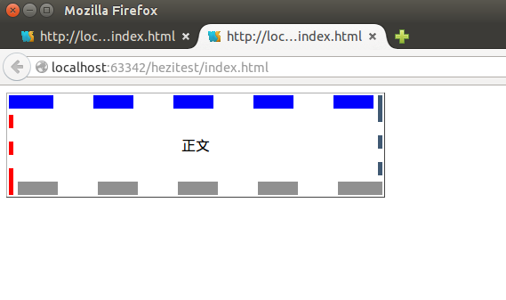
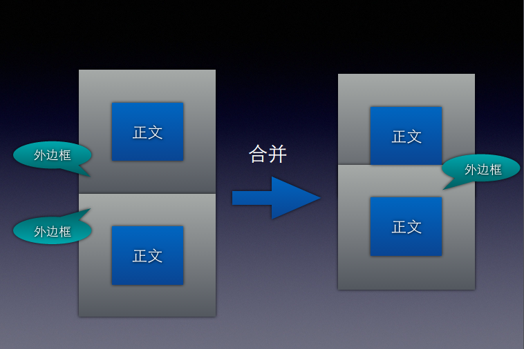
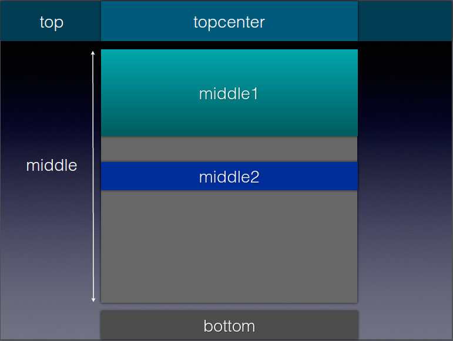
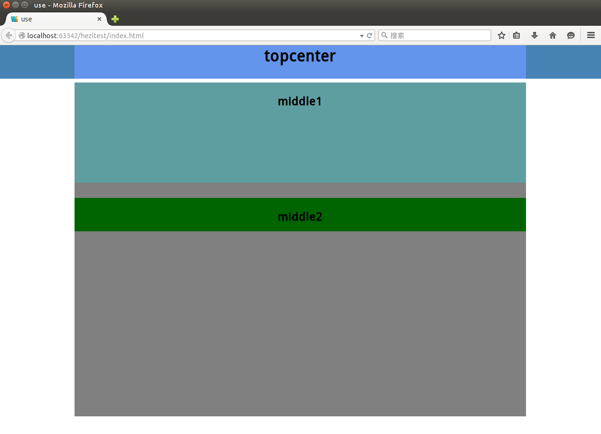
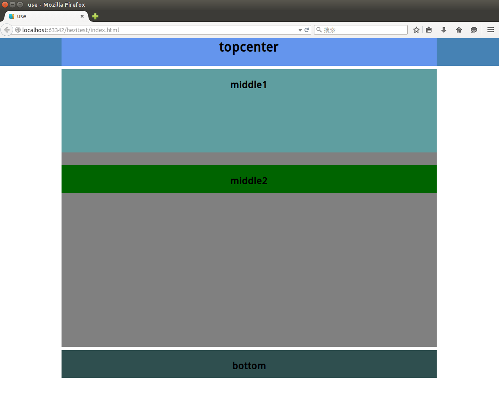

# 第 5 节 CSS 盒子模型

## 1.CSS 盒子模型概述

我们先来看看盒子的组成包括： margin(外边距);border(边框);padding(内边距);content(内容) 正文框的最内部分是实际的内容，直接包围内容的是内边距。内边距呈现了元素的背景。内边距的边缘是边框。边框以外是外边距，外边距默认是透明的，因此不会遮挡其后的任何元素。

下面我们就用一张图来描述下他们的结构：


内边距、边框和外边距都是可选的，默认值是零。但是，许多元素将由用户代也可以使用通用选择器对所有元素进行设置，就相当与是一个初始化：

```js
* {
  margin: 0;
  padding: 0;
} 
```

从上面的图中可以看出，宽度（width） 和 高度（height） 指的是内容区域的宽度和高度。增加内边距、边框和外边距不会影响内容区域的尺寸，但是会增加元素框的总尺寸。

可以如下设置这几个属性：

```js
box {
  width: 70px;
  margin: 10px;
  padding: 5px;
} 
```

>外边距可以是负值，而且在很多情况下都要使用负值的外边距。

## 2.CSS 盒子模型内边距

内边据是什么：

内边据在正文（content）外，边框（border）内。控制该区域最简单的属性是 padding 属性。padding 属性定义元素边框与元素内容之间的空白区域。

CSS padding 属性定义元素的内边距。padding 属性接受长度值或百分比值，但不允许使用负值。

你可以进行统一的内边距设置，也可以进行单边的那边据设置： 例如，如果您希望所有 h1 元素的各边都有 10 像素的内边距，只需要这样：

```js
h1 {padding: 10px;} 
```

您还可以按照上、右、下、左的顺序分别设置各边的内边距，各边均可以使用不同的单位或百分比值：

```js
h1 {padding: 10px 0.25em 2ex 20%;} 
```

如果只想设置某一边的那边据，我们也只可以办到的,只需通过以下四个属性：

*   padding-top
*   padding-right
*   padding-bottom
*   padding-left

顾名思义，这个是很好理解的。

在数值的设置中,我们前面讲到过,可以使用多种单位,常用的就是像素(px)和厘米(cm),这个比较简单,就简单的测试一下就好:

在 html 文件中写入一个表格,加上边框属性:

```js
<table border="1">
    <tr>
        <td>
            正文
        </td>
    </tr>
</table> 
```

这是未设置之前的页面:


下面我们在 CSS 文件中加入

```js
h1 {
    padding-left: 5cm;
    padding-right: 5cm;
    padding-top: 30px;
    padding-bottom: 30px;
} 
```

HTML 代码更新为：

```js
<table border="1">
    <tr>
        <td>
            <h1>正文</h1>
        </td>
    </tr>
</table> 
```

下面就是效果截图:


我们可以看出,我们操作的区域,在正文以外,在边框以内.

## 3.CSS 盒子模型边框

元素的边框 (border) 是围绕元素内容和内边距的一条或多条线。 设置 border 属性可以规定元素边框的样式、宽度和颜色。

学习过 HTML 的同学都知道,在 HTML 中,我们常使用表格来创建周围的边框,但是通过使用 CSS 边框属性,我们可以创建出效果出色的边框,并且可以应用于任何元素.

每个 border 属性我们可以设置宽度,样式,以及颜色.下面我们就看看如何通过 border 属性来设置边框宽度,以及颜色:

>CSS 没有定义 3 个关键字的具体宽度，所以一个用户代理可能把 thin 、medium 和 thick 分别设置为等于 5px、3px 和 2px，而另一个用户代理则分别设置为 3px、2px 和 1px。

可以通过如下的内容

```js
td {border-style: solid; border-width: 15px 5px 15px 5px;} 
```

同样,这里我们也可以设置单边边框的宽度,

```js
border-top-width
border-right-width
border-bottom-width
border-left-width 
```

下面我们在 CSS 文件中加入

```js
 border-style: dashed;
  border-top-width: 15px;
  border-right-width: 5px;
  border-bottom-width: 15px;
  border-left-width: 5px; 
```

下面是效果截图:


说完宽度,我们再来看看颜色,设置边框颜色非常简单。CSS 使用一个简单的 border-color 属性，它一次可以接受最多 4 个颜色值,分别是边框的四边(具体顺序自己可以试试)。可以使用任何类型的颜色值，例如可以是命名颜色，也可以是十六进制和 RGB 值：

在 CSS 文档中添加以下内容:

```js
 border-color: blue rgb(25%,35%,45%) #909090 red; 
```

下面就是效果截图:



同样可以使用属性控制各个边框的颜色,以达到相同的效果: border-top-color border-right-color border-bottom-color border-left-color

这里就留给大家自己练习了

## 4.CSS 盒子模型外边距

外边距就是围绕在内容框的区域,可以参考上面的结构图.默认为透明的区域.同样,外边距也接受任何长度的单位,百分数.与内边据很相似 我们可以使用下列任何一个属性来只设置相应上的外边距，而不会直接影响所有其他外边距： margin-top margin-right margin-bottom margin-left 是不是很眼熟,这些属性都是这么相通,大家可以发散的联系

margin 的默认值是 0，所以如果没有为 margin 声明一个值，就不会出现外边距。但是，在实际中，浏览器对许多元素已经提供了预定的样式，外边距也不例外。例如，在支持 CSS 的浏览器中，外边距会在每个段落元素的上面和下面生成“空行”。因此，如果没有为 p 元素声明外边距，浏览器可能会自己应用一个外边距。当然，只要你特别作了声明，就会覆盖默认样式。

这里讲一讲的具体赋值:

值复制 还记得吗？我们曾经在前两节中提到过值复制。下面我们为您讲解如何使用值复制。 有时，我们会输入一些重复的值：

```js
p {margin: 0.5em 1em 0.5em 1em;} 
```

通过值复制，您可以不必重复地键入这对数字。上面的规则与下面的规则是等价的：

```js
p {margin: 0.5em 1em;} 
```

这两个值可以取代前面 4 个值。这是如何做到的呢？CSS 定义了一些规则，允许为外边距指定少于 4 个值。规则如下：

如果缺少左外边距的值，则使用右外边距的值。

如果缺少下外边距的值，则使用上外边距的值。

如果缺少右外边距的值，则使用上外边距的值。

反正就是对称复制

下面我们来举例说明:

```js
h1 {margin: 0.25em 1em 0.5em;}  
/* 等价于 0.25em 1em 0.5em 1em */
h2 {margin: 0.5em 1em;} 
/* 等价于 0.5em 1em 0.5em 1em */
p {margin: 1px;}        
/* 等价于 1px 1px 1px 1px */ 
```

这里来一个简单的示例: html 文件内容如下:

```js
<div class="wb">
    <div class="bk">
        <div class="nj">
            <div class="zw">
                shiyanlou
            </div>
        </div>
    </div>
</div> 
```

CSS 文件内容如下:

```js
.wb{
    margin: 100px;
}
.bk{
    border-style: groove;

}
.nj{
    padding: 10px;

}
.zw{
    background-color: cornflowerblue;

} 
```

效果图如下:


这里还有个知识点,就是这是外边距的合并,外边框合并就是一个叠加的概念,下面我们用一张图来说明合并之前与合并之后的差别:



当我们将 HTML 文件中的 div 复制一遍之后我们会发现,效果是这样的:


按理这两个模块时间的间距是 200px,但是这里却是 100px,这就说明,默认的状态是合并的状态.

## 5.CSS 盒子模型应用

接下来我们就来练习下盒子模型,绘制一定的样式,实现下图的效果:



我们先来分析下整体结构:最上面是有两部分组成,最上面的是 top,外边距内边距都为 0,上面还有个 topcenter,上下边距为 0,左右是居中状态:

实现 html 内容为:

```js
<div class="top">
    <div class="topcenter"><h1>topcenter</h1></div>
</div> 
```

CSS 内容为:

```js
.top{
    background-color: steelblue;
    width: 100%;
    height: 70px;
    text-align: left;

}
.topcenter{
    margin: 0px auto;/*左右自适应,上下为 0*/
    width: 75%;
    height: 70px;/*与 top 一样*/
    background-color: cadetblue;
    text-align: center;

} 
```

这样就能实现最上面的两个模块:


接下来就是中间部分,我们可以将其分成三部分,第一部分就是 middle,我们可以看出 middle 与上下都有外边距的存在,接下来就是 middle1 包含在 middle 中,宽度完全填充,高度自定义,middle2 宽度完全填充,上外边距有规定.

HTML 内容如下:

```js
<div class="middle">
    <div class="middle1"><br/><h2>middle1</h2></div>
    <br/>
    <div class="middle2"><br/><h2>middle2</h2></div>
</div> 
```

CSS 内容如下:

```js
.middle{
    width: 75%;
    height: 700px;
    margin: 8px auto;
    background-color: gray;
}
.middle1{
    width: 100%;
    height: 30%;
    background-color: cadetblue;
    margin: 0px;
    text-align: center;
}
.middle2{
    width: 100%;
    height: 10%;
    margin: 10px 0px;
    background-color: darkgreen;
    text-align: center;
} 
```

就可以完成如下的效果:



最后我们再加上个底边: HTML:

```js
<div class="bottom"></div> 
```

CSS:

```js
.bottom{
    margin: 0px auto;
    height: 50px;
    background-color: darkslategrey;
    width: 75%;
} 
```

这样我们就完成了整个盒子模型的设计:



## 小结

在这一章中我们学习了 CSS 盒子的模型.主要练习的方向就是外边距，从而学会了控制排版。

## 练习

跟着实验讲解,发散的做一个或多个练习。