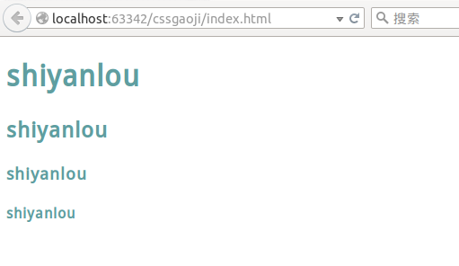
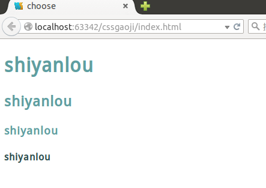
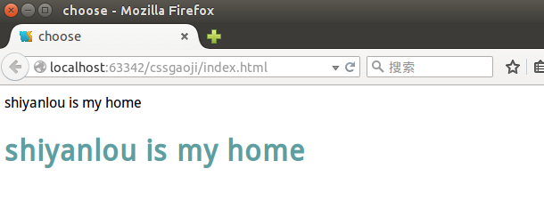
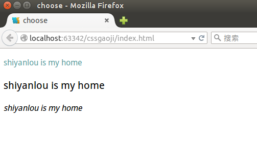
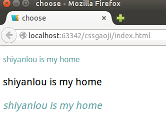
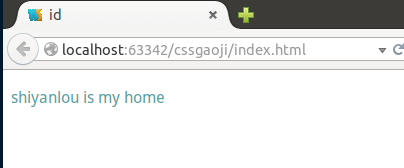
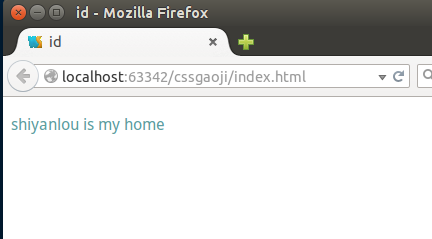
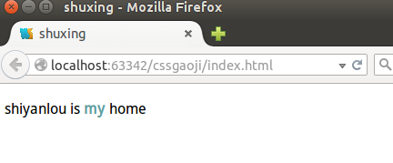
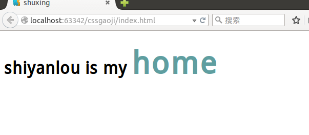
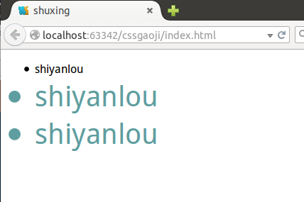

# 第 7 节 css 选择器

前面几个章节我们简单介绍过选择器,大家应该会对选择期有一些基础的了解,下面我们就来具体的讲述下面几个选择器.

## 1.元素选择器

1.最常见的选择器就是元素选择器,文档的元素就是最基本的选择器.

就像这些: h1{}. a{}等

css 文件可以这样实现:

```js
h1{
  color: cadetblue;  
} 
```

这样的实例很多,这里就不一一举例了. 很简单吧.这就叫元素选择器,下面我们来讲讲选择器的分组.

## 2.选择器分组

在原来的基础上我们想将下面 html 文件中的文件都设置成一样的颜色,我们可以这么干: html:

```js
<h1>shiyanlou</h1>
<h2>shiyanlou</h2>
<h3>shiyanlou</h3>
<h4>shiyanlou</h4> 
```

css:

```js
h1{
  color: cadetblue;

}
h2{
    color: cadetblue;

}
h3{
    color: cadetblue;

}
h4{
    color: cadetblue;

} 
```

这样就是下面的效果图:


但是我们一般会这样写 css:

```js
h1,h2,h3,h4{
  color: cadetblue;
} 
```

效果是一样的,完全没有变化:



这样是不是减少了不少代码,这就叫做选择器的分组. 下面我们要补充的知识就是通配符*. 要想达到与前面相同的效果,还有一种方式就是,用通配符.

```js
*{
  color: cadetblue;
} 
```

这样一来的话,如果没有特定元素的设置,都会发生颜色的转换.下面有同学就要提问了,要是我们不想全一样,其中有几个采用别的设置呢.

解决这个问题我们就只需要进行覆盖就好.如果我们想让最后一个标题变成黑灰色,那么在后面加上下面这句就好:

```js
h4{
    color: darkslategray;
} 
```

这样的话,我们就能看见下面的效果:



但是一般我们使用通配符的时候就是设置整个页面的那边据和外边距.就像这样

```js
*{
    padding: 0px;
    margin: 0px;
} 
```

下面我们再来讲讲类选择器

## 3.类选择器

类选择器允许以一种独立与文档元素的方式来制定样式

例如: .class{}(注意是点开头的哦,这是类选择器的标志,点后面是属性名,大括号里面就是具体的设置)

下面我们就来简单举例:

html 文件:

```js
<div class="div">
    shiyanlou is my home
</div> 
```

css 文件:

```js
.div{
color: cadetblue;

} 
```

这样就可以实现定制效果:


前面我们还接触过,将类选择器结合元素选择器来使用.下面再添加一个:

```js
<h1 class="div">shiyanlou is my home</h1> 
```

下面我们将 css 文件如下修改:

```js
h1.div{
color: cadetblue;
} 
```

这样在类选择器前面加了元素描述以后,这个.div 就只会对 h1 起作用.

下面我们来看看具体的效果:



下面我们要讲的就是多类选择器:.class.class{} 这个在先前我们没有接触过.下面我们就来边写边感受: html 文件列出几个 p 字段,到时好比较:

```js
<p class="p1">shiyanlou is my home</p>
<p class="p2">shiyanlou is my home</p>
<p class="p3">shiyanlou is my home</p> 
```

css 文件没一个选择器修改一处设置,地一个颜色蓝黑,第二个字体大小 20px,第三个字体样式斜体:

```js
.p1{
    color: cadetblue;
}
.p2{
    font-size: 20px;
}
.p3{
    font-style: italic;
} 
```

下面就是效果截图:



下面我们就来使用多类选择器:

这里就只需要将 css 文件中 p3 改为 .p1.p2 就好,另外在 html 引用时将第三个 p 标签 class 进行修改: css:

```js
.p1.p2{
    font-style: italic;
} 
```

html:

```js
<p class="p1 p2">shiyanlou is my home</p> 
```

下面就是结果图:



这里我们看出,第三个段即有 p1 颜色的修改,也有 p2 字体大小的修改,还有自己斜体的修改.这就是多类选择器的应用.

## 4.id 选择器

id 选择器类似于类选择器,当然还是有很多不同的地方

id 选择器的引入是用"#",就和类选择器的"."是一样的效果.示例:#div{} 下面我们就来具体实验一把: html:

```js
<p id="div">shiyanlou is my home</p> 
```

css:

```js
div{
    color: cadetblue;
} 
```

效果图:



因为 id 和类选择器很相似,这里我们就主要讲解他俩的区别:

id 顾名思义只能在文档中使用一次,而类可以使用多次 id 选择器不能像刚才类选择器一样结合使用 后面大家会了解到,关于网页渲染也有区别,这里不赘述.

## 5.属性选择器

简单的属性选择器: 例如:[title]{}

下面我们先来看看最简单的属性选择器的是怎样实现的: html: 在 head 中添加

```js
 [title]{

        color: cadetblue;
    }

    </style> 
```

在后面加入一个 p 标签:

```js
<p title="li">shiyanlou is my home</p> 
```

这样以后我们就得到这样的效果:



属性选择器还可以根据具体属性值选择,为了确定设置范围,仅让有特定属性的元素进行设置:

下面我们来看看示例:

我们在 head 中添加 a 属性选择器,使其变色,在 body 中设立两个 a 标签来对比,一个 href 是和上面的属性选择器相等,后面一个与属性选择器不相等:

```js
a[href="http://www.shiyanlou.com"]{
        color: cornflowerblue;

        } 
```

```js
<a href="http://www.shiyanlou.com">shiyanlou right</a>
<a href="http://www.baidu.com">baidu</a> 
```

让我们来看看效果图:


也就像前面类选择器前家一个元素进行定位,筛选一样.

## 6.后代选择器

后代选择其可以选择作为某元素后代的元素 首先我么在 body 中加入一个 p 标签,并且在里面嵌套一个 strong 子标签:

```js
<p>shiyanlou is <strong>my</strong> home</p> 
```

然后我们希望将 my 这个单词设置颜色.其余的不动,这样我们就要在 css 中使用后代选择器来设置: css:

```js
p strong{
    color: cadetblue;
} 
```

下面就是我们的效果:



这就是我们后代选择器的使用,一般我们会用来着重某一句话或者某个字.下面我们就来看看子元素选择器.

## 7.子元素选择器

与后代选择器相比,子元素选择器只能选择作为某子元素的元素 范例就是后面这样:h1>strong{};我们这就来试试.

html:

```js
<h1>shiyanlou is my <strong>home</strong></h1> 
```

css:

```js
h1 > strong{
    color: cadetblue;
    font-size: 60px;
} 
```

下面就是我们的效果图:



## 8.相邻兄弟选择器

相邻兄弟选择器可以选择紧接在另一个元素后的元素,且二者有相同的父级元素,势力:h1+p{};

兄弟选择器多用于列表,具有相同的父级元素 ul,下面我们就来写一个实例: html:

```js
<ul>
    <li>shiyanlou</li>
    <li>shiyanlou</li>
    <li>shiyanlou</li>
</ul> 
```

css:

```js
li+li{
    color: cadetblue;
    font-size: 40px;
} 
```

这就是最后的效果:



## 小结:

上面我们讲到了这么多选择器,其实在一般的开发中我们就只会用到一些常用的选择器,比如类选择器,id 选择器,元素选择器,其余的作为了解就好.

## 练习:

根据讲解,自己动手实验各种选择器.