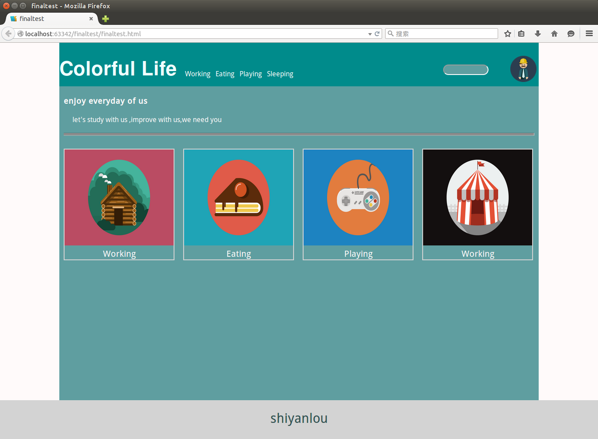
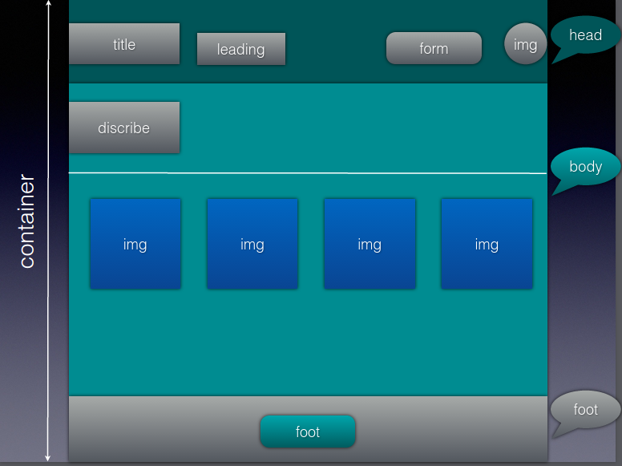

# 第 8 节 HTMl 与 CSS 简单页面效果实例

## 1.总体实验概述(结构)

前面我们讲述了 css 的基础知识,这里我们来做一个整体的练习,回顾下我们前面学到的知识.首先我们来看一下我们需要实现的页面样式



这是小编提前做好的,下面我们就具体的来分下要怎样实现.

我们最先要做的,就是分析整个网页的结构,我们可以发现,我们大致可以将整个页面分为三个部分. 第一部分是头部,上面有标题,导航,还有表单,最后一个小插图. 第二部分是主体,其中有文字描述,有下划线,有图片的排布(细节过下再说). 第三部分就是最简单的脚部,这里就不多说

下面我们用一张结构图来描述下这个页面的结构,进一步加深同学的理解:



从图上我们就可以看出,没一个模块用一个 div 块来描述就很简单了,只是运用前面学到的知识对细节进行优化就好.下面我们就开始具体的讲述每一个部分的实现.

## 2.head 部分

从结构图上我们可以看出,这个部分要实现的功能比较多,首先我们要定义一个 div 来承载这样一个标题(这个超简单), html:

```
<div class="headtitle"><h2>Colorful Life</h2></div> 
```

后面我们要做的就是加上导航,导航利用列表引入,我们知道列表默认的列表会垂直排布,这里我们需要将其设置成为水平排布,为了美观,我们还需要适当加上内边据和外边距

html:

```
<div class="headlead">
               <ul>
                  <li><a href="./cabin.jpg">Working</a></li>
                   <li><a href="./cake.jpg">Eating</a></li>
                   <li><a href="./game.jpg">Playing</a></li>
                   <li><a href="./circus.jpg">Sleeping</a></li>
               </ul>
           </div> 
```

css:

```
li{
    padding: 2px;
    display: inline;

} 
```

既然是导航,列表元素必定是链接,涉及到链接,我们就要设置,是否去掉下划线,鼠标移动到上面有什么变化,单击之前是什么颜色,点击之后是什么颜色(这里简单设置):

css:

```
a:link,a{
    color: snow;
    text-align: center;
    padding: 2px;
    text-decoration: none;

}
a:hover{
    color: black;
} 
```

在右边我们需要插入一个图片,让它浮动在最右边.

html:

```
<div class="headimage">
               
           </div> 
```

css:

```
.headimage{

    float: right;
    margin-top: 30px;
    margin-right: 5px;

}
.headimage img{
    height: 60px;
    width: 60px;
} 
```

这些都是比较简单的设置,前面我们都讲到过的,下面就还剩一个输入文字的表单,小编的审美及只能这样了,我们只需设置表单设置边框为圆弧,背景颜色,还有输入类型就好.下面显而易见的设置,至于自己想怎样发挥,就随大家了.

html:

```
 <div class="headform">
               <form>
                   <input type="text">
               </form>
           </div> 
```

css

```
.headform form{
    float: right;
    height: 26px;
    margin-right: 50px;
}

form input{
    height: 20px;
    background-color: cadetblue ;
    width: 100px;
    margin-top: 50px;
    border-radius: 30px;

} 
```

当写完这些效果以后我们来具体的展示:


在这里我们可以看出上面我们写的导航的效果.

## 3.body 部分

从结构图中我们可以看出,这部分无非就是两大模块,一段的文描述加上下面的图片排列.记得在上一章中我们详细讲述了 css 中的图片样式,图片的排版方式,相信大家映像都还很深吧下面我们就来具体的写写.

首先我们在把文字描述写出来:

html:

```
 <div class="bdytitle">
               <h3>enjoy everyday of us</h3>
               <p>let's study with us ,improve with us,we need you</p>
           </div> 
```

在 css 中我们设定字体颜色模块边距等:

```
.bdytitle{
    color: snow;

}
.bdytitle p{
    margin: 20px;

} 
```

下面这部分就是上一节中的图片排版,这里主要涉及到图片的边框,大小,设置浮动,我就举一个例子:

html:

```
<div class="img1">
               
               <p>Working</p>
           </div> 
```

css:

```
.img1{
    border: 2px solid lightgray;
    float: left;
    text-align: center;
    margin: 10px 10px;

}
.img1 img{
    width: 250px;
    height: 220px;

}
.img1 p{
    color: snow;
    font-size: 20px;

} 
```

我们就会得到下面的效果:


下面我们来看看最简单的 foot 部分

## 4.foot 部分

在网页的最后我们加上了一个底框:

html:

```
 <div class="foot">
        shiyanlou

       </div> 
```

css:

```
.foot{
    text-align: center;
    background-color: lightgray;
    height: 50px;
    padding: 20px;
    font-size: 30px;
    color: darkslategrey;

} 
```

我们就简单的设置下字体对齐方式,背景颜色,等基础配置就好

## 小结

在这一章中我们将 html 与 css 结合做了一个小实验,希望大家回顾起以前所学到的知识.

## 练习

根据实验讲解,动手做一个属于自己的小网页

补充:整个实验的工程可以用以下方式下载

```
git clone http://git.shiyanlou.com/shiyanlou/cssfinaltest 
```