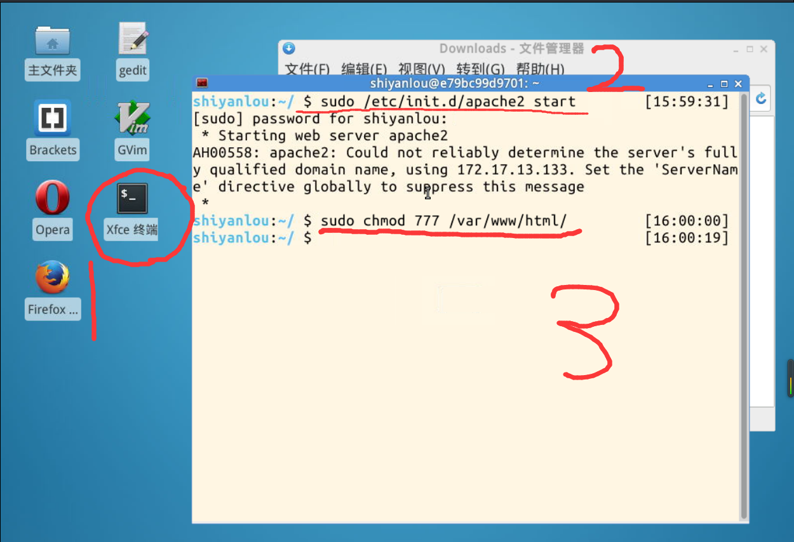
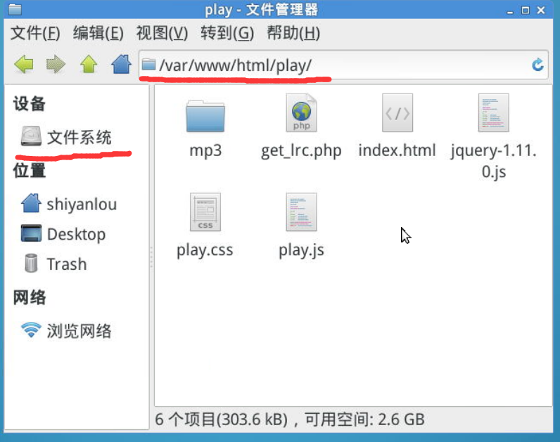
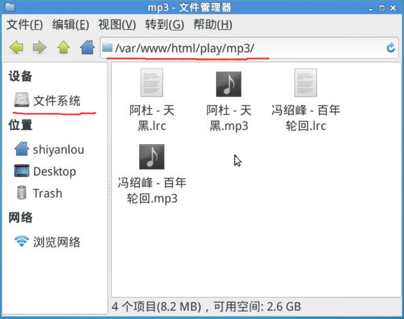
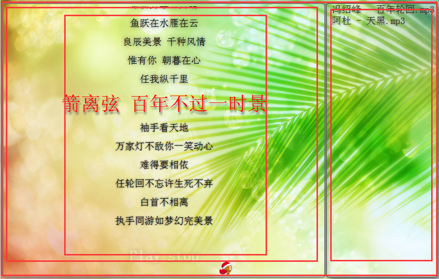
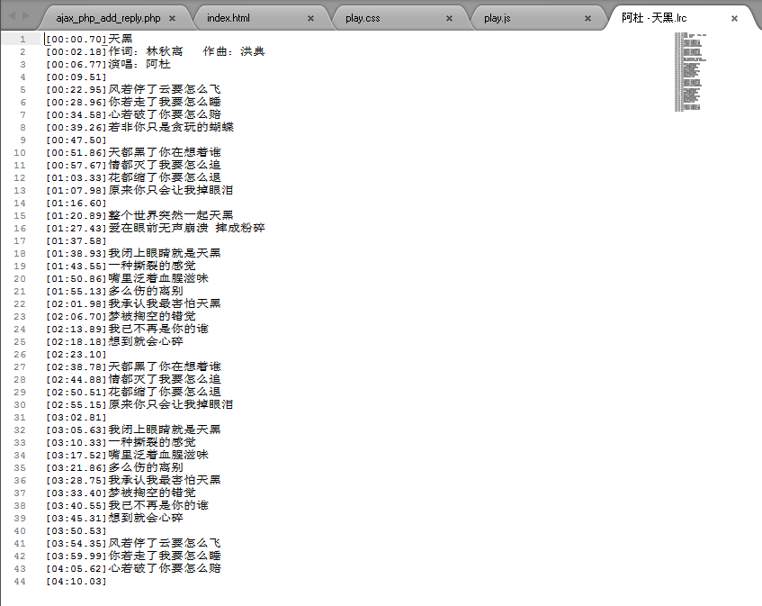

# 第 1 节 HTML5 实现播放器

## 一、实验说明

### 1\. 环境介绍

本实验环境采用带桌面的 Ubuntu Linux 环境，实验中会用到桌面上的程序：

1.  gedit：非常好用的编辑器，本课程将使用这个编辑器编写代码

2.  Firefox：浏览器，可以用在需要前端界面的课程里，只需要打开环境里写的 HTML/JS 页面即可

### 2\. 环境使用

双击打开 gedit 编辑器，按照下面的实验说明编写实验所需的代码及文件，然后保存

实验报告可以在个人主页中查看，其中含有每次实验的截图及笔记，以及每次实验的有效学习时间（指的是在实验桌面内操作的时间，如果没有操作，系统会记录为发呆时间）。这些都是您学习的真实性证明。

本课程中的所有源码可以通过 Git 方式下载：

```js
http://git.shiyanlou.com/shiyanlou/play 
```

### 3\. 项目介绍

酷狗播放器相信大家都使用过，特别是它的歌词同步效果，使用简单，那么如何在网页上实现歌词同步播放器呢？很简单，使用 HTML5 和 css3，我们可以很容易的做出 炫酷的歌词效果。


您或许需要先学习 HTML5 和 CSS。

*   [HTML5 基础入门](https://www.shiyanlou.com/courses/43)
*   [css 速成教程](https://www.shiyanlou.com/courses/53)

## 二、准备工作

首先，把项目 clone 下来，终端下输入：

```js
git clone http://git.shiyanlou.com/shiyanlou/play 
```

然后打开桌面上的 Xfce 终端，输入如下的命令，开启 Apache2 服务器

```js
sudo /etc/init.d/apache2 start 
```

获取 html 文件夹的权限，使得我们能把网页部署到服务器

```js
sudo chmod 777 /var/www/html/ 
```

这次不用输入密码，因为前面输入一次了。完成后如下图



好了，我们有权限了，服务器也启动了，可以开始部署项目了。打开主文件夹，然后点击 文件系统，依次进入 var/www/html/ 文件夹下，右键新建一个文件夹，取名为 play ，然后进入文件夹 play，把刚才我们 clone 下来的文件中的 mp3 整个文件夹和 jquery-1.11.0.js 文件复制到这里。

然后依次新建如下几个文件：

```js
index.html
play.css
play.js
get_lrc.php 
```

创建好所有文件后，文件布局应该是下面这样的：



其中 mp3 文件夹里面的歌曲就是刚才我们下载文件里面的，把它整个拷贝进去：



好了，所有的准备工作都已经做好了，接下来我们就开始写代码，让播放器早点运行起来吧！

## 三、写播放器界面 - HTML

**这里强调一下，如果代码中出现 echo "\\"state\\":\\"wrong\\",";这样的两个一起的反斜杠，那是 markdown 编辑器自动加上去的，只有一个反斜杠，用来转义引号的，请把多余的去掉。**

我们先用 HTML 写出我们播放器的界面，右键 index.html 选择打开方式 gedit 打开，可以按住 ctrl+鼠标滚轮调整字体的大小。

下图是我们的播放器布局。



大家可以看到，总共就两块，左边显示歌词，右边显示列表，所以我们可以用一个 DIV 来包含显示歌词，用一个 DIV 显示列表，而且让他们分列排。 然后当前的歌词会变大，但是不管播放到哪里，当前歌词都是在一个地方，也就是根据时间把当前歌词定位到固定的地方，从而实现了同步。一句 歌词就是一个 p 标签，设置 p 标签的样式，让当前歌词突出显示，就可以实现效果了。

**index.html**

```js
<!DOCTYPE html>
<html lang="zh-CN">
<head>
    <meta http-equiv="Content-Type" content="text/html;charset=UTF-8">
    <title>歌词播放器</title>
    <script src="jquery-1.11.0.js"></script>
    <script src="play.js"></script>
    <link rel="stylesheet" type="text/css" href="play.css">
</head>
<body>
    
    <!--播放器的大背景图，这里由于虚拟机下载文件不便，且是临时的，所以用的是网络图片，是我的服务器，大家可以
    在浏览器粘贴地址下载这些图片，以便脱机使用，也可以使用自己的图片代替，立马变成自己的风格专属播放器-->
    <div id="play_border">
    <!--播放器的边框-->
        <p>
            <audio src="mp3/冯绍峰 - 百年轮回.mp3" id="media" autoplay="autoplay"></audio>
            <!--html5 里面的音频播放标签，src 是播放地址，只要改变 src 地址就可以播放不同的歌曲
            autoplay 属性是自动播放，只要缓冲一定长度就可以自动播放-->
        </p>
        <div id="lrc_border">
        <!--显示歌词用的-->
            <div id="lrc_move"></div>
            <!--里面填写歌词内容，显示歌词移动效果的-->
        </div>
        <p id="button">
            <rowspan onclick="play()" id="play">Play</rowspan>
            <rowspan onclick="stop()">stop</rowspan>
            <!--两个控制按钮，onclick="play()" 表示当点击这个元素的时候，执行 play()这个函数，这个函数
            等下在 play.js 中会定义-->
        </p>
        
        <!--显示播放进度的图片，根据已播放的比例移动相应的距离-->
    </div>
    <div id="list">
        <!--用来显示歌曲列表的-->
    </div>

</body>
</html> 
```

编写完后保存文件，虚拟机里面打不出中文，这些注释可以选择不用写进去，至于 <audio src="mp3/冯绍峰 - 百年轮回.mp3" 这里的 中文，可以打开我们项目里面的 mp3 文件夹，然后选择歌曲，右键 重命名，粘贴到这里去。

## 四、让播放器更漂亮 - CSS

打开 play.css ，为我们的播放器编写 css 样式。

**play.css**

```js
*{
    border: 0;
    padding: 0;
    margin: 0;
}
/* *是通配符，所有的元素都会被选择到，防止浏览器加上默认的样式 */
body{
    width: 100%;
    height: 100%;
    overflow: hidden;
}
/* 我们把宽度和高度都设为 100%，这样会根据浏览器宽度和高度自动调整
   overflow：hidden 表示超出边界的元素会被隐藏*/
#bg{
    position: absolute;
    width: 100%;
    height: 100%;
}
/* 设置背景图为绝对定位，宽度和高度自动适应屏幕大小 */ 
```

然后我们再为播放器边框编写样式，就是下面这部分：

```js
#play_border{
            position: absolute;
            width: 73%;
            height: 97.6%;
            top: 1%;
            left: 0.5%;
            border-radius: 5px;
            border: 2px solid #777;
            box-shadow: 0px 0px 25px #777;
        }
        /* border-radius:是圆角属性，使用它很容易做出圆角效果，它的值是圆角的半径*/
        #play_border p{
            text-align: center;
        }
        #lrc_border{
            position: relative;
            overflow: hidden;
            padding: 10px;
            width: 90%;
            height: 80%;
            top: 1%;
            margin: 0 auto;
            border-radius: 5px;
            transition: 2s;
        }
        /* 这是控制歌词显示位置的，这里也使用了 overflow:hidden，因为我们里面的
        歌词向上移动的时候会超出这个边界，所以让超出的部分隐藏，既不可见，这样
        就实现了歌词往上滚动的效果，你可以控制这个 DIV 的定位，让歌词在不同的地方显示*/
        #lrc_border p{
            position: relative;
            text-align: center;
            margin: 15px 2px 15px 2px;
        }
        #lrc_move{
            position: relative;
            margin: 0 auto;
            width: 100%;
            transition: 1s;
            top: 100px;
        }
        /*这个 DIV 是真正写歌词的，一句歌词就是一个 p 标签，全部放到这里面
        transition:1s 也是 css3 的属性，它的作用是让属性值过渡改变，比如当你
        把 top 从 0px 变为 100px 的时候，如果不使用这个属性，则立马就改变了，使用了
        这个属性后，top 会从 0px 开始，在 1s 的时间内慢慢改变，所以就产生了慢慢
        往下移动的效果*/
        #lrc_move p{
            transition: 1s;
            font-size: 20px;
            font-family: "宋体";
            text-shadow: 0px 0px 5px #555;
        }
        /*设置歌词文字的属性，text-shadow:0px 0px 5px #555;这也是 css3 属性，用来设置文字
        阴影，前两个参数是阴影的 top,left 的偏移值，以文字为基准，第三个是模糊半径，半径越大，阴影越模糊，最后一个
        参数是阴影的颜色*/
        #button{
            position: relative;
            top: 30px;
            height: 80px;
        }
        #button rowspan{
            text-decoration: none;
            display: inline-block;
            transition: 2s;
            cursor: pointer;
            opacity: 0.3;
            width: 70px;
            height: 40px;
            font-weight: bold;
            font-size: 30px;
            color: white;
            text-shadow: 0 0 15px #333;
        }
        /*opacity:0.3 是透明度，设置元素的透明度，值为 0 到 1，可以用小数*/
        #button rowspan:hover{
            transition: 2s;
            opacity: 0.8;
              color: #ddd;
        }
        /*这是伪类，就是当鼠标悬停在元素上面时，用这里的属性替换原来的属性，移开的时候又会变为原来的属性*/ 
```

好了，我们显示歌词部分的做好了，还有一个显示歌曲列表的：

```js
#list{
    position: absolute;
    overflow: auto;
    width: 25%;
    height: 97.6%;
    top: 1%;
    right: 0.5%;
    border-radius: 5px;
    border: 2px solid #666;
    box-shadow: 5px 5px 15px 0px #666;
}
/* 这里使用了 overflow:auto;这是表示如果内容超出边界，则旁边会出现一个滚动条，可以滚动查看
   我设置定位为绝对定位，且 right:0.5%;这样它就会显示在右边，而歌词显示在左边
   box-shadow:5px 5px 15px 0px;是盒子阴影，和 text-shadow 用法一样*/
#list p{
    font-size: 20px;
    color: #222;
    text-shadow: 2px 2px 5px #999;
    padding-left: 10px;
    cursor: pointer;
    transition: 1s;
}
#list p:hover{
    background-color: white;
    opacity: 0.5;
    transition: 0.15s;
}
/* 同样，我们给列表的 p 标签加个伪类效果，这样当你鼠标移上去的时候就会有选中的效果 */ 
```

最后，我们再给进度条设置一下样式，就大功告成了：

```js
#process_img{
    position: absolute;
    bottom: 0px;
    width: 5%;
    z-index: 999;
    transition: 2s;
}
/* 我们把定位设置成绝对定位，这样方便改变它的位置，才不会影响其他元素的位置 */ 
```

编写完后保存文件。样式和布局我们都作好了，现在歌曲也能播放了，下面我们就让他可以显示歌词和切换歌曲，让它听我们的指挥。

## 五、显示同步歌词和切换歌曲 - JavaScript

现在我们让播放器动起来吧！让它显示同步的歌词。前面已经分析了，在歌曲播放前，我们就把歌词已经排好了，且每句歌词之间的上下间距都是相等的，所以，只要我们知道当前播放的是第几句歌词，我们就知道歌词的偏移量，然后用基准量减去偏移量，当前歌词就会显示在屏幕上了。

再把歌词的字体调一下，就实现了歌词同步。要确定当前播放的是第几句歌词，很简单，我们看一下 lrc 歌词的格式：



同样，一句歌词就是一行，且前面的是时间，表示这句歌词在什么时间播放。我们可以很容易知道当前播放的时间，用这个时间和 lrc 的时间一比较， 我们就可以得出应该显示哪句歌词了。

好了，思路就是这么简单，让我们开始写代码吧！实现它。打开 play.js：

试想一下我们使用播放器的操作流程，首先，我们打开一个播放器，肯定是先看一下歌曲列表，然后选择一首歌，播放器就加载歌词播放。那么播放器要做的有两件事：一是获取歌曲列表，并显示出来，二是根据播放的歌名去找歌词。所以我们先写获取信息的函数。

**play.js**

```js
/*这里我们为了代码简洁，清晰明了，也为了提高移植性，方便以后修改，我们把所有的向服务器获取信息
的操作进行封装。method 是要调用的函数名称，lyric_name 是歌词名或歌曲名，ob 是元素的 ID，表示获取的信息要显示在哪里
$.ajax({})是 jquery 的函数，我们可以直接使用它来产生一个 Ajax 请求，既异步加载数据，不必刷新页面就可以想服务器请求数据。
它有好多参数，下面这些是常用的，也是产生一个 Ajax 请求所必需的。
我们这里所使用的全是 json 格式。get 方法。
*/
var lrc_data = [];
//存放歌词数据
var animate;                                    //设置歌词动画函数指针
var process;

function get_lyric(method,lyric_name,ob)
{
    $.ajax({
        cache: true,
        type: "GET",
        url: "get_lrc.php?method="+method+"&name="+encodeURI(lyric_name),
        //encodeURI()是系统函数，用来转换 URL 编码的，因为我们的 lyric_name 是中文
        //避免在传输过程中乱码，所以用 encodeURI 编码，它在后端脚本中会自动转换编码，
        //我们不必自己解码，可以直接使用
        async: true,
        dataType: "json",
        success: function(data) {
            if(data.state == "success")
            //data 是从服务器获取的数据，所有服务器返回的字符全部在这里，但是不包括头等信息
            //所以，我们想要什么数据，就让服务器输出什么数据，然后对 data 进行字符串处理就完成
            //了一个 Ajax 请求，就是这么简单。由于是 json 格式，所以处理起来很简单。
            //data.state 是我们自己定义的变量，表示动作执行成功与否
            {
                if(method == "get_music_list")
                {
                    deal_music_list(data.music_list,ob);
                }else{
                    deal_lyric_data(data.lrc);
                }
                //根据 method 调用相应的函数来处理结果
            }else{
                alert(data.message);
            }
        },
        error: function(XMLHttpRequest,textStatus,errorThrown) {
                alert(textStatus);
        }
        //Ajax 请求失败时执行的函数，
    });
} 
```

第一个函数封装好了，接下来我们编写处理结果的函数：

```js
//处理歌曲列表函数
function deal_music_list(music_list_data,music_list_object)
{
    var music_list_object = document.getElementById(music_list_object);
    var list="";
    for(var i=0; i < music_list_data.length; ++i)
    {
        list+="<p onclick=\"music_change(" + i + ")\" id=\"music" + i + "\">"+music_list_data[i]+"</p>";
    }
    //music_list_object 是一个一维数组，这里要做的就是拼成 HTML 代码。然后插入进去。
    //HTML 格式：<p onclick="music_change(1)" id="music1">歌曲名字</p>
    //1 表示歌曲的序号，为了方便
    music_list_object.innerHTML = list;
}

//切换歌曲
function music_change(music_id)
{
    stop();
    //先暂停播放，自己定义的函数
    var src = document.getElementById("music"+music_id).innerHTML;
    //获取歌曲名字
    document.getElementById("media").src = "mp3/"+src;
    //改变播放地址
    get_lyric("get_lyric_data",src.split(".")[0]+".lrc","");
    //调用 php 中的 get_lyric_data 函数获取歌词
    play();
    //开始播放
}

//处理歌词数据函数
function deal_lyric_data(ajax_lrc_data)
{
    lrc_data.splice(0,lrc_data.length);
    //lrc_data 是一个 2*n 的二维数组，n 就是歌词的行数。每次使用前清空这个二维数组，然后再保存新的歌词
    var lrc_list = ajax_lrc_data.split(",");
    //切割歌词字符，返回一个数组，分隔符是","这是我们在 php 中自己定义的分隔符
    var lrc_length = lrc_list.length;
    var time_min;
    var time_sec;
    for(var i=0; i< lrc_length; ++i)
    {
        time_min = parseInt( lrc_list[i].substr(2,1) )*60*1000;
        time_sec = parseFloat( lrc_list[i].substr(4,5) )*1000;
        //我们为了方便计算判断当前播放的歌词，把秒转换成毫秒，可以精确到毫秒，歌词更精准
        lrc_data.push( [time_min + time_sec,lrc_list[i].substr(10)] );
        //把一句歌词放到数组里面
        if(lrc_data[i][1] == "")
        {
            lrc_data[i][1] = "&nbsp;";
        }
        //如果这句歌词是空的，则用一个 HTML 实体空格代替
    }
    init_lrc();
    //初始化歌词的，用来把歌词显示出来，在后面定义了这个函数
}

//初始化歌词函数
function init_lrc()
{
    var lrc="";
    var lrc_p="<p id=\"t";
    var lrc_p_end="\">";
    for(var i=0; i< lrc_data.length; ++i)
    {
        lrc+=lrc_p + lrc_data[i][0] + lrc_p_end + lrc_data[i][1] + "</p>";
    }
    //把歌词数据拼接成 HTML
    //HTML 格式：<p id="t12000">歌词内容</p>
    //12000 是刚才处理的时间，毫秒，我们根据这个时间来判断这句歌词是不是正在播放
    document.getElementById("lrc_move").innerHTML = lrc;
} 
```

好了，获取歌曲信息的写好了，获取歌词并显示歌词的也写好了，并且对时间做了处理，全都 HTML 格式化好了。现在我们要做的就是判断当前播放的是哪句歌词，并让他高亮，移到布局的中间来。

```js
function lrc_animate()
{
    if(lrc_data.length != 0)
    {
        var i=0;
        var top=0;
        var lrc_move = document.getElementById('lrc_move');
        var current_time = document.getElementById("media").currentTime*1000;
        //获取 audio 标签当前播放的时间长度，单位为秒，我们把它转换成毫秒
        for(i=0; i< lrc_data.length; ++i)
        {
            if( current_time < lrc_data[i][0] || ( i == lrc_data.length-1 ) || (current_time >=lrc_data[i][0] && current_time < lrc_data[i+1][0]) )
            {
                break;
            }
            /*
            这就是判断当前播放的是哪句歌词的算法，很简单，就一个 if 语句，i 就是歌词在 lrc_data 里面的序号
            知道了 i，我们就知道歌词的时间，和内容。所以"t"+lrc_data[i][0]就是歌词的 id。
            这个判断语句有点长，不过并不难，我们来分析一下
            整体可以分为三部分，第一个是 current_time < lrc_data[i][0]
            第二个是 ( i == lrc_data.length-1 )
            第三个是 (current_time >=lrc_data[i][0] && current_time < lrc_data[i+1][0])
            他们的关系为或||，所以只要有一个条件为真，就会退出 for 循环
            循环的长度是 lrc_data.length 也就是歌词句数的长度，从第一句开始判断，时间是升序的
            第一部分如果 current_time < lrc_data[i][0]，则说明时间还没到第一句歌词，那就显示第一句歌词
            第二部分如果( i == lrc_data.length-1 )，则表示循环到最后一句了，那就不用判断了，显示最后一句歌词
            第三部分如果(current_time >=lrc_data[i][0] && current_time < lrc_data[i+1][0])，则时间刚好在
            第 i 句和第 i+1 句中间，第 i 句开始唱了，而第 i+1 句还没唱，所以显示第 i 句歌词
            */
        }
        top = 150 - 38*i;
        150px 是 css 中默认设置的初始 top,每一句的高度刚好是 38px，所以用 150-38*i 就是当前的 top；可以为负数
        document.getElementById("t"+lrc_data[i][0]).style.fontSize = "40px";
        document.getElementById("t"+lrc_data[i][0]).style.color = "red";
        document.getElementById("t"+lrc_data[i][0]).style.textShadow="2px 5px 5px #666";
        //把第 i 句歌词设置为突出显示，id 是前面设置的，t+时间毫秒数
        if(i != 0 )
        {
            document.getElementById("t"+lrc_data[i-1][0]).style.fontSize = "20px";
            document.getElementById("t"+lrc_data[i-1][0]).style.color = "black";
            document.getElementById("t"+lrc_data[i-1][0]).style.textShadow="0px 0px 10px #555";
        }
        //把前一句歌词设置为默认样式
        lrc_move.style.top = top+"px";
        //显示歌词的 DIV 设置 top，就会往上移，歌词永远在中间
    }
} 
```

上面就是判断当前播放歌词并且让歌词一直居中显示的所有代码了，这是本播放器的重点代码，这个效果实现了，其他一些效果都非常容易，可以自己定制其他的功能，让播放器实现更多功能。下面我们再写一个播放，暂停，处理一下时间进度函数就可以了。

```js
//处理进度条函数
function deal_process_time()
{
    var width = document.getElementById("play_border").offsetWidth - document.getElementById("process_img").offsetWidth;
    //因为我们的进度条图片的宽度有点大，所以把整体长度减去图片的长度，就是进度条的长度
    var media = document.getElementById("media");
    var currentTime = media.currentTime;
    //获取当前播放时间，单位为秒，是小数
    var length = media.duration;
    //获取歌曲总时间，单位为秒
    document.getElementById("process_img").style.left=width*(currentTime/length)+"px";
    //用进度条总长度*(已播放时间和总时间的比例)，就是进度条的当前 left
}

//播放函数
function play()
{
    lrc_animate();
    //先执行一次歌词动画函数，初始化一下变量
    animate = setInterval(lrc_animate,100);
    //开启动画，每隔 100 毫秒执行一次函数
    process = setInterval(deal_process_time,100);
    //开启进度条动画
    document.getElementById("media").play();
    //让 audio 开始播放，play()是 audio 标签的系统函数，和我们自己定义的 play 不是同一个
}

//暂停函数
function stop()
{
    clearInterval(animate);
    //暂停歌词动画，也就是清楚定时执行
    clearInterval(process);
    //同上
    document.getElementById("media").pause();
    //暂停播放
}

//最后，页面加载的时候初始化一下，默认播放歌曲
window.onload=function()
{
    get_lyric("get_lyric_data","冯绍峰 - 百年轮回.lrc","");
    get_lyric("get_music_list","","list");
    play();
} 
```

好了，play.js 文件到此就写完了。现在，我们最后再用 php 把歌词内容和歌曲列表传给 js 就完成了。

## 六、把歌词内容和歌曲列表传给前端 js

到这里，我们布局写好了，样式也有了，控制代码也完成了，播放器到这里其实就可以运行了，但是它只能播放固定的一首歌，也没法显示歌词，js 也会报错，因为前面我们写了 Ajax 请求，没有后端完成，这个 Ajax 请求无法完成。js 是无法读取本地文件的，所以我们需要写个 php 脚本来把相应的歌词内容发给 js。很简单，几十行代码轻松搞定，我们把它做成一个接口形式，方便修改。

打开 get_lrc.php 文件，编写代码

**get_lrc.php**

```js
<?php

//首先就要记得写好这个标记，因为它告诉 Apache 这是动态脚本，要不然就无法执行了
//一开始我们就先发送一个头，设置字符编码，编码问题一定要非常注意，我们这个脚本是运行在 Linux 系统下的，
//如果要运行在 windows 下，则需要修改一个地方，稍后会详细讲解
header('content="text/html;charset=utf-8"');
$lrc_file_name = $_GET['name'];
$method = $_GET['method'];
//获取传过来的参数，既要调用的方法和歌词名字

if($method == "get_lyric_data"){                //获取指定歌词名的歌词内容
    if($lrc_file_name == "")
    {
        echo "{";
        echo "\"state\":\"wrong\",";
        //表示操作的结果状态
        echo "\"message\":\"no lrc filename\"";
        //操作执行结果的信息
        echo "}";
        //这里我们是手动拼接 json 格式字符串，前面将 js 的时候就讲了，拼接 json 的时候一定要非常仔细
        //特别是对双引号和换行的转义，一不小心就会出错,如果 json 格式错误，js 会报 parseError 错误。
        //这个时候就要仔细检查了
    } else{
        $path="mp3/".$lrc_file_name;
        //$path=iconv("utf-8", "gb2312", $path);
        //这个函数的作用是把$path 从“uft8”转换成"bg2312"编码，然后返回转换后的字符串
        //如果是在 window 下服务器运行，则需要把$path 从 utf-8 转换成 bg2312 编码
        //因为 window 默认字符集是 bg2312，而我们网页上用的是 utf-8，要不然 php 将找不到文件
        if( file_exists($path) )
        {
            $file = fopen($path, "r");
            $lrc_data="";
            while (!(feof($file)))
            {
                $text=fgets($file);
                $text=preg_replace("/\n/","", $text);
                //preg_replace()是正则替换，/\n/是正则表达式，函数作用是用第二个参数去
                //替换正则匹配的结果，在这里的作用就是把$text 的换行替换成“”,也就是空字符
                //因为使用 json 传送歌词，而 json 格式不允许包含换行符，不然会报错
                //注意：window 下和 Linux 下的换行是不同的，window 下是\r\n，而 Linux 是\n，
                //所以这里要注意不同的环境要相应的改动一下
                $lrc_data=$lrc_data.$text.",";
            }
            fclose($file);
            echo "{";
            echo "\"state\":\"success\",";
            echo "\"message\":\"all have done\",";
            echo "\"lrc\":\"".$lrc_data."\"";
            echo "}";
        }else{
            echo "{";
            echo "\"state\":\"success\",";
            echo "\"message\":\"can not open file\",";
            echo "\"lrc\":\"          暂时没有歌词 稍后我会添加 sorry\"";
            //注意"暂时"前面有 10 个空格，当没有歌词的时候就把这句当作歌词，但是 js 处理的时候会截取前 10 个来处理时间，所以用 10 个空格代替
            echo "}";
        }
    }
}else if($method == "get_music_list"){        //获取所有歌曲列表
    $dir="./mp3";
    //你存放 MP3 和歌词的目录
    $handle=opendir($dir);
    //PHP 遍历文件夹下所有文件 
    $list = array();
    //定义用于存储文件名的数组
    while (false !== ($file = readdir($handle)))
    {
        if ($file!="." && $file!=".." && (substr($file,-3)=="mp3" || substr($file,-3)=="ogg") ){
            //这里我们只要 mp3 和 ogg 文件，并且过滤掉.和..，它们分别表示下一级目录和上一级目录
            $list[] = $file;
            //将文件名保存到 list 数组
        }
    }
    closedir($handle);
    echo "{";
    echo "\"state\":\"success\",";
    echo "\"music_list\":[";
    $list_length = count($list);
    for ($i=0; $i < $list_length; $i++) { 
        //echo "\"".iconv("gb2312", "utf-8", $list[$i])."\"";
        echo "\"".$list[$i]."\"";
        //注意，如果系统默认字符集不是 utf-8，需要把$list[$i]转换成 utf-8 编码
        //比如你是在 window 下服务器运行的，就要加上这句了，不然会乱码
        if($i != ($list_length-1) )
            echo ",";
        //最后一个元素不要加上逗号，不然 json 格式会报错
    }
    echo "]";
    echo "}";
}else{                                                //给的 method 参数不符
    echo "{";
    echo "\"state\":\"wrong\",";
    echo "\"message\":\"no such method\"";
    echo "}";
}

?> 
```

好了，所有代码都已经完成了。现在再确认一下代码有没有错误，文件目录是否正确。确认无误后，就打开浏览器，输入：`localhost/play/index.html`

就可以看到播放器了。点击右边的歌曲列表可以切换歌曲。把 mp3 和 lrc 文件一起放到 mp3/ 目录下，可以自动识别歌曲。lrc 文件名要和歌曲名一模一样，注意 lrc 歌词文件内容格式要一致， 格式是 ：

```js
[00:01.12] 歌词内容 
```

可以自己打开查看一下，如果前面有其他的内容，请手动去掉，不然可能会报错。

**这里要说明一下，本实验环境中的 Firefox 无法播放 mp3 歌曲，所以歌词不会走，大家可以在自己的机器上下载 chrome 浏览器来体验。**

## 七、作业思考

项目涉及的内容比较多，建议多理解消化；你也可以尝试自己修改样式。